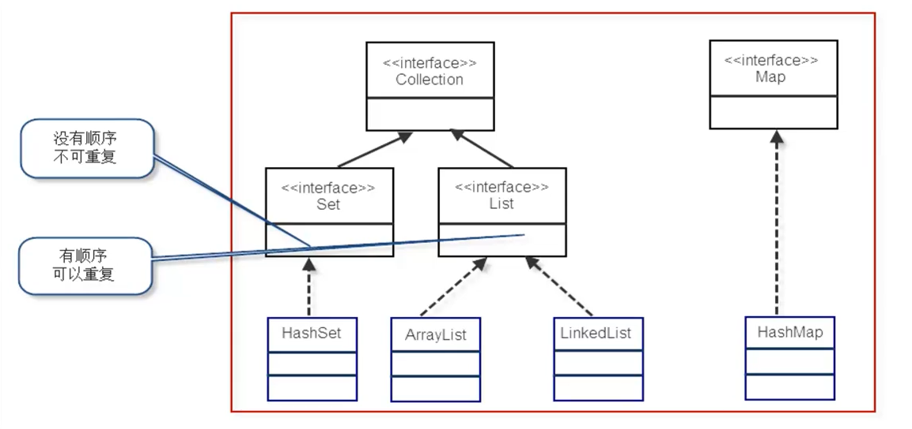

# 数组

> 数组就是一种容器，可以在其中放置对象或者基本类型数据

- 数组的优势
  - 一种简单的线性序列，可以快速地访问数组元素，效率高。如果从效率和类型检查的角度讲，数组是最好的
- 数组的劣势
  - 不灵活。容器需要事先定义好，不能随着需求的变化而扩容。比如：我们在一个用户管理系统中，要把今天注册的所有用户取出来，那么这样的用户有多少个？我们在写程序时是无法确定的。因此，在这里就不能使用数组

## 泛型

JDK1.5以后增加的，它可以帮助我们建立类型安全的集合。

泛型的本质就是“数据类型的参数化”。我们可以把“泛型”理解为数据类型的一个占位符（形式参数），即告诉编译器，在调用泛型时必须传入实际类型

## List

有序、可重复的容器

- 有序
  - List中每个元素都有索引标记。可以根据元素的索引标记（在List中的位置）访问元素，从而精确控制这些元素。
- 可重复
  - LIst允许加入重复的元素，更确切地讲，List通常允许满足e1.equals(e2)的元素重复加入容器。

常用的实现类有3个：

- ArrayList
  - 数组
- LinkedList
  - 链表
- Vector
  - 数组
  - 线程安全

### ArrayList

底层是用数组实现的存储。特点：查询效率高，增删效率低，线程不安全。我们一般使用它。

数组长度是有限的，而ArrayList是可以存放任意数量的对象，长度不受限制，那么它是怎么实现的呢？ - > 扩容

 

