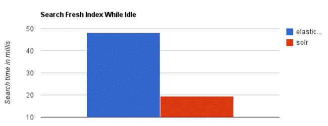
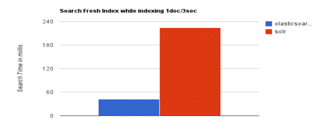
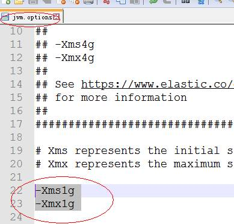
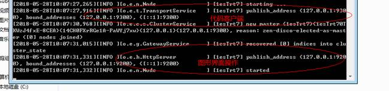
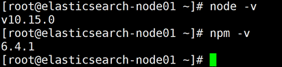
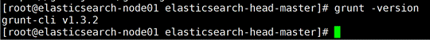
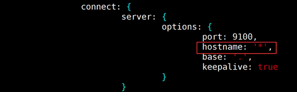
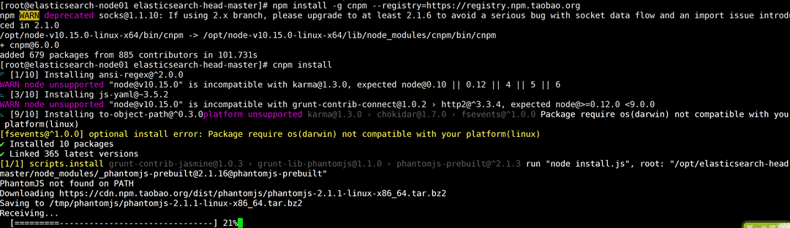
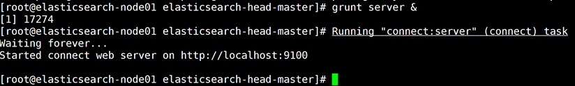
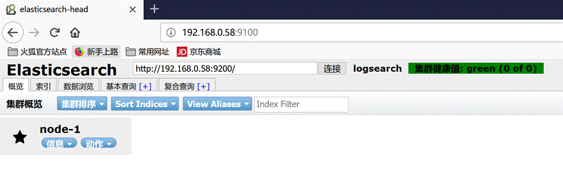

# ElasticSearch学习指南

 

## 1. ElasticSearch简介

1.1 ElasticSearch（简称ES）

**官方网站: https://www.elastic.co/**

**下载地址：**https://www.elastic.co/cn/start

ElasticSearch是一个基于Lucene的搜索服务器，基于RESTful web接口。Elasticsearch 

是用Java开发的，并作为Apache许可条款下的开放源码发布，是当前流行的企业级搜索引擎。能够达到实时搜索，稳定，可靠，快速，安装使用方便。

 

1.2 ElasticSearch与Lucene的关系

Lucene可以被认为是迄今为止最先进、性能最好的、功能最全的搜索引擎库（框架）

但是想要使用Lucene，必须使用Java来作为开发语言并将其直接集成到你的应用中，并且Lucene的配置及使用非常复杂，你需要深入了解检索的相关知识来理解它是如何工作的。

实际项目中，我们建立一个网站或应用程序，并要添加搜索功能，令我们受打击的是：搜索工作是很难的。我们希望我们的搜索解决方案要快，我们希望有一个零配置和一个完全免费的搜索模式，我们希望能够简单地使用JSON/XML通过HTTP的索引数据，我们希望我们的搜索服务器始终可用，我们希望能够从一台开始并在需要扩容时方便地扩展到数百，我们要实时搜索，我们要简单的多租户，我们希望建立一个云的解决方案，这时候出来了搜索引擎，目前比较流行的是Solr和ElasticSearch简称ES;

 

Lucene缺点：

  1）只能在JAVA项目中使用,并且要以jar包的方式直接集成项目中.

  2）使用非常复杂-创建索引和搜索索引代码多

  3）不支持集群环境-索引数据不同步（不支持大型项目）  

  4）索引数据如果太多就不行。

​    索引库和应用所在同一个服务器,共同占用硬盘.共用空间少.

​    Lucene的缺点和我们的期望,ES都能全部解决.

 

1.3 ES的使用者及类似框架

**典型使用案例**

**①Github**使用Elasticsearch搜索20TB的数据，包括13亿的文件和1300亿行的代码.

**②Foursquare**实时搜索5千万地点信息？Foursquare每天都用Elasticsearch做这样的事.

**③**德国**SoundCloud**使用Elasticsearch来为1.8亿用户提供即时精准的音乐搜索服务.

**④Mozilla**公司以火狐著名，它目前使用 WarOnOrange 这个项目来进行单元或功能测试，测试的结果以 json的方式索引到elasticsearch中，开发人员可以非常方便的查找 bug.

**⑤Sony**公司使用elasticsearch 作为信息搜索引擎.

 

1.4 ES vs Solr比较

1.4.1 ES vs Solr 检索速度

当单纯的对已有数据进行搜索时，Solr更快。

 

当实时建立索引时, Solr会产生io阻塞，查询性能较差, Elasticsearch具 

有明显的优势。

大型互联网公司，实际生产环境测试，将搜索引擎从Solr转到 Elasticsearch以后的平均查询速度有了50倍的提升。

### 1.4.2 ES vs Solr 热度

 

**总结：**

二者安装都很简单。 

1、 Solr 利用 Zookeeper 进行分布式管理，而Elasticsearch 自身带有分布式协调管理功能。 

2、Solr 支持更多格式的数据，比如JSON、XML、CSV，而 Elasticsearch 仅支持json文件格式。 

3、Solr 官方提供的功能更多，而 Elasticsearch 本身更注重于核心功能，高级功能多有第三方插件提供 

4、Solr 在传统的搜索应用中表现好于 Elasticsearch，但在处理实时搜索应用时效率明显低于 Elasticsearch。 

5、Solr 是传统搜索应用的有力解决方案，但 Elasticsearch更适用于新兴的实时搜索应用。

 

 

### 1.4.3 ES vs 关系型数据库

 

## 2.  ES安装及使用说明

### 2.1.  Window环境安装ES

ES服务只依赖于JDK，推荐使用JDK1.7+。

① 下载ES安装包

官方下载地址：https://www.elastic.co/downloads/elasticsearch

②window环境下安装

 由于是绿色版本,解压缩就能安装.

③ 运行ES

改一下jvm.options

bin/elasticsearch.bat

 

④ 验证

访问：http://localhost:9200/

看到上图信息，恭喜你，你的ES已经启动并且正常运行.

### 2.2.  Linux环境安装ES

#### 2.2.1介绍 

​    下载内容: Elasticsearch

​        Kibana  

  环境要求:

   JDK 至少需要在1.8以上版本

   Linux 的内核版本需要在2.6以上

#### 2.2.2 安装JDK8(Elasticsearch 需要 Java 8或者更高版本)

　　1）解压文件：tar -zxvf jdk-8u201-linux-x64.tar.gz

 

　　2）配置环境变量：

 

　　　 #vi ~/.bash_profile

​        JAVA_HOME=/usr/local/jdk1.8.0_172

​        export JAVA_HOME

​        PATH=$JAVA_HOME/bin:$PATH 

​        export PATH

使环境变量生效:

​     \#source~/.bash_profile

　　验证是否安装成功：java -version

#### 2.2.3 安装 Elasticsearch

1）下载 Elasticsearch 放之/opt目录中

2）解压文件(解压/opt)：tar -zxvf elasticsearch-x.x.x.tar.gz

3）创建Elasticsearch用户

　　es 规定 root 用户不能启动 es，所以需要新建一个其他用户来启动 es修改配置文件

  先创建组, 再创建用户:

​    3.1）创建 elasticsearch 用户组

​     [root@localhost ~]# groupadd elastic

​    

​    3.2）创建用户 es 并设置密码为es123456

​     [root@localhost ~]# useradd es

​     [root@localhost ~]# passwd es

​    3.3）用户es 添加到 elasticsearch 用户组

​     [root@localhost ~]# usermod -G elastic es

​     [root@localhost ~]# chown -R es /opt/elasticsearch-6.6.0

 

​    3.4）设置sudo权限

​     [root@localhost ~]# visudo

 

​     在root ALL=(ALL) ALL 一行下面

​     添加es用户 如下:

​     es ALL=(ALL) ALL

​      

​     添加成功保存后切换到es用户操作

​     [root@localhost ~]# su es

​     [es@localhost root]$

 

4）修改配置文件

  1）进入/opt/elasticsearch-6.6.0/config目录，

  2）如要修改JVM内存, 使用vi编辑器: vi jvm.options

​    将默认1g的内存自己根据情况调整

  3）使用vi编辑器：vi elasticsearch.yml

  　　3.1）取消如下注释，并修改为当前主机地址(注：冒号前面不能有空格，后面必须有一个空格)：

  　　　　 cluster.name: my-es

  　　　　 node.name: node-1

bootstrap.memory_lock: false #ES官网建议生产环境需要设

  　　　 　network.host: 192.X.X.X      #改成电脑实际IP地址

  　　　 　http.port: 9200 #9200是Web管理端口号; 另个9300是ES的TCP内部通信端口号

  　　3.2）新增如下配置:

  　　　　bootstrap.system_call_filter: false  

​      http.cors.enabled: true
 http.cors.allow-origin: "*"

  

5、启动Elasticsearch

   1) 重启Linux

​    reboot

　　2）切换用户

​    cd /opt/elasticsearch-6.6.0

　　　　su es

　　3）启动服务

　　　　elasticsearch-6.5.0/bin/elasticsearch

　　4）后台启动

　　　　elasticsearch-6.5.0/bin/elasticsearch -d

　　5）测试是否启动成功  访问前需要将防火墙关闭

　　　　curl -XGET 'http://ip:9200/'

## 3.客户端Kibana安装

### 3.1客户端

可以分为图形界面客户端,和代码客户端.

### 3.2 ES主流客户端Kibana，开放9200端口与图形界面客户端交互

1）下载Kibana放之/opt目录中

2）解压文件：tar -zxvf kibana-X.X.X-linux-x86_64.tar.gz

3）进入/opt/kibana-X.X.X-linux-x86_64/config目录

4）使用vi编辑器：vi kibana.yml

​      server.port: 5601

 

​     server.host: "192.168.X.X"

​     

​     elasticsearch.hosts: ["http://IP:9200"] #这里是elasticsearch的访问地址

  

5）启动Kibana

​      /opt/kibana-6.6.0-linux-x86_64/bin/kibana

  

6）访问Kibana

​      http://ip:5601/app/kibana 

 

 

### 3.3 Restful认识

Restful是一种面向资源的架构风格，可以简单理解为：使用URL定位资源，用HTTP动词（GET,POST,DELETE,PUT）描述操作。 基于Restful API ES和所有客户端的交互都是使用JSON格式的数据.

其他所有程序语言都可以使用RESTful API，通过9200端口的与ES进行通信

GET查询

PUT添加

POST修改

DELE删除

 

用户做crud

Get http://localhost:8080/employee/1  

Get [http://localhost:8080/employees](http://localhost:8080/employee/)

put [http://localhost:8080/employee](http://localhost:8080/employee/)

{

 

}

delete http://localhost:8080/employee/1

Post [http://localhost:8080/employee](http://localhost:8080/employee/)/1

{

}

**使用Restful****的好处：**

透明性，暴露资源存在。

充分利用 HTTP 协议本身语义，不同请求方式进行不同的操作

## 4.ES数据管理

### 4.1 ES数据管理概述

ES是面向文档(document oriented)的，这意味着它可以存储整个对象或文档(document)。然而它不仅仅是存储，还会索引(index)每个文档的内容使之可以被搜索。在ES中，你可以对文档（而非成行成列的数据）进行索引、搜索、排序、过滤。

ES使用JSON作为文档序列化格式。JSON现在已经被大多语言所支持，而且已经成为NoSQL领域的标准格式。

ES存储的一个员工文档的格式示例：

{

"email": "584614151@qq.com",

"name": "张三",

 "age": 30,

 "interests": [ "篮球", "健身" ]

 

}

### 4.2 基本操作

#### 1 索引

1.1 创建索引

​    格式: PUT /索引名称

​    举例: PUT /es_db

 

  1.2 查询索引

​    格式: GET /索引名称

​    举例: GET /es_db

​    

  1.3 删除索引

​    格式: DELETE /索引名称

​    举例: DELETE /es_db    

 

  1.4 添加文档 

​    格式: PUT /索引名称/类型/id

​    举例: 

​      PUT /es_db/student/1

​      {

​       "name": "张三",

​       "sex": 1,

​       "age": 25,

​       "address": "广州天河公园"

​      }

​      

​      PUT /es_db/student/2

​      {

​       "name": "李四",

​       "sex": 1,

​       "age": 28,

​       "address": "广州荔湾大厦"

​      }

​      

​      PUT /es_db/student/3

​      {

​       "name": "王五",

​       "sex": 0,

​       "age": 26,

​       "address": "广州白云山公园"

​      }

​      

​      PUT /es_db/student/4

​      {

​       "name": "admin",

​       "sex": 0,

​       "age": 22,

​       "address": "长沙橘子洲头"

​      }

​      

​      PUT /es_db/student/5

​      {

​       "name": "小明",

​       "sex": 0,

​       "age": 19,

​       "address": "长沙岳麓山"

​      }     

​      

  1.5 修改文档 

​    格式: PUT /索引名称/类型/id

​    举例: 

​      PUT /es_db/student/1

​      {

​       "name": "大龙",

​       "sex": 1,

​       "age": 25,

​       "address": "张家界森林公园"      

​      }

​      

  1.6 查询文档

​    格式: GET /索引名称/类型/id

​    举例: GET /es_db/student/1

 

  1.7 删除文档

​    格式: DELETE /索引名称/类型/id

​    举例: DELETE /es_db/student/1

 

#### **2** **查询操作**

  2.1 查询当前类型中的所有文档 _search 

​    格式: GET /索引名称/类型/_search

​    举例: GET /es_db/student/_search

​    SQL: select * from student

 

  2.2 条件查询, 如要查询age等于28岁的 _search?q=*:***

​    格式: GET /索引名称/类型/_search?q=*:***

​    举例: GET /es_db/student/_search?q=age:28

​    SQL: select * from student where age = 28

​    

  2.3 范围查询, 如要查询age在25至26岁之间的 _search?q=***[** TO **] 注意: TO 必须为大写

​    格式: GET /索引名称/类型/_search?q=***[25 TO 26]

​    举例: GET /es_db/student/_search?q=age[25 TO 26]

​    SQL: select * from student where age between 25 and 26

​       

  2.4 根据多个ID进行批量查询 _mget

​    格式: GET /索引名称/类型/_mget

​    举例: GET /es_db/student/_mget

​       {

​        "ids":["1","2"] 

​       }

​    SQL: select * from student where id in (1,2)  

​    

  2.5 查询年龄小于等于28岁的 :<=

​    格式: GET /索引名称/类型/_search?q=age:<=**

​    举例: GET /es_db/student/_search?q=age:<=28

​    SQL: select * from student where age <= 28

​    

  2.6 查询年龄大于28前的 :>

​    格式: GET /索引名称/类型/_search?q=age:>**

​    举例: GET /es_db/student/_search?q=age:>28

​    SQL: select * from student where age > 28

 

  2.7 分页查询 from=*&size=*

​    格式: GET /索引名称/类型/_search?q=age[25 TO 26]&from=0&size=1

​    举例: GET /es_db/student/_search?q=age[25 TO 26]&from=0&size=1

​    SQL: select * from student where age between 25 and 26 limit 0, 1 

​    

  2.8 对查询结果只输出某些字段 _source=字段,字段

​    格式: GET /索引名称/类型/_search?_source=字段,字段

​    举例: GET /es_db/student/_search?_source=name,age

​    SQL: select name,age from student

 

  2.9 对查询结果排序 sort=字段:desc/asc

​    格式: GET /索引名称/类型/_search?sort=字段 desc

​    举例: GET /es_db/student/_search?sort=age:desc

​    SQL: select * from student order by age desc

​    

  

  

#### **3 DSL语言高级查询**  

  ES提供了强大的查询语言（DSL），它可以允许我们进行更加强大、复杂的查询

  Elasticsearch DSL中有Query与Filter两种

  

  3.1 Query方式查询，会在ES中索引的数据都会存储一个_score分值，分值越高就代表越匹配。另外关于某个搜索的分值计算还是很复杂的，因此也需要一定的时间。

  

​    3.1.1 根据名称精确查询姓名 term, term查询不会对字段进行分词查询，会采用精确匹配 

​      注意: 采用term精确查询, 查询字段映射类型属于为keyword.

​      举例: 

​      POST /es_db/student/_search

​      {

​       "query": {

​         "term": {

​           "name": "admin"

​         }

​       }

​      }

​      SQL: select * from student where name = 'admin'

 

​    3.1.2 根据备注信息模糊查询 match, match会根据该字段的分词器，进行分词查询 

​      举例: 

​      POST /es_db/student/_search

​      {

​       "from": 0,

​       "size": 2, 

​       "query": {

​         "match": {

​           "address": "广州"

​         }

​       }

​      }

​      SQL: select * from user where address like '%广州%' limit 0, 2

​      

​    3.1.3 多字段模糊匹配查询与精准查询 multi_match

​      POST /es_db/student/_search

​      {

​       "query":{

​         "multi_match":{

​           "query":"张三",

​           "fields":["address","name"]

​         }

​       }

​      }

​      SQL: select * from student

​        where name like '%张三%' or address like '%张三%'  

​    

​    3.1.4 未指定字段条件查询 query_string , 含 AND 与 OR 条件

​      POST /es_db/student/_search

​      {

​       "query":{

​         "query_string":{

​           "query":"(广州) OR 长沙"

​         }

​       }

​      }

 

​    3.1.5 指定字段条件查询 query_string , 含 AND 与 OR 条件

​      POST /es_db/student/_search

​      {

​       "query":{

​         "query_string":{

​           "query":"admin OR 长沙",

​           "fields":["name","address"]

​         }

​       }

​      }

​    

​    3.1.6 范围查询

​      注：json请求字符串中部分字段的含义

​      　　range：范围关键字

​      　　gte 大于等于

​      　　lte 小于等于

​      　　gt 大于

​      　　lt 小于

​      　　now 当前时间

​      

​      POST /es_db/student/_search

​      {

​       "query" : {

​         "range" : {

​           "age" : {

​             "gte":25,

​             "lte":28

​           }

​         }

​       }

​      }

​      SQL: select * from user where age between 25 and 28

​      

​    3.1.7 分页、输出字段、排序综合查询

​      POST /es_db/student/_search

​      {

​       "query" : {

​         "range" : {

​           "age" : {

​             "gte":25,

​             "lte":28

​           }

​         }

​       },

​       "from": 0,

​       "size": 2,

​       "_source": ["name", "age", "book"],

​       "sort": {"age":"desc"}

​      }

  

  3.2 Filter过滤器方式查询，它的查询不会计算相关性分值，也不会对结果进行排序, 因此效率会高一点，查询的结果可以被缓存。  

​    

​    3.2.1 Filter Context 对数据进行过滤 

​      POST /es_db/student/_search

​      {

​       "query" : {

​         "bool" : {

​           "filter" : {

​             "term":{

​               "age":25

​             }

​           }

​         }

​       }

​      }   

​    

 

#### **4** **文档映射** 

4.1 ES中映射可以分为动态映射和静态映射

4.2 何为动态映射？ 

  在关系数据库中，需要事先创建数据库，然后在该数据库下创建数据表，并创建表字段、类型、长度、主键等，最后才能基于表插入数据。而Elasticsearch中不需要定义Mapping映射（即关系型数据库的表、字段等），在文档写入Elasticsearch时，会根据文档字段自动识别类型，这种机制称之为动态映射。

动态映射规则如下：

****

  **4.3** 静态映射 

  是在Elasticsearch中也可以事先定义好映射，包含文档的各字段类型、分词器等，这种方式称之为静态映射。

 

  4.1 动态映射

​    4.1.1 删除原创建的索引

​      DELETE /es_db

​      

​    4.1.2 创建索引

​      PUT /es_db

 

​    4.1.3 创建文档(ES根据数据类型, 会自动创建映射)

​      PUT /es_db/student/1

​      {

​       "name": "Jack",

​       "sex": 1,

​       "age": 25,

​       "book": "java入门至精通",

​       "address": "广州小蛮腰"

​      }

​      

​    4.1.4 获取文档映射

​      GET /es_db/student/_mapping    

​    

  4.2 静态映射       

​    4.2.1 删除原创建的索引

​      DELETE /es_db

​      

​    4.3.2 创建索引

​      PUT /es_db

​         

​    4.2.3 设置文档映射

​      POST /es_db/_mapping/student

​      {

​       "student":{

​         "properties":{

​           "name":{

​              "type":"keyword"

​           },

​           "sex":{

​             "type":"integer"

​           },

​           "age":{

​             "type":"integer"

​           },

​           "book":{

​             "type":"text"

​           },

​           "address":{

​             "type":"text"

​           }

​         }

​       }

​      }  

  

​    4.2.4 根据静态映射创建文档

​      PUT /es_db/student/1

​      {

​       "name": "Jack",

​       "sex": 1,

​       "age": 25,

​       "book": "elasticSearch入门至精通",

​       "address": "广州车陂"

​      }

​      

​    4.2.5 获取文档映射

​      GET /es_db/student/_mapping      

​      

  

​    

  **4.3 keyword** **与 text 映射类型的区别**

​     将 book 字段设置为 keyword 映射 （只能精准查询, 不能分词查询，能聚合、排序）

​      POST /es_db/student/_search

​      {

​       "query": {

​         "term": {

​           "book": "elasticSearch入门至精通"

​         }

​       }

​      }

​      

​     将 book 字段设置为 text 映射  （能模糊查询, 能分词查询，不能聚合、排序）

​      POST /es_db/student/_search

​      { 

​       "query": {

​         "match": {

​           "book": "elasticSearch入门至精通"

​         }

​       }

​      }

​      

​           

​      

 

**6 ES****集成IK分词器插件**

 

 **6.1** ES默认使用单字分词器，将中文拆分成一个一个的字存放在索引库，这样并不利于查询效果，我们可以自己配置IK分词器，IK分词器是目前相对主流的中文分词器；

 

 **6.2** **下载地址:** 

https://github.com/medcl/elasticsearch-analysis-ik/releases

注意: es-ik 分词插件版本必须与es安装版本对应, 如两者都必须为如6.6.0

 

 **6.3** **基于Linux中的ES安装IK插件**

1) 下载es的IK插件(elasticsearch-analysis-ik-6.6.0.zip)

2）解压后上传到/opt/elasticsearch-6.6.0/plugins

3）重启 ES

 

 通过_analyze指令分词演示 ik_smart (ES默认分词器是 standard)

GET _analyze

{

 "analyzer": "ik_smart",

 "text": "中华人民共和国"

 }

 

 

​       

 

**7** **创建静态映射时指定text类型的ik分词器**

  7.1 设置ik分词器的文档映射

​     先删除之前的es_db

​     再创建新的es_db

​     定义ik_smart的映射

​    POST /es_db/_mapping/student

​    {

​      "student":{

​       "properties":{

​         "name":{

​            "type":"keyword"

​         },

​         "sex":{

​           "type":"integer"

​         },

​         "age":{

​           "type":"integer"

​         },

​         "book":{

​           "type":"text",

​           "analyzer":"ik_smart",

​           "search_analyzer":"ik_smart"

​         },

​         "address":{

​           "type":"text"

​         }

​       }

​      }

​    }  

​    

​    \* 分词查询

​    POST /es_db/student/_search

​    { 

​      "query": {

​       "match": {

​         "address": "广"

​       }

​      }

​    }  

​    

​    POST /es_db/user/_search

​    { 

​      "query": {

​       "match": {

​         "address": "广州"

​       }

​      }

​    }   

 

### 4.3 ES分词原理之倒排索引   

## 5、ES集群

### 5.1 head插件安装

 1）下载elasticsearch-head-master.zip包

解压至 /opt/ 目录

 

2）安装node

由于head插件本质上还是一个nodejs的工程，因此需要安装node

解压node安装包至 /opt/ 目录

添加node环境变量

vim /etc/profile

添加：

export NODE_HOME=/opt/node-v10.15.0-linux-x64
 export PATH=$PATH:$NODE_HOME/bin

 

source /etc/profile

测试node是否安装成功

3） 安装grunt(grunt是基于Node.js的项目构建工具，可以进行打包压缩、测试、执行等等工作，elasticsearch-head插件就是通过grunt启动的)

cd /opt/elasticsearch-head-master/

npm install -g grunt-cli

grunt -version测试是否安装成功

修改elasticsearch-head-master下Gruntfile.js配置文件，添加hostname: '*',

vim Gruntfile.js

 

更换npm源

npm install -g cnpm --registry=[https://registry.npm.taobao.org](https://registry.npm.taobao.org/)

使用cnpm安装

cnpm install

在elasticsearch.yml文件中添加：

http.cors.enabled: true

http.cors.allow-origin: "*"

启动elasticsearch-head-master

grunt server &

通过浏览器测试是否正常

 [http://IP:9100/](http://192.168.0.58:9100/)

 

 Head安装过程中出现如下错误时，解决方案：

[es-user@localhost elasticsearch-head-master]$ grunt server

\>> Local Npm module "grunt-contrib-clean" not found. Is it installed?

\>> Local Npm module "grunt-contrib-concat" not found. Is it installed?

\>> Local Npm module "grunt-contrib-watch" not found. Is it installed?

\>> Local Npm module "grunt-contrib-connect" not found. Is it installed?

\>> Local Npm module "grunt-contrib-copy" not found. Is it installed?

\>> Local Npm module "grunt-contrib-jasmine" not found. Is it installed?

Warning: Task "connect:server" not found. Use --force to continue.

 

Aborted due to warnings.

 

  解决方案：

npm install grunt-contrib-clean --registry=https://registry.npm.taobao.org

npm install grunt-contrib-concat --registry=https://registry.npm.taobao.org

npm install grunt-contrib-watch --registry=https://registry.npm.taobao.org

npm install grunt-contrib-connect --registry=https://registry.npm.taobao.org

npm install grunt-contrib-copy --registry=https://registry.npm.taobao.org

npm install grunt-contrib-jasmine --registry=https://registry.npm.taobao.org

1） head结果查看

仔细观察，我们会发现客户端默认连接的是我们elasticsearch集群健康值的几种状态如下：

　　绿色，最健康的状态，代表所有的分片包括备份都可用

　　黄色，基本的分片可用，但是备份不可用（也可能是没有备份）

　　红色，部分的分片可用，表明分片有一部分损坏。此时执行查询部分数据仍然可以查到，遇到这种情况，还是赶快解决比较好

　　灰色，未连接到elasticsearch服务

 

如同：[http://IP:9200/_cluster/health](http://192.168.42.132:9200/_cluster/health) 查看集群状态

 

### 5.2 ES集群搭建

1) ES集群搭建至少准备3台机器，所以将集群将原CentOS克隆3份

 

2) ES的服务集群配置, 集群默认是9300端口, ES内部机制已经帮我们实现了集群以外，还实现了HA(高可用)，包括选举机制(如Zookeeper的选举机制)、防止脑裂等.

​    进入ES安装目录中的config目录

​    vi elasticsearch.yml

​    

​    cluster.name: my-es     ### 三台服务器节点集群名称必须相同

​    node.name: node-1      ### 每个节点名称不能一样，其它两台如设置为node-132 ,node-133

​    network.host: IP   ### 当前服务器IP地址

​    discovery.zen.ping.unicast.hosts: ["IP1", "IP2","IP3"]  ###多个服务集群IP

​    discovery.zen.minimum_master_nodes: 2 ### 配置节点数(主节点总数/ 2 + 1)来防止“脑裂”

 

 

 

3) 将/opt/elasticsearch-6.6.0/data 里面的nodes文件删除

 

​           

​    4) 查询文档

​        http://192.168.144.138:9200/es_db/student/1

​        [http://192.168.144.139:9200/es_](http://192.168.144.138:9200/es_)db/student/1

​        [http://192.168.144.140:9200/es_](http://192.168.144.138:9200/es_)db/student/1

 

 

### 5.3 ES分片和副本分片原理

配置一套高可用的集群，我们必须要了解ES集群的数据分布和负载原理

ES分片shards （默认是5个分片）

Elasticsearch中的索引(index)是由分片(shard)构成的。比如我们集群中有个索引es_db，该索引由5个分片组成，那么这个es_db索引中的文档数据将分布在这5个分片中。

 

Es_db索引中的文档是根据下面这个规则确定该文档属于哪个分片： 

1

**shard = hash(routing) % number_of_primary_shards**

// routing值默认是文档的_id，number_of_primary_shards是索引的主分片个数 

 

这5个分片可以进行复制，复制是为了实现容错性，比如复制5份，那么一共就需要10个分片(5个主分片+5个主分片复制出来的复制分片)。

 

### 5.4 集群脑裂问题

https://www.cnblogs.com/zhukunrong/p/5224558.html

 

## 6.  Java API操作ES

### 6.1 配置ES相关依赖

 <!-- 配置项目需要哪些jar包 -->

 <dependencies>

​    <dependency>

​      <groupId>org.elasticsearch</groupId>

​      <artifactId>elasticsearch</artifactId>

​      <version>6.6.0</version>

​    </dependency>

​    <dependency>

​      <groupId>org.elasticsearch.client</groupId>

​      <artifactId>transport</artifactId>

​      <version>6.6.0</version>

​    </dependency>

​    <dependency>

​      <groupId>org.apache.logging.log4j</groupId>

​      <artifactId>log4j-core</artifactId>

​      <version>2.9.0</version>

​    </dependency>

​    

   <!-- json-lib -->

   <dependency>

   <groupId>net.sf.json-lib</groupId>

   <artifactId>json-lib</artifactId>

   <version>2.4</version>

   <!-- 指定jar包jdk版本的依赖 -->

   <classifier>jdk15</classifier>

  </dependency>

</dependencies>

**配置编译插件**

<!-- 配置插件 -->

  <plugins>

   <!-- 编译插件 -->

   <plugin>

​     <groupId>org.apache.maven.plugins</groupId>

​     <artifactId>maven-compiler-plugin</artifactId>

​     <version>3.1</version>

​     <configuration>

​      <source>1.8</source>

​      <target>1.8</target>

​      <encoding>utf-8</encoding>

​     </configuration>

   </plugin>

   

  </plugins>

### 6.2创建索引库

public static void create() throws UnknownHostException {

​    // TODO Auto-generated method stub

​    // 获取集群信息

​    Settings settings = Settings.builder().put("cluster.name", "my-es").build();

​    // 获取客户端

​    TransportClient client = new PreBuiltTransportClient(settings);

​    // 连接指定客户端主机

​    client.addTransportAddress(new TransportAddress(InetAddress.getByName("192.168.144.136"), 9300));

​    

​    // 创建索引

​    client.admin().indices().prepareCreate("blog").get();

​    

​    // 最后关闭客户端

​    client.close();

 

  }

### 6.3添加索引

public static void getIndex() throws UnknownHostException {

​    // 获取集群信息

​    Settings settings = Settings.builder().put("cluster.name", "my-es").build();

​    // 获取客户端

​    TransportClient client = new PreBuiltTransportClient(settings);

​    // 连接指定客户端主机

​    client.addTransportAddress(new TransportAddress(InetAddress.getByName("192.168.144.137"), 9300));

​    // 获取数据

​    GetResponse getResponse = client.prepareGet("blog", "article", "1").get();

​    System.out.println("获取的数据为：" + getResponse.getSourceAsString());// 获取的数据为：{"atcId":"1","title":"第一文","content":"浏览器查看http://hadoop102:9200/blog2"}

​    // 最后关闭客户端

​    client.close();

 

  }

### 6.4更新索引

public static void update() throws UnknownHostException {

​       // TODO Auto-generated method stub

​       // 获取集群信息

​       Settings settings = Settings.builder().put("cluster.name", "my-es").build();

​       // 获取客户端

​       PreBuiltTransportClient client = new PreBuiltTransportClient(settings);

​       // 连接指定客户端主机

​       client.addTransportAddress(new TransportAddress(InetAddress.getByName("192.168.144.136"), 9300));

 

​       // 更新文档 方式1

​       Map<String, Object> map = new HashMap<>();

​       map.put("title", "第一文-update文档");

​       UpdateResponse updateResponse = client.prepareUpdate("blog", "article", "1")

​              .setDoc(map).get();

​       System.out.println("" + updateResponse);// UpdateResponse[index=blog,type=article,id=1,version=2,result=updated,shards=ShardInfo{total=2,

​                                          // successful=1, failures=[]}]

​       // 最后关闭客户端

​       client.close();

 

​    }

### 6.5删除索引

public static void delete() throws UnknownHostException {

 

​       // 获取集群信息

​       Settings settings = Settings.builder().put("cluster.name", "my-es").build();

​       // 获取客户端

​       PreBuiltTransportClient client = new PreBuiltTransportClient(settings);

​       // 连接指定客户端主机

​       client.addTransportAddress(new TransportAddress(InetAddress.getByName("192.168.144.136"), 9300));

 

​       DeleteResponse deleteResponse = client.prepareDelete("blog", "article", "1").get();

 

​       System.out.println("删除结果：" + deleteResponse);

​       

​       // ##########关闭clien代码###########

​       client.close();

​    }

### 6.6根据id查询索引库

public static void getIndex() throws UnknownHostException {

​       // 获取集群信息

​       Settings settings = Settings.builder().put("cluster.name", "my-es").build();

​       // 获取客户端

​       TransportClient client = new PreBuiltTransportClient(settings);

​       // 连接指定客户端主机

​       client.addTransportAddress(new TransportAddress(InetAddress.getByName("192.168.144.137"), 9300));

​       // 获取数据

​       GetResponse getResponse = client.prepareGet("blog", "article", "1").get();

​       System.out.println("获取的数据为：" + getResponse.getSourceAsString());// 获取的数据为：{"atcId":"1","title":"第一文","content":"浏览器查看http://hadoop102:9200/blog2"}

​       // 最后关闭客户端

​       client.close();

 

​    }

### 6.7根据关键字查询

public static void getIndexByTerm() throws Exception {

​       //获取集群信息

​       Settings settings = Settings.builder().put("cluster.name", "my-es").build();

​       // 获取客户端

​       TransportClient client = new PreBuiltTransportClient(settings);

​       // 连接指定客户端主机

​       client.addTransportAddress(new TransportAddress(InetAddress.getByName("192.168.144.137"), 9300));

 

​       QueryBuilder queryBuilder = QueryBuilders.termQuery("title", "北京");

 

​       SearchResponse searchResponse = client.prepareSearch("blog").setTypes("article").setQuery(queryBuilder).get();

 

​       SearchHits hits = searchResponse.getHits();

 

​       SearchHit[] searchHits = hits.getHits();

 

​       for (SearchHit searchHit : searchHits) {

​           System.out.println("" + searchHit.getSourceAsString());

​           Map<String, Object> map = searchHit.getSourceAsMap();

​           System.out.println(map.get("id"));

​           System.out.println(map.get("title"));

​           System.out.println(map.get("content"));

​       }

 

​       // 最后关闭客户端

​       client.close();

​    }

### 6.8根据关键字进行分词查询

​    public static void getIndexByKeyWord() throws UnknownHostException {

​       // 获取集群信息

​       Settings settings = Settings.builder().put("cluster.name", "my-es").build();

​       // 获取客户端

​       TransportClient client = new PreBuiltTransportClient(settings);

​       // 连接指定客户端主机

​       client.addTransportAddress(new TransportAddress(InetAddress.getByName("192.168.144.137"), 9300));

 

​       QueryBuilder queryBuilder = QueryBuilders.queryStringQuery("大家").defaultField("title");

 

​       SearchResponse searchResponse = client.prepareSearch("blog").setTypes("article").setQuery(queryBuilder).get();

 

​       SearchHits hits = searchResponse.getHits();

 

​       SearchHit[] searchHits = hits.getHits();

 

​       for (SearchHit searchHit : searchHits) {

​           System.out.println("" + searchHit.getSourceAsString());

​       }

 

​       // 最后关闭客户端

​       client.close();

​    }

### 6.9分页查询

public static void queryPage() throws UnknownHostException {

​       // TODO Auto-generated method stub

​       Settings settings = Settings.builder().put("cluster.name", "my-es").build();

​       // 获取客户端

​       TransportClient client = new PreBuiltTransportClient(settings);

​       // 连接指定客户端主机

​       client.addTransportAddress(new TransportAddress(InetAddress.getByName("192.168.144.137"), 9300));

 

​       QueryBuilder queryBuilder = QueryBuilders.queryStringQuery("北京").defaultField("title");

 

​       SearchResponse searchResponse = client.prepareSearch("blog")

​              .setTypes("article")

​              .setFrom(2).setSize(2)

​              .setQuery(queryBuilder).get();

 

​       SearchHits hits = searchResponse.getHits();

 

​       SearchHit[] searchHits = hits.getHits();

 

​       for (SearchHit searchHit : searchHits) {

​           System.out.println("" + searchHit.getSourceAsString());

​       }

 

​       // 最后关闭客户端

​       client.close();

​    }

### 6.10高亮显示查询结构

public static void queryHighLight() throws UnknownHostException {

 

​       Settings settings = Settings.builder().put("cluster.name", "my-es").build();

​       // 获取客户端

​       TransportClient client = new PreBuiltTransportClient(settings);

​       // 连接指定客户端主机

​       client.addTransportAddress(new TransportAddress(InetAddress.getByName("192.168.144.137"), 9300));

 

​       HighlightBuilder highlight = new HighlightBuilder()

​              .highlighterType("plain")

​              .field("title").preTags("<b>")

​              .postTags("</b>");

 

​       QueryBuilder queryBuilder = QueryBuilders.queryStringQuery("大家").defaultField("title");

 

​       SearchResponse searchResponse = client.prepareSearch("blog")

​              .setTypes("article")

​              .setFrom(0)

​              .setSize(3)

​              .setQuery(queryBuilder)

​              .highlighter(highlight).get();

 

​       SearchHits hits = searchResponse.getHits();

 

​       SearchHit[] searchHits = hits.getHits();

 

​       for (SearchHit searchHit : searchHits) {

​           System.out.println("" + searchHit.getSourceAsString());

 

​           HighlightField hField = searchHit.getHighlightFields().get("title");

​           for (Text t : hField.fragments()) {

​              System.out.println(t.string());

​           }

​       }

 

​       // 最后关闭客户端

​       client.close();

​    }

## 7、电商项目整合ES实战应用

POST /es_db/_mapping/article

​       {

​           "article":{

​              "properties":{

​               "id":{

​                     "type":"integer"

​                },

​                "price":{

​                     "type":"integer"

​                },

​                 "storage":{

​                     "type":"integer"

​                },

​                "title":{

​                      "type":"text",

​                      "analyzer":"ik_smart",

​                     "search_analyzer":"ik_smart"

​                }, 

​                "locality":{

​                     "type":"text",

​                     "analyzer":"ik_smart",

​                     "search_analyzer":"ik_smart"

​                },

​                "description":{

​                     "type":"text",

​                     "analyzer":"ik_smart",

​                     "search_analyzer":"ik_smart"

​                }

​              }

​           }

​       }
