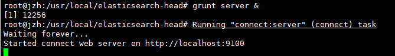

# ElasticSearch学习指南

 

## 1. ElasticSearch简介

1.1 ElasticSearch（简称ES）

**官方网站: https://www.elastic.co/**

**下载地址：**https://www.elastic.co/cn/start

ElasticSearch是一个基于Lucene的搜索服务器，基于RESTful web接口。Elasticsearch 

是用Java开发的，并作为Apache许可条款下的开放源码发布，是当前流行的企业级搜索引擎。能够达到实时搜索，稳定，可靠，快速，安装使用方便。

 

1.2 ElasticSearch与Lucene的关系

Lucene可以被认为是迄今为止最先进、性能最好的、功能最全的搜索引擎库（框架）

但是想要使用Lucene，必须使用Java来作为开发语言并将其直接集成到你的应用中，并且Lucene的配置及使用非常复杂，你需要深入了解检索的相关知识来理解它是如何工作的。

实际项目中，我们建立一个网站或应用程序，并要添加搜索功能，令我们受打击的是：搜索工作是很难的。我们希望我们的搜索解决方案要快，我们希望有一个零配置和一个完全免费的搜索模式，我们希望能够简单地使用JSON/XML通过HTTP的索引数据，我们希望我们的搜索服务器始终可用，我们希望能够从一台开始并在需要扩容时方便地扩展到数百，我们要实时搜索，我们要简单的多租户，我们希望建立一个云的解决方案，这时候出来了搜索引擎，目前比较流行的是Solr和ElasticSearch简称ES;

 

Lucene缺点：

  1）只能在JAVA项目中使用,并且要以jar包的方式直接集成项目中.

  2）使用非常复杂-创建索引和搜索索引代码多

  3）不支持集群环境-索引数据不同步（不支持大型项目）  

  4）索引数据如果太多就不行。

    索引库和应用所在同一个服务器,共同占用硬盘.共用空间少.
    
    Lucene的缺点和我们的期望,ES都能全部解决.

 


1.3 ES的使用者及类似框架

**典型使用案例**

**①Github**使用Elasticsearch搜索20TB的数据，包括13亿的文件和1300亿行的代码.

**②Foursquare**实时搜索5千万地点信息？Foursquare每天都用Elasticsearch做这样的事.

**③**德国**SoundCloud**使用Elasticsearch来为1.8亿用户提供即时精准的音乐搜索服务.

**④Mozilla**公司以火狐著名，它目前使用 WarOnOrange 这个项目来进行单元或功能测试，测试的结果以 json的方式索引到elasticsearch中，开发人员可以非常方便的查找 bug.

**⑤Sony**公司使用elasticsearch 作为信息搜索引擎.

 

1.4 ES vs Solr比较

1.4.1 ES vs Solr 检索速度

当单纯的对已有数据进行搜索时，Solr更快。


 

当实时建立索引时, Solr会产生io阻塞，查询性能较差, Elasticsearch具 

有明显的优势。


大型互联网公司，实际生产环境测试，将搜索引擎从Solr转到 Elasticsearch以后的平均查询速度有了50倍的提升。


### 1.4.2 ES vs Solr 热度


 

**总结：**

二者安装都很简单。 

1、 Solr 利用 Zookeeper 进行分布式管理，而Elasticsearch 自身带有分布式协调管理功能。 

2、Solr 支持更多格式的数据，比如JSON、XML、CSV，而 Elasticsearch 仅支持json文件格式。 

3、Solr 官方提供的功能更多，而 Elasticsearch 本身更注重于核心功能，高级功能多有第三方插件提供 

4、Solr 在传统的搜索应用中表现好于 Elasticsearch，但在处理实时搜索应用时效率明显低于 Elasticsearch。 

5、Solr 是传统搜索应用的有力解决方案，但 Elasticsearch更适用于新兴的实时搜索应用。

 

 

### 1.4.3 ES vs 关系型数据库

 


## 2.  ES安装及使用说明

### 2.1.  Window环境安装ES

ES服务只依赖于JDK，推荐使用JDK1.8+。

① 下载ES安装包

官方下载地址：https://www.elastic.co/downloads/elasticsearch

②window环境下安装

 由于是绿色版本,解压缩就能安装.

③ 运行ES

改一下jvm.options


bin/elasticsearch.bat

 


④ 验证

访问：http://localhost:9200/


看到上图信息，恭喜你，你的ES已经启动并且正常运行.

### 2.2.  Linux环境安装ES

#### 2.2.1介绍 

    下载内容: Elasticsearch  Kibana  

  环境要求:

   JDK 至少需要在1.8以上版本

   Linux 的内核版本需要在2.6以上

#### 2.2.2 安装JDK8(Elasticsearch 需要 Java 8或者更高版本)

　　1）解压文件：tar -zxvf jdk-8u201-linux-x64.tar.gz

　　2）配置环境变量：

```shell
# vi /etc/profile

JAVA_HOME=/usr/local/jdk1.8.0_172
export JAVA_HOME
PATH=$JAVA_HOME/bin:$PATH 
export PATH
```


使环境变量生效:

```sh
# source /etc/profile

验证是否安装成功：java -version
```


#### 2.2.3 安装 Elasticsearch

1. 下载 Elasticsearch 放之/usr/local目录中

2. 解压文件(解压 **/usr/local**)：tar -zxvf elasticsearch-x.x.x.tar.gz

3. 创建Elasticsearch用户

　　es 规定 root 用户不能启动 es，所以需要新建一个其他用户来启动 es修改配置文件

  先创建组, 再创建用户:

- 创建 elasticsearch 用户组

   ```
 [root@localhost ~]# groupadd elastic
   ```

- 创建用户 es 并设置密码为es

     [root@localhost ~]# useradd es
     
     [root@localhost ~]# passwd es

- 用户es 添加到 elasticsearch 用户组

```	
 [root@localhost ~]# usermod -G elastic es

 [root@localhost ~]# chown -R es /usr/local/elasticsearch-7.7.0
```

- 设置sudo权限


     [root@localhost ~]# visudo

  在root ALL=(ALL) ALL 一行下面

  添加es用户 如下:


     es ALL=(ALL) ALL


  添加成功保存后切换到es用户操作

     [root@localhost ~]# su es
     [es@localhost root]$

4. 修改配置文件

- 进入/usr/local/elasticsearch-7.7.0/config目录，

- 如要修改JVM内存, 使用vi编辑器: vi jvm.options

​        将默认1g的内存自己根据情况调整

- 使用vi编辑器：vi elasticsearch.yml

  - 取消如下注释，并修改为当前主机地址(注：冒号前面不能有空格，后面必须有一个空格)：

  - ```yaml
    network.host: 0.0.0.0
    http.port: 9200
    transport.host: localhost
    transport.tcp.port: 9300
    ```

  - 新增如下配置:

  - ```yaml
    http.cors.enabled: true
    http.cors.allow-origin: "*"
    ```

**5. 启动Elasticsearch**

- 重启Linux

```sh
reboot
```

- 切换用户

```sh
cd /usr/local/elasticsearch-7.7.0
su es
```

- 启动服务

```sh
elasticsearch-7.7.0/bin/elasticsearch
```

- 后台启动

```sh
elasticsearch-7.7.0/bin/elasticsearch -d
```

- 测试是否启动成功  访问前需要将防火墙关闭

```
curl -XGET 'http://ip:9200/'
```

**6. ES 集成 IK 分词器插件**

- ES默认使用单字分词器，将中文拆分成一个一个的字存放在索引库，这样并不利于查询效果，我们可以自己配置IK分词器，IK分词器是目前相对主流的中文分词器；

- **下载地址:** https://github.com/medcl/elasticsearch-analysis-ik/releases

- 注意: es-ik 分词插件版本必须与es安装版本对应, 如两者都必须为如7.7.0

- **基于Linux中的ES安装IK插件**

  - 下载es的IK插件(elasticsearch-analysis-ik-7.7.0.zip)
  - 解压后上传到/usr/local/elasticsearch-7.7.0/plugins
  - 重启 ES

- 通过_analyze指令分词演示 ik_smart (ES默认分词器是 standard)

- ```json
  GET _analyze
  {
      "analyzer": "ik_smart",
      "text": "夏末之家"
  }
  ```

**7. 创建静态映射时指定text类型的ik分词器**

- 设置ik分词器的文档映射

```json
先删除之前的es_db
再创建新的es_db
定义ik_smart的映射
POST /es_db/_mapping/student
{
    "student":{
        "properties":{
            "name":{
                "type":"keyword"
            },
            "sex":{
                "type":"integer"
            },
            "age":{
                "type":"integer"
            },
            "book":{
                "type":"text",
                "analyzer":"ik_smart",
                "search_analyzer":"ik_smart"
            },
            "address":{
                "type":"text"
            }
        }
    }
}  
```

- 分词查询

```json
POST /es_db/student/_search
{ 
    "query": {
        "match": {
             "address": "广"
        }
    }
}
POST /es_db/user/_search
{ 
    "query": {
        "match": {
             "address": "广州"
        }
    }
}   
```


 

## 3.  客户端Kibana安装

### 3.1 客户端

可以分为图形界面客户端和代码客户端.

官网下载地址：<https://www.elastic.co/cn/kibana>


### 3.2 安装图形界面客户端

ES主流客户端Kibana，开放9200端口与图形界面客户端交互

1）下载Kibana放之/usr/local目录中

2）解压文件：tar -zxvf kibana-7.7.0-linux-x86_64.tar.gz

3）进入/usr/local/kibana-7.7.0-linux-x86_64/config目录

4）使用vi编辑器：vi kibana.yml

```yaml
server.port: 5601
server.host: "0.0.0.0"
elasticsearch.hosts: ["http://IP:9200"] # 这里是elasticsearch的访问地址
i18n.locale: "zh-CN" # 这里设置中文 
```

5）启动Kibana

```sh
/usr/local/kibana-7.7.0-linux-x86_64/bin/kibana
```

6）访问Kibana

    http://ip:5601/app/kibana 


### 3.3 Restful认识

Restful是一种面向资源的架构风格，可以简单理解为：使用URL定位资源，用HTTP动词（GET,POST,DELETE,PUT）描述操作。 基于Restful API ES和所有客户端的交互都是使用JSON格式的数据.

其他所有程序语言都可以使用RESTful API，通过9200端口的与ES进行通信

GET 查询

PUT 添加

POST 修改

DELETE 删除

 

用户做crud

```
Get http://localhost:8080/employee/1  

Get [http://localhost:8080/employees](http://localhost:8080/employee/)

put [http://localhost:8080/employee](http://localhost:8080/employee/)
{

}

delete http://localhost:8080/employee/1

Post [http://localhost:8080/employee](http://localhost:8080/employee/)/1
{

}
```


**使用Restful的好处：**

透明性，暴露资源存在。

充分利用 HTTP 协议本身语义，不同请求方式进行不同的操作

## 4.  ES数据管理

### 4.1 ES数据管理概述

ES是面向文档(document oriented)的，这意味着它可以存储整个对象或文档(document)。然而它不仅仅是存储，还会索引(index)每个文档的内容使之可以被搜索。在ES中，你可以对文档（而非成行成列的数据）进行索引、搜索、排序、过滤。

ES使用JSON作为文档序列化格式。JSON现在已经被大多语言所支持，而且已经成为NoSQL领域的标准格式。

ES存储的一个员工文档的格式示例：

```json
{
    "email": "584614151@qq.com",
    "name": "张三",
     "age": 30,
     "interests": [ "篮球", "健身" ]
}
```


### 4.2 基本操作

#### 4.2.1 索引

1.1 创建索引

    格式: PUT /索引名称
    
    举例: PUT /es_db


  1.2 查询索引

    格式: GET /索引名称
    
    举例: GET /es_db


​    

  1.3 删除索引

    格式: DELETE /索引名称
    
    举例: DELETE /es_db    


  1.4 添加文档 

```json
格式: PUT /索引名称/类型/id

举例: 
PUT /es_db/student/1
{
    "name": "张三",
    "sex": 1,
    "age": 25,
    "address": "广州天河公园"
}
PUT /es_db/student/2
{
    "name": "李四",
    "sex": 1,
    "age": 28,
    "address": "广州荔湾大厦"
}
PUT /es_db/student/3
{
    "name": "王五",
    "sex": 0,
    "age": 26,
    "address": "广州白云山公园"
}
PUT /es_db/student/4
{
    "name": "admin",
    "sex": 0,
    "age": 22,
    "address": "长沙橘子洲头"
}
PUT /es_db/student/5
{
    "name": "小明",
    "sex": 0,
    "age": 19,
    "address": "长沙岳麓山"
}   
```


​     

  1.5 修改文档 

```json
格式: PUT /索引名称/类型/id

举例: 
PUT /es_db/student/1
{
    "name": "大龙",
    "sex": 1,
    "age": 25,
    "address": "张家界森林公园"      
}
```


​      

  1.6 查询文档

    格式: GET /索引名称/类型/id
    
    举例: GET /es_db/student/1

 


  1.7 删除文档

    格式: DELETE /索引名称/类型/id
    
    举例: DELETE /es_db/student/1

 


#### **4.2.2** 查询操作

1. 查询当前类型中的所有文档 `_search`

    格式: GET /索引名称/类型/_search
    
    举例: GET /es_db/student/_search
    
    SQL: select * from student

2. 条件查询, 如要查询age等于28岁的 `_search?q=*:***`

    格式: GET /索引名称/类型/_search?q=*:***
    
    举例: GET /es_db/student/_search?q=age:28
    
    SQL: select * from student where age = 28

3. 范围查询, 如要查询age在25至26岁之间的 `_search?q=***[** TO **]` 注意: TO 必须为大写

    格式: GET /索引名称/类型/_search?q=***[25 TO 26]
    
    举例: GET /es_db/student/_search?q=age[25 TO 26]
    
    SQL: select * from student where age between 25 and 26

4. 根据多个ID进行批量查询 `_mget`

    格式: GET /索引名称/类型/_mget
    
    举例: 
    GET /es_db/student/_mget
    {
        "ids":["1","2"] 
    }
    
    SQL: select * from student where id in (1,2)  

5. 查询年龄小于等于28岁的 `:<=`

    格式: GET /索引名称/类型/_search?q=age:<=**
    
    举例: GET /es_db/student/_search?q=age:<=28
    
    SQL: select * from student where age <= 28

6. 查询年龄大于28前的 `:>`

    格式: GET /索引名称/类型/_search?q=age:>**
    
    举例: GET /es_db/student/_search?q=age:>28
    
    SQL: select * from student where age > 28

7. 分页查询 `from=*&size=*`

    格式: GET /索引名称/类型/_search?q=age[25 TO 26]&from=0&size=1
    
    举例: GET /es_db/student/_search?q=age[25 TO 26]&from=0&size=1
    
    SQL: select * from student where age between 25 and 26 limit 0, 1 

8. 对查询结果只输出某些字段 _source=字段,字段

    格式: GET /索引名称/类型/_search?_source=字段,字段
    
    举例: GET /es_db/student/_search?_source=name,age
    
    SQL: select name,age from student

9. 对查询结果排序 sort=字段:desc/asc

    格式: GET /索引名称/类型/_search?sort=字段 desc
    
    举例: GET /es_db/student/_search?sort=age:desc
    
    SQL: select * from student order by age desc


#### 4.2.3 DSL语言高级查询

  ES提供了强大的查询语言（DSL），它可以允许我们进行更加强大、复杂的查询

  Elasticsearch DSL中有Query与Filter两种

##### 4.2.3.1 Query方式查询

会在ES中索引的数据都会存储一个_score分值，分值越高就代表越匹配。另外关于某个搜索的分值计算还是很复杂的，因此也需要一定的时间。

- 根据名称精确查询姓名 term，term查询不会对字段进行分词查询，会采用精确匹配 
  - 注意: 采用term精确查询，查询字段映射类型属于为keyword。


```json
举例: 
POST /es_db/student/_search
{
    "query": {
        "term": {
            "name": "admin"
        }
    }
}
SQL: select * from student where name = 'admin'
```

- 根据备注信息模糊查询 match, match会根据该字段的分词器，进行分词查询


```json
举例: 
POST /es_db/student/_search
{
    "from": 0,
    "size": 2, 
    "query": {
        "match": {
            "address": "广州"
        }
    }
}
SQL: select * from user where address like '%广州%' limit 0, 2
```

- 多字段模糊匹配查询与精准查询 multi_match

```json
POST /es_db/student/_search
{
    "query":{
        "multi_match":{
            "query":"张三",
            "fields":["address","name"]
        }
    }
}
SQL: select * from student where name like '%张三%' or address like '%张三%'  
```

- 未指定字段条件查询 query_string , 含 AND 与 OR 条件

```json
POST /es_db/student/_search
{
    "query":{
        "query_string":{
            "query":"(广州) OR 长沙"
        }
    }
}
```

- 指定字段条件查询 query_string , 含 AND 与 OR 条件


```json
POST /es_db/student/_search
{
    "query":{
        "query_string":{
            "query":"admin OR 长沙",
            "fields":["name","address"]
        }
    }
}
```

- 范围查询
  - 注：json请求字符串中部分字段的含义
  - range：范围关键字
  - gte 大于等于
  - lte 小于等于
  - gt 大于
  - lt 小于
  - now 当前时间

```json
POST /es_db/student/_search
{
    "query" : {
        "range" : {
            "age" : {
                "gte":25,
                "lte":28
            }
        }
    }
}
SQL: select * from user where age between 25 and 28
```

- 分页、输出字段、排序综合查询

```json
POST /es_db/student/_search
{
    "query" : {
        "range" : {
            "age" : {
                "gte":25,
                "lte":28
            }
        }
    },
    "from": 0,
    "size": 2,
    "_source": ["name", "age", "book"],
    "sort": {"age":"desc"}
}
```


 

##### 4.2.3.2 Filter过滤器方式查询

它的查询不会计算相关性分值，也不会对结果进行排序, 因此效率会高一点，查询的结果可以被缓存。      

- Filter Context 对数据进行过滤 

```json
POST /es_db/student/_search
{
    "query" : {
        "bool" : {
            "filter" : {
                "term":{
                    "age":25
                }
            }
        }
    }
}   
```


​    


#### **4**.2.4 文档映射

ES中映射可以分为动态映射和静态映射

##### 4.2.4.1 动态映射

  在关系数据库中，需要事先创建数据库，然后在该数据库下创建数据表，并创建表字段、类型、长度、主键等，最后才能基于表插入数据。而Elasticsearch中不需要定义Mapping映射（即关系型数据库的表、字段等），在文档写入Elasticsearch时，会根据文档字段自动识别类型，这种机制称之为动态映射。

动态映射规则如下：

****

- 删除原创建的索引

```
DELETE /es_db
```

- 创建索引

```
PUT /es_db
```

- 创建文档(ES根据数据类型, 会自动创建映射)

```json
PUT /es_db/student/1
{
    "name": "Jack",
    "sex": 1,
    "age": 25,
    "book": "java入门至精通",
    "address": "广州小蛮腰"
}
```

- 获取文档映射

```
GET /es_db/student/_mapping
```


##### 4.2.4.2 静态映射 

在Elasticsearch中也可以事先定义好映射，包含文档的各字段类型、分词器等，这种方式称之为静态映射。

- 删除原创建的索引

    DELETE /es_db

- 创建索引

    PUT /es_db

- 设置文档映射

```json
POST /es_db/_mapping/student
{
    "student":{
        "properties":{
            "name":{
                "type":"keyword"
            },
            "sex":{
                "type":"integer"
            },
            "age":{
                "type":"integer"
            },
            "book":{
                "type":"text"
            },
            "address":{
                "type":"text"
            }
        }
    }
}  
```

- 根据静态映射创建文档


```json
PUT /es_db/student/1
{
    "name": "Jack",
    "sex": 1,
    "age": 25,
    "book": "elasticSearch入门至精通",
    "address": "广州车陂"
}
```

- 获取文档映射

```
GET /es_db/student/_mapping
```


##### 4.2.4.3 keyword 与 text 映射类型的区别

- 将 book 字段设置为 keyword 映射 （只能精准查询, 不能分词查询，能聚合、排序）


```json
POST /es_db/student/_search
{
    "query": {
        "term": {
            "book": "elasticSearch入门至精通"
        }
    }
}
```


- 将 book 字段设置为 text 映射  （能模糊查询, 能分词查询，不能聚合、排序）

```json
POST /es_db/student/_search
{ 
    "query": {
        "match": {
            "book": "elasticSearch入门至精通"
        }
    }
}
```


### 4.3 ES分词原理之倒排索引   


## 5.  ES集群

### 5.1 head插件安装

 1）下载elasticsearch-head-master.zip包

解压至 /usr/local/ 目录

 

2）安装node

由于head插件本质上还是一个nodejs的工程，因此需要安装node

解压node安装包至 /usr/local/ 目录

添加node环境变量

```sh
vim /etc/profile
```

添加：

```sh
NODE_HOME=/usr/local/node-v14.3.0-linux-x64
export NODE_HOME
PATH=$NODE_HOME/bin:$PATH
export PATH
```

```
source /etc/profile
```

测试node是否安装成功


3） 安装grunt(grunt是基于Node.js的项目构建工具，可以进行打包压缩、测试、执行等等工作，elasticsearch-head插件就是通过grunt启动的)

```sh
cd /usr/local/elasticsearch-head-master/

npm install -g grunt-cli --registry=https://registry.npm.taobao.org
# 测试是否安装成功
grunt -version
```


修改elasticsearch-head-master下Gruntfile.js配置文件，添加hostname: '*',

```sh
vim Gruntfile.js
```


更换npm源

```sh
npm install -g cnpm --registry=https://registry.npm.taobao.org
```

使用cnpm安装

```sh	
cnpm install
```

在elasticsearch.yml文件中添加：

```yaml
http.cors.enabled: true
http.cors.allow-origin: "*"
```

启动elasticsearch-head-master

```sh
grunt server &
```



通过浏览器测试是否正常

http://IP:9100/

 

 Head安装过程中出现如下错误时，解决方案：

```sh
root@jzh:/usr/local/elasticsearch-head# grunt server
>> Local Npm module "grunt-contrib-clean" not found. Is it installed?
>> Local Npm module "grunt-contrib-concat" not found. Is it installed?
>> Local Npm module "grunt-contrib-watch" not found. Is it installed?
>> Local Npm module "grunt-contrib-connect" not found. Is it installed?
>> Local Npm module "grunt-contrib-copy" not found. Is it installed?
>> Local Npm module "grunt-contrib-jasmine" not found. Is it installed?
Warning: Task "connect:server" not found. Use --force to continue.
Aborted due to warnings.
```

**解决方案：**

```sh
npm install grunt-contrib-clean --registry=https://registry.npm.taobao.org
npm install grunt-contrib-concat --registry=https://registry.npm.taobao.org
npm install grunt-contrib-watch --registry=https://registry.npm.taobao.org
npm install grunt-contrib-connect --registry=https://registry.npm.taobao.org
npm install grunt-contrib-copy --registry=https://registry.npm.taobao.org
npm install grunt-contrib-jasmine --registry=https://registry.npm.taobao.org
```


1） head结果查看

仔细观察，我们会发现客户端默认连接的是我们elasticsearch集群健康值的几种状态如下：

　　绿色，最健康的状态，代表所有的分片包括备份都可用

　　黄色，基本的分片可用，但是备份不可用（也可能是没有备份）

　　红色，部分的分片可用，表明分片有一部分损坏。此时执行查询部分数据仍然可以查到，遇到这种情况，还是赶快解决比较好

　　灰色，未连接到elasticsearch服务

 

如同：[http://IP:9200/_cluster/health](http://192.168.56.101:9200/_cluster/health) 查看集群状态

 

### 5.2 ES集群搭建

1) ES集群搭建至少准备3台机器，所以将集群将原CentOS克隆3份

2) ES的服务集群配置, 集群默认是9300端口, ES内部机制已经帮我们实现了集群以外，还实现了HA(高可用)，包括选举机制(如Zookeeper的选举机制)、防止脑裂等.

进入ES安装目录中的config目录

    vi elasticsearch.yml


修改配置

```yaml
cluster.name: my-es     ### 三台服务器节点集群名称必须相同

node.name: node-1      ### 每个节点名称不能一样，其它两台如设置为node-132 ,node-133

network.host: IP   ### 当前服务器IP地址

discovery.zen.ping.unicast.hosts: ["IP1", "IP2","IP3"]  ###多个服务集群IP

discovery.zen.minimum_master_nodes: 2 ### 配置节点数(主节点总数/ 2 + 1)来防止“脑裂”
```

 关于配置方面，可以参考：<https://blog.csdn.net/weixin_43064185/article/details/102748356>

3) 将/usr/local/elasticsearch-7.7.0/data 里面的nodes文件删除

4) 查询文档

http://IP:9200/es_db/student/1


### 5.3 ES分片和副本分片原理

配置一套高可用的集群，我们必须要了解ES集群的数据分布和负载原理

ES分片shards （默认是5个分片）

Elasticsearch中的索引(index)是由分片(shard)构成的。比如我们集群中有个索引es_db，该索引由5个分片组成，那么这个es_db索引中的文档数据将分布在这5个分片中。

es_db索引中的文档是根据下面这个规则确定该文档属于哪个分片： 

**shard = hash(routing) % number_of_primary_shards**

routing值默认是文档的_id，number_of_primary_shards是索引的主分片个数 

这5个分片可以进行复制，复制是为了实现容错性，比如复制5份，那么一共就需要10个分片(5个主分片+5个主分片复制出来的复制分片)。

 

### 5.4 集群脑裂问题

参考：https://www.cnblogs.com/zhukunrong/p/5224558.html

 

## 6.  Java API操作ES

### 6.1 配置ES相关依赖

```xml
<properties>
    <java.version>1.8</java.version>
    <elasticsearch.version>7.7.0</elasticsearch.version>
</properties>

<dependencies>
    <!-- 解析网页 jsoup -->
    <dependency>
        <groupId>org.jsoup</groupId>
        <artifactId>jsoup</artifactId>
        <version>1.10.2</version>
    </dependency>

    <dependency>
        <groupId>org.springframework.boot</groupId>
        <artifactId>spring-boot-starter</artifactId>
    </dependency>
    <dependency>
        <groupId>org.springframework.boot</groupId>
        <artifactId>spring-boot-starter-web</artifactId>
    </dependency>
    <dependency>
        <groupId>org.springframework.boot</groupId>
        <artifactId>spring-boot-configuration-processor</artifactId>
    </dependency>
    <!-- Thymeleaf Start -->
    <dependency>
        <groupId>org.springframework.boot</groupId>
        <artifactId>spring-boot-starter-thymeleaf</artifactId>
    </dependency>
    <dependency>
        <groupId>net.sourceforge.nekohtml</groupId>
        <artifactId>nekohtml</artifactId>
    </dependency>
    <!-- Thymeleaf End -->


    <dependency>
        <groupId>org.springframework.boot</groupId>
        <artifactId>spring-boot-starter-test</artifactId>
        <scope>test</scope>
        <exclusions>
            <exclusion>
                <groupId>org.junit.vintage</groupId>
                <artifactId>junit-vintage-engine</artifactId>
            </exclusion>
        </exclusions>
    </dependency>

    <dependency>
        <groupId>org.springframework.boot</groupId>
        <artifactId>spring-boot-starter-data-elasticsearch</artifactId>
    </dependency>
    <dependency>
        <groupId>org.projectlombok</groupId>
        <artifactId>lombok</artifactId>
    </dependency>
    <dependency>
        <groupId>com.alibaba</groupId>
        <artifactId>fastjson</artifactId>
        <version>1.2.68</version>
    </dependency>
</dependencies>
```


### 6.2 配置高级客户端

```java
/**
 * @author jzh
 * @version 1.0.0
 * @date 2020/5/27 13:52
 * @description 配置 ES 高级客户端
 */
@Configuration
public class ElasticSearchClientConfig {
    @Bean
    public RestHighLevelClient restHighLevelClient() {
        return new RestHighLevelClient(RestClient.builder(
                new HttpHost("localhost", 9200, "http")
        ));
    }
}
```


### 6.3 创建索引

```java
@Resource(name = "restHighLevelClient")
private RestHighLevelClient client;

/**
 * 测试索引的创建 Request PUT kuang_index
 * @throws IOException
 */
@Test
void testCreateIndex() throws IOException {
    // 1、创建索引请求
    CreateIndexRequest request = new CreateIndexRequest("myblog");
    // 2、客户端执行请求 IndicesClient,请求后获得响应
    CreateIndexResponse createIndexResponse =
            client.indices().create(request, RequestOptions.DEFAULT);
    System.out.println(createIndexResponse);
}
```

  

### 6.4 添加数据

```java
// 测试添加文档
@Test
void testAddDocument() throws IOException {
    // 创建对象
    User user = new User("夏末", 3);
    // 创建请求
    IndexRequest request = new IndexRequest("myblog");
    // 规则 put /myblog/_doc/1
    request.id("1");
    request.timeout(TimeValue.timeValueSeconds(1));
    request.timeout("1s");
    // 将我们的数据放入请求 json
    request.source(JSON.toJSONString(user), XContentType.JSON);
    // 客户端发送请求 , 获取响应的结果
    IndexResponse indexResponse = client.index(request,
            RequestOptions.DEFAULT);
    System.out.println(indexResponse.toString()); //
    System.out.println(indexResponse.status()); // 对应我们命令返回的状态 CREATED
}
```

 

### 6.5 更新数据

```java
/**
 * 更新文档的信息
 * @throws IOException
 */
@Test
void testUpdateRequest() throws IOException {
    UpdateRequest updateRequest = new UpdateRequest("myblog", "1");
    updateRequest.timeout("1s");
    User user = new User("夏末123", 18);
    updateRequest.doc(JSON.toJSONString(user), XContentType.JSON);
    UpdateResponse updateResponse = client.update(updateRequest,
            RequestOptions.DEFAULT);
    System.out.println(updateResponse.status());
}
```


### 6.6 删除数据

```java
/**
 * 删除文档记录
 * @throws IOException
 */
@Test
void testDeleteRequest() throws IOException {
    DeleteRequest request = new DeleteRequest("myblog", "1");
    request.timeout("1s");
    DeleteResponse deleteResponse = client.delete(request,
            RequestOptions.DEFAULT);
    System.out.println(deleteResponse.status());
}
```


### 6.7 删除索引

```java
/**
 * 测试删除索引
 *
 * @throws IOException
 */
@Test
void testDeleteIndex() throws IOException {
    DeleteIndexRequest request = new DeleteIndexRequest("myblog");
    // 删除
    AcknowledgedResponse delete = client.indices().delete(request,
            RequestOptions.DEFAULT);
    System.out.println(delete.isAcknowledged());
}
```


### 6.8 根据id查询索引

```java
/**
 * 获得文档的信息
 * @throws IOException
 */
@Test
void testGetDocument() throws IOException {
    GetRequest getRequest = new GetRequest("myblog", "1");
    GetResponse getResponse = client.get(getRequest,
            RequestOptions.DEFAULT);
    System.out.println(getResponse.getSourceAsString()); // 打印文档的内容
    System.out.println(getResponse); // 返回的全部内容和命令是一样的
}
```

 

### 6.9 批量插入数据

```java
/**
 * 特殊的，真的项目一般都会批量插入数据！
 * @throws IOException
 */
@Test
void testBulkRequest() throws IOException {
    BulkRequest bulkRequest = new BulkRequest();
    bulkRequest.timeout("10s");
    ArrayList<User> userList = new ArrayList<>();
    userList.add(new User("夏末1", 4));
    userList.add(new User("夏末2", 5));
    userList.add(new User("夏末3", 6));
    userList.add(new User("夏末之家1", 6));
    userList.add(new User("夏末之家2", 6));
    userList.add(new User("夏末之家3", 6));
    // 批处理请求
    for (int i = 0; i < userList.size(); i++) {
    // 批量更新和批量删除，就在这里修改对应的请求就可以了
        bulkRequest.add(
                new IndexRequest("myblog")
            		   // 这里如果不设置，则会使用随机id
                        .id("" + (i + 1))
                        .source(JSON.toJSONString(userList.get(i)), XContentType.JSON));
    }
    BulkResponse bulkResponse = client.bulk(bulkRequest,
            RequestOptions.DEFAULT);
    System.out.println(bulkResponse.hasFailures()); // 是否失败，返回 false 代表成功！
}
```


### 6.10 根据关键字进行精确查询

```java
/**
 *  查询
 *  SearchRequest 搜索请求
 *  SearchSourceBuilder 条件构造
 *  HighlightBuilder 构建高亮
 *  TermQueryBuilder 精确查询
 *  MatchAllQueryBuilder
 *  xxx QueryBuilder 对应我们刚才看到的命令！
 * @throws IOException
 */
@Test
void testSearch() throws IOException {
    SearchRequest searchRequest = new SearchRequest("myblog");
    // 构建搜索条件
    SearchSourceBuilder sourceBuilder = new SearchSourceBuilder();
    // 设置高亮
    // sourceBuilder.highlighter();
    // 查询条件，我们可以使用 QueryBuilders 工具来实现
    // QueryBuilders.termQuery 精确
    // QueryBuilders.matchAllQuery() 匹配所有
    TermQueryBuilder termQueryBuilder = QueryBuilders.termQuery("name",
            "夏末1");
    // MatchAllQueryBuilder matchAllQueryBuilder = QueryBuilders.matchAllQuery();
    sourceBuilder.query(termQueryBuilder);
    sourceBuilder.timeout(new TimeValue(60, TimeUnit.SECONDS));
    searchRequest.source(sourceBuilder);
    SearchResponse searchResponse = client.search(searchRequest,
            RequestOptions.DEFAULT);
    System.out.println(JSON.toJSONString(searchResponse.getHits()));
    System.out.println("=================================");
    for (SearchHit documentFields : searchResponse.getHits().getHits()) {
        System.out.println(documentFields.getSourceAsMap());
    }
}
```

​               

### 6.11 根据关键字进行分词查询

```JAVA
/**
 * 分词查询
 * @throws IOException
 */
@Test
void testMatchSearch() throws IOException {
    SearchRequest searchRequest = new SearchRequest("myblog");
    // 构建搜索条件
    SearchSourceBuilder sourceBuilder = new SearchSourceBuilder();
    MatchQueryBuilder matchQueryBuilder = QueryBuilders.matchQuery("name",
            "夏末之家1");
    sourceBuilder.query(matchQueryBuilder);
    sourceBuilder.timeout(new TimeValue(60, TimeUnit.SECONDS));
    searchRequest.source(sourceBuilder);
    SearchResponse searchResponse = client.search(searchRequest,
            RequestOptions.DEFAULT);
    System.out.println(JSON.toJSONString(searchResponse.getHits()));
    System.out.println("=================================");
    for (SearchHit documentFields : searchResponse.getHits().getHits()) {
        System.out.println(documentFields.getSourceAsMap());
    }
}
```

​         

### 6.12 分页查询

```JAVA
/**
 * 分页查询
 * @throws Exception
 */
@Test
void testPageSearch() throws Exception {
    SearchRequest searchRequest = new SearchRequest("myblog");
    SearchSourceBuilder sourceBuilder = new SearchSourceBuilder();
    sourceBuilder.from(0);
    sourceBuilder.size(2);
    MatchAllQueryBuilder matchAllQueryBuilder = QueryBuilders.matchAllQuery();
    sourceBuilder.query(matchAllQueryBuilder);
    sourceBuilder.timeout(new TimeValue(60, TimeUnit.SECONDS));
    searchRequest.source(sourceBuilder);

    SearchResponse searchResponse = client.search(searchRequest, RequestOptions.DEFAULT);
    System.out.println(JSON.toJSONString(searchResponse.getHits()));
    System.out.println("=================================");
    for (SearchHit documentFields : searchResponse.getHits().getHits()) {
        System.out.println(documentFields.getSourceAsMap());
    }
}
```

   

### 6.13 高亮显示查询结构

```java
/**
 * 高亮搜索
 * @throws Exception
 */
@Test
void testHighLightSearch() throws Exception {
    SearchRequest searchRequest = new SearchRequest("myblog");
    SearchSourceBuilder sourceBuilder = new SearchSourceBuilder();
    // 精准匹配
    TermQueryBuilder termQueryBuilder = QueryBuilders.termQuery("name", "夏末");
    sourceBuilder.query(termQueryBuilder);
    sourceBuilder.timeout(new TimeValue(60, TimeUnit.SECONDS));

    // 高亮
    HighlightBuilder highlightBuilder = new HighlightBuilder();
    highlightBuilder.field("title");
    // 关闭多个高亮显示
    // highlightBuilder.requireFieldMatch(false);
    highlightBuilder.preTags("<span style='color:red'>");
    highlightBuilder.postTags("</span>");
    sourceBuilder.highlighter(highlightBuilder);

    SearchResponse searchResponse = client.search(searchRequest, RequestOptions.DEFAULT);
    System.out.println("=================================");
    for (SearchHit hit : searchResponse.getHits().getHits()) {
        Map<String, HighlightField> highlightFields = hit.getHighlightFields();
        HighlightField title = highlightFields.get("title");
        // 这是原来的结果
        Map<String, Object> sourceAsMap = hit.getSourceAsMap();

        // 解析高亮字段，将原来的字段换为我们高亮的字段即可
        if (title != null) {
            Text[] fragments = title.getFragments();
            String n_title = "";
            for (Text text : fragments) {
                n_title += text;
            }
            sourceAsMap.put("title", n_title);
        }
        System.out.println(sourceAsMap);
    }
}
```


## 7.  京东搜索项目整合ES实战应用

**来源：[B站-狂神说Java](<https://www.bilibili.com/video/BV17a4y1x7zq>)**

### 7.1 创建索引

```
PUT /jd_goods
```

### 7.2 编写爬虫工具类

```java
/**
 * @author jzh
 * @version 1.0.0
 * @date 2020/5/27 15:37
 * @description html 解析工具，获取京东数据
 */
@Component
public class HtmlParseUtil {
     /**
     * 获取京东有关关键字的数据
     * @param keywords          关键字
     * @return                  数据集
     * @throws IOException
     */
    public List<Content> parseJD(String keywords) throws IOException {
        // 获取请求 https://search.jd.com/Search?keyword=java
        // 前提，需要联网
        String url = "https://search.jd.com/Search?keyword=" + keywords;
        // 解析网页，返回的就是浏览器 Document 对象
        Document document = Jsoup.parse(new URL(url), 30000);
        // 所有你在 js 中可以使用的方法，这里都能用
        Element element = document.getElementById("J_goodsList");
        // System.out.println(element.html());
        // 获取所有的li元素
        Elements elements = element.getElementsByTag("li");

        ArrayList<Content> goodsList = new ArrayList<>();

        // 获取元素中的内容，这里el，就是每个li标签了
        for (Element el : elements) {
            //TODO 这里和狂神的教程不一样，我用 source-data-lazy-img 无法获取图片地址，但用 src 可以
            // String img = el.getElementsByTag("img").eq(0).attr("source-data-lazy-img");
            String img = el.getElementsByTag("img").eq(0).attr("src");

            String price = el.getElementsByClass("p-price").eq(0).text();
            String title = el.getElementsByClass("p-name").eq(0).text();

            Content content = new Content();
            content.setImg(img);
            content.setPrice(price);
            content.setTitle(title);
            goodsList.add(content);
        }
        return goodsList;
    }
}
```

### 7.3 将数据保存至 ES 中

```java
/**
 * @author jzh
 * @version 1.0.0
 * @date 2020/5/27 16:09
 * @description
 */
@Service
public class ContentService {
    @Autowired
    private HtmlParseUtil htmlParseUtil;

    @Autowired
    private RestHighLevelClient restHighLevelClient;

    /**
     * 1、解析数据放入 es 索引中
     *
     * @param keywords
     * @return
     * @throws Exception
     */
    public Boolean parseContent(String keywords) throws Exception {
        List<Content> contents = htmlParseUtil.parseJD(keywords);
        // 把查询到的数据放入 es 中
        BulkRequest bulkRequest = new BulkRequest();
        bulkRequest.timeout(new TimeValue(2, TimeUnit.SECONDS));

        for (int i = 0; i < contents.size(); i++) {
            System.out.println(JSON.toJSONString(contents.get(i)));
            bulkRequest.add(
                // ESConstant.JD_GOODS => jd_goods
                    new IndexRequest(ESConstant.JD_GOODS)
                            .source(JSON.toJSONString(contents.get(i)),
                                    XContentType.JSON)
            );
        }
        BulkResponse bulkResponse = restHighLevelClient.bulk(bulkRequest, RequestOptions.DEFAULT);
        return !bulkResponse.hasFailures();
    }
}
```

### 7.4 实现搜索功能

```java
/**
 * @author jzh
 * @version 1.0.0
 * @date 2020/5/27 16:09
 * @description
 */
@Service
public class ContentService {
	/**
     * 2、获取这些数据实现搜索功能
     *
     * @param keyword
     * @param pageNo
     * @param pageSize
     * @return
     * @throws IOException
     */
    public List<Map<String, Object>> searchPage(String keyword, int pageNo, int pageSize) throws IOException {
        if (pageNo < 0) {
            pageNo = 0;
        }

        // 条件搜索
        SearchRequest searchRequest = new SearchRequest(ESConstant.JD_GOODS);
        SearchSourceBuilder sourceBuilder = new SearchSourceBuilder();

        // 分页
        sourceBuilder.from(pageNo);
        sourceBuilder.size(pageSize);

        // 精准匹配
        TermQueryBuilder termQueryBuilder = QueryBuilders.termQuery("title", keyword);
        sourceBuilder.query(termQueryBuilder);
        sourceBuilder.timeout(new TimeValue(60, TimeUnit.SECONDS));

        // 执行搜索
        searchRequest.source(sourceBuilder);
        SearchResponse searchResponse = restHighLevelClient.search(searchRequest, RequestOptions.DEFAULT);

        // 解析结果
        List<Map<String, Object>> list = new ArrayList<>();
        for (SearchHit documentFields : searchResponse.getHits().getHits()) {
            list.add(documentFields.getSourceAsMap());
        }
        return list;
    }
}
```

### 7.5 实现搜索高亮功能

```java
/**
 * @author jzh
 * @version 1.0.0
 * @date 2020/5/27 16:09
 * @description
 */
@Service
public class ContentService {
	/**
     * 3、获取这些数据实现搜索高亮功能
     *
     * @param keyword
     * @param pageNo
     * @param pageSize
     * @return
     * @throws IOException
     */
    public List<Map<String, Object>> searchPageHighlightBuilder(String keyword, int pageNo, int pageSize) throws IOException {
        if (pageNo <= 1) {
            pageNo = 1;
        }

        // 条件搜索
        SearchRequest searchRequest = new SearchRequest(ESConstant.JD_GOODS);
        SearchSourceBuilder sourceBuilder = new SearchSourceBuilder();

        // 分页
        sourceBuilder.from(pageNo);
        sourceBuilder.size(pageSize);

        // 精准匹配
        TermQueryBuilder termQueryBuilder = QueryBuilders.termQuery("title", keyword);
        sourceBuilder.query(termQueryBuilder);
        sourceBuilder.timeout(new TimeValue(60, TimeUnit.SECONDS));

        // 高亮
        HighlightBuilder highlightBuilder = new HighlightBuilder();
        highlightBuilder.field("name");
        // 关闭多个高亮显示
        // highlightBuilder.requireFieldMatch(false);
        highlightBuilder.preTags("<span style='color:red'>");
        highlightBuilder.postTags("</span>");
        sourceBuilder.highlighter(highlightBuilder);

        // 执行搜索
        searchRequest.source(sourceBuilder);
        SearchResponse searchResponse = restHighLevelClient.search(searchRequest, RequestOptions.DEFAULT);

        // 解析结果
        List<Map<String, Object>> list = new ArrayList<>();
        for (SearchHit hit : searchResponse.getHits().getHits()) {
            System.out.println(hit);
            // 解析高亮的字段
            Map<String, HighlightField> highlightFields = hit.getHighlightFields();
            HighlightField title = highlightFields.get("name");
            // 这是原来的结果
            Map<String, Object> sourceAsMap = hit.getSourceAsMap();

            // 解析高亮字段，将原来的字段换为我们高亮的字段即可
            if (title != null) {
                Text[] fragments = title.getFragments();
                String n_title = "";
                for (Text text : fragments) {
                    n_title += text;
                }
                sourceAsMap.put("title", n_title);
            }

            list.add(sourceAsMap);
        }
        return list;
    }
}
```

### 7.6 前端页面

```html
<!DOCTYPE html>
<html xmlns:th="http://www.thymeleaf.org">

<head>
    <meta charset="utf-8"/>
    <title>狂神说Java-ES仿京东实战</title>
    <link rel="stylesheet" th:href="@{/css/style.css}"/>
</head>

<body class="pg">
<div id="app" class="page">
    <div id="mallPage" class=" mallist tmall- page-not-market ">

        <!-- 头部搜索 -->
        <div id="header" class=" header-list-app">
            <div class="headerLayout">
                <div class="headerCon ">
                    <!-- Logo-->
                    <h1 id="mallLogo">
                        
                    </h1>

                    <div class="header-extra">

                        <!--搜索-->
                        <div id="mallSearch" class="mall-search">
                            <form name="searchTop" class="mallSearch-form clearfix">
                                <fieldset>
                                    <legend>天猫搜索</legend>
                                    <div class="mallSearch-input clearfix">
                                        <div class="s-combobox" id="s-combobox-685">
                                            <div class="s-combobox-input-wrap">
                                                <input v-model="keyword" type="text" autocomplete="off" value="dd"
                                                       id="mq"
                                                       class="s-combobox-input" aria-haspopup="true">
                                            </div>
                                        </div>
                                        <button type="submit" @click.prevent="searchKey" id="searchbtn">搜索</button>
                                    </div>
                                </fieldset>
                            </form>
                            <ul class="relKeyTop">
                                <li><a>狂神说Java</a></li>
                                <li><a>狂神说前端</a></li>
                                <li><a>狂神说Linux</a></li>
                                <li><a>狂神说大数据</a></li>
                                <li><a>狂神聊理财</a></li>
                            </ul>
                        </div>
                    </div>
                </div>
            </div>
        </div>

        <!-- 商品详情页面 -->
        <div id="content">
            <div class="main">
                <!-- 品牌分类 -->
                <form class="navAttrsForm">
                    <div class="attrs j_NavAttrs" style="display:block">
                        <div class="brandAttr j_nav_brand">
                            <div class="j_Brand attr">
                                <div class="attrKey">
                                    品牌
                                </div>
                                <div class="attrValues">
                                    <ul class="av-collapse row-2">
                                        <li><a href="#"> 狂神说 </a></li>
                                        <li><a href="#"> Java </a></li>
                                    </ul>
                                </div>
                            </div>
                        </div>
                    </div>
                </form>

                <!-- 排序规则 -->
                <div class="filter clearfix">
                    <a class="fSort fSort-cur">综合<i class="f-ico-arrow-d"></i></a>
                    <a class="fSort">人气<i class="f-ico-arrow-d"></i></a>
                    <a class="fSort">新品<i class="f-ico-arrow-d"></i></a>
                    <a class="fSort">销量<i class="f-ico-arrow-d"></i></a>
                    <a class="fSort">价格<i class="f-ico-triangle-mt"></i><i class="f-ico-triangle-mb"></i></a>
                </div>

                <!-- 商品详情 -->
                <div class="view grid-nosku">

                    <div class="product" v-for="result in results">
                        <div class="product-iWrap">
                            <!--商品封面-->
                            <div class="productImg-wrap">
                                <a class="productImg">
                                    
                                </a>
                            </div>
                            <!--价格-->
                            <p class="productPrice">
                                <em>{{ result.price }}</em>
                            </p>
                            <!--标题-->
                            <p class="productTitle">
                                <a v-html="result.title"></a>
                            </p>
                            <!-- 店铺名 -->
                            <div class="productShop">
                                <span>店铺： 狂神说Java </span>
                            </div>
                            <!-- 成交信息 -->
                            <p class="productStatus">
                                <span>月成交<em>999笔</em></span>
                                <span>评价 <a>3</a></span>
                            </p>
                        </div>
                    </div>
                </div>
            </div>
        </div>
    </div>
</div>

<!-- 前端使用 Vue，实现前后端分离 -->
<script th:src="@{/js/axios.min.js}"></script>
<script th:src="@{/js/vue.min.js}"></script>
<script>
    new Vue({
        el: '#app',
        data: {
            keyword: '',
            results: []
        },
        methods: {
            searchKey() {
                let keyword = this.keyword;
                console.log(keyword);
                // URL 与后端的 Controller 保持一致
                axios.get('search/' + keyword + '/0/10').then(response => {
                    console.log(response);
                    this.results = response.data;
                })
            }
        }
    });
</script>
</body>
</html>
```

