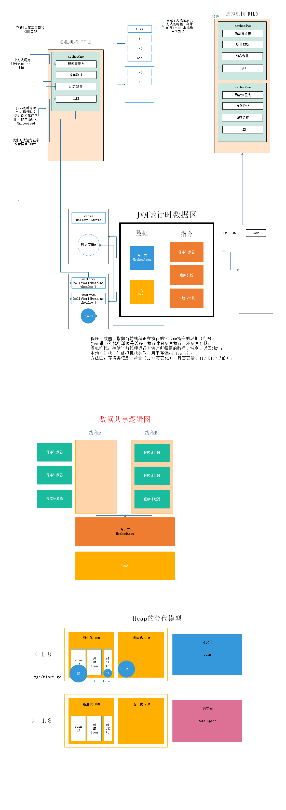

# JVM

## 介绍

​	JVM是一个令人望而却步的领域，因为它博大精深，涉及到的内容与知识点非常之多。虽然java开发者每天都在使用JVM，但对其有所研究深入的人却少之又少。然而，JVM的重要性却又是不言而喻的。基于JVM的各种动态与静态语言生态圈已经异常繁荣了，对JVM的运行机制有一定的了解不但可以提升我们的竞争力，还可以让我们在面对问题时能够沉着应对，加速问题的解决速度；同时还能够增强我们的自信心，让我们更加游刃有余。

## 大纲

- JVM介绍
- HotSpot虚拟机讲解
- 垃圾收集方式
- 垃圾收集算法
- 垃圾收集器
- 分代垃圾收集机制详解
- 新生代讲解
- 老年代讲解
- G1收集器分析与实例
- 常见且重要虚拟机参数示例
- 栈
- 方法区
- 线程共享内存区
- 根搜索算法
- Serial收集器
- ParNew收集器
- 类加载机制
- 类加载的双亲委托机制
- 字节码文件生成与分析
- 魔数
- 常量池与方法表
- 各种指令详解
- 锁详解
- 线程安全
- 偏向锁、自旋锁与轻量级锁
- JIT编译器
- GC日志生成与分析
- 虚拟机监控工具详解
- JConsole使用方式详解
  - jvisualvm
- 何为逃逸与逃逸分析
- 方法内联
- 虚拟机内存模型详解

## 类加载

- **在java代码中，类型的加载、连接与初始化过程都是在程序运行期间完成的**
- **提供了更大的灵活性，增加了更多的可能性**

### 类加载器深入剖析

- Java虚拟机与程序的生命周期
- 在如下几种情况下，Java虚拟机将结束生命周期
  - 执行了System.exit()方法
  - 程序正常执行结束
  - 程序在执行过程中遇到了异常或者错误而异常终止
  - 由于操作系统出现错误而导致Java虚拟机进程终止

### 类的加载、连接与初始化

- 加载：查找并加载类的二进制数据
- 连接
  - 验证：确保被加载的类的正确性
  - 准备：为类的**静态变量**分配内存，并将其初始化为**默认值**
  - 解析：把类中的符号引用转换为直接引用
- 初始化：为类的静态变量赋予正确的初始值

