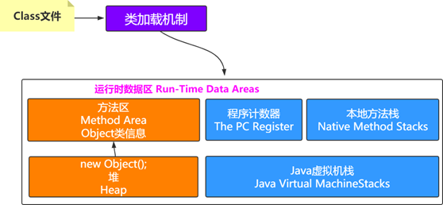
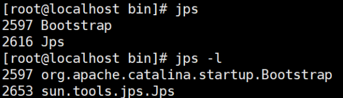
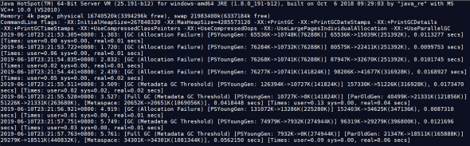

## 来源

[咕泡学院 - Jack 老师](<https://www.gupaoedu.com/>)

[腾讯课堂](<https://ke.qq.com/course/410618?tuin=9f7c6eb0#term_id=101687664>)


## 从官网了解JVM

### 帮助文档

[Java官网首页](https://www.oracle.com/java/)

[帮助文档目录](https://docs.oracle.com/javase/specs/jvms/se8/html/index.html)

[帮助文档首页](https://docs.oracle.com/javase/8/ )


### JDK/JRE/JVM关系图


> jre 是 Java 程序运行的基础，所有的 Java 程序都运行在 jre 上， jvm 又是 jre 的一部分，拥有自己的处理器、栈、寄存器、指令系统等，所以 jvm 可以看成是一个独立的操作系统，因此使用 jvm 可以让 Java 程序实现跨平台运行，也就是所谓的一次编译到处浪， jdk 是 Java 开发工具，让开发人员使用其对 Java 程序进行开发、编译、调试等，一般在安装 jdk 的同时会安装相同版本的 jre ，否则编写的 Java 程序无法运行。


## 源码到类文件

### 源码

```java
class Person{
    private String name;
    private int age;
    private static String address;
    private final static String hobby="Programming";
    public void say(){
    	System.out.println("person say...");
    }
    public int calc(int op1,int op2){
    	return op1+op2;
    }
}

```

通过 javac 将 Person.java 编译成 Person.class。

> 编译过程
>
> Person.java -> 词法分析器 -> tokens流 -> 语法分析器 -> 语法树/抽象语法树 -> 语义分析器 -> 注解抽象语法树 -> 字节码生成器 -> Person.class文件


### 类文件(Class文件)

通过 Sublime Text 工具打开这个 Class 文件，会发现 Java 文件被编译成了一串十六进制的字符：

> cafe babe 0000 0034 0027 0a00 0600 1809
> 0019 001a 0800 1b0a 001c 001d 0700 1e07
> 001f 0100 046e 616d 6501 0012 4c6a 6176
> 612f 6c61 6e67 2f53 7472 696e 673b 0100
> 0361 6765 0100 0149 0100 0761 6464 7265
>
> .....

这样的文件我们根本没法看，那么官网上会不会有对应的介绍呢？

通过官方文档目录我们发现，在第四章节有对 Class 文件的格式的介绍：


```
ClassFile {
    u4             magic;
    u2             minor_version;
    u2             major_version;
    u2             constant_pool_count;
    cp_info        constant_pool[constant_pool_count-1];
    u2             access_flags;
    u2             this_class;
    u2             super_class;
    u2             interfaces_count;
    u2             interfaces[interfaces_count];
    u2             fields_count;
    field_info     fields[fields_count];
    u2             methods_count;
    method_info    methods[methods_count];
    u2             attributes_count;
    attribute_info attributes[attributes_count];
}
```

> magic
>
> The `magic` item supplies the magic number identifying the `class` file format; it has the value `0xCAFEBABE`.

这句话的大致意思是 Class 文件的开头格式是十六进制的 cafe babe。

这里我们可以做个试验，看看是不是所有的 Class 文件都是 cafe babe 文件开头的：

```
class Student {
	
}
```

这里我们准备另一个 Java 文件，里面的内容就不写了，通过 javac 编译后：

```
cafe babe 0000 0034 000d 0a00 0300 0a07
000b 0700 0c01 0006 3c69 6e69 743e 0100
0328 2956 0100 0443 6f64 6501 000f 4c69
6e65 4e75 6d62 6572 5461 626c 6501 000a
536f 7572 6365 4669 6c65 0100 0c53 7475
6465 6e74 2e6a 6176 610c 0004 0005 0100
0753 7475 6465 6e74 0100 106a 6176 612f
6c61 6e67 2f4f 626a 6563 7400 2000 0200
0300 0000 0000 0100 0000 0400 0500 0100
0600 0000 1d00 0100 0100 0000 052a b700
01b1 0000 0001 0007 0000 0006 0001 0000
0001 0001 0008 0000 0002 0009 
```

我们可以发现，这个文件果然也是 cafe babe 开头的。

其它的参数意思我们就不看了，这些在官网上都有详细的解释，到这里，我们可以做个假设，假如我们有一天，自己写了一个这样的十六进制文件：

```
cafe babe ....
```

格式完全符合 JVM 的格式要求，那么，是不是就代表着我们写的这个 Class 文件也同样能放进 JVM 中运行呢？

换句话说，假如换了一门语言，再写一个编译器编译成 Class 文件，是不是也可以放进 JVM 中运行呢？

这就意味着，只要能符合 JVM 的格式规范，那么不管是什么语言，都能放进 JVM 里运行。这就是诸如 Kotlin、Scala等语言能用 JVM 运行的原因。


## 类文件到虚拟机(类加载机制)

> 虚拟机把Class文件加载到内存 
>
> 并对数据进行校验，转换解析和初始化 
>
> 形成可以虚拟机直接使用的Java类型，即java.lang.Class

了解完了类文件，接下来我们就来看看类文件是怎么加载到虚拟机的。同样，我们可以看看官方文档对这方面介绍：


通过目录，我们看到第五章名字非常的熟悉，这不就是类加载机制的三大过程：

- Loading：装载
- Linking：链接
- Initializing：初始化


### 装载(Loading)

装载，顾名思义，应该是先查找 Class 文件，然后导入，所以：

- 通过一个类的**全限定名**获取定义此类的**二进制字节流**；
- 将这个字节流所代表的静态存储结构转化为**方法区的运行时数据结构**；
- 在 Java 堆中生成一个代表这个类的 **java.lang.Class** 对象，作为对方法区中这些数据的访问入口。
  - Class 对象**封闭**了类在方法区内的数据结构，并且向 Java 程序员提供了访问方法区内的数据结构的接口。


那么，类的装载方式有哪些？

- 本地系统加载
- 网络下载 .class 文件
- 从zip，jar等归档文件中加载 .class 文件
- 从数据库中提取 .class 文件
- 由 java 源文件动态编译成 .class 文件
- Class.forName() 加载
- ClassLoader.loadClass() 加载


### 链接(Linking)

> Linking a class or interface involves **verifying** and **preparing** that class or interface, its direct superclass, its direct superinterfaces, and its element type (if it is an array type), if necessary. **Resolution** of symbolic references in the class or interface is an optional part of linking.

#### 验证(Verify)

> 保证被加载类的正确性

- 文件格式验证
- 元数据验证
- 字节码验证
- 符号引用验证


#### 准备(Prepare)

> 为类的静态变量分配内存，并将其初始化为默认值


#### 解析(Resolve)

> 把类中的符号引用转换为直接引用

符号引用：class 文件中定义的那些内容，就是一组符号来**描述目标**，可以是任何字面量：

```
cafe babe ....
或者
u4 u2 ...
```

直接引用：Java 进程中的一些真实地址、指针、句柄，就是直接**指向目标**的指针、相对偏移量或一个间接定位到目标的句柄。

解析阶段是虚拟机将常量池内的符号引用替换为直接引用的过程。

解析动作主要针对类或接口、字段、类方法、接口方法、方法类型、方法句柄和调用限定符7类符号引用进行。


### 初始化(Initializing)

> 对类的静态变量，静态代码块执行初始化操作


## 类装载器 ClassLoader

在装载(Load)阶段的第一步，通过类的全限定名获取其定义的二进制字节流，需要借助类装载器完成，顾名思义，就是用来装载 Class 文件的。

### 分类

****

- Bootstrap ClassLoader 负责加载 $JAVA_HOME 中 jre/lib/rt.jar 里所有的 class 或者 Xbootclasspath 选项指定的 jar 包。由 C++ 实现，不是 ClassLoader 子类。
- Extension ClassLoader 负责加载 Java 平台中扩展功能的一些 jar 包，包括 $JAVA_HOME 中 jre/lib/*.jar 或 -Djava.ext.dirs 指定目录下的 jar 包。
- App ClassLoader 负责加载 classpath 中指定的 jar 包及 -Djava.class.path 所指定目录下的类和 jar 包。
- Custom ClassLoader 通过 java.lang.ClassLoader 的子类自定义加载 class ，属于应用程序根据自身需要自定义的 ClassLoader ， 如 tomcat、 jboss 都会根据 j2ee 规范自行实现 ClassLoader。


### 加载原则 

检查某个类是否已经加载：顺序是自底向上，从 Custom ClassLoader 到 BootStrap ClassLoader 逐层检查，只要某个 ClassLoader 已加载，就视为已加载此类，保证此类在所有 ClassLoader 中加载一次。

加载的顺序：加载的顺序是自顶向下，也就是由上层来逐层尝试加载此类。

> 双亲委派机制
>
> 定义：如果一个类加载器在接到加载类的请求时，它首先不会自己尝试去加载这个类，而是把这个请求任务委托给父类加载器去完成，依次递归，如果父类加载器可以完成类加载任务，就成功返回；只有父类加载器无法完成此加载任务时，才自己去加载。
>
> 优势： Java 类随着加载它的类加载器一起具备了一种带有优先级的层次关系。比如， Java 中的 Object类，它存放在 rt.jar 之中，无论哪一个类加载器要加载这个类，最终都是委派给处于模型最顶端的启动类加载器进行加载，因此 Object 在各种类加载环境中都是同一个类，如果不采用双亲委派模型，那么由各个类加载器自己去加载的话，那么系统中会存在多种不同的 Object 类。

```java
 protected Class<?> loadClass(String name, boolean resolve)
        throws ClassNotFoundException
    {
       	...
        // 源码中双亲委派的实现
		if (parent != null) {
    		c = parent.loadClass(name, false);
        } 
     	...
    }

```


## 运行时数据区(Run-Time Data Areas)

在装载阶段的第二、三步中可以发现有运行时数据、堆、方法区等名词。

说白了就是类文件被类装载器装载进来之后，类中的内容(比如变量、常量、方法、对象等这些数据得要有个去处，也就是要存储起来，存储的位置肯定是在 JVM 中有对应的空间)


### 常规理解 

#### 方法区(Method Area)

- 方法区是各个线程共享的内存区域，在虚拟机启动时创建
- 用于存储已被虚拟机加载的**类信息、常量、静态变量、即时编译器编译后的代码**等数据
- 虽然 Java 虚拟机规范把方法区描述为堆的一个逻辑部分，但是它却有一个别名叫做 **Non-Heap (非堆)**，目的是与 Java 堆区分开来
- 当方法区无法满足内存分配需求时，将抛出 **OutOfMemoryError** 异常

> 此时回看装载阶段的第2步：(2)将这个字节流所代表的静态存储结构转化为方法区的运行时数据结构

这时，如果把从 class 文件到装载的第一、二步合并起来理解的话，可以画个图：


**注意**

- 方法区在 jdk 8 中就是 Metaspace ，在 jdk6 或 7 中就是 Perm Space
- 常量池的变化，jdk7 后，字符串常量池被移动到堆中

Class 文件中除了有类的版本、字段、方法、接口等描述信息外， 还有一项信息就是常量池，用于存在编译时期生成的各种字面里和符号引用，这部分内容将在类加载后进入方法区的运行时常量池中存放。


#### 堆(Heap)

- 堆是 Java 虚拟机所管理内存中最大的一块，在虚拟机启动时创建，被所有线程共享
- Java 对象实例以及数组都在堆上分配

此时回看装载阶段的第3步：(3)在Java堆中生成一个代表这个类的java.lang.Class对象，作为对方法区中这些数据的访问入口。

此时装载(1)(2)(3)的图可以改动一下：


#### 虚拟机栈(Java Virtual Machine Stacks)

> 经过上面的分析，类加载机制的装载过程已经完成，后续的链接，初始化也会相应的生效。
>
> 假如目前的阶段是初始化完成了，后续做啥呢？肯定就是使用了，不用的话这样折腾来折腾去有什么意义？那怎样才能被使用到？换句话说里面内容怎样才能被执行？比如通过主函数 main 调用其他方法，这种方式实际上是 main 线程执行之后调用的方法，既要想使用里面的各种内容，得要以线程为单位，执行相应的方法才行。
>
> 那一个线程执行的状态如何维护？一个线程可以执行多少个方法？这样的关系怎么维护呢？

- 虚拟机栈是一个线程执行的区域，保存着一个线程中方法的调用状态。换句话说，一个 Java 线程的运行状态，由一个虚拟机栈来保存，所以虚拟机栈肯定是线程私有的，独有的，随着线程的创建而创建
- 每一个被线程执行的方法，为该栈中的栈帧，即每个方法对应一个栈帧
- 调用一个方法，就会向栈中压入一个栈帧；一个方法调用完成，就会把该栈帧从栈中弹出

```java
// 伪代码
a(){
	b();
} 
b(){
	c();
} 
c(){
    ...
}
```


#### 程序计数器(The PC Register)

> 我们都知道一个 JVM 进程中有多个线程在执行，而线程中的内容是否能够拥有执行权，是根据 CPU 调试来的。
>
> 假如线程 A 正在执行到某个地方，突然失去了 CPU 的执行权，切换到线程 B 了，然后当线程 A 再获得 CPU 执行权的时候，怎么能继续执行呢？这就是需要在线程中维护一个变量，记录线程执行到的位置。

- 程序计数器占用到的内存空间很小 ，由于 Java 虚拟机的多线程是通过线程轮流切换，并分配处理器执行时间的方式来实现的，在任意时刻，一个处理器只会执行一条线程中的指令。因此，为了 线程切换后能够恢复到正确的执行位置，每条线程需要有一个独立的程序计数器(线程私有)
- 如果如果线程正在执行 Java 方法，则计数器记录的是正在执行的虚拟机字节码指令的地址
- 如果正在执行的是 Native 方法，则这个计数器为空。


#### 本地方法栈(Native Method Stacks)

如果当前线程执行的方法是 Native 类型的，这些方法就会在本地方法栈中执行。


### 结合字节码指令理解 Java 虚拟机栈和栈帧

> 官网：[https://docs.oracle.com/javase/specs/jvms/se8/html/jvms-2.html#jvms-2.6 ](https://docs.oracle.com/javase/specs/jvms/se8/html/jvms-2.html#jvms-2.6)
>
> 栈帧：每个栈帧对应一个被调用的方法，可以理解为一个方法的运行空间。

每个栈帧中包括局部变量表(Local Variables)、操作数栈(Operand Stack)、指向运行时常量池的引用(A reference to the run-time constant pool)、方法返回地址(Return Address)和附加信息。


- 局部变量表
  - 方法中定义的局部变量以及方法的参数存放在这张表中
  - 局部变量表中的变量不可直接使用，如需要使用的话，必须通过相关指令将其加载至操作数栈中使用
- 操作数栈
  - 以压栈和出栈的方式存储操作数的
- 动态链接
  - 每个栈帧都包含一个指向运行时常量池中该栈帧所属方法的引用，持有这个引用是为了支持方法调用过程中的动态链接(Dynamic Linking)
- 方法返回地址
  - 当一个方法开始执行后，只有两种方式可以退出，一种是遇到方法返回的字节码指令；另一种是遇见异常，并且这个异常没有在方法体内得到处理。


```java
class Person{
    private String name="Jack"; 
    private int age;
    private final double salary=100; 
    private static String address;
	private final static String hobby="Programming"; 
    public void say(){
		System.out.println("person say...");
	}
	public static int calc(int op1,int op2){ 
        op1=3;
		int result=op1+op2; 
        return result;
	}
	public static void order(){

	}
	public static void main(String[] args){ 
		calc(1,2);
		order();
	}
}
```

这里我们先 javac 编译一下，然后 javap 反编译成 Person.txt 文件，其中这些指令的意思网上有更多更详细的，这里就不一一列出来了。

```java
Compiled from "Person.java" 
class Person {
    ...
    public static int calc(int, int); 
    	Code:
            0: iconst_3	//将int类型常量3压入[操作数栈]
            1: istore_0	//将int类型值存入[局部变量0]
            2: iload_0	//从[局部变量0]中装载int类型值入栈
            3: iload_1	//从[局部变量1]中装载int类型值入栈
            4: iadd	//将栈顶元素弹出栈，执行int类型的加法，结果入栈
            【For example, the iadd instruction (§iadd) adds two int values together. It requires that the int values to be added be the top two values of the operand stack, pushed there by previous instructions. Both of the int values are popped from the operand stack. They are added, and their sum is pushed back onto the operand stack. Subcomputations may be nested on the operand stack, resulting in values that can be used by the encompassing computation.】
            5: istore_2	//将栈顶int类型值保存到[局部变量2]中
            6: iload_2	//从[局部变量2]中装载int类型值入栈
            7: ireturn	//从方法中返回int类型的数据
    ...
}
```

**注意**

通过上面的指令，我们不难发现，==op1=3== 是被拆分成两行指令来运行的，这就是为什么平时看着明明就一行代码，却发生了线程安全问题的原因，这是因为你的一行代码被拆分成两行指令后并不是一个原子性的操作。


### 拓展知识

#### 栈指向堆

如果在栈帧中有一个变量，类型为引用类型，比如 Object obj = new Object() ，这时候就是典型的栈中元素指向堆中的对象。


#### 方法区指向堆

方法区中会存放静态变量、常量等数据。如果是下面这种情况，就是典型的方法区中元素指向堆中的对象

```java
private static Object obj = new Object();
```


#### 堆指向方法区

What? 堆还能指向方法区？

注意，方法区中会包含类的信息，堆中会有对象，那么怎么知道对象是哪个类创建的呢？




#### Java 对象内存布局

一个 Java 对象在内存中包括3个部分：对象头、实例数据和对齐填充


对象头

- Mark Word
  - 一系列的标记位(哈希码、分代年龄、锁状态标志、GC年龄等)
- Class Pointer
  - 指向对象对应的类元数据的内存地址(堆指向方法区)
- Length
  - 数组对象特有，数组长度


## JVM内存模型

### 内存模型与运行时数据区

上面对运行时数据区描述了很多，其实重点存储数据的是堆和方法区(非堆)，所以内存的设计也着重从这两方面展开(注意这两块区域都是线程共享的)。

对于虚拟机栈、本地方法栈、程序计数器都是线程私有的。


### 图解

> 一块是非堆区，一块是堆区。
>
> 堆区分为两大块，一个是Old区，一个是Young区。
>
> Young区分为两大块，一个是Survivor区（S0+S1），一块是Eden区。 Eden:S0:S1=8:1:1 S0和S1一样大，也可以叫From和To。


根据之前对于 Heap 的介绍可以知道，一般对象和数组的创建会在堆中分配内存空间，关键是堆中有这么多区域，那一个对象的创建到底在哪个区域？


### Eden区

一般情况下，新创建的对象都会被分配到 Eden 区，一些特殊的大的对象会真的分配到 Old 区。

> 比如有对象 A，B，C 等创建在 Eden 区，但是 Eden 区的内存空间肯定有限，比如有 100M ，假如已经使用了 100M 或者达到一个设定的临界值，这时候就需要对 Eden 内存空间进行清理，即垃圾收集(Garbage Collect)，这样的 GC 我们称之为 Minor GC， Minor GC 指得是 Young 区的 GC。
>
> 经过 GC 之后 ，有些对象就会被清理掉，有些对象可能还存活着，对存活着的对象需要将其复制到 Survivor 区，然后再清空 Eden 区中的这些对象。


### Survivor 区详解

由图解可以看出， Survivor 区分为两块 S0 和 S1 ，也可以叫做 From 和 To。

在同一个时间点上， S0 和 S1 只能有一个区有数据，另外一个是空的。

> 接着上面的 GC 来说，比如一开始只有 Eden 区和 From 中有对象， To 中是空的。
>
> 此时进行一次 GC 操作， From 区中对象的年龄就会 +1 ，我们知道 Eden 区中所有存活的对象会被复制到 To 区， From 区中还能存活的对象会有两个去处。
>
> 若对象的年龄达到之前设置好的的年龄阈值，此时对象会被移动到 Old 区，没有达到阈值的对象会被复制到 To 区。
>
> 此时 Eden 区和 From 区已经被清空(被 GC 的对象肯定没了，没有被 GC 的对象都有了各自的去处。)
>
> 这时候 From 和 To 交换角色，之前的 From 变成了 To ，之前的 To 变成了 From 。
>
> 也就是说无论如何 都要保证名为 To 的 Survivor 区域是空的。
>
> Minor GC 会一直重复这样的过程，知道 To 区被填满，然后会将所有对象复制到老年代中。


### Old 区

从上面的分析可以看出，一般 Old 区都是年龄比较大的对象，或者相对超过了某个阈值的对象。

在 Old 区也会有 GC 的操作， Old 区的 GC 我们称作为 Major GC。

默认15次GC还存活在新生代的对象会转移至老年代。


### 对象的一辈子理解 

> 我是一个普通的Java对象,我出生在Eden区,在Eden区我还看到和我长的很像的小兄弟,我们在Eden区中玩了 挺长时间。有一天Eden区中的人实在是太多了,我就被迫去了Survivor区的“From”区,自从去了Survivor 区,我就开始漂了,有时候在Survivor的“From”区,有时候在Survivor的“To”区,居无定所。直到我18岁的 时候,爸爸说我成人了,该去社会上闯闯了。 于是我就去了年老代那边,年老代里,人很多,并且年龄都挺大的,我在这里也认识了很多人。在年老代里,我生 活了20年(每次GC加一岁)，然后被回收。


### 常见问题

- 如何理解 Minor / Major /Full GC

```
Minor GC: 新生代GC
Major GC: 老年代GC
Full GC: Minor GC + Major GC + MetaSpace GC
```

- 为什么需要 Survivor 区？只有 Eden 区不行吗

```
如果没有 Survivor 区， Eden 区每进行一次 Minor GC，并且没有年龄限制的条件下，存活的对象就会被送到老年代。
这样一来，老年代很快被填满，触发 Major GC (因为 Major GC 一般伴随着 Minor GC，也可以看做触发了 Full GC)。
老年代的内存空间远大于新生代，进行一次 Full GC 消耗时间比 Minor GC 要长得多。
执行时间长有什么坏处？
频繁的 Full GC 消耗的时间很长，会影响大型程序的执行和响应速度。
可能你会说，那就对老年代的空间进行增加或者减少咯。
假如增加老年代空间，更多存活对象才能填满老年代，虽然降低 Full GC 频率，但是随着老年代空间加大，一旦发生 Full GC， 执行所需要的时间会更长。
假如减少老年代空间，虽然 Full GC 所需要的时间减少，但是老年代很快被存活对象填满， Full GC 频率增加。
所以 Survivor 区的存在意义，就是减少被送到老年代的对象，进而减少 Full GC 的发生， Survivor 区的预筛选保证了只有经历16次 Minor GC 还能在新生代中存活的对象，才会被送到老年代。
```

- 为什么需要两个 Survivor 区？

```
最大的好处就是解决了碎片化。也就是说为什么一个 Survivor 区不行？第一部分中，我们知道了必须设置 Survivor 区。假设现在只有一个 Survivor 区，我们来模拟一下流程：
刚刚新建的对象在 Eden 中，一旦 Eden 满了，触发一次 Minor GC， Eden 中的存活对象就会被移动到 Survivor 区。这样继续循环下支，下一次 Eden 满了的时候，问题来了，此时进行 Minor GC， Eden 和 Survivor 各有一些存活对象，如果此时把 Eden 区的存活对象硬放到 Survivor 区，很明显这两个部分对象所占有的内存是不连续的，也就导致了内存碎片化。
永远有一个 Survivor space 是空的，另一个非空的 Survivor space 无碎片。
```

- 新生代中 Eden:S1:S2 为什么是8:1:1？

```
新生代中的可用内存：复制算法用来担保的内存为 9:1
可用内存中 Eden:S1 为 8:1
即新生代中 Eden:S1:S2 = 8:1:1
```


## 体验与验证

### 使用 jvisualvm 查看

==visualgc插件下载链接：==https://visualvm.github.io/pluginscenters.html --->选择对应版本链接--->Tools--->Visual GC
若上述链接找不到合适的，大家也可以自己在网上下载对应的版本


### 堆内存溢出 

#### 代码

```java
@RestController
public class HeapController {
    List<Person> list=new ArrayList<Person>();
    @GetMapping("/heap")
    public String heap() throws Exception{
        while(true){
            list.add(new Person());
            Thread.sleep(1);
        }
    }
}
```

> 记得设置运行参数，如：-Xmx20M -Xms20M

#### 运行结果

访问 -> http://localhost:8080/heap

> Exception in thread "http-nio-8080-exec-2" java.lang.OutOfMemoryError: GC
> overhead limit exceeded


### 方法区内存溢出

> 比如方法区中添加Class的信息

#### asm依赖和Class代码

```pom
<dependency>
    <groupId>asm</groupId>
    <artifactId>asm</artifactId>
    <version>3.3.1</version>
</dependency>
```

```java
public class MyMetaspace extends ClassLoader {
    public static List<Class<?>> createClasses() {
        List<Class<?>> classes = new ArrayList<Class<?>>();
        for (int i = 0; i < 10000000; ++i) {
            ClassWriter cw = new ClassWriter(0);
            cw.visit(Opcodes.V1_1, Opcodes.ACC_PUBLIC, "Class" + i, null,
            "java/lang/Object", null);
            MethodVisitor mw = cw.visitMethod(Opcodes.ACC_PUBLIC, "<init>",
            "()V", null, null);
            mw.visitVarInsn(Opcodes.ALOAD, 0);
            mw.visitMethodInsn(Opcodes.INVOKESPECIAL, "java/lang/Object",
            "<init>", "()V");
            mw.visitInsn(Opcodes.RETURN);
            mw.visitMaxs(1, 1);
            mw.visitEnd();
            Metaspace test = new Metaspace();
            byte[] code = cw.toByteArray();
            Class<?> exampleClass = test.defineClass("Class" + i, code, 0,
            code.length);
            classes.add(exampleClass);
        }
        return classes;
    }
}
```

```java
@RestController
public class NonHeapController {
    List<Class<?>> list=new ArrayList<Class<?>>();
    @GetMapping("/nonheap")
    public String nonheap() throws Exception{
    	while(true){
        	list.addAll(MyMetaspace.createClasses());
        	Thread.sleep(5);
        }
    }
}
```

> 设置Metaspace的大小，比如-XX:MetaspaceSize=50M -XX:MaxMetaspaceSize=50M

#### 运行结果

访问 -> http://localhost:8080/nonheap

> java.lang.OutOfMemoryError: Metaspace
> at java.lang.ClassLoader.defineClass1(Native Method) ~[na:1.8.0_191]
> at java.lang.ClassLoader.defineClass(ClassLoader.java:763) ~[na:1.8.0_191]

### 虚拟机栈溢出

StackOverFlow

#### 代码

```java
public class StackDemo {
    public static long count=0;
    public static void method(long i){
    	System.out.println(count++);
    	method(i);
    }
    public static void main(String[] args) {
    	method(1);
    }
}
```

#### 运行结果


#### 理解和说明

Stack Space 用来做方法的递归调用时压入 Stack Frame (栈帧)。所以当递归调用太深的时候，就有可能耗尽 Stack Space ，爆出 StackOverFlow 的错误。

-Xss128k：设置每个线程的堆栈大小。JDK 5以后每个线程堆栈大小为1M，以前每个线程堆栈大小为 256K 。根据应用的线程所需内存大小进行调整。在相同物理内存下，减小这个值能生成更多的线程。但是操作系统对一个进程内的线程数还是有限制的，不能无限生成，默认下如上图是在7000~8000，实际开发可以设置在3000~5000。

线程栈的大小是个双刃剑，如果设置过小，可能会出现栈溢出，特别是在该线程内有递归、大的循环时出现溢出的可能更大，如果该值设置过大，就有影响到创建栈的数量，如果是多线程的应用，就会出现内存溢出的错误。


## 垃圾回收（Garbage Collect）

> 之前说堆内存中有垃圾回收，比如 Young 区的 Minor GC，Old 区的 Major GC， Young 区和 Old 区的 Full GC。
>
> 但是对于一个对象而言，怎么确定它是垃圾？是否需要被回收？怎么对它进行回收？等等这些问题我们还需要详细探索。
>
> 因为 Java 是自动做内存管理和垃圾回收的，如果不了解垃圾回收的各方面知识，一旦出现问题我们很难进行排查和解决，自动垃圾回收机制就是寻找 Java 堆中的对象，并对对象进行分类差别，寻找出正在使用的对象和已经不会使用的对象，然后把那些不会使用的对象从堆上清除。

### 如何确定一个对象是垃圾

> 要想进行垃圾回收，得先知道什么样的对象是垃圾。

#### 引用计数法

对于某个对象而言，只要应用程序中持有该对象的引用，就说明该对象不是垃圾，如果一个对象没有任何指针对其引用，它就是垃圾。

**注意：** 如果对象 A 和对象 B 之间想到持有引用，则会导致永远不能被回收。


#### 可达性分析

通过 GC Root 的对象，开始向下寻找，看某个对象是否可达。

> 能作为 GC Root ：类加载器、Thread、虚拟机栈的本地变量表、static 成员、常量引用、本地方法栈的变量等。

```
虚拟机栈（栈帧中的本地变量表）中引用的对象。
方法区中类静态属性引用的对象。
方法区中常量引用的对象。
本地方法栈中 JNI (即一般说的 Native 方法)引用的对象。 
```


### 垃圾收集算法

> 已经能够确定一个对象为垃圾之后，接下来要考虑的就是回收，怎么回收呢？得要有对应的算法，下面介绍常见的垃圾回收算法。


#### 标记-清除（Mark-Sweep）

- 标记

找出内存中需要回收的对象，并且把它们标记出来。

> 此时堆中所有对象都会被扫描一遍，从而才能确定需要回收的对象，比较耗时。


- 清除

清除掉被标记需要回收的对象，释放出对应的内存空间


==缺点==

```tex
1. 标记和清除两个过程都比较耗时，效率不高
2. 会产生大量不连续的内存碎片，空间碎片太多可能会导致以后在程序运行过程中需要分配较大对象时，无法找到足够的连续内存而不得不提前触发另一次垃圾收集动作。
```


#### 复制（Copying）

将内存划分为两块相等的区域，每次只使用其中一块，如下图所示：


当其中一块内存使用完了，就将还存活的对象复制到另外一块上面，然后把已经使用过的内存空间一次清除掉。


==缺点：==空间利用率降低。

例子：新生代


#### 标记-整理（Mark-Compact）

> 复制收集算法在对象存活率较高时就要进行较多的复制操作，效率将会变低。更关键的是，如果不想浪费50%的空间，就需要有额外的空间进行分配担保，以应对被使用的内存中所有对象都有100%存活的极端情况，所以老年代一般不能直接选用这种算法。

标记过程仍然与“标记-清除”算法一样，但是后续步骤不是直接对可回收对象进行清理，而是让所有存活的对象都向一端移动，然后直接清理掉端边界以外的内存。

> 其实上述过程相对“复制算法”来讲，少了一个“保留区”


让所有存活的对象都向一端移动，清理掉边界以外的内存。


### 分代收集算法

> 通过上面介绍了3种垃圾收集算法，那么在堆内存中到底用哪一个呢？

新生代：复制算法（对象在被分配之后，可能生命周期比较短，在新生代复制效率比较高）

老年代：标记清除或者标记整理（老年代对象存活时间比较长，复制来复制去没必要，不如做个标记再清理）


### 垃圾收集器

> 如果说收集算法是内存回收的方法论，那么垃圾收集器就是内存回收的具体实现。


==注意：==上图是以 JDK1.8 为主


#### Serial 收集器

Serial 收集器是最基本、发展历史最悠久的收集器，曾经（在 JDK1.3.1 之前）是虚拟机新生代收集的唯一选择。

它是一种**单线程收集器**，不仅仅意味着它只会使用一个 CPU 或者一条收集线程去完成垃圾收集工作，更重要的是其在进行垃圾收集的时候需要暂停其它线程。

- 优点：简单高效，拥有很高的单线程收集效率
- 缺点：收集过程需要暂停所有线程
- 算法：复制算法
- 适用范围：新生代
- 应用： Client 模式下的默认新生代收集器


#### Serial Old 收集器

Serial Old 收集器是 Serial 收集器的老年代版本，也是一个单线程收集器，不同的是采用“标记-整理”算法，运行过程和 Serial 收集器一样。


#### ParNew 收集器

可以把这个收集器理解为 Serial 收集器的多线程版本。


- 优点：在多 CPU 时，比 Serial 效率高
- 缺点：收集过程暂停所有应用程序线程，单 CPU 时比 Serial 效率差
- 算法：复制算法
- 适用范围：新生代
- 应用：运行在 Server 模式下的虚拟机中首选的新生代收集器


#### Parallel Scavenge 收集器

Parallel Scavenge 收集器是一个新生代收集器，它也是使用复制算法的收集器，又是并行的多线程收集器，看上去和 ParNew 一样，但是 Parallel Scanvenge 更关注**系统的吞吐量**。

> 吞吐量 = 运行用户代码的时间 / （运行用户代码的时间 + 垃圾收集时间）
>
> 比如虚拟机总共运行了 100 分钟，垃圾收集时间用了 1 分钟，吞吐量 = (100 - 1) / 100 = 99%
>
> 若吞吐量越大，意味着垃圾收集的时间越短，则用户代码可以充分利用 CPU 资源，尽快完成程序的运算任务

```
-XX:MaxGCPauseMillis 控制最大的垃圾收集停顿时间
-XX:GCTimeRatio 直接设置吞吐量的大小
```


#### Parallel Old 收集器

Parallel Old 收集器是 Parallel Scavenge 收集器的老年代版本，使用多线程和“标记-整理”算法进行垃圾回收。**吞吐量优先**


#### CMS 收集器

CMS（Concurrent Mark Sweep）收集器是一种以获取**最短回收停顿时间**为目标的收集器

采用的是“标记-清除算法”，整个过程分为4步

```
1. 初始标记 CMS initial mark		标记 GC Roots 能关联到的对象	Stop The World --> 速度很快
2. 并发标记 CMS concurrent mark		进行 GC Roots Tracing
3. 重新标记 CMS remark			   修改并发标记因用户程序变动的内容  Stop The World
4. 并发清除 CMS concurrent sweep
```

> 由于整个过程中，并发标记和并发清除，收集器线程可以与用户线程一起工作，所以总体上来说，CMS 收集器的内存回收过程是与用户线程一起并发地执行的。

- 优点：并发收集、低停顿
- 缺点：产生大量空间碎片、并发阶段会降低吞吐量


#### G1 收集器

G1 收集器在 JDK 7 正式作为商用的收集器

与前几个收集器相比， G1 有以下特点

- 并行与并发
- 分代收集（仍然保留了分代的概念）
- 空间整合（整体上属于“标记-整理”算法，不会导致空间碎片）
- 可预测的停顿（比 CMS 更先进的地方在于能让使用者明确指定一个长度为 M 毫秒的时间片段内，消耗在垃圾收集上的时间不得超过 N 毫秒）
- G1 收集器会先收集存活对象少的区域，也就是垃圾对象多的区域，这样可以有大量的空间可以释放出来，这就是 Garbage First 的由来

> 使用 G1 收集器时，Java 堆的内存布局与其它收集器有很大差别，它将整个 Java 堆划分为多个大小相等的独立区域（Region），虽然还保留有新生代和老年代的概念，但新生代和老年代不再是物理隔离的了，它们都是一部分 Region（不需要连续）的集合。


工作过程可以分为如下几步：

- 初始标记（Initial Marking）	标记一下 GC Roots 能够关联的对象，并且修改 TAMS 的值，需要暂停用户线程
- 并发标记（Concurrent Marking）	从 GC Roots 进行可达性分析，找出 存活的对象，与用户线程并发执行
- 最终标记（Final Marking）	修正并发标记阶段因为用户程序的并发执行导致变动的数据，需暂停用户线程
- 筛选回收（Live Data Counting and Evacuation） 	对各个 Region 的回收价值和成本进行排序，根据用户所期望的 GC 停顿时间制定回收计划


#### 垃圾收集器分类

- 串行收集器 -> Serial 和 Serial Old
  - 只能有一个垃圾回收线程执行，用户线程暂停。**适用于内存比较小的嵌入式设备。**
- 并行收集器（吞吐量优先） -> Parallel Scanvenge、Parallel Old
  - 多条垃圾收集线程并行工作，但此时用户线程仍然处于等待状态。**适用于科学计算、后台处理等交互场景。**
- 并发收集器（停顿时间优先） -> CMS、G1
  - 用户线程和垃圾收集线程同时执行（但并不一定是并行的，可能是交替执行的），垃圾收集线程在执行的时候不会停顿用户线程的运行。**适用于相对时间有要求的场景，比如 Web 。**


#### 吞吐量和停顿时间

- 停顿时间 -> 垃圾收集器进行垃圾回收时终端应用执行响应时间
- 吞吐量 -> 运行用户代码时间 / （运行用户代码时间 + 垃圾收集时间）

```
停顿时间越短就越适合需要和用户交互的程序，良好的响应速度能提升用户体验；
高吞吐量则可以高效地利用 CPU 时间，尽快完成程序的运算任务，主要适合在后台运算而不需要太多交互的任务。
```

**小结：**这两个指标也是评价垃圾收集器好坏的标准，其实调优也就是在观察这两个变量


#### 如何选择合适的垃圾收集器


官网 ：https://docs.oracle.com/javase/8/docs/technotes/guides/vm/gctuning/collectors.html#sthref28

- 如果应用程序的数据集较小（最大约100 MB），则选择串行收集器`-XX:+UseSerialGC`。
- 如果应用程序将在单个处理器上运行，并且没有暂停时间要求，则让VM选择收集器，或选择串行收集器`-XX:+UseSerialGC`。
- 如果（a）峰值应用程序性能是第一要务，并且（b）没有暂停时间要求或可接受的暂停时间为1秒或更长时间，则让VM选择收集器，或选择并行收集器`-XX:+UseParallelGC`。
- 如果响应时间比整体吞吐量更重要，并且垃圾收集暂停时间必须保持小于1秒，那么请使用并发收集器`-XX:+UseConcMarkSweepGC`或`-XX:+UseG1GC`。


#### 再次理解 G1

> JDK 7 开始使用， JDK 8 非常成熟，JDK 9 默认的垃圾收集器适用于新老生代。

是否使用 G1 收集器？

- 50% 以上的堆被存活对象占用
- 对象分配和晋升的速度变化非常大
- 垃圾回收时间比较长


#### 如何开启需要的垃圾收集器

> 这里 JVM 参数信息的设置大家先不用关心，下一章节会学习到。

- 串行
  - -XX:+UseSerialGC
  - -XX:+UseSerialOldGC
- 并行（吞吐量优先）
  - -XX:+UseParallelGC
  - -XX:+UseParallelOldGC
- 并发（响应时间优先）
  - -XX:+UseConcMarkSweepGC
  - -XX:+UseG1GC


## 工欲善其事必先利其器

> 经过前面 的各种分析学习，我们知道了关于 JVM 很多的知识，比如版本信息、类加载、堆、方法区、垃圾回收等，但是总觉得心里不踏实，原因是没看到实际的一些东西。
>
> 所以这一章节，咱们就好好来聊一聊关于怎么将这些内容进行直观地展示在我们面前，包括怎么进行相应的一些设置。 OK, let's go~

### JVM 参数

#### 标准参数

```
-version
-help
-server
-cp
```


#### -X 参数

> 非标准参数，也就是在 JDK 各个版本中可能会变动

```
-Xint		解释执行
-Xcomp		第一次使用就编译成本地代码
-Xmixed		混合模式， JVM 自己来决定
```


#### -XX 参数

> **使用得最多的参数类型**
>
> 非标准化参数，相对不稳定，主要用于 JVM 调优和 Debug

```
a. Boolean 类型
格式：	-XX:[+-]<name>				+ 或 - 表示启用或者禁用 name 属性
比如：	-XX:+UseConcMarkSweepGC		表示启用 CMS 类型的垃圾收集器
	  -XX:+UseG1GC				 表示启用 G1 类型的垃圾收集器
	  
b. 非 Boolean 类型
格式：	-XX<name>=<value>			表示 name 属性的值是 value
比如：	-XX:MaxGCPauseMillis=500	表示最大 GC 停顿时间不超过500毫秒
```


#### 其它参数

```\
-Xms1000 等价于 -XX:InitialHeapSize=1000
-Xmx1000 等价于 -XX:MaxHeapSize=1000
-Xss1000 等价于 -XX:ThreadStackSize=1000
```

> **所以这块也相当于是 -XX 类型的参数**


#### 查看参数

> java -XX: +PrintFlagsFinal -version > flags.txt


> 值得注意的是“=”表示默认值， “:=” 表示被用户或 JVM 修改后的值
>
> 要想查看某个进程具体参数的值，可以使用 jinfo ，这块后面聊
>
> 一般要设置参数，可以先查看一下当前参数是什么，然后进行修改


#### 设置参数的方式

- 开发工具中设置，比如 IDEA， eclipse
- 运行 jar 包的时候，比如 java -XX:UseG1GC xxx.jar
- web 容器，比如 tomcat，可以在脚本中的进行设置
- 通过 jinfo 实时调整某个 java 进程的参数（参数只有被标记为 manageable 的 flags 可以被实时修改）


#### 实践和单位换算

> 1Byte(字节) = 8bit(位)
>
> 1KB = 1024Byte(字节)
>
> 1MB = 1024KB
>
> 1GB = 1024MB
>
> 1TB =1024GB

```
(1)设置堆内存大小和参数打印
	-Xmx100M -Xms100M -XX:+PrintFlagsFinal
(2)查询+PrintFlagsFinal的值
	:=true
(3)查询堆内存大小MaxHeapSize
	:= 104857600
(4)换算
	104857600(Byte)/1024=102400(KB)
	102400(KB)/1024=100(MB)
(5)结论
	104857600是字节单位
```


#### 常用参数含义

| 参数                                                         |                             含义                             | 说明                                                         |
| :----------------------------------------------------------- | :----------------------------------------------------------: | :----------------------------------------------------------- |
| -XX:CICompilerCount=3                                        |                        最大并行编译数                        | 如果设置大于1，虽然编译速度会提高，但是同样影响系统稳定性，会增加JVM崩溃的可能 |
| XX:InitialHeapSize=100M                                      |                         初始化堆大小                         | 简写-Xms100M                                                 |
| -XX:MaxHeapSize=100M                                         |                          最大堆大小                          | 简写-Xmx100M                                                 |
| -XX:PermSize=64M                                             |                      设置非堆的初始大小                      | 默认是物理内存的1/64                                         |
| -XX:MaxPermSize=128M                                         |                         最大非堆大小                         | 默认是物理内存的1/4                                          |
| -XX:NewSize=20M                                              |                       设置新生代的大小                       |                                                              |
| -XX:MaxNewSize=50M                                           |                        新生代最大大小                        |                                                              |
| -XX:OldSize=50M                                              |                        设置老年代大小                        |                                                              |
| -XX:MetaspaceSize=50M                                        |                        设置方法区大小                        |                                                              |
| -XX:MaxMetaspaceSize=50M                                     |                        方法区最大大小                        |                                                              |
| -XX:+UseParallelGC                                           |                      使用UseParallelGC                       | 新生代，吞吐量优先                                           |
| -XX:+UseParallelOldGC                                        |                     使用UseParallelOldGC                     | 老年代，吞吐量优先                                           |
| -XX:+UseConcMarkSweepGC                                      |                           使用CMS                            | 老年代，停顿时间优先                                         |
| -XX:+UseG1GC                                                 |                           使用G1GC                           | 新生代，老年代，停顿时间优先                                 |
| -XX:NewRatio                                                 |                        新老生代的比值                        | 比如-XX:Ratio=4，则表示新生代:老年代=1:4，也就是新生代占整个堆内存的1/5 |
| -XX:SurvivorRatio                                            |                    两个S区和Eden区的比值                     | 比如-XX:SurvivorRatio=8，也就是(S0+S1):Eden=2:8，也就是一个S占整个新生代的1/10 |
| -XX:+HeapDumpOnOutOfMemoryError                              |                      启动堆内存溢出打印                      | 当JVM堆内存发生溢出时，也就是OOM，自动生成dump文件           |
| -XX:HeapDumpPath=heap.hprof                                  |                    指定堆内存溢出打印目录                    | 表示在当前目录生成一个heap.hprof文件                         |
| -XX:+PrintGCDetails <br/>-XX:+PrintGCTimeStamps <br/>-XX:+PrintGCDateStamps<br/>-Xloggc:$CATALINA_HOME/logs/gc.log |                         打印出GC日志                         | 可以使用不同的垃圾收集器，对比查看GC情况                     |
| -Xss128k                                                     |                    设置每个线程的堆栈大小                    | 经验值是3000-5000最佳                                        |
| -XX:MaxTenuringThreshold=6                                   |                    提升年老代的最大临界值                    | 默认值为 15                                                  |
| -XX:InitiatingHeapOccupancyPercent                           |                启动并发GC周期时堆内存使用占比                | G1之类的垃圾收集器用它来触发并发GC周期,基于整个堆的使用率,而不只是 某一代内存的使用比. 值为 0 则表示”一直执行GC循环”. 默认值为 45. |
| -XX:G1HeapWastePercent                                       |                    允许的浪费堆空间的占比                    | 默认是10%，如果并发标记可回收的空间小于10%,则不会触发MixedGC。 |
| -XX:MaxGCPauseMillis=200                                     |                        G1最大停顿时间                        | 暂停时间不能太小，太小的话就会导致出现G1跟不上垃圾产生的速度。最终退化成Full GC。所以对这个参数的调优是一个持续的过程，逐步调整到<br/>最佳状态。 |
| -XX:ConcGCThreads=n                                          |                 并发垃圾收集器使用的线程数量                 | 默认值随JVM运行的平台不同而不同                              |
| -XX:G1MixedGCLiveThresholdPercent=65                         |        混合垃圾回收周期中要包括的旧区域设置占用率阈值        | 默认占用率为 65%                                             |
| -XX:G1MixedGCCountTarget=8                                   | 设置标记周期完成后，对存活数据上限为G1MixedGCLIveThresholdPercent 的旧区域执行混合垃圾回收的目标次数 | 默认8次混合垃圾回收，混合回收的目标是要控制在此目标次数以内  |
| -XX:G1OldCSetRegionThresholdPercent=1                        |           描述Mixed GC时，Old Region被加入到CSet中           | 默认情况下，G1只把10%的Old Region加入到CSet中                |


### 常用命令

#### jps

> 查看 Java 进程

```
The jps command lists the instrumented Java HotSpot VMs on the target system.
The command is limited to reporting information on JVMs for which it has the
access permissions.
```




#### jinfo

> 1. 实时查看和调整 JVM 配置参数

```
The jinfo command prints Java configuration information for a specified Java
process or core file or a remote debug server. The configuration information
includes Java system properties and Java Virtual Machine (JVM) command-line
flags.
```

> 2. 查看
>
>    jinfo -flag name PID	查看某个 Java 进程的  name 属性的值

```
jinfo -flag MaxHeapSize PID
jinfo -flag UseG1GC PID
```


> 3. 修改
>
>    **参数只有被标记为 manageable 的 flags 可以被实时修改**
>
>    jinfo -flag [+|-] PID
>
>    jinfo -flag = PID
>
> 4. 查看曾经赋过值的一些参数

jinfo -flags PID


#### jstat

> 1. 查看虚拟机性能统计信息

```
The jstat command displays performance statistics for an instrumented Java
HotSpot VM. The target JVM is identified by its virtual machine identifier, or
vmid option.
```

> 2. 查看类装载信息

```
jstat -class PID 1000 10 查看某个java进程的类装载信息，每1000毫秒输出一次，共输出10
次
```


> 3. 查看垃圾收集信息

```
jstat -gc PID 1000 10
```


#### jstack

> 1. 查看线程堆栈信息

```
The jstack command prints Java stack traces of Java threads for a specified Java
process, core file, or remote debug server.
```

> 2. 用法

```
jstack PID
```


> 3. 排查死锁案例

- **DeadLockDemo**

```java
//运行主类
public class DeadLockDemo{
    public static void main(String[] args){
        DeadLock d1=new DeadLock(true);
        DeadLock d2=new DeadLock(false);
        Thread t1=new Thread(d1);
        Thread t2=new Thread(d2);
        t1.start();
        t2.start();
    }
}
//定义锁对象
class MyLock{
    public static Object obj1=new Object();
    public static Object obj2=new Object();
}
//死锁代码
class DeadLock implements Runnable{
    private boolean flag;
    DeadLock(boolean flag){
    	this.flag=flag;
    }
    public void run() {
        if(flag) {
            while(true) {
                synchronized(MyLock.obj1) {
                    System.out.println(Thread.currentThread().getName()+"----if获得obj1锁");

                    synchronized(MyLock.obj2) {
                        System.out.println(Thread.currentThread().getName()+"----if获得obj2锁");
                    }
                }
            }
        }
   		else {
            while(true){
                synchronized(MyLock.obj2) {
                    System.out.println(Thread.currentThread().getName()+"----否则获得obj2锁");
                    synchronized(MyLock.obj1) {
                    	System.out.println(Thread.currentThread().getName()+"----否则获得obj1锁");
                    }
                }
            }
        }
    }
}
```

- 运行结果


- jstack 分析


> 把打印信息拉到最后可以发现，


#### jmap

- 生成堆转储快照

```
The jmap command prints shared object memory maps or heap memory details of a
specified process, core file, or remote debug server.
```

- 打印出堆内存相关信息

```
-XX:+PrintFlagsFinal -Xms300M -Xmx300M
jmap -heap PID
```


 - dump 出堆内存相关信息

```
jmap -dump:format=b,file=heap.hprof PID
jmap -dump:format=b,file=heap.hprof 44808
```


- 在发生堆内存溢出的时候，要自动 dump 出该日志文件

一般在开发中， JVM 参数可以加上下面两句，这样内存溢出时，会自动 dump 出该文件

```
-XX:+HeapDumpOnOutOfMemoryError -XX:HeapDumpPath=heap.hprof
```

```
设置堆内存大小: -Xms20M -Xmx20M
启动，然后访问localhost:9090/heap，使得堆内存溢出
```

- 关于 dump 下来的文件

一般 dump 下来的文件可以结合工具来分析，这块后面再说。


### 常用工具

> 参数也了解了，命令也知道了，关键是用起来不是很方便，要是有图形化的界面就好了。
>
> 一定会有好事之者来做这件事情。

#### jconsole

JConsole 工具是 JDK 自带的可视化监控工具，查看  Java 应用程序的运行概况、监控堆信息、永久区使用情况、类加载情况等。

> 命令行中输入： jconsole


#### jvisualvm

##### 监控本地 Java 进程

可以监控本地的 Java 进程的 CPU 、类、线程等


##### 监控远端 Java 进程

> 比如监控远端 tomcat，演示部署在阿里云服务器上的 tomcat

1. 在 visualvm 中选中“远程”，右击“添加”

2. 主机名上写服务器的 ip 地址，比如 39.100.39.63， 然后点击“确定”

3. 右击该主机“39.100.39.63”，添加“ JMX ” （也就是通过 JMX 技术具体监控远端服务器哪个 Java 进程）

4. 要想让服务器上的 tomcat 被连接，需要改一下 `bin/catalina.sh` 这个文件

   **注意下面的 8998 i不要和服务器上其它端口冲突**

   ```
   JAVA_OPTS="$JAVA_OPTS -Dcom.sun.management.jmxremote -
   Djava.rmi.server.hostname=39.100.39.63 -Dcom.sun.management.jmxremote.port=8998
   -Dcom.sun.management.jmxremote.ssl=false -
   Dcom.sun.management.jmxremote.authenticate=true -
   Dcom.sun.management.jmxremote.access.file=../conf/jmxremote.access -
   Dcom.sun.management.jmxremote.password.file=../conf/jmxremote.password"
   ```

5. 在 `../conf` 文件中添加两个文件 jmxremote.access 和 jmxremote.password

   ```
   jmxremote.access 文件
   
   guest readonly
   manager readwrite
   ```

   ```
   jmxremote.password 文件
   
   guest guest
   manager manager
   ```

   `授予权限 : chmod 600 *jmxremot*`

6. 将连接服务器地址改为公网 ip 地址

   ```
   hostname -i 查看输出情况
   172.26.225.240 172.17.0.1
   vim /etc/hosts
   172.26.255.240 39.100.39.63
   ```

7. 设置上述端口对应的阿里云安全策略和防火墙策略

8. 启动 tomcat ， 来到 bin 目录

   ```
   ./startup.sh
   ```

9. 查看 tomcat 的启动日志以及端口监听

   ```
   tail -f ../logs/catalina.out
   lsof -i tcp:8080
   ```

10. 查看 8998 监听情况，可以发现多开了几个端口

    ```
    lsof -i:8998 得到PID
    netstat -antup | grep PID
    ```

11. 在刚才的 JMX 中输入 8998 端口，并且输入用户名和密码则登录成功

    ```
    端口:8998
    用户名:manager
    密码:manager
    ```

    

#### Arthas

> `github`: <https://github.com/alibaba/arthas>
>
> ```
> Arthas allows developers to troubleshoot production issues for Java
> applications without modifying code or restarting servers.
> ```
>
> Arthas 是Alibaba开源的Java诊断工具，采用命令行交互模式，是排查jvm相关问题的利器。
>
> `Arthas` 是Alibaba开源的Java诊断工具，深受开发者喜爱。
>
> 当你遇到以下类似问题而束手无策时，`Arthas`可以帮助你解决：
>
> 1. 这个类从哪个 jar 包加载的？为什么会报各种类相关的 Exception？
> 2. 我改的代码为什么没有执行到？难道是我没 commit？分支搞错了？
> 3. 遇到问题无法在线上 debug，难道只能通过加日志再重新发布吗？
> 4. 线上遇到某个用户的数据处理有问题，但线上同样无法 debug，线下无法重现！
> 5. 是否有一个全局视角来查看系统的运行状况？
> 6. 有什么办法可以监控到JVM的实时运行状态？
> 7. 怎么快速定位应用的热点，生成火焰图？
>
> `Arthas`支持JDK 6+，支持Linux/Mac/Windows，采用命令行交互模式，同时提供丰富的 `Tab` 自动补全功能，进一步方便进行问题的定位和诊断。

##### 下载安装

```
curl -O https://alibaba.github.io/arthas/arthas-boot.jar
java -jar arthas-boot.jar
# 然后可以选择一个Java进程.
```

**Print usage**

```
java -jar arthas-boot.jar -h
```


##### 常用命令

> 具体每个命令怎么使用，大家可以自己查阅资料

```
version:查看arthas版本号
help:查看命名帮助信息
cls:清空屏幕
session:查看当前会话信息
quit:退出arthas客户端
---
dashboard:当前进程的实时数据面板
thread:当前JVM的线程堆栈信息
jvm:查看当前JVM的信息
sysprop:查看JVM的系统属性
---
sc:查看JVM已经加载的类信息
dump:dump已经加载类的byte code到特定目录
jad:反编译指定已加载类的源码
---
monitor:方法执行监控
watch:方法执行数据观测
trace:方法内部调用路径，并输出方法路径上的每个节点上耗时
stack:输出当前方法被调用的调用路径
......
```


#### MAT

> Java堆分析器，用于查找内存泄漏
>
> Heap Dump，称为堆转储文件，是Java进程在某个时间内的快照。
>
> 它在触发快照的时候保存了很多信息：Java对象和类信息。
>
> 通常在写Heap Dump文件前会触发一次Full GC。
>
> `下载地址` ：https://www.eclipse.org/mat/downloads.php

##### Dump 的信息

- All Objects
  - Class, fields, primitive values and references
- All Classes
  - Classloader, name, super class, static fields
- Garbage Collection Roots
  - Objects defined to be reachable by the JVM
- Thread Stacks and Local Variables
  - The call-stacks of threads at the moment of the snapshot, and per-frame information about local
    objects


##### 获取 Dump 文件

- 手动

  - ```
    jmap -dump:format=b,file=heap.hprof 44808
    ```

- 自动

  - ```
    -XX:+HeapDumpOnOutOfMemoryError -XX:HeapDumpPath=heap.hprof
    ```


##### 使用

- Histogram

  - Histogram 可以列出内存中的对象，对象的个数及其大小

  - ```
    Class Name:类名称，java类名
    Objects:类的对象的数量，这个对象被创建了多少个
    Shallow Heap:一个对象内存的消耗大小，不包含对其他对象的引用
    Retained Heap:是shallow Heap的总和，即该对象被GC之后所能回收到内存的总和
    ```

  - ```
    右击类名--->List Objects--->with incoming references--->列出该类的实例
    ```

  - ```
    右击Java对象名--->Merge Shortest Paths to GC Roots--->exclude all ...--->找到GC
    Root以及原因
    ```

- Leak Suspects

  - 查找并分析内存泄漏的可能原因

  - ```
    Reports--->Leak Suspects--->Details
    ```

- Top Consumers

  - 列出大对象


#### perfma

> 一款在线的 Java 虚拟机参数分析网站，可以分析 dump 文件

官网： <https://perfma.com/>

控制台： <https://console.perfma.com/>


#### GC 日志分析工具

> 要想分析日志的信息，得先拿到GC日志文件才行，所以得先配置一下，根据前面参数的学习，下
> 面的配置很容易看懂

```
-XX:+PrintGCDetails -XX:+PrintGCTimeStamps -XX:+PrintGCDateStamps
-Xloggc:$CATALINA_HOME/logs/gc.log
```

- 在线网站
  - <https://gceasy.io/>
- GCViewer
  - 官网：http://www.tagtraum.com/gcviewer.html
  - 下载地址：https://github.com/chewiebug/GCViewer
- G1 GC 日志介绍
  - <https://blogs.oracle.com/poonam/understanding-g1-gc-logs>


## 性能优化及总结

### 重新认知 JVM

> 之前我们画过一张图，是从 Class 文件到类装载器，再到运行时数据区的过程。
>
> 现在咱们把这张图不妨丰富完善一下，展示了 JVM 的大体物理结构图。


> 执行引擎：用于执行 JVM 字节码指令
>
> 主要由两个实现方式;
>
> 1. 将输入的字节码指令在加载时或执行时翻译成另外一种虚拟机指令
> 2. 将输入的字节码指令在加载时或执行时翻译成宿主主机本 CPU 的指令集。
>
> 这两种方式对应着字节码的服务业执行和即时编译。


### GC 优化

> 内存被使用了之后，难免会有不够用或者达到设定值的时候，就需要对内存空间进行垃圾回收。

#### 垃圾收集发生的时机

> GC 是由 JVM 自动完成的，根据 JVM 系统环境而定，所以时机是不确定的。
>
> 当然，我们可以手动进行垃圾回收，比如调用 System.gc() 方法通知  JVM 进行一次垃圾回收，但是具体什么时刻运行也无法控制。也就是说 System.gc()  只是通知要回收，什么时候回收由 JVM 决定。
>
> 但是不建议手动调用该方法，因为消耗的资源比较大。

一般以下几种情况会发生垃圾回收

- 当 Eden 区或者 S 区不够用了
- 老年代空间不够用了
- 方法区空间不够用了
- System.gc()


#### 实验环境准备

我的本地机器使用的是 JDK1.8 和 Tomcat8.5，大家也可以使用 Linux 上的 Tomcat，然后把 GC 日志下载下来即可。


#### GC 日志文件


> 要想分析日志的信息，得先拿到 GC 日志文件才行，所以得行配置一下，之前也看过这些参数。
>
> -XX:+PrintGCDetails 
>
> -XX:+PrintGCTimeStamps
>
>  -XX:+PrintGCDateStamps
>
> -Xloggc:gc.log

比如打开 Windows 中的 catalina.bat，在第一行加上

```
set JAVA_OPTS=%JAVA_OPTS% -XX:+PrintGCDetails -XX:+PrintGCTimeStamps -
XX:+PrintGCDateStamps -Xloggc:gc.log
```

这样使用 startup.bat 启动 Tomcat 的时候就能够在当前目录下拿到 gc.log 文件

可以看到默认使用的是 ParallelGC


#### Parallel GC 日志

【吞吐量优先】

```
2019-06-10T23:21:53.305+0800: 1.303:
[GC (Allocation Failure) [PSYoungGen: 65536K[Young区回收前]->10748K[Young区回
收后](76288K[Young区总大小])] 65536K[整个堆回收前]->15039K[整个堆回收后]
(251392K[整个堆总大小]), 0.0113277 secs] [Times: user=0.00 sys=0.00,
real=0.01 secs]
```

`注意`：如果回收的减值中间有出入，说明 这部分空间是 Old 区释放出来的




#### CMS 日志

> 【停顿时间优先】
>
> 参数设置： -XX:+UseConcMarkSweepGC	-Xloggc:cms-gc.log

重启 Tomcat 获取 GC 日志，这里的日志格式和上面差不多，不作分析


#### G1 日志

> 初始标记（Initial Marking） 	标记一下GC Roots能够关联的对象，并且修改TAMS的值，
> 需要暂停用户线程
>
> 并发标记（Concurrent Marking） 	从GC Roots进行可达性分析，找出存活的对象，与用户线程
> 并发执行
>
> 最终标记（Final Marking） 	修正在并发标记阶段因为用户程序的并发执行导致变动的数
> 据，需暂停用户线程
>
> 筛选回收（Live Data Counting and Evacuation） 	对各个Region的回收价值和成本进行排
> 序，根据用户所期望的GC停顿时间制定回收计划


【停顿时间优先】

参数设置： -XX:+UseG1GC	-Xloggc:g1-gc.log

理解 G1 日志格式：https://blogs.oracle.com/poonam/understanding-g1-gc-logs

```
-XX:+UseG1GC # 使用了G1垃圾收集器

# 什么时候发生的GC，相对的时间刻，GC发生的区域young，总共花费的时间，0.00478s，
# It is a stop-the-world activity and all
# the application threads are stopped at a safepoint during this time.
2019-12-18T16:06:46.508+0800: 0.458: [GC pause (G1 Evacuation Pause)
(young), 0.0047804 secs]

# 多少个垃圾回收线程，并行的时间
[Parallel Time: 3.0 ms, GC Workers: 4]

# GC线程开始相对于上面的0.458的时间刻
[GC Worker Start (ms): Min: 458.5, Avg: 458.5, Max: 458.5, Diff: 0.0]

# This gives us the time spent by each worker thread scanning the roots
# (globals, registers, thread stacks and VM data structures).
[Ext Root Scanning (ms): Min: 0.2, Avg: 0.4, Max: 0.7, Diff: 0.5, Sum: 1.7]

# Update RS gives us the time each thread spent in updating the Remembered
Sets.
[Update RS (ms): Min: 0.0, Avg: 0.0, Max: 0.0, Diff: 0.0, Sum: 0.0]

...

# 主要是Eden区变大了，进行了调整
[Eden: 14.0M(14.0M)->0.0B(16.0M) Survivors: 0.0B->2048.0K Heap:
14.0M(256.0M)->3752.5K(256.0M)]
```


####  GC 日志文件分析工具

##### gceasy

> `官网`：https://gceasy.io
>
> 可以比较不同的垃圾收集器的吞吐量和停顿时间
>
> 比如打开 cms-gc.log 和 g1-gc.log


  

##### GCViewer


#### G1 调优与最佳指南

##### 调优

> 是否选用 G1 垃圾收集器的判断依据
>
> https://docs.oracle.com/javase/8/docs/technotes/guides/vm/G1.html#use_cases
>
> - 50% 以上的堆被存活对象占用
> - 对象分配和晋升的速度变化非常大
> - 垃圾回收时间比较长
>
> `思考 why`：https://blogs.oracle.com/poonam/increased-heap-usage-with-g1-gc

- 使用 G1GC 垃圾收集器：-XX:UseG1GC

  - 修改配置参数，获取到 GC 日志，使用 GCViewer 分析吞吐量和响应时间

  - ```
    Throughput		Min Pause		Max Pause		Avg Pause		GC count
    	99.16% 		0.00016s 		0.0137s 		0.00559s 			12
    ```

- 调整内存大小再获取 GC 日志分析

  - ```
    -XX:MetaspaceSize=100M
    -Xms300M
    -Xmx300M
    ```

  - 比如设置堆内存的大小，获取到 GC 日志，使用 GCViewer 分析吞吐量和响应时间

  - ```
    Throughput		Min Pause		Max Pause		Avg Pause		GC count
    	98.89% 		0.00021s 		0.01531s 		0.00538s 			12
    ```

- 调整最大停顿时间

  - ```
    -XX:MaxGCPauseMillis=200 	设置最大GC停顿时间指标
    ```

  - 比如设置最大停顿时间，获取到 GC 日志，使用 GCViewer 分析吞吐量和响应时间

  - ```
    Throughput		Min Pause		Max Pause		Avg Pause		GC count
    	98.96% 		0.00015s 		0.01737s 		0.00574s 			12
    ```

- 启动并发 GC 时堆内存占用百分比

  - ```
    -XX:InitiatingHeapOccupancyPercent=45 G1用它来触发并发GC周期,基于整个堆的使用率,而不只是某一代内存的使用比例。值为 0 则表示“一直执行GC循环)'. 默认值为 45 (例如, 全部的 45% 或者使用了45%).
    ```

  - 比如设置该百分比参数，获取到 GC 日志，使用 GCViewer 分析吞吐量和响应时间

  - ```
    Throughput		Min Pause		Max Pause		Avg Pause		GC count
    	98.11% 		0.00406s 		0.00532s 		0.00469s 			12
    ```


##### 最佳指南

`官网建议`： https://docs.oracle.com/javase/8/docs/technotes/guides/vm/gctuning/g1_gc_tuning.html#recommendations

1. 不要手动设置新生代和老年代的大小，只要设置整个堆的大小

   G1 收集器在运行过程中，会自己调整新生代和老年代的大小

   其实是通过 adapt 代的大小来调整对象晋升的速度和年龄，从而达到为收集器设置的暂停时间目标

   如果手动设置了大小就意味着许诺了 G1 的自动调优

2. 不断调优暂停时间目标

   一般情况下这个值设置到 100ms 或者 200ms 都是可以的（不同情况下会不一样）,但如果设置成 50ms 就不太合理。暂停时间设置的太短，就会导致出现 G1 跟不上垃圾产生的速度，最终退化成 Full GC。所以对这个参数的调优是一个持续的过程，逐步调整到最佳状态。暂停时间只是一个目标，并不能总是得到满足。

3. 使用 -XX:ConcGCThreads=n 来增加标记线程的数量

   IHOP 如果阈值设置过高，可以会遇到转移失败的风险。比如对象进行转移时空间不足，如果阀值设置过低，就会使标记周期运行过于频繁，并且有可能收集器回收不到空间。

   IHOP 值如果设置合理，但是在并发周期时间过长时，可以尝试增加并发线程数，调高 ConcGCThreads。

4. MixedGC 调优

   ```
   -XX:InitiatingHeapOccupancyPercent
   -XX:G1MixedGCLiveThresholdPercent
   -XX:G1MixedGCCountTarger
   -XX:G1OldCSetRegionThresholdPercent
   ```

5. 适当增加堆内存大小


### 高并发场景分析

> 以每秒 3000 笔订单为例


### JVM 性能优化指南


### 常见问题解答

1. 内存泄漏与内存溢出的区别

   内存泄漏是指不再使用的对象无法得到及时的回收,持续占用内存空间，从而造成内存空间的浪费。

   内存泄漏很容易导致内存溢出，但内存溢出不一定是内存泄漏导致的。

2. Young GC 会有 STW 吗？

   不管什么 GC，都会发送 Stop The World，区别是发生的时间长短。而这个时间跟垃圾收集器又有关系，Serial、PartNew、Parallel Scavenge 收集器无论是串行还是并行，都会挂起用户线程，而 CMS 和 G1 在并发标记时，是不会挂起用户线程的，但其它时候一样会挂起用户线程， Stop The World 的时间相对来说就小很多了。

3. Major GC 和 Full GC 的区别

   Major GC 在很多参考资料中是等价于 Full GC 的，我们也可以发现很多性能监测工具中只有 Minor

   GC 和 Full GC。一般情况下，一次 Full GC 将会对新生代、老年代、元空间以及堆外内存进行垃圾回收。触发 Full GC 的原因有很多：当新生代晋升到老年代的对象大小，比目前老年代剩余的空间大小还要大时，会触发 Full GC；当老年代的空间使用率超过某个阈值时，会触发 Full GC；当元空间不足时（JDK1.7是永久代不足），也会触发 Full GC；当调用 System.gc() 也会安排一次 Full GC。

4. G1 与 CMS 的区别是什么

   CMS 主要集中在老年代的回收，而 G1 集中在分代回收，包括了新生代的 Young GC 以及老年代的 Mix GC；G1 使用了 Region 方式对堆内存进行了划分，且基于标记整理算法实现，整体减少了垃圾碎片的产生；在初始化标记阶段，搜索可达对象使用到的 Card Table ，其实现方式不一样 。

5. 什么是直接内存

   Java 的 NIO 库允许 Java 程度使用直接内存。直接内存是在 Java 堆外的。直接向系统申请的内存空间。通常访问直接内存的速度会优于 Java 堆。因此出于性能的考虑，读写频繁的场合可能会考虑使用直接内存。由于直接内存在 Java 堆外，因此它的大小不会直接受限于 Xmx 指定的最大堆大小，但是系统内存是有限的， Java 堆和直接内存的总和依然受限于操作系统能给出的最大内存。

6. 垃圾判断的方式

   引用计数法：指的是如果某个地方引用了这个对象就+1，如果失效就-1，当为0就会回收。但是 JVM 没有用这种方式，因为无法判定相互循环引用（A 引用 B，B 引用 A）的情况。

   引用链法（可达性分析）：通过一种 GC Root 的对象（方法区中的静态变量引用的对象等、static 变量）来判断，如果有一条链能够到达 GC Root 就说明该对象还不是垃圾，不能到达 GC Root 就说明是垃圾可以回收。

7. 不可达的对象一定要被回收吗？

   即使在可达性分析法中不可达的对象，也并非是“非死不可”的，这时候它们暂时处于“缓刑阶段”，要真正宣告一个对象死亡，至少要经历两次标记过程；可达性分析法中不可达的对象被第一次标记并且进行一次筛选，筛选的条件是此对象是否有必要执行 finalize 方法。当对象没有覆盖 finalize 方法，或者 finalize 方法已经被虚拟机调用过时，虚拟机将这两种情况视为没有必要执行。

   被判定为需要执行的对象将会被放在一个队列中进行第二次标记，除非这个对象与引用链上的任何一个对象建立关联，否则就会被真的回收。

8. 方法区中的无用类回收

   方法区主要回收的是无用的类，那么如何判断一个类是无用的类的呢？

   判定一个常量是否是“废弃常量”比较简单，而要判定一个类是否是“无用的类”条件则相对苛刻许多、类需要同时满足下面3个条件才能算是“**无用的类**”。

   - 该类所有的实例都已经被回收，也就是 Java 堆中不存在该类的任何实例。
   - 加载该类的 ClassLoader 已经被回收。
   - 该类对应的 java.lang.Class 对象没有在任何地方被引用，无法在任何地方通过反射访问该类的方法。

   虚拟机可以对满足上述3个条件的无用类进行回收，这里说的仅仅是“可以”，而并不是和对象一样一使用了就会必然被回收。

9. 不同的引用

   JDK1.2 以后， Java 对引用进行了扩充：强引用、软引用、弱引用和虚引用

10. 为什么要区分新生代和老年代？

    当前虚拟机的垃圾收集都是采用分代收集算法，这种算法没有什么新的思想，只是根据对象存活周期的不同将内存分为几块。一般将 Java 堆分为新生代和老年代，这样我们就可以根据各个 年代的特点选择合适的垃圾收集算法。

    比如在新生代中，每次收集都会有大量对象死去，所以可以选择复制算法，只需要付出少量对象的复制成本就可以完成每次垃圾收集。而老年代的对象存活几率是比较高的，而且没有额外的空间对象它进行分配担保，所以我们必须选择“标记-清除”或“标记-整理”算法进行垃圾收集。

