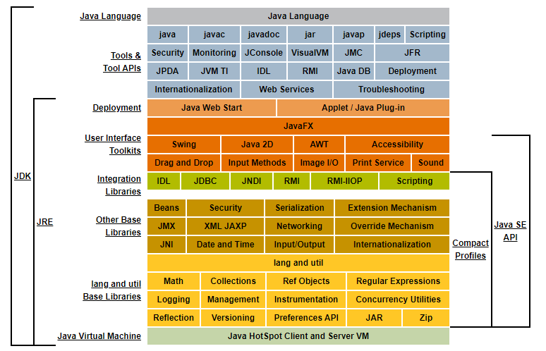
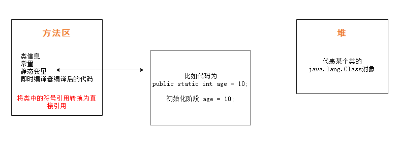

## 从官网了解JVM

### 帮助文档

[Java官网首页](https://www.oracle.com/java/)

[帮助文档目录](https://docs.oracle.com/javase/specs/jvms/se8/html/index.html)

[帮助文档首页](https://docs.oracle.com/javase/8/ )


### JDK/JRE/JVM关系图



> jre 是 Java 程序运行的基础，所有的 Java 程序都运行在 jre 上， jvm 又是 jre 的一部分，拥有自己的处理器、栈、寄存器、指令系统等，所以 jvm 可以看成是一个独立的操作系统，因此使用 jvm 可以让 Java 程序实现跨平台运行，也就是所谓的一次编译到处浪， jdk 是 Java 开发工具，让开发人员使用其对 Java 程序进行开发、编译、调试等，一般在安装 jdk 的同时会安装相同版本的 jre ，否则编写的 Java 程序无法运行。


## 源码到类文件

### 源码

```java
class Person{
    private String name;
    private int age;
    private static String address;
    private final static String hobby="Programming";
    public void say(){
    	System.out.println("person say...");
    }
    public int calc(int op1,int op2){
    	return op1+op2;
    }
}

```

通过 javac 将 Person.java 编译成 Person.class。

> 编译过程
>
> Person.java -> 词法分析器 -> tokens流 -> 语法分析器 -> 语法树/抽象语法树 -> 语义分析器 -> 注解抽象语法树 -> 字节码生成器 -> Person.class文件


### 类文件(Class文件)

通过 Sublime Text 工具打开这个 Class 文件，会发现 Java 文件被编译成了一串十六进制的字符：

> cafe babe 0000 0034 0027 0a00 0600 1809
> 0019 001a 0800 1b0a 001c 001d 0700 1e07
> 001f 0100 046e 616d 6501 0012 4c6a 6176
> 612f 6c61 6e67 2f53 7472 696e 673b 0100
> 0361 6765 0100 0149 0100 0761 6464 7265
>
> .....

这样的文件我们根本没法看，那么官网上会不会有对应的介绍呢？

通过官方文档目录我们发现，在第四章节有对 Class 文件的格式的介绍：


```
ClassFile {
    u4             magic;
    u2             minor_version;
    u2             major_version;
    u2             constant_pool_count;
    cp_info        constant_pool[constant_pool_count-1];
    u2             access_flags;
    u2             this_class;
    u2             super_class;
    u2             interfaces_count;
    u2             interfaces[interfaces_count];
    u2             fields_count;
    field_info     fields[fields_count];
    u2             methods_count;
    method_info    methods[methods_count];
    u2             attributes_count;
    attribute_info attributes[attributes_count];
}
```

> magic
>
> The `magic` item supplies the magic number identifying the `class` file format; it has the value `0xCAFEBABE`.

这句话的大致意思是 Class 文件的开头格式是十六进制的 cafe babe。

这里我们可以做个试验，看看是不是所有的 Class 文件都是 cafe babe 文件开头的：

```
class Student {
	
}
```

这里我们准备另一个 Java 文件，里面的内容就不写了，通过 javac 编译后：

```
cafe babe 0000 0034 000d 0a00 0300 0a07
000b 0700 0c01 0006 3c69 6e69 743e 0100
0328 2956 0100 0443 6f64 6501 000f 4c69
6e65 4e75 6d62 6572 5461 626c 6501 000a
536f 7572 6365 4669 6c65 0100 0c53 7475
6465 6e74 2e6a 6176 610c 0004 0005 0100
0753 7475 6465 6e74 0100 106a 6176 612f
6c61 6e67 2f4f 626a 6563 7400 2000 0200
0300 0000 0000 0100 0000 0400 0500 0100
0600 0000 1d00 0100 0100 0000 052a b700
01b1 0000 0001 0007 0000 0006 0001 0000
0001 0001 0008 0000 0002 0009 
```

我们可以发现，这个文件果然也是 cafe babe 开头的。

其它的参数意思我们就不看了，这些在官网上都有详细的解释，到这里，我们可以做个假设，假如我们有一天，自己写了一个这样的十六进制文件：

```
cafe babe ....
```

格式完全符合 JVM 的格式要求，那么，是不是就代表着我们写的这个 Class 文件也同样能放进 JVM 中运行呢？

换句话说，假如换了一门语言，再写一个编译器编译成 Class 文件，是不是也可以放进 JVM 中运行呢？

这就意味着，只要能符合 JVM 的格式规范，那么不管是什么语言，都能放进 JVM 里运行。这就是诸如 Kotlin、Scala等语言能用 JVM 运行的原因。


## 类文件到虚拟机(类加载机制)

> 虚拟机把Class文件加载到内存 
>
> 并对数据进行校验，转换解析和初始化 
>
> 形成可以虚拟机直接使用的Java类型，即java.lang.Class

了解完了类文件，接下来我们就来看看类文件是怎么加载到虚拟机的。同样，我们可以看看官方文档对这方面介绍：


通过目录，我们看到第五章名字非常的熟悉，这不就是类加载机制的三大过程：

- Loading：装载
- Linking：链接
- Initializing：初始化


### 装载(Loading)

装载，顾名思义，应该是先查找 Class 文件，然后导入，所以：

- 通过一个类的**全限定名**获取定义此类的**二进制字节流**；
- 将这个字节流所代表的静态存储结构转化为**方法区的运行时数据结构**；
- 在 Java 堆中生成一个代表这个类的 **java.lang.Class** 对象，作为对方法区中这些数据的访问入口。
  - Class 对象**封闭**了类在方法区内的数据结构，并且向 Java 程序员提供了访问方法区内的数据结构的接口。


那么，类的装载方式有哪些？

- 本地系统加载
- 网络下载 .class 文件
- 从zip，jar等归档文件中加载 .class 文件
- 从数据库中提取 .class 文件
- 由 java 源文件动态编译成 .class 文件
- Class.forName() 加载
- ClassLoader.loadClass() 加载


### 链接(Linking)

> Linking a class or interface involves **verifying** and **preparing** that class or interface, its direct superclass, its direct superinterfaces, and its element type (if it is an array type), if necessary. **Resolution** of symbolic references in the class or interface is an optional part of linking.

#### 验证(Verify)

> 保证被加载类的正确性

- 文件格式验证
- 元数据验证
- 字节码验证
- 符号引用验证


#### 准备(Prepare)

> 为类的静态变量分配内存，并将其初始化为默认值


#### 解析(Resolve)

> 把类中的符号引用转换为直接引用

符号引用：class 文件中定义的那些内容，就是一组符号来**描述目标**，可以是任何字面量：

```
cafe babe ....
或者
u4 u2 ...
```

直接引用：Java 进程中的一些真实地址、指针、句柄，就是直接**指向目标**的指针、相对偏移量或一个间接定位到目标的句柄。

解析阶段是虚拟机将常量池内的符号引用替换为直接引用的过程。

解析动作主要针对类或接口、字段、类方法、接口方法、方法类型、方法句柄和调用限定符7类符号引用进行。


### 初始化(Initializing)

> 对类的静态变量，静态代码块执行初始化操作



## 类装载器 ClassLoader

在装载(Load)阶段的第一步，通过类的全限定名获取其定义的二进制字节流，需要借助类装载器完成，顾名思义，就是用来装载 Class 文件的。

### 分类

****

- Bootstrap ClassLoader 负责加载 $JAVA_HOME 中 jre/lib/rt.jar 里所有的 class 或者 Xbootclasspath 选项指定的 jar 包。由 C++ 实现，不是 ClassLoader 子类。
- Extension ClassLoader 负责加载 Java 平台中扩展功能的一些 jar 包，包括 $JAVA_HOME 中 jre/lib/*.jar 或 -Djava.ext.dirs 指定目录下的 jar 包。
- App ClassLoader 负责加载 classpath 中指定的 jar 包及 -Djava.class.path 所指定目录下的类和 jar 包。
- Custom ClassLoader 通过 java.lang.ClassLoader 的子类自定义加载 class ，属于应用程序根据自身需要自定义的 ClassLoader ， 如 tomcat、 jboss 都会根据 j2ee 规范自行实现 ClassLoader。


### 加载原则 

检查某个类是否已经加载：顺序是自底向上，从 Custom ClassLoader 到 BootStrap ClassLoader 逐层检查，只要某个 ClassLoader 已加载，就视为已加载此类，保证此类在所有 ClassLoader 中加载一次。

加载的顺序：加载的顺序是自顶向下，也就是由上层来逐层尝试加载此类。

> 双亲委派机制
>
> 定义：如果一个类加载器在接到加载类的请求时，它首先不会自己尝试去加载这个类，而是把这个请求任务委托给父类加载器去完成，依次递归，如果父类加载器可以完成类加载任务，就成功返回；只有父类加载器无法完成此加载任务时，才自己去加载。
>
> 优势： Java 类随着加载它的类加载器一起具备了一种带有优先级的层次关系。比如， Java 中的 Object类，它存放在 rt.jar 之中，无论哪一个类加载器要加载这个类，最终都是委派给处于模型最顶端的启动类加载器进行加载，因此 Object 在各种类加载环境中都是同一个类，如果不采用双亲委派模型，那么由各个类加载器自己去加载的话，那么系统中会存在多种不同的 Object 类。

```java
 protected Class<?> loadClass(String name, boolean resolve)
        throws ClassNotFoundException
    {
       	...
        // 源码中双亲委派的实现
		if (parent != null) {
    		c = parent.loadClass(name, false);
        } 
     	...
    }

```


## 运行时数据区(Run-Time Data Areas)

在装载阶段的第二、三步中可以发现有运行时数据、堆、方法区等名词。

说白了就是类文件被类装载器装载进来之后，类中的内容(比如变量、常量、方法、对象等这些数据得要有个去处，也就是要存储起来，存储的位置肯定是在 JVM 中有对应的空间)


### 常规理解 

#### 方法区(Method Area)

- 方法区是各个线程共享的内存区域，在虚拟机启动时创建
- 用于存储已被虚拟机加载的**类信息、常量、静态变量、即时编译器编译后的代码**等数据
- 虽然 Java 虚拟机规范把方法区描述为堆的一个逻辑部分，但是它却有一个别名叫做 **Non-Heap (非堆)**，目的是与 Java 堆区分开来
- 当方法区无法满足内存分配需求时，将抛出 **OutOfMemoryError** 异常

> 此时回看装载阶段的第2步：(2)将这个字节流所代表的静态存储结构转化为方法区的运行时数据结构

这时，如果把从 class 文件到装载的第一、二步合并起来理解的话，可以画个图：


**注意**

- 方法区在 jdk 8 中就是 Metaspace ，在 jdk6 或 7 中就是 Perm Space
- 常量池的变化，jdk7 后，字符串常量池被移动到堆中

Class 文件中除了有类的版本、字段、方法、接口等描述信息外， 还有一项信息就是常量池，用于存在编译时期生成的各种字面里和符号引用，这部分内容将在类加载后进入方法区的运行时常量池中存放。


#### 堆(Heap)

- 堆是 Java 虚拟机所管理内存中最大的一块，在虚拟机启动时创建，被所有线程共享
- Java 对象实例以及数组都在堆上分配

此时回看装载阶段的第3步：(3)在Java堆中生成一个代表这个类的java.lang.Class对象，作为对方法区中这些数据的访问入口。

此时装载(1)(2)(3)的图可以改动一下：


#### 虚拟机栈(Java Virtual Machine Stacks)

> 经过上面的分析，类加载机制的装载过程已经完成，后续的链接，初始化也会相应的生效。
>
> 假如目前的阶段是初始化完成了，后续做啥呢？肯定就是使用了，不用的话这样折腾来折腾去有什么意义？那怎样才能被使用到？换句话说里面内容怎样才能被执行？比如通过主函数 main 调用其他方法，这种方式实际上是 main 线程执行之后调用的方法，既要想使用里面的各种内容，得要以线程为单位，执行相应的方法才行。
>
> 那一个线程执行的状态如何维护？一个线程可以执行多少个方法？这样的关系怎么维护呢？

- 虚拟机栈是一个线程执行的区域，保存着一个线程中方法的调用状态。换句话说，一个 Java 线程的运行状态，由一个虚拟机栈来保存，所以虚拟机栈肯定是线程私有的，独有的，随着线程的创建而创建
- 每一个被线程执行的方法，为该栈中的栈帧，即每个方法对应一个栈帧
- 调用一个方法，就会向栈中压入一个栈帧；一个方法调用完成，就会把该栈帧从栈中弹出

```java
// 伪代码
a(){
	b();
} 
b(){
	c();
} 
c(){
    ...
}
```


#### 程序计数器(The PC Register)

> 我们都知道一个 JVM 进程中有多个线程在执行，而线程中的内容是否能够拥有执行权，是根据 CPU 调试来的。
>
> 假如线程 A 正在执行到某个地方，突然失去了 CPU 的执行权，切换到线程 B 了，然后当线程 A 再获得 CPU 执行权的时候，怎么能继续执行呢？这就是需要在线程中维护一个变量，记录线程执行到的位置。

- 程序计数器占用到的内存空间很小 ，由于 Java 虚拟机的多线程是通过线程轮流切换，并分配处理器执行时间的方式来实现的，在任意时刻，一个处理器只会执行一条线程中的指令。因此，为了 线程切换后能够恢复到正确的执行位置，每条线程需要有一个独立的程序计数器(线程私有)
- 如果如果线程正在执行 Java 方法，则计数器记录的是正在执行的虚拟机字节码指令的地址
- 如果正在执行的是 Native 方法，则这个计数器为空。


#### 本地方法栈(Native Method Stacks)

如果当前线程执行的方法是 Native 类型的，这些方法就会在本地方法栈中执行。


### 结合字节码指令理解 Java 虚拟机栈和栈帧

> 官网：[https://docs.oracle.com/javase/specs/jvms/se8/html/jvms-2.html#jvms-2.6 ](https://docs.oracle.com/javase/specs/jvms/se8/html/jvms-2.html#jvms-2.6)
>
> 栈帧：每个栈帧对应一个被调用的方法，可以理解为一个方法的运行空间。

每个栈帧中包括局部变量表(Local Variables)、操作数栈(Operand Stack)、指向运行时常量池的引用(A reference to the run-time constant pool)、方法返回地址(Return Address)和附加信息。


- 局部变量表
  - 方法中定义的局部变量以及方法的参数存放在这张表中
  - 局部变量表中的变量不可直接使用，如需要使用的话，必须通过相关指令将其加载至操作数栈中使用
- 操作数栈
  - 以压栈和出栈的方式存储操作数的
- 动态链接
  - 每个栈帧都包含一个指向运行时常量池中该栈帧所属方法的引用，持有这个引用是为了支持方法调用过程中的动态链接(Dynamic Linking)
- 方法返回地址
  - 当一个方法开始执行后，只有两种方式可以退出，一种是遇到方法返回的字节码指令；另一种是遇见异常，并且这个异常没有在方法体内得到处理。


```java
class Person{
    private String name="Jack"; 
    private int age;
    private final double salary=100; 
    private static String address;
	private final static String hobby="Programming"; 
    public void say(){
		System.out.println("person say...");
	}
	public static int calc(int op1,int op2){ 
        op1=3;
		int result=op1+op2; 
        return result;
	}
	public static void order(){

	}
	public static void main(String[] args){ 
		calc(1,2);
		order();
	}
}
```

这里我们先 javac 编译一下，然后 javap 反编译成 Person.txt 文件，其中这些指令的意思网上有更多更详细的，这里就不一一列出来了。

```java
Compiled from "Person.java" 
class Person {
    ...
    public static int calc(int, int); 
    	Code:
            0: iconst_3	//将int类型常量3压入[操作数栈]
            1: istore_0	//将int类型值存入[局部变量0]
            2: iload_0	//从[局部变量0]中装载int类型值入栈
            3: iload_1	//从[局部变量1]中装载int类型值入栈
            4: iadd	//将栈顶元素弹出栈，执行int类型的加法，结果入栈
            【For example, the iadd instruction (§iadd) adds two int values together. It requires that the int values to be added be the top two values of the operand stack, pushed there by previous instructions. Both of the int values are popped from the operand stack. They are added, and their sum is pushed back onto the operand stack. Subcomputations may be nested on the operand stack, resulting in values that can be used by the encompassing computation.】
            5: istore_2	//将栈顶int类型值保存到[局部变量2]中
            6: iload_2	//从[局部变量2]中装载int类型值入栈
            7: ireturn	//从方法中返回int类型的数据
    ...
}
```

**注意**

通过上面的指令，我们不难发现，==op1=3== 是被拆分成两行指令来运行的，这就是为什么平时看着明明就一行代码，却发生了线程安全问题的原因，这是因为你的一行代码被拆分成两行指令后并不是一个原子性的操作。


### 拓展知识

#### 栈指向堆

如果在栈帧中有一个变量，类型为引用类型，比如 Object obj = new Object() ，这时候就是典型的栈中元素指向堆中的对象。


#### 方法区指向堆

方法区中会存放静态变量、常量等数据。如果是下面这种情况，就是典型的方法区中元素指向堆中的对象

```java
private static Object obj = new Object();
```


#### 堆指向方法区

What? 堆还能指向方法区？

注意，方法区中会包含类的信息，堆中会有对象，那么怎么知道对象是哪个类创建的呢？


#### Java 对象内存布局

一个 Java 对象在内存中包括3个部分：对象头、实例数据和对齐填充


对象头

- Mark Word
  - 一系列的标记位(哈希码、分代年龄、锁状态标志等)
- Class Pointer
  - 指向对象对应的类元数据的内存地址(堆指向方法区)
- Length
  - 数组对象特有，数组长度


## 内存模型

### 内存模型与运行时数据区

上面对运行时数据区描述了很多，其实重点存储数据的是堆和方法区(非堆)，所以内存的设计也着重从这两方面展开(注意这两块区域都是线程共享的)。

对于虚拟机栈、本地方法栈、程序计数器都是线程私有的。


### 图解

> 一块是非堆区，一块是堆区。
>
> 堆区分为两大块，一个是Old区，一个是Young区。
>
> Young区分为两大块，一个是Survivor区（S0+S1），一块是Eden区。 Eden:S0:S1=8:1:1 S0和S1一样大，也可以叫From和To。


根据之前对于 Heap 的介绍可以知道，一般对象和数组的创建会在堆中分配内存空间，关键是堆中有这么多区域，那一个对象的创建到底在哪个区域？


### 对象创建所在区域

一般情况下，新创建的对象都会被分配到 Eden 区，一些特殊的大的对象会真的分配到 Old 区。

> 比如有对象 A，B，C 等创建在 Eden 区，但是 Eden 区的内存空间肯定有限，比如有 100M ，假如已经使用了 100M 或者达到一个设定的临界值，这时候就需要对 Eden 内存空间进行清理，即垃圾收集(Garbage Collect)，这样的 GC 我们称之为 Minor GC， Minor GC 指得是 Young 区的 GC。
>
> 经过 GC 之后 ，有些对象就会被清理掉，有些对象可能还存活着，对存活着的对象需要将其复制到 Survivor 区，然后再清空 Eden 区中的这些对象。


### Survivor 区详解

由图解可以看出， Survivor 区分为两块 S0 和 S1 ，也可以叫做 From 和 To。

在同一个时间点上， S0 和 S1 只能有一个区有数据，另外一个是空的。

> 接着上面的 GC 来说，比如一开始只有 Eden 区和 From 中有对象， To 中是空的。
>
> 此时进行一次 GC 操作， From 区中对象的年龄就会 +1 ，我们知道 Eden 区中所有存活的对象会被复制到 To 区， From 区中还能存活的对象会有两个去处。
>
> 若对象的年龄达到之前设置好的的年龄阈值，此时对象会被移动到 Old 区，没有达到阈值的对象会被复制到 To 区。
>
> 此时 Eden 区和 From 区已经被清空(被 GC 的对象肯定没了，没有被 GC 的对象都有了各自的去处。)
>
> 这时候 From 和 To 交换角色，之前的 From 变成了 To ，之前的 To 变成了 From 。
>
> 也就是说无论如何 都要保证名为 To 的 Survivor 区域是空的。
>
> Minor GC 会一直重复这样的过程，知道 To 区被填满，然后会将所有对象复制到老年代中。


### Old 区

从上面的分析可以看出，一般 Old 区都是年龄比较大的对象，或者相对超过了某个阈值的对象。

在 Old 区也会有 GC 的操作， Old 区的 GC 我们称作为 Major GC。


### 对象的一辈子理解 

> 我是一个普通的Java对象,我出生在Eden区,在Eden区我还看到和我长的很像的小兄弟,我们在Eden区中玩了 挺长时间。有一天Eden区中的人实在是太多了,我就被迫去了Survivor区的“From”区,自从去了Survivor 区,我就开始漂了,有时候在Survivor的“From”区,有时候在Survivor的“To”区,居无定所。直到我18岁的 时候,爸爸说我成人了,该去社会上闯闯了。 于是我就去了年老代那边,年老代里,人很多,并且年龄都挺大的,我在这里也认识了很多人。在年老代里,我生 活了20年(每次GC加一岁)，然后被回收。


### 常见问题

- 如何理解 Minor / Major /Full GC

```
Minor GC: 新生代
Major GC: 老年代
Full GC: 新生代+老年代
```

- 为什么需要 Survivor 区？只有 Eden 区不行吗

```
如果没有 Survivor 区， Eden 区每进行一次 Minor GC，并且没有年龄限制的条件下，存活的对象就会被送到老年代。
这样一来，老年代很快被填满，触发 Major GC (因为 Major GC 一般伴随着 Minor GC，也可以看做触发了 Full GC)。
老年代的内存空间远大于新生代，进行一次 Full GC 消耗时间比 Minor GC 要长得多。
执行时间长有什么坏处？
频繁的 Full GC 消耗的时间很长，会影响大型程序的执行和响应速度。
可能你会说，那就对老年代的空间进行增加或者减少咯。
假如增加老年代空间，更多存活对象才能填满老年代，虽然降低 Full GC 频率，但是随着老年代空间加大，一旦发生 Full GC， 执行所需要的时间会更长。
假如减少老年代空间，虽然 Full GC 所需要的时间减少，但是老年代很快被存活对象填满， Full GC 频率增加。
所以 Survivor 区的存在意义，就是减少被送到老年代的对象，进而减少 Full GC 的发生， Survivor 区的预筛选保证了只有经历16次 Minor GC 还能在新生代中存活的对象，才会被送到老年代。
```

- 为什么需要两个 Survivor 区？

```
最大的好处就是解决了碎片化。也就是说为什么一个 Survivor 区不行？第一部分中，我们知道了必须设置 Survivor 区。假设现在只有一个 Survivor 区，我们来模拟一下流程：
刚刚新建的对象在 Eden 中，一旦 Eden 满了，触发一次 Minor GC， Eden 中的存活对象就会被移动到 Survivor 区。这样继续循环下支，下一次 Eden 满了的时候，问题来了，此时进行 Minor GC， Eden 和 Survivor 各有一些存活对象，如果此时把 Eden 区的存活对象硬放到 Survivor 区，很明显这两个部分对象所占有的内存是不连续的，也就导致了内存碎片化。
永远有一个 Survivor space 是空的，另一个非空的 Survivor space 无碎片。
```

- 新生代中 Eden:S1:S2 为什么是8:1:1？

```
新生代中的可用内存：复制算法用来担保的内存为 9:1
可用内存中 Eden:S1 为 8:1
即新生代中 Eden:S1:S2 = 8:1:1
```


## 体验与验证

### 使用 jvisualvm 查看

