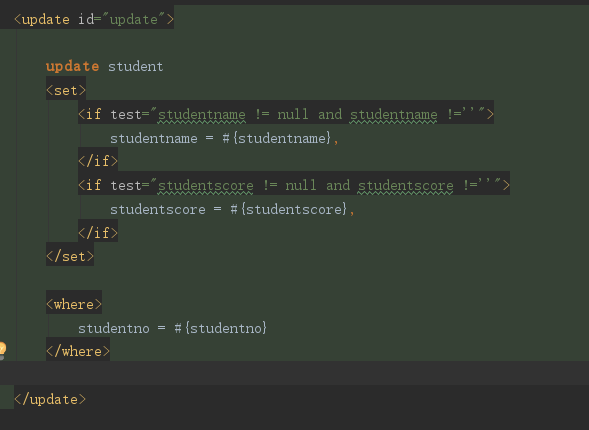
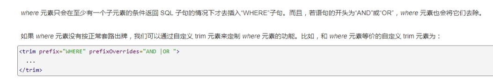
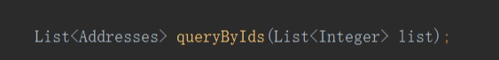
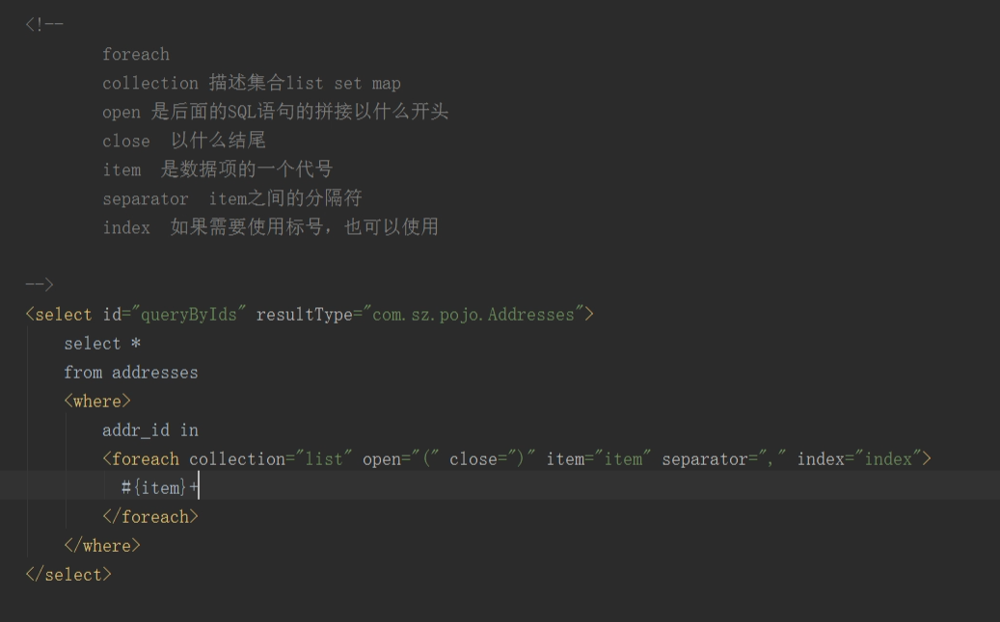
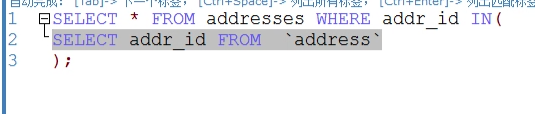
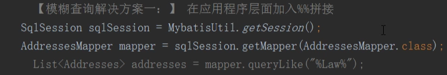
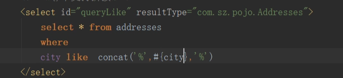
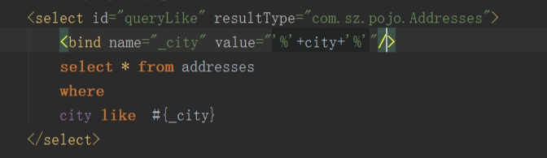
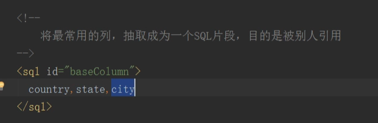
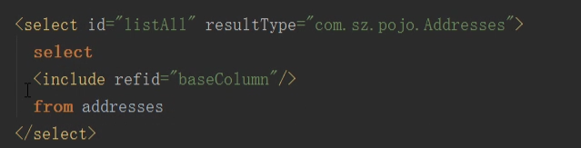

# 动态SQL

## 获取连接

> ``` java
>  	//获取myutil的连接源	
> 		SqlSession sqlSession = myutil.getSession();
>      //mapper包里面的mapper  
> 		AddstudentMapper addstudentMapper = sqlSession.getMapper(AddstudentMapper.class);
>        
> ```
>


## mybatis的sql

里面的标签<set></set>、<where></where>、<choose></choose>、<trim></trim>




<choose>          == ----->if  else

​	<when test="----">	

​		---

​	</when>

​	<when test="----">

​		-----

​	</when>	

​	<otherwise>

​		------

​	</otherwise>

</choose>


<trim>、</trim>用法：




<foreach collection="list" open="(" close=")" item="item" separator="," index="index">

</foreach>---->子查询






模糊查询：




查询一：在应用程序层面加入%%拼接




查询二：通过mysql的函数完成concat也可以



查询三:通过通过bind标签，对我们的变量重新进行绑定，然后通过新绑定的变量进行应用即可




​	select * from .....where .....like （select.........）


```java
<select id="listAll" resultType="Addresses">
    select
    	<include refid="baseColumn">
     from addresses       
</select>
```

查询四：

<sql id= "baseColumn">

​	country、state、city

<sql>





