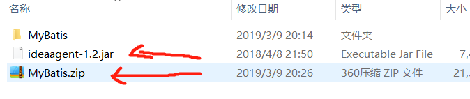
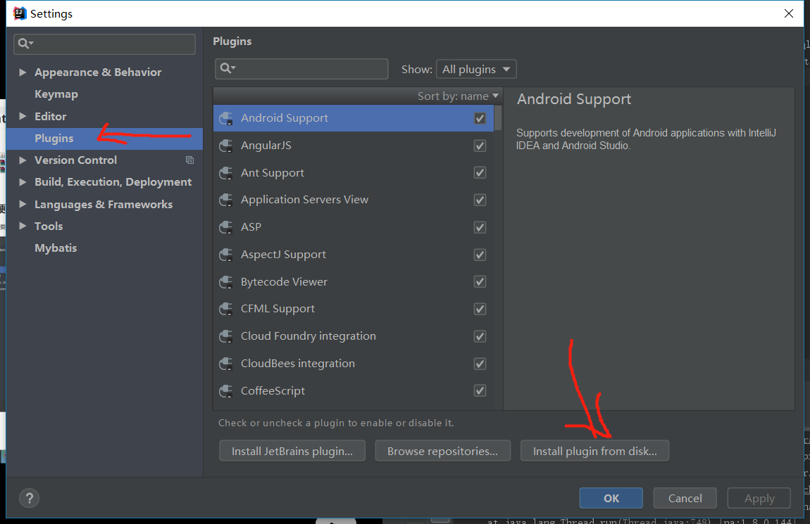
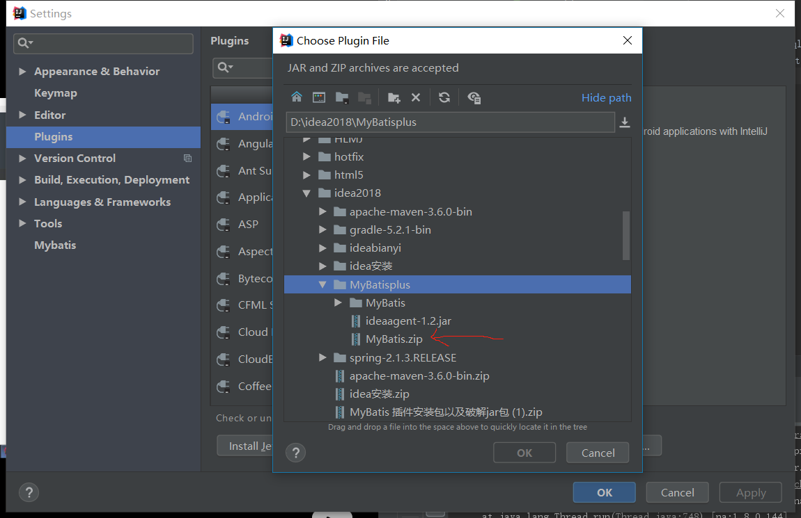
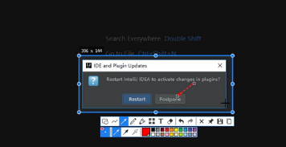
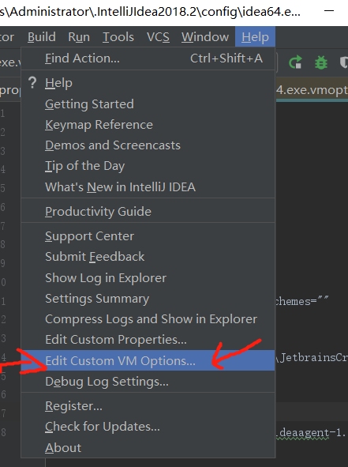

mybitls plugin安装

去互联网上下载



## 找到从硬盘安装的方式

### 






打开help


请你添加如下代码

``` java
-XX:+DisableAttachMechanism
-javaagent:D:\idea2018\MyBatisplus\ideaagent-1.2.jar
 # 上面的D：是路径，也是我提供的ideafent这个jar的位置，可以直接复制路径
 
```

保存后重启idea，重启之后，打开Mapper接口文件，如果左边有绿色图标，表示成功


