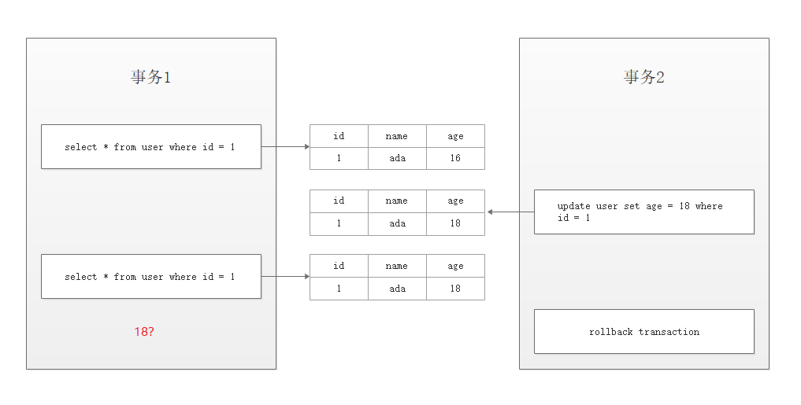
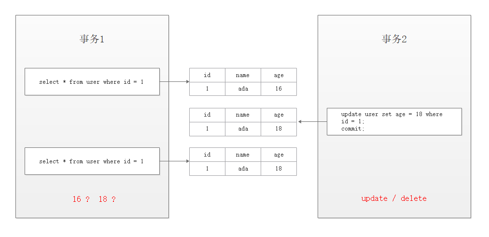
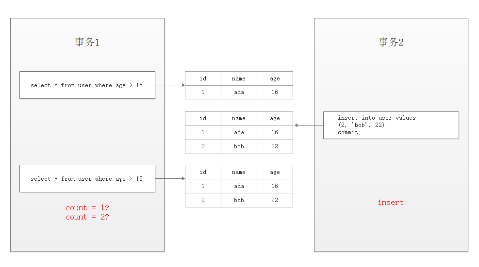

# 事务


## 什么是数据库的事务


### 数据库事务的典型场景

- 订单
- 秒杀
- 支付
- ...


### 什么是事务

事务：是数据库操作的最小工作单元，是作为单个逻辑工作单元执行的一系列操作；这些操作作为一个整体一起向系统提交，要么都执行、要么都不执行；事务是一组不可再分割的操作集合（工作逻辑单元）。


### 事务的四大特性

- 原子性 (Atomicity)
  - 事务是数据库的逻辑工作单位，事务中包含的各操作要么都做，要么都不做 
- 一致性 (Consistent)
  - 事务执行的结果必须是使数据库从一个一致性状态变到另一个一致性状态。因此当数据库只包含成功事务提交的结果时，就说数据库处于一致性状态。如果数据库系统 运行中发生故障，有些事务尚未完成就被迫中断，这些未完成事务对数据库所做的修改有一部分已写入物理数据库，这时数据库就处于一种不正确的状态，或者说是 不一致的状态。
- 隔离性 (Isolation)
  - 一个事务的执行不能其它事务干扰。即一个事务内部的操作及使用的数据对其它并发事务是隔离的，并发执行的各个事务之间不能互相干扰。 
- 持续性 (Durable)
  - 也称永久性，指一个事务一旦提交，它对数据库中的数据的改变就应该是永久性的。接下来的其它操作或故障不应该对其执行结果有任何影响。 


### 有哪些存储引擎支持事务？

- innoDB
- BDB


### 数据库什么时候会出现事务？

#### 如何开启/结束事务

- 手工开启

  - begin  /  start transaction

- 自动开启

  - ```mysql
    set session autocommit = on / off; 	-- 两个级别：session、gloabal
    ```

- 事务提交或回滚(结束事务)

  - commit / rollback


### 事务并发会带来什么问题？

#### 脏读



解决方案：

对修改的数据加上排他锁，不允许其他的事务去读取它正在修改的数据，但可以读取它之前的数据


#### 不可重复读



解决方案：

假设我们要让事务1的前后两次读取的数据一致，这时我们不允许其它事务对我正在读取的数据操作并且提交，这时候，我们可以给事务1的第一次读取加上读锁，这时同一事务下再一次读取时，也能读取到相同的结果


#### 幻读



解决方案：

通过使用间隙锁，给 age > 15 的这个区间，即 (15, +∞)加上间隙锁，这时候其它的事务是不能够往这个区间插入任何数据的，保证同一事务前后两次读取能读到相同的数据


#### 总结

事务并发的三大问题其实都是数据库读一致性问题，必须由数据库提供一定的事务隔离机制来解决。


## 事务的四种隔离级别

[SQL92 ANSI/ISO标准](http://www.contrib.andrew.cmu.edu/~shadow/sql/sql1992.txt)

- Read Uncommitted (未提交读)
  - 未解决任何并发问题
  - 事务未提交的数据对其他事务也是可见的，会出现脏读
- Read Committed (已提交读)
  - 解决脏读问题
  - 一个事务开始之后，只能看到已提交的事务所做的修改，会出现不可重复读
- Repeatable Read (可重复读)
  - 解决不可重复读问题
  - 在同一个事务中多次读取同样的数据结果是一样的，这种隔离级别未定义解决幻读的问题
- Serializable (串行化)
  - 解决所有问题
  - 最高的隔离级别，通过强制事务的串行执行


### InnoDB对事务隔离级别的支持程度

| 事务隔离级别               | 脏读   | 不可重复读 | 幻读             |
| -------------------------- | ------ | ---------- | ---------------- |
| 未提交读(Read Uncommitted) | 可能   | 可能       | 可能             |
| 已提交读(Read Committed)   | 不可能 | 可能       | 可能             |
| 可重复读(Repeatable Read)  | 不可能 | 不可能     | 对 InnoDB 不可能 |
| 串行化(Serializable)       | 不可能 | 不可能     | 不可能           |


### 事务隔离级别解决方案

**思考：**

如果要解决读一致性的问题，保证一个事务中前后两次读取数据结果一致，实现事务隔离，应该怎么做？


#### 第一种：加锁

在读取数据前，对其加锁，阻止其他事务对数据进行修改（LBCC）Lock Based Concurrency Control。

但不支持读与写的并发操作。


#### 第二种：快照

生成一个数据请求时间点的一致性数据快照（Snapshot），并用这个快照来提供一定级别（语句级或事务级）的一致性读取（MVCC）Multi Version Concurrency Control。


## 锁的类别


### 锁的作用

解决事务对数据的并发操作所带来的问题


### 锁的粒度

>表锁与行锁的区别：
>
>锁定粒度：表锁 > 行锁
>
>加锁效率：表锁 > 行锁
>
>冲突概率：表锁 > 行锁
>
>并发性能：表锁 < 行锁

InnoDB即支持行锁也支持表锁，MyISAM支持表锁


### 锁的类型

- 行锁

  - 共享锁（读锁）：Shared Locks

    - 又称为读锁，简称 S 锁，顾名思义，共享锁就是多个事务对于同一数据可以共享一把锁，都能访问到数据，但是只能读不能修改；如果在一行数据上加了读锁然后去修改它，这时候可能会发生死锁

    - 加锁释锁方式

      - ```mysql
        select * from student where id = 1 LOCK IN SHARE MODE;
        commit / rollback;
        ```

  - 排他锁（写锁）：Exclusive Locks

    - 又称为写锁，简称 X 锁，排他锁不能与其他锁并存，如一个事务获取了一个数据行的排他锁，其他事务就不能再获取该行的锁（共享锁、排他锁），只有该获取了排他锁的事务是可以对数据行进行读取和修改。

    - 加锁释锁方式

      - ```mysql
        -- 自动
        delete / update / insert -- 默认加上X锁
        -- 手动
        select * from student where id = 1 FOR UPDATE;
        
        commit / rollback; 
        ```

  - 算法

    - 记录锁：Record Locks
    - 间隙锁：Gap Locks
    - 临键锁：Next-Key Locks

- 表锁(意向锁)

  - 意向锁是由数据引擎自己维护的，用户无法手动操作意向锁
  - 意向共享锁（意向读锁）：Intention Shared Locks
    - 简称 IS 锁，表示事务准备给数据行加入共享锁，也就是说一个数据行加共享锁前必须先取得该表的 IS 锁。
  - 意向排他锁（意向写锁）：Intention Exclusive Locks
    - 简称 IX 锁，表示事务准备给数据行加入排他锁，说明事务在一个数据行加排他锁前必须先取得该表的 IX 锁。
  - 为什么需要（表级别的）意向锁？
    - 一个事务给一张表成功加上一个表锁的前提：
      - 没有其他任何一个事务已经锁定了其中的任意一行数据
    - 当有一个意向锁的时候，我们就知道在这个表上面有一行数据加上了行锁，在这种情况下就免去了检索数据的消耗，提升加锁的效率


## 锁的原理

锁的作用：用于管理不同事务对数据的并发访问


### 锁住的内容

锁到底锁住了什么？

是一行数据（Record）吗？

是一个字段（Column）吗？

测试

- t1：不使用索引
  - 为什么没有索引时，行锁会升级为表锁？
    - 因为当你没有创建索引的时候，数据库会自动创建一个默认的聚集索引，然后我们检索数据的时候，由于我们没有索引，它会走全表扫描，然后它会把每一行数据上面的聚集索引都给锁住，所以就会造成一个锁表的假象。
- t2：主键索引
- t3：唯一索引
  - 为什么通过唯一索引加锁，然后通过主键索引加锁也不能成功？
    - 这与 InnoDB 引擎的索引存储结构和检索方式有关
      - 主键索引：存储索引和数据
      - 辅助索引：存储二级索引和主键ID

**结论：锁住的是索引项**


### 什么是索引？

简单的说，索引就是数据库的一种数据结构。

**索引的本质**

索引是为了加速对表中数据行的检索而创建的一种分散存储的数据结构

在RDBMS系统（关系数据库管理系统）中数据的索引都是**硬盘级**索引


## 行锁的算法

- Record(记录)
  - 数据库里实际存储的数据
- Gap(间隙)
  - 由 Record 分隔开的其它不存在数据的区间的这些范围，叫 Gap
  - 最多有 Record + 1 个 Gap
- Next-Key(间隙)
  - 相当于 Record 和 Gap 的结合体，左开右闭的区间

假设当前的数据是：1、4、7、10

那么 

Next-Key：(-∞, 1]、(1, 4]、(4, 7]、(7, 10]、(10, +∞)

Gap：(-∞, 1)、(1, 4)、(4, 7)、(7, 10)、(10, +∞)


### 临键锁

临键锁(Next-Key Lock)：锁定范围加记录

InnoDB 默认的行锁算法

此时的查询语句是

```mysql
select * from t2 where id > 5 and id < 9 for update;
```

会锁住：

(4, 7]、(7, 10]


### 间隙锁

间隙锁(Gap Lock)：锁定范围。范围查询或等值查询且记录不存在

当记录不存在时，会退化成 Gap 锁

**注意：**

Gap 锁之间不冲突，同时只在 RR 事务隔离级别存在

InnoDB 对幻读的实现原理就是间隙锁


### 记录锁

记录锁(Record Lock)：锁定记录。

当使用唯一性（唯一/主键）索引（等于是精准匹配）等值查询时，会退化成 Record 锁

```mysql
select * from t2 where id = 4 for update;
```

锁住：id = 4


## 测试

### 查看环境

```mysql
-- 查询引擎
show variables like '%engine%';

-- 事务隔离级别
show global variables like 'tx_isolation';

-- 查询事务是否自动开启
show variables like 'autocommit';
```


### 手工开启事务和结束事务的方法

```mysql
update student set sname = '张三111' where id = 1;

beging;
update student set sname = '张三222' where id = 1;
rollback;

show variables like 'autocommit';
set session autocommit = on;
update student set sname = '张三333' where id = 1;
commit;
```


### 共享锁

```mysql
Session 1

BEGIN;
SELECT * FROM student WHERE id = 1 LOCK IN SHARE MODE;

ROLLBACK;


Session 2

BEGIN;
SELECT * FROM student WHERE id = 1 LOCK IN SHARE MODE;
DELETE FROM student WHERE id = 1;
ROLLBACK;
```


### 排他锁

```mysql
Session 1

BEGIN;
UPDATE student SET sname = '张三' WHERE id = 1;

ROLLBACK;
COMMIT;


Session 2

BEGIN;
SELECT * FROM student WHERE id = 1 LOCK IN SHARE MODE;
SELECT * FROM student WHERE id = 1 FOR UPDATE;
DELETE FROM student WHERE id = 1;
ROLLBACK;
```


### 意向锁

```mysql
Session 1

BEGIN;
SELECT * FROM student WHERE id = 1 FOR UPDATE;

ROLLBACK;
COMMIT;


Session 2

BEGIN;
LOCK TABLES student WRITE;
UNLOCK TABLES;
```


### 不使用索引

```mysql
Session 1

BEGIN;
SELECT * FROM t1 WHERE id = 1 FOR UPDATE;

ROLLBACK;
COMMIT;

-- 当没有索引的时候，行锁会自动升级成表锁
-- 这是因为当你不创建索引时，数据库会自动创建一个默认的聚集索引

Session 2

SELECT * FROM t1 WHERE id = 3 FOR UPDATE;
INSERT INFO `t1`(`id`, `name`) VALUES (5, '5');
```


### 使用索引

```mysql
Session 1
BEGIN;
SELECT * FROM t2 WHERE id = 1 FOR UPDATE;

ROLLBACK;

-- 使用索引后，只会锁 id=1 这行数据， id=4 这行能够正常获取锁

Session 2
SELECT * FROM t2 WHERE id = 1 FOR UPDATE;
SELECT * FROM t2 WHERE id = 4 FOR UPDATE;

ROLLBACK;
```


### 唯一索引带主键索引

```mysql
Session 1
-- 通过唯一索引锁定
BEGIN;
SELECT * FROM t3 WHERE name = '4' FOR UPDATE;
ROLLBACK;

Session 2
SELECT * FROM t3 WHERE name = '4' FOR UPDATE;
SELECT * FROM t3 WHERE id = 4 FOR UPDATE;
SELECT * FROM t3 WHERE id = 1 FOR UPDATE;
```


### 临键锁

```mysql
Session 1
BEGIN;
SELECT * FROM t2 WHERE id > 5 AND id < 9 FOR UPDATE;

Session 2
BEGIN;
SELECT * FROM t2 WHERE id = 4 FOR UPDATE;
INSERT INTO `t2` (`id`, `name`) VALUES (6, '6');
INSERT INTO `t2` (`id`, `name`) VALUES (8, '8');
SELECT * FROM `t2` WHERE id = 10 FOR UPDATE;
ROLLBACK;
```


### 间隙锁

```mysql
Session 1
BEGIN;
SELECT * FROM t2 WHERE id = 6 FOR UPDATE;	-- 锁住 (4, 7)
SELECT * FROM t2 WHERE id > 20 FOR UPDATE;	-- 锁住 (10, +∞)
ROLLBACK;

Session 2
BEGIN;
INSERT INTO t2 (`id`, `name`) VALUES (5, '5');
INSERT INTO t2 (`id`, `name`) VALUES (6, '6');
-- 相同的 Gap 锁是不冲突的
SELECT * FROM t2 WHERE id = 6 FOR UPDATE;
ROLLBACK;
INSERT INTO t2 (`id`, `name`) VALUES (11, '11');
```


### 记录锁

```mysql
Session 1
BEGIN;
SELECT * FROM t2 WHERE id = 4 FOR UPDATE;
ROLLBACK;

Session 2
BEGIN;
SELECT * FROM t2 WHERE id = 4 FOR UPDATE;
ROLLBACK;
```

