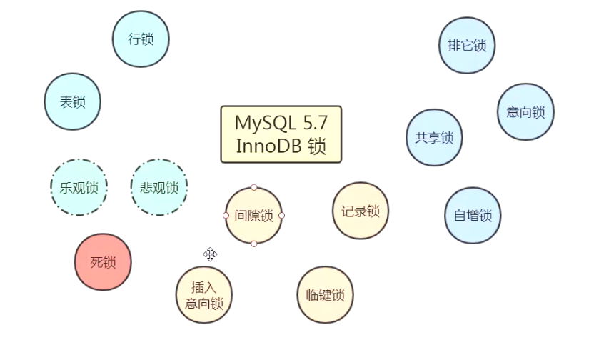

# 事务

## 什么是索引

事务：是数据库操作的最小工作单元，是作为单个逻辑工作单元执行的一系列操作；这些操作作为一个整体一起向系统提交，要么都执行、要么都不执行；事务是一组不可再分割的操作集合（工作逻辑单元）；

## 事务的四大特性

- 原子性 
  - 事务是数据库的逻辑工作单位，事务中包含的各操作要么都做，要么都不做 
- 一致性 
  - 事务执行的结果必须是使数据库从一个一致性状态变到另一个一致性状态。因此当数据库只包含成功事务提交的结果时，就说数据库处于一致性状态。如果数据库系统 运行中发生故障，有些事务尚未完成就被迫中断，这些未完成事务对数据库所做的修改有一部分已写入物理数据库，这时数据库就处于一种不正确的状态，或者说是 不一致的状态。
- 隔离性 
  - 一个事务的执行不能其它事务干扰。即一个事务内部的操作及使用的数据对其它并发事务是隔离的，并发执行的各个事务之间不能互相干扰。 
- 持续性 
  - 也称永久性，指一个事务一旦提交，它对数据库中的数据的改变就应该是永久性的。接下来的其它操作或故障不应该对其执行结果有任何影响。 

### 锁的粒度

>表锁与行锁的区别：
>
>锁定粒度：表锁 > 行锁
>
>加锁效率：表锁 > 行锁
>
>冲突概率：表锁 > 行锁
>
>并发性能：表锁 < 行锁

InnoDB即支持行锁也支持表锁，MyISAM支持表锁