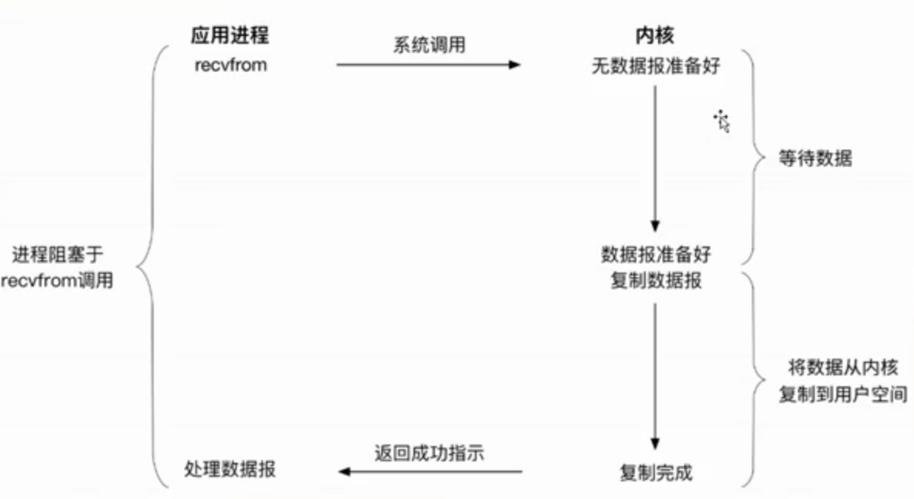
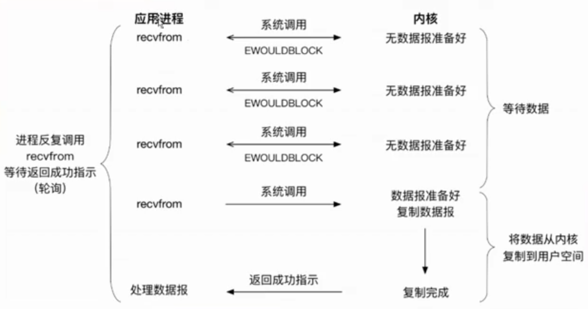
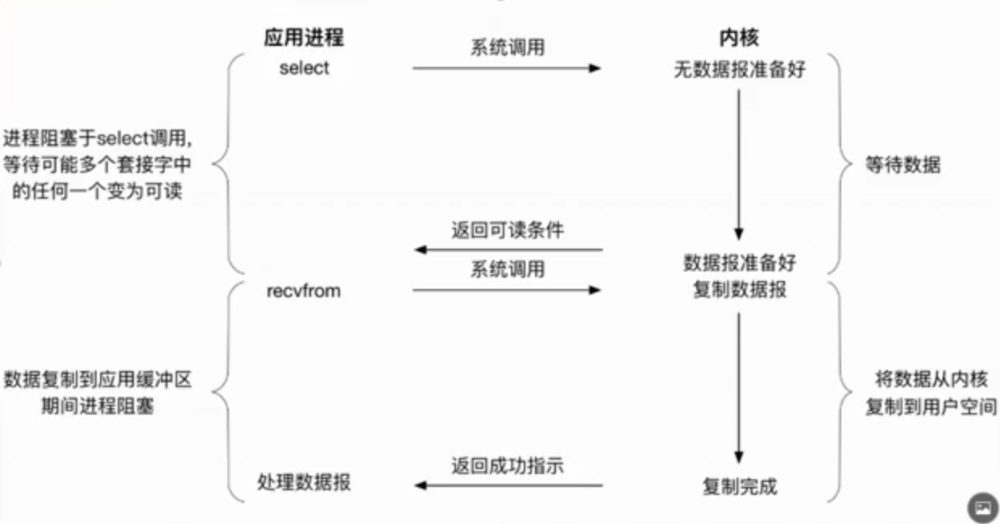
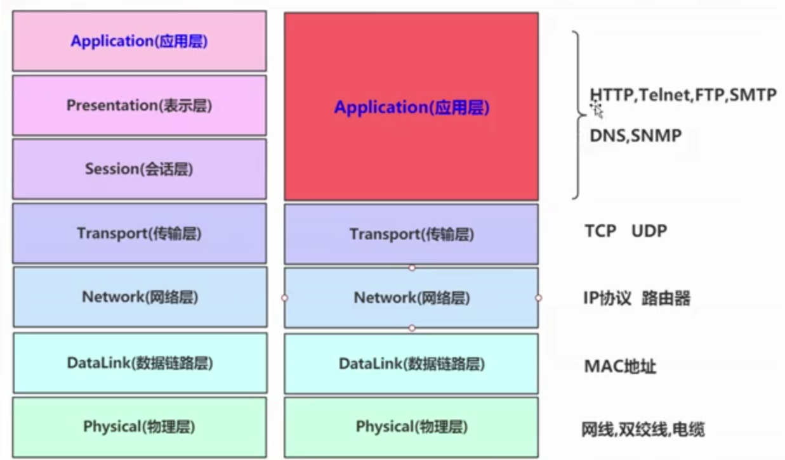
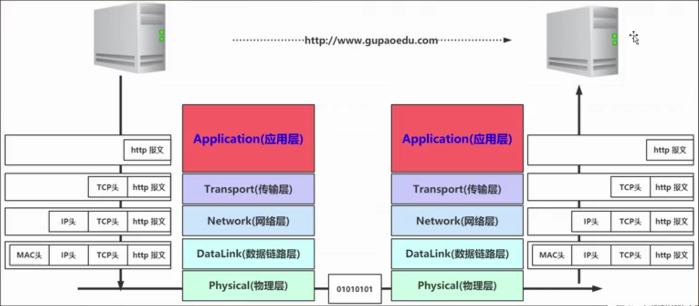
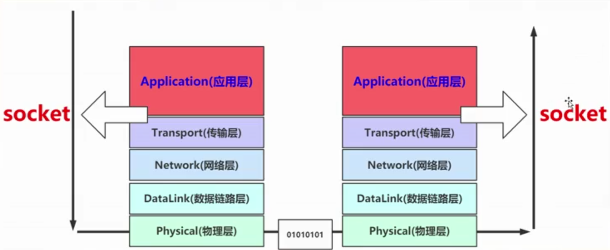

## 从Java来看IO的本质是什么？

`来源：`[咕泡学院](<https://www.gupaoedu.com/>)


### 如何更好的去理解它

计算机 = I / O + 计算机CPU

在计算机中有个重要的东西叫操作系统，对计算机来说它最主要的作用就是调度、管理资源，处于我们的硬件资源跟软件之间的桥梁。它需要管理硬件设备（IO设备），以及对我们软件提供运行环境

从java的角度，去硬盘中读取一个文件的内容，应该怎么做？

向OS操作系统发起调用，然后由OS去调用硬盘、网卡，完成数据交换或者持久化


### Unix的IO模型

阻塞性IO模型




非阻塞性IO模型




IO复用模型



- 进程阻塞于select调用，但它一次会请求多个fd的数据调用


- 阻塞/非阻塞IO
  - 程序对内核空间**数据准备**阶段的耗时操作的处理方式
- 同步/异步IO
  - 程序对内核空间**数据拷贝**到用户空间阶段的耗时操作的处理方式


## 既然要网络编程，网络通讯你得知道这些

### 网络编程 Socket与IO


#### 网络通讯模型

OSI 7层模型



前三层由于界限不明显，所以一般也将前三层压缩统称为应用层

传输层最主要的功能是建立主机端对端的连接，提供向高层屏蔽向下数据传递的细节


HTTP是基于TCP协议的应用层协议


#### 网络通讯流程




#### Socket所在位置




### Java的网络编程详尽的分析

- BIO阻塞
  - 与线程是强绑定关系


## 那Socket于IO来讲又意味着什么

Socket 套接字

- 问题
  - Socket与应用程序中的I/O有没有关系
  - 如果有，有什么关系
  - 如果没有，为什么
- 答案
  - Socket与应用的IO并没有直接关系
  - Socket只是网络通讯模型中的一层抽象
  - Socket对象最多只是数据的一个承载体而已（或者说是一个FD ->  file descriptor）


## 网络编程中BIO的利弊分析及NIO的原理


### BIOServer

版本1

因为阻塞原因，这个版本它只能1：1的进行服务，但你不可能让服务器只服务一台客户端，于是就有版本2

```java
/**
 * @author jzh
 * @version 1.0.0
 * @title BIOServer
 * @date 2019/12/19 16:46
 * @description：
 */
public class BIOServer {
    public static void main(String[] args) throws Exception {
        ServerSocket socket = new ServerSocket(7777);
        System.out.println("BIO Server Starting, port: " + socket.getLocalPort());
        BufferedReader br = null;
        while (true) {
            Socket accept = socket.accept();
            try {
                System.out.println("Connection from: " + accept.getRemoteSocketAddress());
                br = new BufferedReader(new InputStreamReader(accept.getInputStream()));
                while (true) {
                    String request = br.readLine();
                    System.out.println("Receive Request : " + accept.getRemoteSocketAddress() + ", msg : " + request);
                    String response = "Response: " + request + ".\n";
                    accept.getOutputStream().write(response.getBytes());
                }
            } catch (Exception e) {
                e.printStackTrace();
            } finally {
                if (null != socket) {
                    socket.close();
                }
                if (null != accept) {
                    accept.close();
                }
                if (null != br) {
                    br.close();
                }
            }
        }
    }
}
```


### BIOServerByThread

版本2

通过线程的方式去维护BIO，这样虽然实现了m:m，但同时线程的开销是非常大的，所以我们可以用线程池去进一步的优化

```java
/**
 * @author jzh
 * @version 1.0.0
 * @title BIOServerByThread
 * @date 2019/12/19 17:03
 * @description：
 */
public class BIOServerByThread {
    public static void main(String[] args) throws Exception {
        ServerSocket socket = new ServerSocket(8888);
        System.out.println("BIO Server Starting, port: " + socket.getLocalPort());
        while (true) {
            Socket accept = socket.accept();
            System.out.println("Connection from: " + accept.getRemoteSocketAddress());
            new RequestHandler(accept).start();
        }
    }
}
```


### BIOServerByThreadPool

版本3

通过线程池来维护BIO虽然解决了开销过大的问题，但它只是实现了m:n(固定值)这样的模式

```java
/**
 * @author jzh
 * @version 1.0.0
 * @title BIOServerByThreadPool
 * @date 2019/12/19 17:11
 * @description：
 */
public class BIOServerByThreadPool {
    public static void main(String[] args) throws Exception {
        ExecutorService executorService = Executors.newFixedThreadPool(100);
        ServerSocket socket = new ServerSocket(9999);
        System.out.println("BIO Server Starting, port: " + socket.getLocalPort());
        while (true) {
            Socket accept = socket.accept();
            System.out.println("Connection from: " + accept.getRemoteSocketAddress());
            executorService.execute(new RequestHandler(accept));
        }
    }
}
```


### RequestHandler

```java
/**
 * @author jzh
 * @version 1.0.0
 * @title RequestHandler
 * @date 2019/12/19 17:03
 * @description：
 */
public class RequestHandler extends Thread {

    private Socket socket;

    public RequestHandler(Socket socket) {
        this.socket = socket;
    }

    @Override
    public void run() {

        BufferedReader br = null;

        try {
            System.out.println("Connection from: " + socket.getRemoteSocketAddress());

            br = new BufferedReader(new InputStreamReader(socket.getInputStream()));

            while (true) {
                String request = br.readLine();

                System.out.println("Receive Request : " + socket.getRemoteSocketAddress() + ", msg : " + request);

                String response = "Response: " + request + ".\n";

                socket.getOutputStream().write(response.getBytes());

            }

        } catch (Exception e) {
            e.printStackTrace();
        } finally {
            if (null != socket) {
                try {
                    socket.close();
                } catch (IOException e) {
                    e.printStackTrace();
                }
            }
            if (null != br) {
                try {
                    br.close();
                } catch (IOException e) {
                    e.printStackTrace();
                }
            }
        }
    }
}
```


### NIOServer

```java
/**
 * @author jzh
 * @version 1.0.0
 * @title NIOServer
 * @date 2019/12/19 17:19
 * @description：
 */
public class NIOServer {
    public static void main(String[] args) throws Exception {
        // 创建ServerSocketChannel
        ServerSocketChannel serverSocketChannel = ServerSocketChannel.open();

        // 设置channel 为非阻塞方式
        serverSocketChannel.configureBlocking(false);

        // 绑定本机服务器端口号，监听12345端口
        serverSocketChannel.bind(new InetSocketAddress(12345));

        System.out.println("NIO Server Starting, Listening ON Port: " + serverSocketChannel.getLocalAddress());

        // NIO三大剑客：Selector, Channel, Buffer
        // 创建Selector
        Selector selector = Selector.open();

        // 把当前的通道的连接建立事件，注册在Selector
        serverSocketChannel.register(selector, SelectionKey.OP_ACCEPT);

        // 创建缓冲区接收数据
        ByteBuffer buffer = ByteBuffer.allocate(2048);

        while (true) {
            // 阻塞
            // 系统调用 select
            int select = selector.select();

            if (select == 0) {
                continue;
            }

            // 有通道已经准备好相关事件
            Set<SelectionKey> selectionKeys = selector.selectedKeys();

            // 循环所有通道上的事件
            Iterator<SelectionKey> iterator = selectionKeys.iterator();
            while (iterator.hasNext()) {
                SelectionKey key = iterator.next();

                // 如果是通道的连接事件，则新建连接好r的通道，并将该通道的读事件注册在selector上
                if (key.isAcceptable()) {
                    // 基于serverSocketChannel 连接事件触发之后

                    // socket再一次封装
                    ServerSocketChannel channel = (ServerSocketChannel) key.channel();

                    // 创建新的socketChannel(SocketChannel是对Socket的再一次封装)
                    SocketChannel socketChannel = channel.accept();

                    System.out.println("Connection From: " + socketChannel.getRemoteAddress());

                    // 将socketChannel 的读事件，注册到selector上
                    socketChannel.configureBlocking(false);

                    socketChannel.register(selector, SelectionKey.OP_READ);
                }

                // 如果准备好的事件为读事件
                if (key.isReadable()) {
                    SocketChannel channel = (SocketChannel) key.channel();

                    // 基于通道将数据读取到缓冲Buffer中
                    channel.read(buffer);
                    String request = new String(buffer.array()).trim();
                    buffer.clear();

                    System.out.println("Receive Request: " + channel.getRemoteAddress() + ", msg: " + request);

                    String response = "Response: " + request + ".\n";

                    // 基于通道返回请求方内容
                    channel.write(ByteBuffer.wrap(response.getBytes()));
                }

                // 移除已经处理过的准备好的事件
                iterator.remove();
            }
        }
   }
}
```

