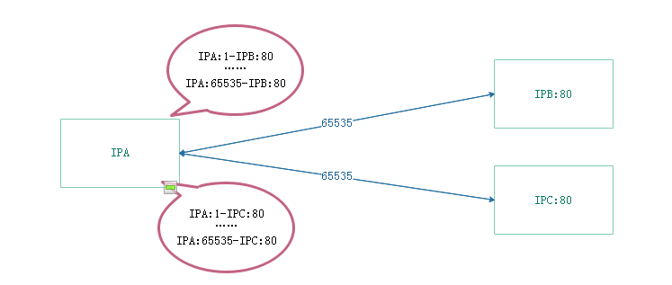

# Socket

## 什么是Socket？

中文名叫套接字，ip:port + ip:port（客户端IP：端口号 + 服务端IP：端口号）


一个IP的端口数为65535个，在不计较系统占用等情况下，`IPA`就可以与`IPB:80`建立65535个连接。



此时来了个`IPC:80`也想与`IPA`进行连接，那么`IPA`同样也可以与`IPC:80`建立65535个连接。


## Client

```java
import java.io.*;
import java.net.Inet4Address;
import java.net.InetSocketAddress;
import java.net.Socket;

public class Client {
    public static void main(String[] args) throws IOException {
        Socket socket = new Socket();
//        超时时间
        socket.setSoTimeout(3000);

//        连接本地，端口2000 超时时间3000ms
        socket.connect(new InetSocketAddress(Inet4Address.getLocalHost(), 2000), 3000);

        System.out.println("已发起服务器连接，并进入后续流程~");
        System.out.println("客户端信息：" + socket.getLocalAddress() + "  P：" + socket.getLocalPort());
        System.out.println("服务端信息：" + socket.getInetAddress() + "   P：" + socket.getPort());

        try {
            todo(socket);
        } catch (Exception e) {
            System.out.println("异常关闭");
        }
//        释放资源
        socket.close();
        System.out.println("客户端已退出");
    }

    private static void todo(Socket client) throws IOException {
//        构建键盘输入流
        InputStream in = System.in;
        BufferedReader input = new BufferedReader(new InputStreamReader(in));

//        得到Socket输出流，并转换为打印流
        OutputStream outputStream = client.getOutputStream();
        PrintStream socketPrintStream = new PrintStream(outputStream);

//        得到Socket输入流，并转换为BufferedReader
        InputStream inputStream = client.getInputStream();
        BufferedReader socketBufferedReader = new BufferedReader(new InputStreamReader(inputStream));


        boolean flag = true;

        do {
//        键盘读取一行
            String str = input.readLine();
//        发送到服务器
            socketPrintStream.println(str);

//            socketPrintStream.


            String echo = socketBufferedReader.readLine();
            if ("bye".equalsIgnoreCase(echo)) {
                flag = false;
            } else {
                System.out.println(echo);
            }
        } while (flag);

        socketBufferedReader.close();
        socketPrintStream.close();
    }
}
```


## Server

```java
import java.io.BufferedReader;
import java.io.IOException;
import java.io.InputStreamReader;
import java.io.PrintStream;
import java.net.ServerSocket;
import java.net.Socket;

public class Server {
    public static void main(String[] args) throws IOException {
        ServerSocket server = new ServerSocket(2000);

        System.out.println("服务器准备就绪~~");
        System.out.println("服务端信息：" + server.getInetAddress() + "   P：" + server.getLocalPort());

//        等待客户端连接
        for (; ; ) {
//            得到客户端
            Socket client = server.accept();
//            客户端构建异步线程
            ClientHandler clientHandler = new ClientHandler(client);
//            启动线程
            clientHandler.start();
        }


    }

    /**
     * 客户端消息处理
     */
    private static class ClientHandler extends Thread {
        private Socket socket;
        private boolean flag = true;

        ClientHandler(Socket socket) {
            this.socket = socket;
        }

        @Override
        public void run() {
            super.run();
            System.out.println("新服务端连接：" + socket.getInetAddress() + "   P：" + socket.getPort());
            try {
//                得到打印流，用于数据输出，服务器回送数据使用
                PrintStream socketOutput = new PrintStream(socket.getOutputStream());
//                得到输入流，用于接收数据
                BufferedReader socketInput = new BufferedReader(new InputStreamReader(socket.getInputStream()));

                do {
//                    客户端拿到一条数据
                    String str = socketInput.readLine();
                    if ("bye".equalsIgnoreCase(str)) {
                        flag = false;
//                        回送
                        socketOutput.println("bye");
                    } else {
//                        打印到屏幕，并回送数据长度
                        System.out.println(str);
                        socketOutput.println("回送：" + str.length());
                    }

                } while (flag);

                socketInput.close();
                socketOutput.close();

            } catch (Exception e) {
                System.out.println("连接异常断开");
            } finally {
                try {
                    socket.close();
                } catch (IOException e) {
                    e.printStackTrace();
                }
            }

            System.out.println("客户端已退出：" + socket.getInetAddress() + "   P：" + socket.getPort());

        }
    }
}
```