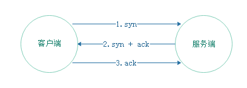

# TCP

-----

## 什么是TCP？

面向**连接**的**可靠**的传输协议

## 三次握手

客户端：我想和你建立连接，发数据给你，能听到我说话吗？

服务器：能

客户端：好的，那我开始了

### 为什么要三次握手？两次不行吗？

对于客户端来说，第一次握手表明客户端能发送数据，第二次表明服务端收到了数据并且客户端能收到数据。

但是对服务端来说，第一次握手只能表明能收到数据，第二次表明能发数据，但服务器不知道这第二次握手客户端是否真的收到了数据，这时就需要第三次握手让服务端知道客户端收到了服务端发送的数据。

## 四次分手

