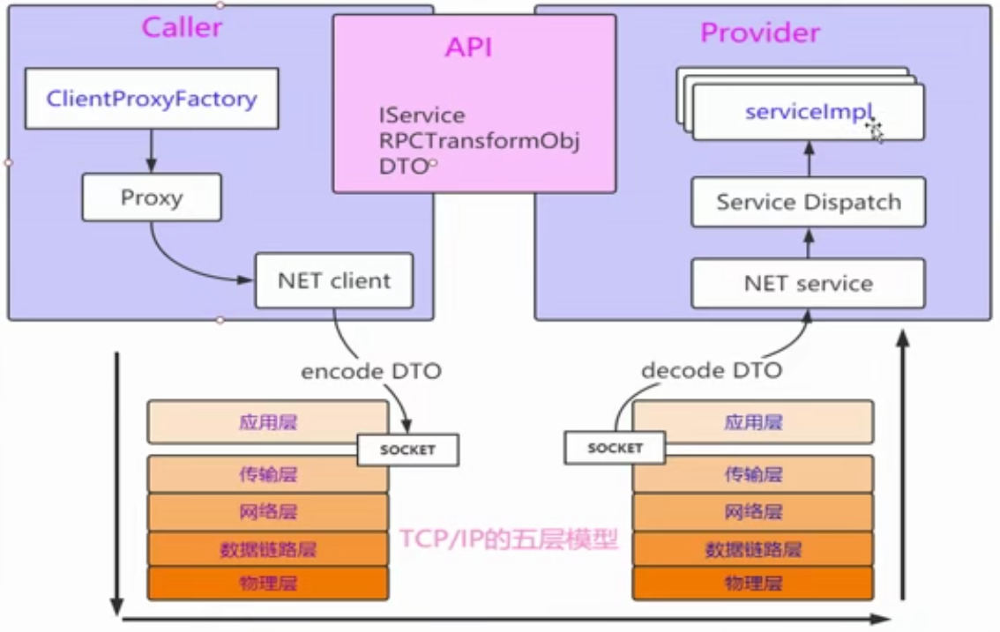

> RPC概述理解
>
> 手写RPC思路整理
>
> 手写RPC通讯机制
>
> 合格的RPC机制到优秀RPC框架


### 什么是RPC

Remote Procedure Call - 远程过程（服务）调用

- 定义
  - RPC是基于网络跨进程服务间的数据通讯标准
- 意义
  - 提供快速的构建分布式应用的底层数据通讯支撑
- 原则
  - 在RPC下的数据交换尽量不损失调用语言表达的简洁性

- RPC 的机制
  - 保证服务端与端之间的调用


### 思路整理



- API
  - 定义服务之间数据交换的标准
- Provider（服务器）
  - 实现API标准
  - 提供网络服务
  - 进行服务分发
- Caller
  - 实现API标准
  - 使用动态代理屏蔽网络细节


### 基于Socket的BIO实现

#### api

```java
/**
 * @author jzh
 * @version 1.0.0
 * @title UserDTO
 * @date 2019/12/18 20:33
 * @description：
 */
@Data
public class UserDTO implements Serializable {

    private static final long serialVersionUID = -5217069794202364802L;

    private String userId;

    private String userName;

    private int age;

}
```

```java
/**
 * @author jzh
 * @version 1.0.0
 * @title RPCTransformObj
 * @date 2019/12/20 16:19
 * @description：
 */
@Data
public class RPCTransformObj implements Serializable {

    private static final long serialVersionUID = 8721056664203046167L;

    private String fullClassPath;

    private String methodName;

    private Object[] params;
}
```

```java
/**
 * @author jzh
 * @version 1.0.0
 * @title UserService
 * @date 2019/12/18 20:35
 * @description：
 */
@ServiceMapped("person.jzh.rpc.api.impl.UserServiceImpl")
public interface UserService {
    UserDTO addUser(UserDTO userDTO);
}
```

```java
/**
 * @author jzh
 * @version 1.0.0
 * @title ServiceMapped
 * @date 2019/12/20 16:58
 * @description：
 */
@Target(ElementType.TYPE)
@Retention(RetentionPolicy.RUNTIME)
public @interface ServiceMapped {
    String value() default "";
}
```


#### provider

```java
/**
 * @author jzh
 * @version 1.0.0
 * @title UserServiceImpl
 * @date 2019/12/20 15:55
 * @description：
 */
public class UserServiceImpl implements UserService {
    @Override
    public UserDTO addUser(UserDTO userDTO) {
        System.out.println("userDTO: " + userDTO.toString());
        userDTO.setUserId(new Random().nextInt() + "");
        return userDTO;
    }
}
```

```java
/**
 * @author jzh
 * @version 1.0.0
 * @title ServiceDispatch
 * @date 2019/12/20 16:11
 * @description：
 */
public class ServiceDispatch {
    public static Object dispatch(Object reqObj) {
        // 反射方式
        // 1、类的全路径名称
        // 2、调用的方法名称
        // 3、调用方法的
        // 4、调用方法的参数值的列表
        RPCTransformObj rpcTransformObj = (RPCTransformObj) reqObj;
        String fullClassPath = rpcTransformObj.getFullClassPath();
        String methodName = rpcTransformObj.getMethodName();
        Object[] params = rpcTransformObj.getParams();
        Class[] types = new Class[params.length];
        for (int i = 0; i < params.length; i++) {
            types[i] = params[i].getClass();
        }

        Object respObject = null;
        try {
            Class<?> clazz = Class.forName(fullClassPath);
            Method method = clazz.getDeclaredMethod(methodName, types);
            respObject = method.invoke(clazz.newInstance(), params);
        } catch (Exception e) {
            e.printStackTrace();
        }

        return respObject;
    }
}
```

```java
/**
 * @author jzh
 * @version 1.0.0
 * @title BIOServer
 * @date 2019/12/20 15:59
 * @description：
 */
public class BIOServer {

    private static ExecutorService executorService = Executors.newFixedThreadPool(100);

    public static void startServer(int port) throws Exception {
        ServerSocket ss = new ServerSocket(port);

        while (true) {
            // 阻塞的等到客户端的连接到来
            Socket socket = ss.accept();

            // 流的操作，是典型的BIO的处理方式
            // 阻塞，与线程是一个强绑定的关系

            // 多线程的方式，但不能让它无止尽的创建与销毁，所以我们需要用到线程池
            executorService.submit(new RPCThreadProcessor(socket));
        }
    }
}
```

```java
/**
 * @author jzh
 * @version 1.0.0
 * @title RPCThreadProcessor
 * @date 2019/12/20 16:06
 * @description：
 */
public class RPCThreadProcessor implements Runnable {

    private Socket socket;

    public RPCThreadProcessor(Socket socket) {
        this.socket = socket;
    }

    @Override
    public void run() {
        ObjectInputStream ois = null;
        ObjectOutputStream oos = null;
        try {
            ois = new ObjectInputStream(socket.getInputStream());

            // 获取请求的内容
            Object obj = ois.readObject();

            // 服务的调用
            Object resObj = ServiceDispatch.dispatch(obj);

            oos = new ObjectOutputStream(socket.getOutputStream());

            oos.writeObject(resObj);

            oos.flush();

        } catch (Exception e) {
            e.printStackTrace();
        } finally {
            if (ois != null) {
                try {
                    ois.close();
                } catch (IOException e) {
                    e.printStackTrace();
                }
            }
            if (oos != null) {
                try {
                    oos.close();
                } catch (IOException e) {
                    e.printStackTrace();
                }
            }
            if (socket != null) {
                try {
                    socket.close();
                } catch (IOException e) {
                    e.printStackTrace();
                }
            }
        }
    }
}
```

```java
public class App {
    public static void main(String[] args) throws Exception {
        BIOServer.startServer(7777);
    }
}

```


#### consumer

```java
/**
 * @author jzh
 * @version 1.0.0
 * @title ProxyFactory
 * @date 2019/12/20 16:40
 * @description：
 */
public class ProxyFactory {
    public static <T> T getService(Class<T> clazz) {
        return (T) Proxy.newProxyInstance(ProxyFactory.class.getClassLoader(),
                new Class[]{
                        clazz
                }, new RPCInvocationHandler());
    }
}
```

```java
/**
 * @author jzh
 * @version 1.0.0
 * @title RPCInvocationHandler
 * @date 2019/12/20 16:45
 * @description：
 */
public class RPCInvocationHandler implements InvocationHandler {
    /**
     * 代码的增强
     * 1、保护我们的目标对象
     * 2、增强我们的目标对象
     *
     * @param proxy
     * @param method
     * @param args
     * @return
     * @throws Throwable
     */
    @Override
    public Object invoke(Object proxy, Method method, Object[] args) throws Throwable {
        // 网络请求的部分内容

        RPCTransformObj rpcTransformObj = new RPCTransformObj();

        rpcTransformObj.setParams(args);
        rpcTransformObj.setMethodName(method.getName());
        ServiceMapped mapped = method.getDeclaringClass().getAnnotation(ServiceMapped.class);
        rpcTransformObj.setFullClassPath(mapped.value());

        // 网络编程，完成服务端的调用
        return BIOClient.callRemoteService(rpcTransformObj, "localhost", 7777);
    }
}
```

```java
/**
 * @author jzh
 * @version 1.0.0
 * @title BIOClient
 * @date 2019/12/20 17:04
 * @description：
 */
public class BIOClient {
    public static Object callRemoteService(Object reqObj, String host, int port){
        ObjectInputStream ois = null;
        ObjectOutputStream oos = null;
        Object obj = null;
        try {
            Socket socket = new Socket(host, port);

            oos = new ObjectOutputStream(socket.getOutputStream());

            oos.writeObject(reqObj);

            oos.flush();

            ois = new ObjectInputStream(socket.getInputStream());

            // 获取请求的内容
            obj = ois.readObject();


        } catch (Exception e) {
            e.printStackTrace();
        } finally {
            if (ois != null) {
                try {
                    ois.close();
                } catch (IOException e) {
                    e.printStackTrace();
                }
            }
            if (oos != null) {
                try {
                    oos.close();
                } catch (IOException e) {
                    e.printStackTrace();
                }
            }
        }

        return obj;
    }
}
```

```java
public class App {
    public static void main(String[] args) {
        UserService userService = ProxyFactory.getService(UserService.class);
        UserDTO userDTO = new UserDTO();
        userDTO.setUserName("张三");
        userDTO.setAge(18);
        userDTO = userService.addUser(userDTO);
        System.out.println(userDTO);
        // 在客户端调用的过程中，要尽量保证语义表达的简洁
    }
}
```


### 优化思路

- 更高效的序列化方式和数据流
  - JSON、Hessian、ProtoBuf。。。
- 更强劲的I / O的方式
  - BIO -> NIO -> Netty
- 完善的服务管理
  - 服务的注册/发现/路由
- 服务统一配置/链路追踪/限流/降级/熔断