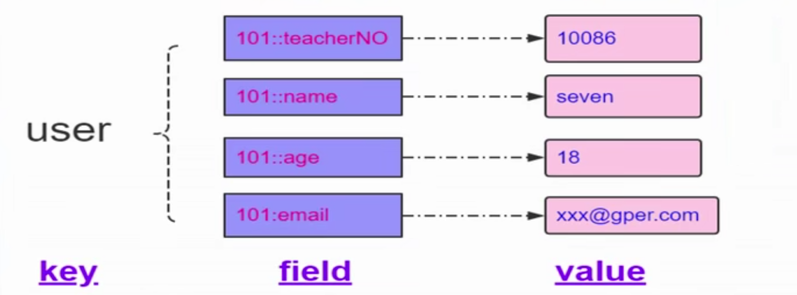
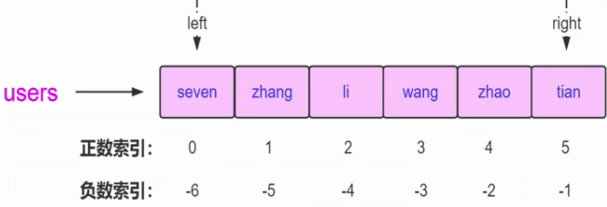
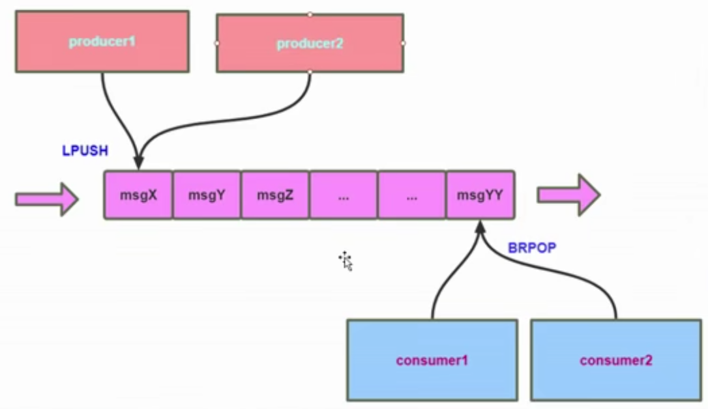
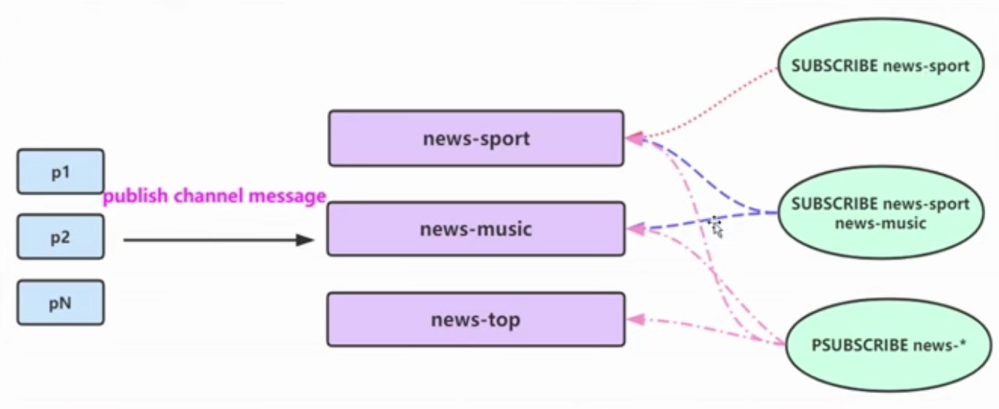
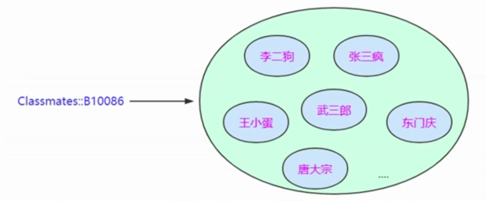
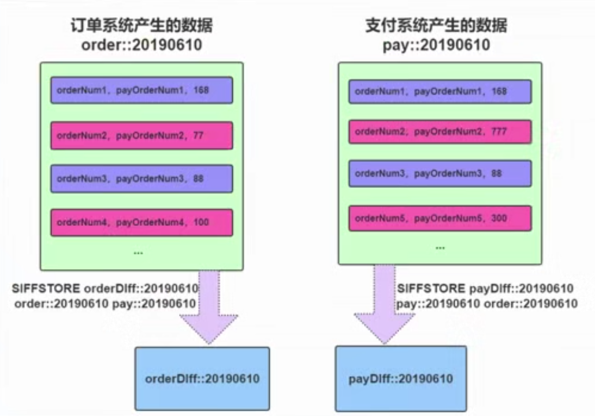
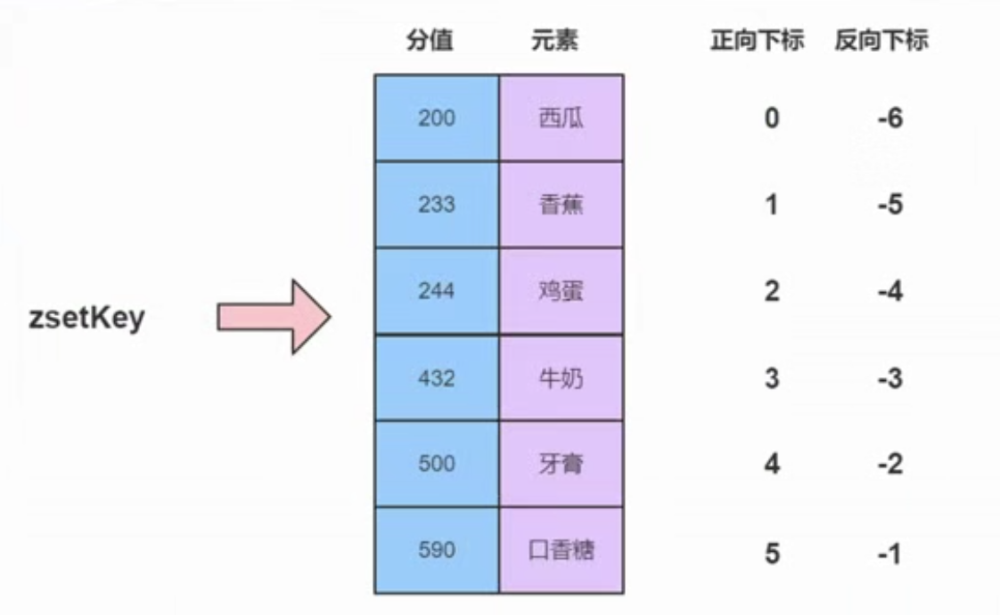
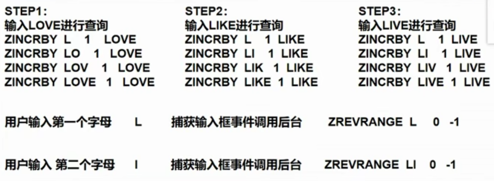

### 使用场景

| 功能                | 作用                         |
| ------------------- | ---------------------------- |
| 缓存                | 热点数据的访问加速           |
| 共享数据（session） | 数据的存储和共享的问题       |
| 分布式全局序列      | 分布式系统ID的生成方案       |
| 分布式锁            | 进程间共享数据的原子操作保证 |
| 在线用户统计和计数  |                              |
| [同步阻塞]队列/栈   | 跨进程的队列/栈              |
| 消息队列            | 异步解耦的消息机制           |
| 服务注册和发现中心  | RPC通讯机制的服务协调中心    |

- 类似新浪/Twitter用户消息时间线
- 抽奖逻辑（礼物、转发）
- 点赞、签到、打卡
- 商品标签
- 用户（商品）关注（推荐）模型
- 电商产品筛选
- 排行榜
- 搜索框自动补齐
- 。。。

### 数据类型

8种

- String
- Hash
- List
- Set
- ZSet
- HyperLogLog(2.8.9 版本后)
- Geo(3.2版本后)，基于地理位置经纬度的数据类型
- Stream(5.0版本后)

#### String

- String
- Number
- bit

此String非彼String，你不能用java的String来理解它，这个String只是个泛指，实际上它不仅仅只能用来存储我们的字符串，还可以存储数字类型和二进制。

这个二进制是什么？

比如说我们要给网站进行加速，网页需要加速加载图片时，就可以把我们的网页、图片缓存到bit数据类型当中。

##### String

HashMap<String, String> keyValue = new HashMap<String, String>();

**针对字符串的常见操作**

| 格式                 | 作用                                          |
| -------------------- | --------------------------------------------- |
| SET key value        | 存入字符串键                                  |
| SETNX key value      | 存入一个不存在的字符串，若存在key，存储不成功 |
| GET key              | 获取一个字符串键                              |
| MSET key value [k v] | 批量存储字符串键                              |
| MGET key [k ...]     | 批量获取字符串键                              |

其中 SETNX key value 可以作为分布式锁的解决方案

##### Number

HashMap<String, Number> count = new HashMap<String, Number>();

**针对数字常见操作**

| 格式                 | 作用                           |
| -------------------- | ------------------------------ |
| INCRBY key increment | 对数字key进行{increment}的增加 |
| DECRBY key decrement | 对数字key进行{decrement}的减少 |
| INCR key             | 对数字key自增1                 |
| DECR key             | 对数字key自减1                 |

**场景**

计数器																-- 论坛帖子阅读数

分布式全局序列（分布式ID生成）	

##### Bit

HashMap<String, bit[]> userOnline = new HashMap<String, bit[]>();

**针对bits常见操作**

| 格式                       | 作用                                   |
| -------------------------- | -------------------------------------- |
| GETBIT key offset          | 获取指定偏移量上的位（bit）值          |
| SETBIT key offset value    | 设置或替换指定偏移量上的位（bit）值    |
| BITCOUNT key [start] [end] | 统计从Start到End被设置为1的bit位的数量 |

**场景**

在线用户统计设计（仅适用id自增的表（或者hash））

##### 缓存key设计

| id   | name | age  |
| ---- | ---- | ---- |
| 1    | 张三 | 19   |
| 2    | 李四 | 20   |
| 3    | 王五 | 21   |

**存入结构化（序列化）数据**

json、xml、hessian、protobuf

但这样会有个问题，==数据难于修改==

**合理的key设计**

设值：

​	MSET   user::1::name   张三    user::1::age   19

取值：

​	MSET   user::1::name  user::1:age

但这样会造成key数量较多

#### Hash

HashMap<String, HashMap<String, String>> hash = new HashMap<String, HashMap<String, String>>();

**针对Hash常见操作**

| 格式                                    | 作用                       |
| --------------------------------------- | -------------------------- |
| HSET key field value                    | 存储一个散列键             |
| HSETNX key field value                  | 存储一个不存在的散列键     |
| HMSET key field value [field value ...] | 在一个key中存储多个field   |
| HGET key field                          | 获取key field的散列键值    |
| HMGET key field [field ...]             | 批量获取key中多个field的值 |
| HDEL key field [field ...]              | 删除散列键key中field的值   |

**针对数字操作**

| 格式                        | 作用                                    |
| --------------------------- | --------------------------------------- |
| HINCRBY key field increment | 对key散列中field进行数字操作{increment} |

**场景**

购物车					--  {userId}:car     {goodsId}      {count}

##### 意义及不适用场景

**意义**

- Hash键可以将信息凝聚在一起，便于管理
- 避免键名冲突、误操作
- 减少内存/IO/CPU消耗

**不适用**

- 过期键功能的使用，过期功能只能使用在key上
- 二进制操作命令，如：SETBIT、GETBIT
- 需要考虑数据量分布的问题

#### List

HashMap<String, Object[]> userOnline = new HashMap<String, Object[]>();

**针对List常见操作**

| 格式                        | 作用                                                         |
| --------------------------- | ------------------------------------------------------------ |
| LPUSH key value [value ...] | 往key的列表键中左边放入一个元素，key不存在则新建             |
| RPUSH key value [value ...] | 往key的列表键中右边放入一个元素，key不存在则新建             |
| LPOP key                    | 从key的列表键最左端弹出一个元素                              |
| RPOP key                    | 从key的列表键最右端弹出一个元素                              |
| LRANGE key start stop       | 获取列表键从start下标到stop下标的元素                        |
| BLPOP key [key ...] timeout | 阻塞的从key的列表键最左端弹出一个元素，若列表键中不存在元素，阻塞等待{timeout}秒，若{timeout}=0，一直阻塞 |
| BRPOP key [key ...] timeout | 阻塞的从key的列表键最右端弹出一个元素，若列表键中不存在元素，阻塞等待{timeout}秒，若{timeout}=0，一直阻塞 |

**场景**

- 阻塞消息队列

- Pub/Sub 模型

- 用户消息时间线
  - 微博（基于消息时间，获取最新的微博信息）

#### Set

HashMap<String, Set> classmates = new HashMap<String, Set>();

**针对Set常见操作**

| 格式                         | 作用                                                |
| ---------------------------- | --------------------------------------------------- |
| SADD key member [member ...] | 往集合键key中存放元素，若key不存在则新建            |
| SREM key member [member ...] | 从集合键key中删除元素                               |
| SMEMBERS key                 | 获取集合键key中所有的元素                           |
| SCARD key                    | 获取集合键key的元素个数                             |
| SISMEMBER key member         | 判断{member}元素是否存在于集合键key中               |
| SRANDMEMBER key [count]      | 从集合键key中选出{count}元素，不从集合键key中删除   |
| SPOP key [count]             | 从集合键key中选出{count}元素，并且从集合键key中删除 |

**场景**

- 点赞					
  - 用户1001点赞8001帖子 -> SADD like::8001 1001
  - 用户取消点赞 -> SREM like::8001 1001
  - 检查1001用户是否点过赞 -> SISMEMBER like::8001 1001
  - 获取8001帖子点赞的用户 -> SMEMBERS like::8001
  - 获取8001帖子点赞用户数 -> SCARD like::8001

- 签到
- 打卡
- 商品标签
  - sadd tags::{goodsId} 	保温还行

##### Set的运算API

- 交集运算
  - SINTER key [key ...]
  - SINTERSTORE destination key [key ...]
- 并集运算
  - SUNION key [key ...]
  - SUNIONSTORE destination key [key ...]
- 差集运算
  - SDIFF key [key ...]
  - SDIFFSTORE destination key [key ...]

**场景**

- 用户关注（商品推荐）模型
  - 例：qq里可能认识的人的提示（张三和李四是好友，李四和王五是好友，那么qq就会向张三推荐王五）
- 商品筛选
- 支付系统的T+1对账
  - 

#### ZSet

**针对ZSet基本操作**

| 格式                                  | 作用                                                         |
| ------------------------------------- | ------------------------------------------------------------ |
| ZADD key score element [..]           | 往有序集合键key中存放元素，若key不存在则新建                 |
| ZREM key element [element ..]         | 从有序集合key中删除元素                                      |
| ZSCORE key element                    | 获取有序集合key中{element}元素的score值                      |
| ZINCRBY key increment element         | 给有序集合key中{element}元素进行score值操作，若key不存在则新建，{element}元素不存在则新增后进行score值操作 |
| ZCARD key                             | 获取有序集合key中元素个数                                    |
| ZRANGE key start stop [WITHSCORES]    | 正序获取有序集合key从start下标到stop下标的元素               |
| ZREVRANGE key start stop [WITHSCORES] | 倒序获取有序集合key从start下标到shop下标的元素               |

**集合运算操作**

| 格式                                      | 作用     |
| ----------------------------------------- | -------- |
| ZUNIONSTORE destkey numkeys key [key ...] | 并集计算 |
| ZINTERSTORE destkey numkeys key [key ...] | 交集计算 |

**场景**

- 排行榜
  - 网易云周榜
  - 今日热点事件排行榜
- 搜索框自动补齐
  - 

