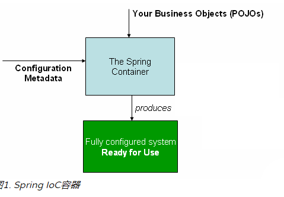
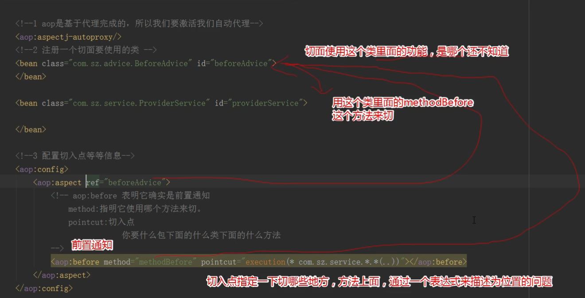
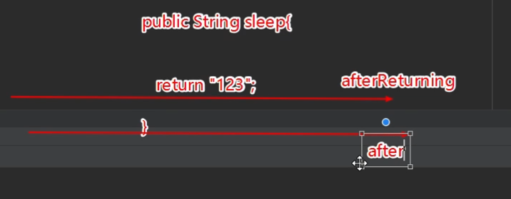

---


---

# Spring

## 简介

---

​	Spring 是一个框架，在2002年左右Rod Johnson推出的一个框架，讨论java企业级开发的问题，按EJB(java企业级开发的标准)标准开发时比较困难，开发起来比较繁琐，为了实现某个功能，往往需要继承某个类，然后被迫实现好几个接口，写一堆方法。

​	简化我们的开发工作，构建了最早版本的spring，获取对象的方式发生了极大的改变。

​	Spring默认是单例方式。

```java
Girl g = new Girl();

// 写死的方式
new PrettyGirl();

new YoungGirl();
```

```java
// 支付
Pay pay;
// 究竟是微信还是支付宝
pay = new WXpay();
```

​	大部分的对象应该从容器当中获取，而不是进行java硬编码

​	容器：就由它来写，以后我们要什么，就从这个容器里面拿，在容器去声明告诉它，给我准备什么


### 基础技术

- java
- 反射
- xml
- xml解析
- 代理
- 大量设计模式


### 基础环境搭建

1. 添加Spring的依赖
2. 编写一个Spring的配置文件
3. 通过Spring的应用程序上下文对象获取对象


官网：https://spring.io/


spring可以学习的模块

- [核心技术](https://docs.spring.io/spring-framework/docs/current/spring-framework-reference/core.html)：依赖注入，事件，资源，i18n，验证，数据绑定，类型转换，SpEL，AOP。
- [测试](https://docs.spring.io/spring-framework/docs/current/spring-framework-reference/testing.html)：模拟对象，TestContext框架，Spring MVC测试，`WebTestClient`。
- [数据访问](https://docs.spring.io/spring-framework/docs/current/spring-framework-reference/data-access.html)：事务，DAO支持，JDBC，ORM，编组XML。
- [Spring MVC](https://docs.spring.io/spring/docs/current/spring-framework-reference/web.html)和 [Spring WebFlux](https://docs.spring.io/spring/docs/current/spring-framework-reference/web-reactive.html) Web框架。
- [集成](https://docs.spring.io/spring-framework/docs/current/spring-framework-reference/integration.html)：远程处理，JMS，JCA，JMX，电子邮件，任务，调度，缓存。
- [语言](https://docs.spring.io/spring-framework/docs/current/spring-framework-reference/languages.html)：Kotlin，Groovy，动态语言。

原文

- [Core technologies](https://docs.spring.io/spring-framework/docs/current/spring-framework-reference/core.html): dependency injection, events, resources, i18n, validation, data binding, type conversion, SpEL, AOP.
- [Testing](https://docs.spring.io/spring-framework/docs/current/spring-framework-reference/testing.html): mock objects, TestContext framework, Spring MVC Test, `WebTestClient`.
- [Data Access](https://docs.spring.io/spring-framework/docs/current/spring-framework-reference/data-access.html): transactions, DAO support, JDBC, ORM, Marshalling XML.
- [Spring MVC](https://docs.spring.io/spring/docs/current/spring-framework-reference/web.html) and [Spring WebFlux](https://docs.spring.io/spring/docs/current/spring-framework-reference/web-reactive.html) web frameworks.
- [Integration](https://docs.spring.io/spring-framework/docs/current/spring-framework-reference/integration.html): remoting, JMS, JCA, JMX, email, tasks, scheduling, cache.
- [Languages](https://docs.spring.io/spring-framework/docs/current/spring-framework-reference/languages.html): Kotlin, Groovy, dynamic languages.


### 依赖

```xml
<dependency>
  <groupId>org.springframework</groupId>
  <artifactId>spring-core</artifactId>
  <version>5.1.5.RELEASE</version>
</dependency>
  <dependency>
  <groupId>org.springframework</groupId>
  <artifactId>spring-beans</artifactId>
  <version>5.1.5.RELEASE</version>
</dependency>
  <dependency>
  <groupId>org.springframework</groupId>
  <artifactId>spring-context</artifactId>
  <version>5.1.5.RELEASE</version>
</dependency>
```


### 配置文件

```xml
<?xml version="1.0" encoding="UTF-8"?>
<beans xmlns="http://www.springframework.org/schema/beans"
       xmlns:xsi="http://www.w3.org/2001/XMLSchema-instance"
       xsi:schemaLocation="http://www.springframework.org/schema/beans http://www.springframework.org/schema/beans/spring-beans.xsd">

    <!--将对象的创建交给spring容器，在这个配置文件里面去声明我要什么对象

            class: 写java类的全限定类名，它是通过全类名然后使用反射的技术进行创建的。
            id: id就是给这个对象在整个应用程序上下文当中取个名字以方便区分
    -->
    <bean class="person.jzh.pojo.Girl" id="girl"></bean>
</beans>
```


### java代码

pojo类

```java
package person.jzh.pojo;

public class Girl {

    private String name;

    private Integer age;

    private Dog dog;

    public Girl() {
        System.out.println("我来了");
    }

    public Girl(String name, Integer age) {
        this.name = name;
        this.age = age;
    }


    @Override
    public String toString() {
        return "Girl{" +
                "name='" + name + '\'' +
                ", age=" + age +
                '}';
    }

    public Dog getDog() {
        return dog;
    }

    public void setDog(Dog dog) {
        this.dog = dog;
    }

    public void chearDress(){
        System.out.println("我要卸妆了。。。");
    }

    public void dress(){
        System.out.println("我先化个妆。。。");
    }

    public String getName() {
        return name;
    }

    public void setName(String name) {
        this.name = name;
    }

    public Integer getAge() {
        return age;
    }

    public void setAge(Integer age) {
        this.age = age;
    }
}

```


test类

```java
package person.jzh;

import org.junit.Test;
import org.springframework.context.ApplicationContext;
import org.springframework.context.support.ClassPathXmlApplicationContext;
import person.jzh.pojo.Girl;

public class TestSpring {

    @Test
    public void m1(){
//        获取上下文对象，spring里面声明对象都需要通过上下文对象获取
        ApplicationContext ctx = new ClassPathXmlApplicationContext("applicationContext.xml");
//        通过这个对象获取我们的girl
        Girl g = (Girl)ctx.getBean("girl");
        System.out.println(g);
    }
}
```


### 普通编写 VS Spring方式

​	普通的获取对象方式，所有对象之间的依赖，类之间的依赖关系都是在java代码里面维护的，很难进行维护，如果说我们有替换方案，替换比较困难。

​	对象的产生全部是在配置文件里面完成的，其实我们想分析关系，直接在配置文件里面就看出来了。


核心内容学习

- IOC
- AOP

IOC概念：

​	控制反转：inverse of control 什么是控制，谁反转了谁。

控制：创建对象，彼此关系的权利。

控制权是在开发人员在程序代码当中进行掌控。 new

需要夺取控制权，反转给spring的容器

-  声明要什么
- spring容器来进行具体的控制


改变了编程的方式


IoC也称为依赖注入（DI）

注入：

```xml
<!--这种行为就称之为注入-->
<!--<bean class="person.jzh.pojo.WXPay" id="pay"></bean>-->
<bean class="person.jzh.pojo.AliPay" id="pay"></bean>
```


## 容器与Bean



- pojos：自己定义的这些类
- metadata：原数据，在spring的配置文件里面写的那些就是原数据
- 实例化容器：classpath..... 将配置文件传入，就实例完毕了


### 值的注入

- setter注入（最常用的）
  - 必须其字段有对应setter方法才可以完成   name   setName()
  - 通过property子节点完成注入
- 构造注入


如果没有对应的set方法，会出现以下错误：

```java
Invalid property 'name' of bean class [person.jzh.pojo.Girl]: Bean property 'name' is not writable or has an invalid setter method. 
```

### 注意

默认是通过无参构造器完成对象的创建的

如果没有无参构造器

```java
No default constructor found; nested exception is java.lang.NoSuchMethodException
```


### bean元素探讨

#### 属性探讨

- abstract：该bean将无法被实例化，
- parent：继承，与extends相同，指定它的父bean是谁，将会继承父bean的所有内容，通过ID进行指引。

```xml
<!--注入，配置原数据-->
<bean class="person.jzh.pojo.Girl" id="yourGirl" abstract="true">
    <property name="name" value="韩雪"/>
</bean>

<!--注入，配置原数据-->
<bean class="person.jzh.pojo.Girl" id="hisGirl" parent="yourGirl">
    <property name="age" value="33"/>
</bean>
```

-  destroy-method：指定这个bean最后销毁的时候一定执行的方法，适合于清理型工作，触发条件是bean确实是被销毁才发生。
  - 容器close会触发
  - refresh也会触发
  - 过时的destroy也会触发

```java
((ClassPathXmlApplicationContext) ctx).close();
((ClassPathXmlApplicationContext) ctx).refresh();
((ClassPathXmlApplicationContext) ctx).destroy();
```

- init-method：指定bean的初始化方法，准备性的工作。

- name： 别名，可以通过它一样获取，和id不一样，name可以写多个，彼此分割可以用多种分隔符方式，空格和逗号等

- scope：

  - 默认"singleton"（单例），==spring上下文==当中，只有一个实例
  - prototype：原型，要一个就新给一个

- lazy-init：延迟初始化

  - 默认(false)情况下，所有的bean是容器初始化完毕，立马就注入，即无参初始化
  - true： 就是spring一上来不会直接初始化我们的bean，当我们需要使用它的时候，spring才会初始化
    - 直接初始化
      - 应用程序启动会慢一点，内存消耗更大一点
      - 当我们使用bean的时候会快一些
    - 延迟初始化
      - 程序启动快一些，内存消耗更小一点
      - 使用bean会慢一些

```java
ApplicationContext ctx = new ClassPathXmlApplicationContext("bean3.xml");
```

- depends-on：依赖的bean，如果某一个bean的使用严重依赖于另外一个bean的准备的话，就可以配置


#### 对于非字面值可以描述的值的注入问题

```xml
<bean class="person.jzh.pojo.Girl" id="girl" lazy-init="false" depends-on="dog">
    <!--非字面值可以描述的属性注入，通过用ref来描述，即引用-->
    <!--<property name="dog" value="哮天犬"/>-->
    <property name="dog" ref="dog"/>
</bean>

<bean class="person.jzh.pojo.Dog" id="dog">
    <property name="name" value="哮天犬"/>
</bean>
```

​	通过ref指向另外一个bean的ID。

关于在spring的配置文件当中单独定义别名

- alias 标签完成

spring 多个配置文件里面的bean是可以互相引用的（被上下文扫描到的前提下）

### 两种注入方式

- setter

- 构造注入

  - Car类

```java
package person.jzh.pojo;
public class Car {
    private String name;
    private Double price;
    private Double speed;
    public Car(String name, Double price, Double speed) {
        this.name = name;
        this.price = price;
        this.speed = speed;
    }
    public Car(Double price, Double speed) {
        this.price = price;
        this.speed = speed;
    }
    public Car(String name, Double price) {
        this.name = name;
        this.price = price;
    }
    @Override
    public String toString() {
        return "Car{" +
                "name='" + name + '\'' +
                ", price=" + price +
                ", speed=" + speed +
                '}';
    }
    public String getName() {
        return name;
    }
    public void setName(String name) {
        this.name = name;
    }
    public Double getPrice() {
        return price;
    }
    public void setPrice(Double price) {
        this.price = price;
    }
    public Double getSpeed() {
        return speed;
    }
    public void setSpeed(Double speed) {
        this.speed = speed;
    }
}
```


  - 构造注入方式一

```xml
<!--
        通过名字来进行注入
-->
<bean class="person.jzh.pojo.Car" id="car">
    <constructor-arg name="name" value="宝马"/>
    <constructor-arg name="price" value="1123231"/>
    <constructor-arg name="speed" value="200"/>

</bean>
```
  - 方式二：
      - 它优先使用了后面的构造器，最好不要用

```xml
<bean class="person.jzh.pojo.Car" id="car2">
    <constructor-arg index="0" value="宝马"/>
    <constructor-arg index="1" value="2333"/>
</bean>
```

```java
public Car(Double price, Double speed) {
    this.price = price;
    this.speed = speed;
}

public Car(String name, Double price) {
    this.name = name;
    this.price = price;
}
```

- 方式三

```xml
<bean class="person.jzh.pojo.Car" id="car3">
    <constructor-arg type="java.lang.String" value="2222"/>
    <constructor-arg type="java.lang.Double" value="333"/>
</bean>
```

按照构造函数里面的入参的数据类型定义


## Spring当中的各种值的注入

- 数组
- List
- Set
- Map

如果其对应的值是简单的字面值，就直接写就可以了，如果是一个其它的类，那么使用内部bean的方式完成

```xml
 <bean class="person.jzh.pojo.People" id="people">
        <property name="name" value="阿发"/>
        <property name="age" value="62"/>
        <!--<property name="friends" value="刘德华 郭富城"/>-->
        <property name="friends">
            <array>
                <value>刘德华</value>
                <value>郭富城</value>
                <value>黎明</value>
                <value>张学友</value>
            </array>
        </property>
        <property name="nums">
            <list>
                <value>7</value>
                <value>5</value>
            </list>
        </property>
        <property name="cats">
            <list>
                <!--内部bean，无法被外部所引用，所以无需ID-->
                <bean class="person.jzh.pojo.Cat">
                    <property name="leg" value="2"/>
                    <property name="skin" value="蓝色"/>
                </bean>
                <bean class="person.jzh.pojo.Cat">
                    <property name="leg" value="4"/>
                    <property name="skin" value="青色"/>
                </bean>
            </list>
        </property>
        <property name="pigs">
            <set>
                <bean class="person.jzh.pojo.Pig">
                    <property name="name" value="佩奇"/>
                    <property name="sleep" value="88"/>
                    <property name="kw" value="香辣"/>
                </bean>
                <bean class="person.jzh.pojo.Pig">
                    <property name="name" value="小宝"/>
                    <property name="sleep" value="99"/>
                    <property name="kw" value="酱香"/>
                </bean>
            </set>
        </property>
        <property name="users">
            <map>
                <entry key="user1">
                    <bean class="person.jzh.pojo.User">
                        <property name="name" value="韩雪"/>
                        <property name="address" value="梧桐村"/>
                    </bean>
                </entry>
                <entry key="user2">
                    <bean class="person.jzh.pojo.User">
                        <property name="name" value="林青霞"/>
                        <property name="address" value="台湾"/>
                    </bean>
                </entry>
            </map>
        </property>
    </bean>
```

测试类

```java
@Test
public void m1(){

    ApplicationContext ctx = new ClassPathXmlApplicationContext("beans.xml");
    People people = ctx.getBean("people", People.class);

//        System.out.println(Arrays.toString(people.getFriends()));
//        System.out.println(people.getFriends().length);
//        System.out.println(people.getNums());

//        System.out.println(people.getCats());
//        System.out.println(people.getPigs());

    System.out.println(people.getUsers());
}
```


## 自动注入

- autowire

  - byType

    - 是根据类型进行注入它的属性，此时在上下文当中搜寻Pig这种bean，找到有且仅有一个的情况下，将会注入成功，如果一个都没有，没注入，如果不止一个，将会有异常。

    - ```xml
      <bean class="person.jzh.pojo.User" id="user" autowire="byType">
          <property name="name" value="陈慧琳"/>
          <property name="address" value="香港"/>
      </bean>
      
      <bean class="person.jzh.pojo.Pig">
          <property name="name" value="大宝"/>
      </bean>
      ```

    - 多个bean异常：==No qualifying bean of type 'person.jzh.pojo.Pig'==

      - 解决方案：primary

      - ```xml
        <!--
              primary默认值是true
              如果有多个bean，并且它会按类型注入给其它bean，那么只能有一个primary为true
          -->
          <bean class="person.jzh.pojo.Pig" primary="true">
              <property name="name" value="大宝"/>
          </bean>
          <bean class="person.jzh.pojo.Pig" primary="false">
              <property name="name" value="巨大宝"/>
          </bean>
        ```

  - byName：按照bean对应的pojo里面的属性的名字进行匹配

    - ```xml
         <bean class="person.jzh.pojo.Pig" id="pig">
              <property name="name" value="大宝"/>
          </bean>
      ```

    - ```xml
         <bean class="person.jzh.pojo.Pig" name="pig">
              <property name="name" value="大宝"/>
          </bean>
      ```

  - constructor

    - 优先按照类型去匹配，如果匹配到一个那么直接注入，不止一个按照名字注入，如果一个都找不到，注入失败

    - ```java
          public User(String name, Pig pig) {
              this.name = name;
              this.pig = pig;
          }
      ```

    - ```xml
      <bean class="person.jzh.pojo.User" id="user" autowire="constructor">
          <constructor-arg name="name" value="韩红"/>
      </bean>
      <bean class="person.jzh.pojo.Pig" id="pig">
          <property name="name" value="大宝"/>
      </bean>
      ```

  - default

  - no：不注入

```xml
<!--<bean class="person.jzh.pojo.User" id="user" autowire="byName">-->
    <!--<property name="name" value="陈慧琳"/>-->
    <!--<property name="address" value="香港"/>-->
<!--</bean>-->

<!--<bean class="person.jzh.pojo.User" id="user" autowire="constructor">-->
    <!--<constructor-arg name="name" value="韩红"/>-->
<!--</bean>-->

<!--
    primary默认值是true
    如果有多个bean，并且它会按类型注入给其它bean，那么只能有一个primary为true
-->
<bean class="person.jzh.pojo.Pig" id="pig">
    <property name="name" value="大宝"/>
</bean>
<!--<bean class="person.jzh.pojo.Pig">-->
    <!--<property name="name" value="巨大宝"/>-->
<!--</bean>-->

<!--<bean class="person.jzh.Service.ProviderService" id="providerService" autowire="byType">-->

<!--</bean>-->
<bean class="person.jzh.Service.ProviderService" id="providerService">
    <property name="providerDao" ref="providerDao"/>
</bean>

<bean class="person.jzh.Dao.ProviderDao" id="providerDao">

</bean>
```


## 常用注解

- component
- controller(springmvc)
- service(业务层)
- repository(dao层)


## 零碎的知识点

- 如何引入外部propertie文件

  - ```xml
    <!--通过这种方式引入我们类路径下的文件-->
    <context:property-placeholder location="classpath:database.properties"/>
    ```

- 如何通过表达式外用外部properties的键值

  - ```xml
    <!--通过${} 表达式可以去引用我们引入的这些properties里面的属性的值，通过它的键名来得到值-->
    <bean class="person.jzh.Dao.ProviderDao" id="providerDao">
        <property name="driver" value="${driver}"/>
        <property name="url" value="${url}"/>
        <property name="user" value="${username}"/>
        <property name="password" value="${password}"/>
    </bean>
    ```

- 从一个配置文件引入多个spring配置文件

  - ```xml
    <import resource="classpath:spring/spring-*.xml"/>
    ```

- 配置扫描包

  - ```xml
    <!--激活注解
            扫描包是扫描该包以及子包所有
    -->
    <context:component-scan base-package="person.jzh.Service">
        <!--这个包下面的repository这种注解不扫描-->
        <context:exclude-filter type="annotation" expression="org.springframework.stereotype.Repository"></context:exclude-filter>
    </context:component-scan>
    ```

- beanfactory与applicationContext之间的区别

  - 参考官方回答


## Spring AOP

### 简介

​	面向切面（方面）编程，编程的关注点是一个横切面。

### 概念

- 方面：跨越多个类别的关注点的模块化。事务管理是企业Java应用程序中横切关注点的一个很好的例子。在Spring AOP中，方面是通过使用常规类（[基于模式的方法](https://docs.spring.io/spring-framework/docs/current/spring-framework-reference/core.html#aop-schema)）或使用`@Aspect`注释（[@AspectJ样式](https://docs.spring.io/spring-framework/docs/current/spring-framework-reference/core.html#aop-ataspectj)）注释的常规类来实现的 。
- 连接点：程序执行期间的一个点，例如执行方法或处理异常。在Spring AOP中，连接点始终表示方法执行。
- 建议：特定连接点的某个方面采取的操作。不同类型的建议包括“周围”，“之前”和“之后”建议。（建议类型将在后面讨论。）许多AOP框架（包括Spring）将建议建模为拦截器并在连接点周围维护一系列拦截器。
- 切入点：匹配连接点的谓词。建议与切入点表达式相关联，并在切入点匹配的任何连接点处运行（例如，执行具有特定名称的方法）。由切入点表达式匹配的连接点的概念是AOP的核心，Spring默认使用AspectJ切入点表达式语言。
- 简介：代表类型声明其他方法或字段。Spring AOP允许您向任何建议的对象引入新接口（以及相应的实现）。例如，您可以使用简介使bean实现 `IsModified`接口，以简化缓存。（介绍被称为AspectJ社区中的类型间声明。）
- 目标对象：由一个或多个方面建议的对象。也称为“建议对象”。由于Spring AOP是使用运行时代理实现的，因此该对象始终是代理对象。
- AOP代理：由AOP框架创建的对象，用于实现方面契约（建议方法执行等）。在Spring Framework中，AOP代理是JDK动态代理或CGLIB代理。
- 织入：将方面与其他应用程序类型或对象链接以创建建议对象。这可以在编译时（例如，使用AspectJ编译器），加载时间或在运行时完成。与其他纯Java AOP框架一样，Spring AOP在运行时执行编织。


###  Spring AOP包括以下类型的建议

- 建议之前：在连接点之前运行但无法阻止执行流程进入连接点的建议（除非它抛出异常）。

- 返回建议后：在连接点正常完成后运行的建议（例如，如果方法返回而不抛出异常）。

- 抛出建议后：如果方法通过抛出异常退出，则执行建议。

- 在（最终）建议之后：无论连接点退出的方式（正常或异常返回），都要执行建议。

- 围绕建议：围绕连接点的建议，例如方法调用。这是最有力的建议。around通知可以在方法调用之前和之后执行自定义行为。它还负责选择是继续加入点还是通过返回自己的返回值或抛出异常来快速建议的方法执行。

​	围绕建议是最普遍的建议。由于Spring AOP（如AspectJ）提供了全方位的建议类型，因此我们建议您使用可以实现所需行为的最不强大的建议类型。例如，如果您只需要使用方法的返回值更新缓存，那么最好实现返回后的建议而不是周围的建议，尽管周围的建议可以完成同样的事情。使用最具体的建议类型可以提供更简单的编程模型，减少错误的可能性。例如，您不需要`proceed()` 在`JoinPoint`used for around advice 上调用该方法，因此，您无法调用它。


### 配置文件版实现过程

#### 依赖

```xml
<!-- https://mvnrepository.com/artifact/org.aspectj/aspectjrt -->
    <dependency>
      <groupId>org.aspectj</groupId>
      <artifactId>aspectjrt</artifactId>
      <version>1.9.1</version>
    </dependency>
    <!-- https://mvnrepository.com/artifact/org.aspectj/aspectjweaver -->
    <dependency>
      <groupId>org.aspectj</groupId>
      <artifactId>aspectjweaver</artifactId>
      <version>1.9.1</version>
    </dependency>
```

#### 配置文件

```xml
<!--1、aop是基于代理完成的，所以我们要激活我们自动代理-->
<aop:aspectj-autoproxy/>

<!--2、注册一个切面要使用的类-->
<bean class="person.jzh.advice.BeforeAdvice" id="beforeAdvice">

</bean>
<bean class="person.jzh.service.ProviderService" id="providerService">

</bean>

<bean class="person.jzh.advice.AfterAdvice" id="afterAdvice">

</bean>

<bean class="person.jzh.advice.AfterReturningAdvice" id="afterReturningAdvice">

</bean>

<bean class="person.jzh.service.HelloService" id="helloService">

</bean>

<bean class="person.jzh.advice.ExceptionAdvice" id="exceptionAdvice">

</bean>

<bean class="person.jzh.advice.AroundAdvice" id="aroundAdvice">

</bean>

<!--3、配置切入点等等信息-->
<aop:config>
    <aop:aspect id="beforeAspect" ref="beforeAdvice">
        <!--aop:before 表明它确实是前置通知
            method 指明它使用哪个方法来切
            pointcut 切入点
                        你要切什么包下面的什么类下面的什么方法

        -->
        <!--
            如果有多个同类型的建议，谁在前，谁先执行
        -->
        <aop:before method="before" pointcut="execution(* person.jzh.service.*.*(..)))">
        </aop:before>
        <aop:before method="methodBefore" pointcut="execution(* person.jzh.service.*.*(..)))">
        </aop:before>
    </aop:aspect>

    <aop:aspect id="afterAspect" ref="afterAdvice">
        <!--service.*.*(..)
            第一个*是service下面的任意的类
            第二个是任何方法名都可以
            (..)是任意参数，没有参数，无数个参数也行

            execution(* person.jzh.service.*.*()) 切无参的
            execution(* person.jzh.service.*.*(java.lang.String)) 切参数一个且为String类型的方法
            execution(* person.jzh.service.*.*(java.lang.String,int)) 切参数两个，一个为String，一个为int
            实验证明，包装类和基本数据类型，对于execution是严格区分的
        -->
        <!--<aop:after method="methodAfter" pointcut="execution(* person.jzh.service.*.*(java.lang.String,java.lang.Integer))"></aop:after>-->
        <!--<aop:after method="methodAfter" pointcut="execution(* person.jzh.service.*.*(person.jzh.pojo.Provider))"></aop:after>-->
        <aop:after method="methodAfter" pointcut="execution(* person.jzh.service.*.*(..))">
        </aop:after>
    </aop:aspect>

    <aop:aspect ref="afterReturningAdvice">
        <!--
            returning可以对返回值进行绑定，与形参名字一致
        -->
        <aop:after-returning method="afterReturning" pointcut="execution(* person..*.*.*(..))" returning="returning"></aop:after-returning>
    </aop:aspect>

    <aop:aspect ref="exceptionAdvice">
        <aop:after-throwing method="execep" pointcut="execution(* person.jzh..*.*.*(..))">
        </aop:after-throwing>
    </aop:aspect>

    <aop:aspect ref="aroundAdvice">
        <aop:around method="around" pointcut="execution(* person.jzh..*.*.*(..))"></aop:around>
    </aop:aspect>
</aop:config>
```





#### afterReturning与after的区别




### 注解版

```xml
<!--1、自动代理-->
<aop:aspectj-autoproxy/>
<!--2、配置自动扫描包-->
<context:component-scan base-package="person"></context:component-scan>
```


```java
import org.aspectj.lang.JoinPoint;
import org.aspectj.lang.annotation.Aspect;
import org.aspectj.lang.annotation.Before;
import org.springframework.core.annotation.Order;
import org.springframework.stereotype.Component;
@Order(2)//数字小的优先,after与之相反
@Aspect//标记其为一个切面
@Component//标记当前的这个类为spring的一个组件，相当于在xml注册了一个bean一样
public class BeforeAdvice {

//    person下的任何子包下的任何方法都可以切到
//    @Before("execution(* person..*.*.*(..))")
//    在person包及其子包下面的任意的类的任意方法
    @Before("execution(* person..*.*(..))")
    public void before(JoinPoint joinPoint){
        System.out.println(joinPoint.getSignature().getName() + Arrays.toString(joinPoint.getArgs()));
        System.out.println("在一个世纪以前。。。。。");
    }
}
```


## execution表达式

​	先写访问修饰符  包名的限定  类名  方法名  参数列表  +  组合条件符合 ，  同时符合两个条件 ， 多个条件任意一个都可以

例：

```java
public person.jzh..*.*(java.lang.String)
//访问修饰符为public的并且是jzh这个包或者子包下面的任意的类的任意的方法的参数为一个，并且类型为String的方法，就可以切到
    
public person.jzh.*.*.*()
    
protected person.jzh..*.*(java.lang.Integer, ..)
    					//参数第一个是Integer的，后面有多个或无参的方法可以切到
```


