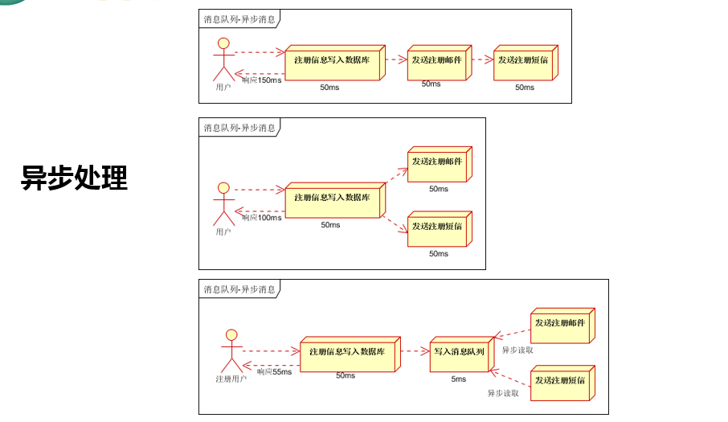

# 一、SpringBoot与缓存

```java
/**
 *  搭建基本环境
 *  1、导入数据库文件 创建出department和employee表
 *  2、创建javaBean封装数据
 *  3、整合MyBatis操作数据
 *      1.配置数据源信息
 *      2.使用注解版的MyBatis;
 *          1）、@MapperScan指定需要扫描的mapper接口所在的包
 *
 *  二、快速体验缓存
 *      步骤：
 *          1、开启基于注解的缓存
 *          2、标注缓存注解即可
 *              @Cacheable：开启缓存（针对方法配置）
 *              @CacheEvict：清空缓存
 *              @CachePut：方法被调用后，返回结果被缓存
 *
 *  	默认使用的是ConcurrentMapCacheManager==ConcurrentMapCache；
 * 		将数据保存在 ConcurrentMap<Object, Object>这
 *  	开发中使用缓存中间件：redis、memcached、ehcache;
 *  三、整合redis作为缓存
 *  	Redis 是一个开源（BSD许可）的，内在中的数据结构存储系统，它可以用作数据库、缓存和消息中间件
 *      1、安装redis：
 *          使用docker安装
 *      2、引用redis的starter
 *      3、配置redis
 */
```

## 1、JSR107

​	JavaCaching定义了5个核发接口，分别是Cachingprovider，CacheManager，Cache,Entry和Expiry。

- **CachingProvider**定义了创建、配置、获取、管理和控制多个**CacheManager**。一个应用可以在运行期访问多个CachingProvider。
- **CacheManager**定义了创建、配置、获取、管理和控制多个唯一命名的**Cache**，这些Cache存在于CacheManager的上下文中。一个CacheManager仅被一个CachingProvider所拥有。
- **Cache**是一个类似Map的数据结构并临时存储以Key为索引的值。一个Cache仅被一个CacheManager所拥有。
- **Entry**是一个存储在Cache中的key-value对。
- **Expiry** 每一个存储在Cache中的条目有一个定义的有效期。一旦超过这个时间，条目为过期的状态。一旦过期，条目将不可访问、更新和删除。缓存有效期可以通过ExpiryPolicy设置。


### 1、依赖

```xml
<dependency>
    <groupId>javax.cache</groupId>
    <artifactId>cache-api</artifactId>
</dependency>
```


## 2、缓存抽象

Spring从3.1开始定义了org.springframework.cache.Cache

和org.springframework.cache.CacheManager接口来统一不同的缓存技术；

并支持使用JCache（JSR-107）注解简化我们开发；

- Cache接口为缓存的组件规范定义，包含缓存的各种操作集合；
- Cache接口下Spring提供了各种xxxCache的实现；如RedisCache，EhCacheCache , ConcurrentMapCache等；
- 每次调用需要缓存功能的方法时，Spring会检查检查指定参数的指定的目标方法是否已经被调用过；如果有就直接从缓存中获取方法调用后的结果，如果没有就调用方法并缓存结果后返回给用户。下次调用直接从缓存中获取。
- 使用Spring缓存抽象时我们需要关注以下两点；
  - 1、确定方法需要被缓存以及他们的缓存策略
  - 2、从缓存中读取之前缓存存储的数据


### 1、几个重要概念&缓存注解

| **Cache**          | **缓存接口，定义缓存操作。实现有：RedisCache、EhCacheCache、ConcurrentMapCache等** |
| ------------------ | ------------------------------------------------------------ |
| **CacheManager**   | **缓存管理器，管理各种缓存（Cache）组件**                    |
| **@Cacheable**     | **主要针对方法配置，能够根据方法的请求参数对其结果进行缓存** |
| **@CacheEvict**    | **清空缓存**                                                 |
| **@CachePut**      | **保证方法被调用，又希望结果被缓存。**                       |
| **@EnableCaching** | **开启基于注解的缓存**                                       |
| **keyGenerator**   | **缓存数据时key生成策略**                                    |
| **serialize**      | **缓存数据时value序列化策略**                                |
| **@CacheConfig**   | **放在类上面，主要用于抽取缓存的公共配置**                   |


## 3、搭建基本环境

### 1、依赖

```xml
<dependency>
   <groupId>org.springframework.boot</groupId>
   <artifactId>spring-boot-starter-cache</artifactId>
</dependency>
<dependency>
   <groupId>org.springframework.boot</groupId>
   <artifactId>spring-boot-starter-web</artifactId>
</dependency>
<dependency>
   <groupId>org.mybatis.spring.boot</groupId>
   <artifactId>mybatis-spring-boot-starter</artifactId>
   <version>1.3.2</version>
</dependency>
<dependency>
   <groupId>org.springframework.boot</groupId>
   <artifactId>spring-boot-starter-data-redis</artifactId>
</dependency>
<dependency>
   <groupId>mysql</groupId>
   <artifactId>mysql-connector-java</artifactId>
   <!--<scope>runtime</scope>-->
   <version>8.0.15</version>
</dependency>
<dependency>
   <groupId>org.springframework.boot</groupId>
   <artifactId>spring-boot-starter-test</artifactId>
   <scope>test</scope>
</dependency>
```


### 2、导入数据库

```sql
/*
Navicat MySQL Data Transfer

Source Server         : 本地
Source Server Version : 50528
Source Host           : 127.0.0.1:3306
Source Database       : springboot_cache

Target Server Type    : MYSQL
Target Server Version : 50528
File Encoding         : 65001

Date: 2018-04-27 14:54:04
*/

SET FOREIGN_KEY_CHECKS=0;

-- ----------------------------
-- Table structure for department
-- ----------------------------
DROP TABLE IF EXISTS `department`;
CREATE TABLE `department` (
  `id` int(11) NOT NULL AUTO_INCREMENT,
  `departmentName` varchar(255) DEFAULT NULL,
  PRIMARY KEY (`id`)
) ENGINE=InnoDB DEFAULT CHARSET=utf8;

-- ----------------------------
-- Table structure for employee
-- ----------------------------
DROP TABLE IF EXISTS `employee`;
CREATE TABLE `employee` (
  `id` int(11) NOT NULL AUTO_INCREMENT,
  `lastName` varchar(255) DEFAULT NULL,
  `email` varchar(255) DEFAULT NULL,
  `gender` int(2) DEFAULT NULL,
  `d_id` int(11) DEFAULT NULL,
  PRIMARY KEY (`id`)
) ENGINE=InnoDB DEFAULT CHARSET=utf8;
```


### 3、创建相应的JavaBean

Department

```java
package com.atguigu.cache.bean;

import java.io.Serializable;

public class Department implements Serializable {
   
   private Integer id;
   private String departmentName;
   
   
   public Department() {
      super();
      // TODO Auto-generated constructor stub
   }
   public Department(Integer id, String departmentName) {
      super();
      this.id = id;
      this.departmentName = departmentName;
   }
   public Integer getId() {
      return id;
   }
   public void setId(Integer id) {
      this.id = id;
   }
   public String getDepartmentName() {
      return departmentName;
   }
   public void setDepartmentName(String departmentName) {
      this.departmentName = departmentName;
   }
   @Override
   public String toString() {
      return "Department [id=" + id + ", departmentName=" + departmentName + "]";
   }
}
```


Employee

```java
package com.atguigu.cache.bean;

import java.io.Serializable;

public class Employee implements Serializable {
   
   private Integer id;
   private String lastName;
   private String email;
   private Integer gender; //性别 1男  0女
   private Integer dId;
   
   
   public Employee() {
      super();
   }

   
   public Employee(Integer id, String lastName, String email, Integer gender, Integer dId) {
      super();
      this.id = id;
      this.lastName = lastName;
      this.email = email;
      this.gender = gender;
      this.dId = dId;
   }
   
   public Integer getId() {
      return id;
   }
   public void setId(Integer id) {
      this.id = id;
   }
   public String getLastName() {
      return lastName;
   }
   public void setLastName(String lastName) {
      this.lastName = lastName;
   }
   public String getEmail() {
      return email;
   }
   public void setEmail(String email) {
      this.email = email;
   }
   public Integer getGender() {
      return gender;
   }
   public void setGender(Integer gender) {
      this.gender = gender;
   }
   public Integer getdId() {
      return dId;
   }
   public void setdId(Integer dId) {
      this.dId = dId;
   }
   @Override
   public String toString() {
      return "Employee [id=" + id + ", lastName=" + lastName + ", email=" + email + ", gender=" + gender + ", dId="
            + dId + "]";
   }
}
```


### 4、整合MyBatis操作数据库

#### 1、配置数据源

```properties
spring.datasource.url=jdbc:mysql://localhost:3306/spring_cache?serverTimezone=GMT%2B8
spring.datasource.username=root
spring.datasource.password=123
spring.datasource.driver-class-name=com.mysql.cj.jdbc.Driver

# 开启驼峰命名匹配规则
mybatis.configuration.map-underscore-to-camel-case=true

# logging.level.com.atguigu.cache.mapper=debug

# debug=true

# spring.redis.host=172.18.255.101
```

#### 2、使用注解版的MyBatis

##### 1）、@MapperScan指定需要扫描的mapper接口所在的包

```java
@MapperScan("com.atguigu.cache.mapper")
@SpringBootApplication
@EnableCaching
public class Springboot01CacheApplication {

    public static void main(String[] args){
        SpringApplication.run(Springboot01CacheApplication.class);
    }
}
```


##### 2）、创建注解版mapper接口

```java
package com.atguigu.cache.mapper;

import com.atguigu.cache.bean.Employee;
import org.apache.ibatis.annotations.*;

//@Mapper
public interface EmployeeMapper {

    @Select("select * from employee where id = #{id}")
    public Employee getEmpById(@Param("id") Integer id);

    @Update("update employee set lastName=#{lastName},email=#{email},gender=#{gender},d_id=#{dId} where id = #{id}")
    public void updateEmp(Employee employee);

    @Delete("delete from employee where id=#{id}")
    public void deleteEmpById(Integer id);

    @Insert("insert into employee(lastName,email,gender,d_id) values(#{lastName},#{email},#{gender},#{dId})")
    public void insertEmployee(Employee employee);

    @Select("select * from employee where lastName = #{lastName}")
    Employee getEmpByLastName(String lastName);
}
```


## 4、快速体验缓存


```java
/**
 * 将方法的运行结果进行缓存;以后再要相同的数据，直接从缓存中获取，不用调用方法
 *
 * CacheManager管理多个Cache组件的，对缓存的真正CRUD操作在Cache组件中，每个缓存组件有自己唯一一个名字
 * 几个属性：
 *      cacheNames/value：指定缓存组件的名字；将方法的返回结果放在哪个缓存中，是数组的方式，可以指定多个缓存
 *      key：缓存数据使用的key；可以用它来指定。默认是使用方法参数的值  1-方法的返回值
 *              编写SpEL：#id：参数id的值，等同于#a0,#p0,#root.args[0]
 *      keyGenerator：key的生成器；可以自己指定key的生成器的组件id
 *          key/keyGenerator：二选一使用
 *      cacheManager：指定缓存管理器；或者CacheResolver指定获取解析器
 *      condition：指定符合条件的情况下才缓存
 *          condition = "#id > 0"
 *      unless：否定缓存；当unless指定的条件为true，方法的返回值就不会被缓存；可以获取到结果进行判断
 *          unless = "#result == null"
 *          unless = "#a0 == 2"；如果第一个参数的值是2，结果不缓存
 *      sync：是否使用异步模式
 *
 * 原理：
 *      1、自动配置类；CacheAutoConfiguration
 *      2、缓存的配置类
 *      org.springframework.boot.autoconfigure.cache.GenericCacheConfiguration
 *      org.springframework.boot.autoconfigure.cache.JCacheCacheConfiguration
 *      org.springframework.boot.autoconfigure.cache.EhCacheCacheConfiguration
 *      org.springframework.boot.autoconfigure.cache.HazelcastCacheConfiguration
 *      org.springframework.boot.autoconfigure.cache.InfinispanCacheConfiguration
 *      org.springframework.boot.autoconfigure.cache.CouchbaseCacheConfiguration
 *      org.springframework.boot.autoconfigure.cache.RedisCacheConfiguration
 *      org.springframework.boot.autoconfigure.cache.CaffeineCacheConfiguration
 *      org.springframework.boot.autoconfigure.cache.SimpleCacheConfiguration
 *      org.springframework.boot.autoconfigure.cache.NoOpCacheConfiguration
 *
 *      3、哪个配置类默认生效：SimpleCacheConfiguration
 *
 *      4、给容器中注册了一个CacheManager：ConcurrentMapCacheManager
 *
 *      5、可以获取和创建ConcurrentMapCache类型的缓存组件；他的作用将数保存在ConcurrentMap中
 *
 *      运行流程：
 *      @Cacheable：
 *      1、方法运行之前，先去查询Cache（缓存组件），按照cacheNames指定的名字获取
 *         （CacheManager先获取相应的缓存），第一次获取缓存如果没有Cache组件会自动创建
 *      2、去Cache中查找缓存的内容，使用一个key，默认就是方法的参数
 *          key是按照某种策略生成的；默认是使用keyGenerator生成的，默认使用SimpleKeyGenerator生成key
 *              SimpleKeyGenerator生成key的默认策略：
 *                  如果没有参数；key=new SimpleKey()
 *                  如果有一个参数：key=参数的值
 *                  如果有多个参数：key=new SimpleKey(params);
 *      3、没有查到缓存就调用目标方法；
 *      4、将目标方法返回的结果，放进缓存中
 *
 *      @Cacheable标注的方法执行之前，先来检查缓存中有没有这个数据，默认按照参数的值作为key去查询缓存，
 *      如果没有就运行方法并将结果放入缓存；以后再来调用就可以直接使用缓存中的数据
 *
 *      核心：
 *          1、使用CacheManager【ConcurrentMapCacheManager】按照名字得到Cache【ConcurrentMapCache】组件
 *          2、key使用keyGenerator生成的，默认是SimpleKeyGenerator
 *
 */
/**
 *  @CachePut：既调用方法，又更新缓存数据：
 *  修改了数据库的某个数据，同时更新缓存；
 *  运行时机：
 *      1、先调用目标方法
 *      2、将目标方法的结果缓存起来
 *
 *  测试步骤：
 *      1、查询1号员工；查到的结果会放在缓存中
 *      2、以后查询还是之前的结果
 *      3、更新1号员工；【lastName:zhangsan; gender:0】
 *          将方法的返回值也放进缓存了
 *          key：传入的employee对象   值：返回的employee对象
 *      4、查询1号员工？
 *          应该是更新后的员工：
 *              key = "#employee.id"：使用传入的参数的员工id；
 *              key = "#result.id"：使用返回后的id
 *                  @Cacheable的key是不能用#result的
 *          为什么是没更新前的？【1号员工没有在缓存中更新】
 */
/**
 *  @CacheEvict：缓存清除
 *      key：指定要清除的数据
 *      allEntries = true：指定清除这个缓存中所有的数据
 *      beforeInvocation = false：缓存的清除是否在方法之前执行
 *          默认代表缓存清除操作是在方法执行之后执行；如果出现异常缓存就不会清除
 *
 *      beforeInvocation = true：
 *          代表清除缓存操作是在方法运行之前执行，无论方法是否出现异常，缓存都清除
 */
```


### 1、开启基于注解的缓存

```java
@MapperScan("com.atguigu.cache.mapper")
@SpringBootApplication
@EnableCaching//开启缓存
public class Springboot01CacheApplication {

    public static void main(String[] args){
        SpringApplication.run(Springboot01CacheApplication.class);
    }
}
```


### 2、标注缓存的注解

| @Cacheable：      | 开启缓存（针对方法配置）         |
| ----------------- | -------------------------------- |
| **@CacheEvict：** | **清空缓存**                     |
| **@CachePut：**   | **方法被调用后，返回结果被缓存** |


```java
package com.atguigu.cache.service;

import com.atguigu.cache.bean.Employee;
import com.atguigu.cache.mapper.EmployeeMapper;
import org.springframework.beans.factory.annotation.Autowired;
import org.springframework.cache.annotation.*;
import org.springframework.stereotype.Service;

//抽取缓存的公共配置
@CacheConfig(cacheNames = "emp",cacheManager = "employeeCacheManager")
@Service
public class EmployeeService {

    @Autowired
    EmployeeMapper employeeMapper;

    /**
     * 将方法的运行结果进行缓存;以后再要相同的数据，直接从缓存中获取，不用调用方法
     *
     * CacheManager管理多个Cache组件的，对缓存的真正CRUD操作在Cache组件中，每个缓存组件有自己唯一一个名字
     * 几个属性：
     *      cacheNames/value：指定缓存组件的名字；将方法的返回结果放在哪个缓存中，是数组的方式，可以指定多个缓存
     *      key：缓存数据使用的key；可以用它来指定。默认是使用方法参数的值  1-方法的返回值
     *              编写SpEL：#id：参数id的值，等同于#a0,#p0,#root.args[0]
     *      keyGenerator：key的生成器；可以自己指定key的生成器的组件id
     *          key/keyGenerator：二选一使用
     *      cacheManager：指定缓存管理器；或者CacheResolver指定获取解析器
     *      condition：指定符合条件的情况下才缓存
     *          condition = "#id > 0"
     *      unless：否定缓存；当unless指定的条件为true，方法的返回值就不会被缓存；可以获取到结果进行判断
     *          unless = "#result == null"
     *          unless = "#a0 == 2"；如果第一个参数的值是2，结果不缓存
     *      sync：是否使用异步模式
     *
     * 原理：
     *      1、自动配置类；CacheAutoConfiguration
     *      2、缓存的配置类
     *      org.springframework.boot.autoconfigure.cache.GenericCacheConfiguration
     *      org.springframework.boot.autoconfigure.cache.JCacheCacheConfiguration
     *      org.springframework.boot.autoconfigure.cache.EhCacheCacheConfiguration
     *      org.springframework.boot.autoconfigure.cache.HazelcastCacheConfiguration
     *      org.springframework.boot.autoconfigure.cache.InfinispanCacheConfiguration
     *      org.springframework.boot.autoconfigure.cache.CouchbaseCacheConfiguration
     *      org.springframework.boot.autoconfigure.cache.RedisCacheConfiguration
     *      org.springframework.boot.autoconfigure.cache.CaffeineCacheConfiguration
     *      org.springframework.boot.autoconfigure.cache.SimpleCacheConfiguration
     *      org.springframework.boot.autoconfigure.cache.NoOpCacheConfiguration
     *
     *      3、哪个配置类默认生效：SimpleCacheConfiguration
     *
     *      4、给容器中注册了一个CacheManager：ConcurrentMapCacheManager
     *
     *      5、可以获取和创建ConcurrentMapCache类型的缓存组件；他的作用将数保存在ConcurrentMap中
     *
     *      运行流程：
     *      @Cacheable：
     *      1、方法运行之前，先去查询Cache（缓存组件），按照cacheNames指定的名字获取
     *         （CacheManager先获取相应的缓存），第一次获取缓存如果没有Cache组件会自动创建
     *      2、去Cache中查找缓存的内容，使用一个key，默认就是方法的参数
     *          key是按照某种策略生成的；默认是使用keyGenerator生成的，默认使用SimpleKeyGenerator生成key
     *              SimpleKeyGenerator生成key的默认策略：
     *                  如果没有参数；key=new SimpleKey()
     *                  如果有一个参数：key=参数的值
     *                  如果有多个参数：key=new SimpleKey(params);
     *      3、没有查到缓存就调用目标方法；
     *      4、将目标方法返回的结果，放进缓存中
     *
     *      @Cacheable标注的方法执行之前，先来检查缓存中有没有这个数据，默认按照参数的值作为key去查询缓存，
     *      如果没有就运行方法并将结果放入缓存；以后再来调用就可以直接使用缓存中的数据
     *
     *      核心：
     *          1、使用CacheManager【ConcurrentMapCacheManager】按照名字得到Cache【ConcurrentMapCache】组件
     *          2、key使用keyGenerator生成的，默认是SimpleKeyGenerator
     *
     *
     *
     * @param id
     * @return
     */
//    @Cacheable(cacheNames = {"emp"}, key = "#root.methodName + '[' + #id + ']'")
    @Cacheable(cacheNames = {"emp"}/*, keyGenerator = "myKeyGenerator", condition = "#id>1", unless = "#a0 == 2"*/)
    public Employee getEmp(Integer id) {
        System.out.println("查询" + id + "号员工");
        Employee emp = employeeMapper.getEmpById(id);
        return emp;
    }

    /**
     *  @CachePut：既调用方法，又更新缓存数据：
     *  修改了数据库的某个数据，同时更新缓存；
     *  运行时机：
     *      1、先调用目标方法
     *      2、将目标方法的结果缓存起来
     *
     *  测试步骤：
     *      1、查询1号员工；查到的结果会放在缓存中
     *      2、以后查询还是之前的结果
     *      3、更新1号员工；【lastName:zhangsan; gender:0】
     *          将方法的返回值也放进缓存了
     *          key：传入的employee对象   值：返回的employee对象
     *      4、查询1号员工？
     *          应该是更新后的员工：
     *              key = "#employee.id"：使用传入的参数的员工id；
     *              key = "#result.id"：使用返回后的id
     *                  @Cacheable的key是不能用#result的
     *          为什么是没更新前的？【1号员工没有在缓存中更新】
     */
    @CachePut(value = "emp", key = "#employee.id")
    public Employee updateEmp(Employee employee){
        System.out.println("updateEmp:" + employee);
        employeeMapper.updateEmp(employee);
        return employee;
    }

    /**
     *  @CacheEvict：缓存清除
     *      key：指定要清除的数据
     *      allEntries = true：指定清除这个缓存中所有的数据
     *      beforeInvocation = false：缓存的清除是否在方法之前执行
     *          默认代表缓存清除操作是在方法执行之后执行；如果出现异常缓存就不会清除
     *
     *      beforeInvocation = true：
     *          代表清除缓存操作是在方法运行之前执行，无论方法是否出现异常，缓存都清除
     */
    @CacheEvict(value = "emp"/*, key = "#id"*/,allEntries = true)
    public void deleteEmp(Integer id) {
        System.out.println("deleteEmp:" + id);
    }

//    定义复杂的缓存规则
    @Caching(
            cacheable = {
                    @Cacheable(value = "emp", key = "#lastName")
            },
            put = {
                    @CachePut(value = "emp", key = "#result.id"),
                    @CachePut(value = "emp", key = "#result.email")
            }
    )
    public Employee getEmpByLastName(String lastName){
        return employeeMapper.getEmpByLastName(lastName);
    }
}
```


#### key的自定义生成

缓存数据使用的key；可以用它来指定。默认是使用方法参数的值  如 1-方法的返回值

**==那么如何自定义生成Key==**

```java
// #root.methodName获取方法名，即 getEmp
@Cacheable(cacheNames = {"emp"}, key = "#root.methodName + '[' + #id + ']'")
public Employee getEmp(Integer id) {
```


**==也可以用keyGenerator的方式生成Key==**

key的生成器；可以自己指定key的生成器的组件id
key/keyGenerator：二选一使用

编写配置类

```java
@Configuration
public class MyCacheConfig {

    @Bean("myKeyGenerator")
    public KeyGenerator keyGenerator() {
        return new KeyGenerator() {

            @Override
            public Object generate(Object target, Method method, Object... params) {
                return method.getName() + "[" + Arrays.asList(params).toString() + "]";
            }
        };
    }
}
```


## 5、整合redis作为缓存

默认使用的是ConcurrentMapCacheManager==ConcurrentMapCache；将数据保存在 ConcurrentMap<Object, Object>这
开发中使用缓存中间件：redis、memcached、ehcache;

```java
/*
*      1、自动配置类；CacheAutoConfiguration
*      2、缓存的配置类
*      org.springframework.boot.autoconfigure.cache.GenericCacheConfiguration
*      org.springframework.boot.autoconfigure.cache.JCacheCacheConfiguration
*      org.springframework.boot.autoconfigure.cache.EhCacheCacheConfiguration
*      org.springframework.boot.autoconfigure.cache.HazelcastCacheConfiguration
*      org.springframework.boot.autoconfigure.cache.InfinispanCacheConfiguration
*      org.springframework.boot.autoconfigure.cache.CouchbaseCacheConfiguration
*      org.springframework.boot.autoconfigure.cache.RedisCacheConfiguration
*      org.springframework.boot.autoconfigure.cache.CaffeineCacheConfiguration
*      org.springframework.boot.autoconfigure.cache.SimpleCacheConfiguration
*      org.springframework.boot.autoconfigure.cache.NoOpCacheConfiguration
*/
```

### 如何使用Redis作为缓存？

SpringBoot本身支持多种缓存配置，而默认开启的是SimpleCacheConfiguration

**而其它的缓存要如何开启呢？**

在你导入相应的依赖配置后，就会自动开启


### 1、安装redis

使用docker进行安装

```dockerfile
docker pull redis

# 启动docker
docker run -d -p 6379:6379 --name myredis redis
```


### 2、引用redis的starter

```xml
<dependency>
   <groupId>org.springframework.boot</groupId>
   <artifactId>spring-boot-starter-data-redis</artifactId>
</dependency>
```


### 3、配置redis

```properties
spring.redis.host=172.18.255.101
```


**MyRedisConfig配置类**

```java
package com.atguigu.cache.config;

@Configuration
public class MyRedisConfig {
	// 转成JSON的序列化器
    @Bean
    public RedisTemplate<Object, Employee> empRedisTemplate(
            RedisConnectionFactory redisConnectionFactory) throws UnknownHostException {
        RedisTemplate<Object, Employee> template = new RedisTemplate<>();
        template.setConnectionFactory(redisConnectionFactory);
        Jackson2JsonRedisSerializer<Employee> ser = new Jackson2JsonRedisSerializer<Employee>(Employee.class);
        template.setDefaultSerializer(ser);
        return template;
    }

    @Bean
    public RedisTemplate<Object, Department> deptRedisTemplate(
            RedisConnectionFactory redisConnectionFactory) throws UnknownHostException {
        RedisTemplate<Object, Department> template = new RedisTemplate<>();
        template.setConnectionFactory(redisConnectionFactory);
        Jackson2JsonRedisSerializer<Department> ser = new Jackson2JsonRedisSerializer<Department>(Department.class);
        template.setDefaultSerializer(ser);
        return template;
    }

//    将某个缓存管理器作为默认的
    @Primary
    @Bean
    public RedisCacheManager employeeCacheManager(RedisTemplate<Object, Employee> empRedisTemplate){
        RedisCacheManager cacheManager = new RedisCacheManager(empRedisTemplate);
//        CacheManagerCustomizers可以来定制缓存的一些规则
        cacheManager.setUsePrefix(true);

//        key多了一个前缀
//        使用前缀，默认会将CacheName作为Key的前缀
        return cacheManager;
    }

    @Bean
    public RedisCacheManager deptCacheManager(RedisTemplate<Object, Department> deptRedisTemplate){
        RedisCacheManager cacheManager = new RedisCacheManager(deptRedisTemplate);
//        CacheManagerCustomizers可以来定制缓存的一些规则
        cacheManager.setUsePrefix(true);

//        key多了一个前缀
//        使用前缀，默认会将CacheName作为Key的前缀
        return cacheManager;
    }
}
```


### 4、测试缓存

原理：CacheManager===Cache 缓存组件来实际给缓存中存取数据

1）、引入redis的starter，容器中保存的是 RedisCacheManager；

2）、RedisCacheManager 帮我们创建 RedisCache 来作为缓存组件；RedisCache 通过操作 redis 缓存数据的

3）、默认保存数据 k-v都是Object；利用序列化保存；如何保存为JSON

​	1、引入了Redis的Starter， CacheManager 变为RedisCacheManager；

​	2、默认创建的 RedisCacheManager 操作Redis的时候使用的是 RedisTemplate<Object,Object>

​	3、RedisTemplate<Object,Object>是默认使用jdk的序列化机制

4）、自定义CacheManager；

```java
@Configuration
public class MyRedisConfig {
//    将某个缓存管理器作为默认的
    @Primary
    @Bean
    public RedisCacheManager employeeCacheManager(RedisTemplate<Object, Employee> empRedisTemplate){
        RedisCacheManager cacheManager = new RedisCacheManager(empRedisTemplate);
//        CacheManagerCustomizers可以来定制缓存的一些规则
        cacheManager.setUsePrefix(true);

//        key多了一个前缀
//        使用前缀，默认会将CacheName作为Key的前缀
        return cacheManager;
    }
```


```java
package com.atguigu.cache;

import com.atguigu.cache.bean.Employee;
import com.atguigu.cache.mapper.EmployeeMapper;
import org.junit.Test;
import org.junit.runner.RunWith;
import org.springframework.beans.factory.annotation.Autowired;
import org.springframework.boot.test.context.SpringBootTest;
import org.springframework.data.redis.core.RedisTemplate;
import org.springframework.data.redis.core.StringRedisTemplate;
import org.springframework.test.context.junit4.SpringRunner;

@RunWith(SpringRunner.class)
@SpringBootTest
public class Springboot01CacheApplicationTests{

    @Autowired
    EmployeeMapper employeeMapper;

//    操作k-v都是字符串的
    @Autowired
    StringRedisTemplate stringRedisTemplate;

//    k-v都是对象的
    @Autowired
    RedisTemplate redisTemplate;

    @Autowired
    RedisTemplate<Object,Employee> empRedisTemplate;

    /**
     *  Redis常见的五大数据类型
     *      String（字符串）、List（列表）、Set（集合）、Hash（散列）、ZSet（有序集合）
     *      stringRedisTemplate.opsForValue()[String（字符串）]
     *      stringRedisTemplate.opsForList()[List（列表）]
     *      stringRedisTemplate.opsForSet()[Set（集合）]
     *      stringRedisTemplate.opsForHash()[Hash（散列）]
     *      stringRedisTemplate.opsForZSet()[ZSet（有序集合）]
     */
    @Test
    public void test01(){
//        给redis中保存数据
//        stringRedisTemplate.opsForValue().append("msg","hello");
//        String msg = stringRedisTemplate.opsForValue().get("msg");
//        System.out.println(msg);
//        stringRedisTemplate.opsForList().leftPush("mylist","1");
//        stringRedisTemplate.opsForList().leftPush("mylist","2");
        Employee employee = empRedisTemplate.opsForValue().get("emp-01");
        System.out.println(employee);
    }

//    测试保存对象
    @Test
    public void test02(){
        Employee empById = employeeMapper.getEmpById(1);
//        默认如果保存对象，使用jdk序列化机制，序列化后的数据保存到redis中
//        redisTemplate.opsForValue().set("emp-01",empById);
//        1、将数据以JSON的方式保存
//          1）、自己将对象转为JSON
//          2）、redisTemplate默认的序列化规则；改变默认的序列化规则 
        empRedisTemplate.opsForValue().set("emp-01",empById);
    }

    @Test
    public void contextLoads(){
        Employee empById = employeeMapper.getEmpById(1);
        System.out.println(empById);
    }
}
```


#### 创建JSON序列化器

```java
@Configuration
public class MyRedisConfig {
	// 转成JSON的序列化器
    @Bean
    public RedisTemplate<Object, Employee> empRedisTemplate(
            RedisConnectionFactory redisConnectionFactory) throws UnknownHostException {
        RedisTemplate<Object, Employee> template = new RedisTemplate<>();
        template.setConnectionFactory(redisConnectionFactory);
        Jackson2JsonRedisSerializer<Employee> ser = new Jackson2JsonRedisSerializer<Employee>(Employee.class);
        template.setDefaultSerializer(ser);
        return template;
    }
```


# 二、SpringBoot与消息

**1.大多应用中，可通过消息服务中间件来提升系统异步通信、扩展解耦能力**

**2.消息服务中两个重要概念：**

​       **消息代理（message broker）和目的地（destination）**

**当消息发送者发送消息以后，将由消息代理接管，消息代理保证消息传递到指定目的地。**

**3.消息队列主要有两种形式的目的地**

​	**1.队列（queue）：点对点消息通信（point-to-point）**

​	**2.主题（topic）：发布（publish）/订阅（subscribe）消息通信**




**4.点对点式：**

- **消息发送者发送消息，消息代理将其放入一个队列中，消息接收者从队列中获取消息内容，消息读取后被移出队列**
- **消息只有唯一的发送者和接受者，但并不是说只能有一个接收者**

**5.发布订阅式：**

- **发送者（发布者）发送消息到主题，多个接收者（订阅者）监听（订阅）这个主题，那么就会在消息到达时同时收到消息**

**6.JMS（Java Message Service）JAVA消息服务：**

- **基于JVM消息代理的规范。ActiveMQ、HornetMQ是JMS实现**

**7.AMQP（Advanced Message Queuing Protocol）**

- **高级消息队列协议，也是一个消息代理的规范，兼容JMS**
- **RabbitMQ是AMQP的实现**


**8.Spring支持**

- **spring-jms提供了对JMS的支持**
- **spring-rabbit提供了对AMQP的支持**
- **需要ConnectionFactory的实现来连接消息代理**
- **提供JmsTemplate、RabbitTemplate来发送消息**
- **@JmsListener（JMS）、@RabbitListener（AMQP）注解在方法上监听消息代理发布的消息**
- **@EnableJms、@EnableRabbit开启支持**

**9.Spring Boot自动配置**

- **JmsAutoConfiguration**
- **RabbitAutoConfiguration**


## 1、简介

**RabbitMQ简介：**

RabbitMQ是一个由erlang开发的AMQP(Advanved Message Queue Protocol)的开源实现。

**核心概念**

​	**Message**

​	消息，消息是不具名的，它由消息头和消息体组成。消息体是不透明的，而消息头则由一系列的可选属性组成，这些属性包括routing-key（路由键）、priority（相对于其他消息的优先权）、delivery-mode（指出该消息可能需要持久性存储）等。

​	**Publisher**

​	消息的生产者，也是一个向交换器发布消息的客户端应用程序。

​	**Exchange**

​	交换器，用来接收生产者发送的消息并将这些消息路由给服务器中的队列。

​	Exchange有4种类型：direct(默认)，fanout, topic, 和headers，不同类型的Exchange转发消息的策略有所区别

​	**Queue**

​	消息队列，用来保存消息直到发送给消费者。它是消息的容器，也是消息的终点。一个消息可投入一个或多个队列。消息一直在队列里面，等待消费者连接到这个队列将其取走。

​	**Binding**

​	绑定，用于消息队列和交换器之间的关联。一个绑定就是基于路由键将交换器和消息队列连接起来的路由规则，所以可以将交换器理解成一个由绑定构成的路由表。

​	Exchange 和Queue的绑定可以是多对多的关系。

​	**Connection**

​	网络连接，比如一个TCP连接。

​	**Channel**

​	信道，多路复用连接中的一条独立的双向数据流通道。信道是建立在真实的TCP连接内的虚拟连接，AMQP 命令都是通过信道发出去的，不管是发布消息、订阅队列还是接收消息，这些动作都是通过信道完成。因为对于操作系统来说建立和销毁 TCP 都是非常昂贵的开销，所以引入了信道的概念，以复用一条 TCP 连接。

​	**Consumer**

​	消息的消费者，表示一个从消息队列中取得消息的客户端应用程序。

​	**Virtual Host**

​	虚拟主机，表示一批交换器、消息队列和相关对象。虚拟主机是共享相同的身份认证和加密环境的独立服务器域。每个 vhost 本质上就是一个 mini 版的 RabbitMQ 服务器，拥有自己的队列、交换器、绑定和权限机制。vhost 是 AMQP 概念的基础，必须在连接时指定，RabbitMQ 默认的 vhost 是 / 。

​	**Broker**

​	表示消息队列服务器实体


## 2、运行机制

AMQP 中的消息路由

- AMQP 中消息的路由过程和 Java 开发者熟悉的 JMS 存在一些差别，AMQP 中增加了 **Exchange** 和 **Binding** 的角色。生产者把消息发布到 Exchange 上，消息最终到达队列并被消费者接收，而 Binding 决定交换器的消息应该发送到那个队列。


**Exchange类型**

- **Exchange**分发消息时根据类型的不同分发策略有区别，目前共四种类型：**direct、fanout、topic、headers** 。headers 匹配 AMQP 消息的 header 而不是路由键， headers 交换器和 direct 交换器完全一致，但性能差很多，目前几乎用不到了，所以直接看另外三种类型：


## 3、RabbitMQ整合


### 1.**引入 spring-boot-starter-amqp**

```xml
<dependency>
   <groupId>org.springframework.boot</groupId>
   <artifactId>spring-boot-starter-amqp</artifactId>
   <!--<version>2.1.4.RELEASE</version>-->
</dependency>
```

### 2.**application.yml配置**

```properties
spring.rabbitmq.host=192.168.137.164
#spring.rabbitmq.host=172.18.255.101
spring.rabbitmq.username=guest
spring.rabbitmq.password=guest
#spring.rabbitmq.virtual-host=
```

### 3.**测试RabbitMQ**
**将数据自动的转为JSON发送出去**

```java
@Configuration
public class MyAMQPConfig {
    @Bean
    public MessageConverter messageConverter(){
        return new Jackson2JsonMessageConverter();
    }
}
```


**测试**

```java
	@Autowired
    RabbitTemplate rabbitTemplate;

    @Autowired
    AmqpAdmin amqpAdmin;

    @Test
    public void createExchange(){
//        amqpAdmin.declareExchange(new DirectExchange("amqpadmin.exchange"));
//        System.out.println("创建完成");

//        amqpAdmin.declareQueue(new Queue("amqpadmin.queue",true));
//
//        创建绑定规则
        amqpAdmin.declareBinding(new Binding("amqpadmin.queue",Binding.DestinationType.QUEUE,"amqpadmin.exchange","amqp.haha",null));

    }

    /**
     * 1、单播（点对点）
     */
    @Test
    public void contextLoads() {
//        Message需要自己构造一个；定义消息体内容和消息头
//        rabbitTemplate.send(exchange,routeKey,message);

//        Object默认当成消息体，只需要传入要发送的对象，自动序列化发送给RabbitMq
//        rabbitTemplate.convertAndSend(exchange,routeKey,object);
        Map<String, Object> map = new HashMap<>();
        map.put("msg", "这是第一个消息");
        map.put("data", Arrays.asList("helloworld", 123, true));
//        对象被默认序列化以后发送出去
        rabbitTemplate.convertAndSend("exchange.direct", "atguigu.news", new Book("西游记","吴承恩"));
    }

//    接受数据，如何将数据自动的转为JSON发送出去
    @Test
    public void receive(){
        Object o = rabbitTemplate.receiveAndConvert("atguigu.news");
        System.out.println(o.getClass());
        System.out.println(o);
    }

    /**
     *  广播
     */
    @Test
    public void sendMsg(){
        rabbitTemplate.convertAndSend("exchange.fanout","",new Book("红楼梦","曹雪芹"));
    }
```


### 4、消息监听

@EnableRabbit + @RabbitListener 监听消息队列的内容

**开启注解模式**

```java
/**
 *  自动配置
 *      1、RabbitAutoConfiguration
 *      2、有自动配置了连接工厂ConnectionFactory
 *      3、RabbitProperties  封装了 RabbitMQ的配置
 *      4、RabbitTemplate：给RabbitMQ发送和接受消息
 *      5、AmqpAdmin：RabbitMQ 系统管理功能组件
 *          创建和删除   Queue，Exchange，Binding
 *      6、@EnableRabbit + @RabbitListener 监听消息队列的内容
 */
//开启基于注解的RabbitMQ模式
@EnableRabbit
@SpringBootApplication
public class SpringBoot02AmqpApplication {
    public static void main(String[] args){
        SpringApplication.run(SpringBoot02AmqpApplication.class);
    }
}
```

BookService.java

```java
@Service
public class BookService {

    @RabbitListener(queues = "atguigu.news")
    public void receive(Book book) {
        System.out.println("收到消息：" + book);
    }

    @RabbitListener(queues = "atguigu")
    public void receive02(Message message){
        System.out.println(message.getBody());
        System.out.println(message.getMessageProperties());
    }
}
```


### 5、创建管理组件

```java
    @Autowired
    AmqpAdmin amqpAdmin;

    @Test
    public void createExchange(){
        //创建路由
//        amqpAdmin.declareExchange(new DirectExchange("amqpadmin.exchange"));
//        System.out.println("创建完成");

        //创建队列
//        amqpAdmin.declareQueue(new Queue("amqpadmin.queue",true));
//
//        创建绑定规则
        amqpAdmin.declareBinding(new Binding("amqpadmin.queue",Binding.DestinationType.QUEUE,"amqpadmin.exchange","amqp.haha",null));

    }
```


# 三、SpringBoot与检索

## 1、检索

我们的应用经常需要添加检索功能，开源的 [ElasticSearch](https://www.elastic.co/) 是目前全文搜索引擎的首选。他可以快速的存储、搜索和分析海量数据。Spring Boot通过整合Spring Data ElasticSearch为我们提供了非常便捷的检索功能支持；

Elasticsearch是一个分布式搜索服务，提供Restful API，底层基于Lucene，采用多shard（分片）的方式保证数据安全，并且提供自动resharding的功能，github等大型的站点也是采用了ElasticSearch作为其搜索服务，


## 2、概念

- 以 *员工文档* 的形式存储为例：一个文档代表一个员工数据。存储数据到 ElasticSearch 的行为叫做 *索引* ，但在索引一个文档之前，需要确定将文档存储在哪里。
- 一个 ElasticSearch 集群可以 包含多个 *索引* ，相应的每个索引可以包含多个 *类型* 。 这些不同的类型存储着多个 *文档* ，每个文档又有 多个 *属性* 。
- 类似关系：
  - 索引-数据库
  - 类型-表
  - 文档-表中的记录
  - 属性-列


## 3、安装ElasticSearch

```
# 下载镜像
docker pull elasticsearch:5.6.9

# 运行镜像,elasticsearch是java写的，默认初始化会占用2G的堆内存空间，可以进行限制
docker run -e ES_JAVA_OPTS="-Xms256m -Xmx256m" -d -p 9200:9200 -p 9300:9300 --name ES01 elasticsearch:5.6.9
```


## 4、测试
**SpringBoot默认支持两种技术来和ES交互**
**1、Jest（默认不生效）**
	**需要导入jest的工具包（io.searchbox.client.JestClient;）**
**2、SpringData ElasticSearch【ES版本可能不合适】2.4.6**
	[版本适配说明](https://github.com/spring-projects/spring-data-elasticsearch)
	**如果版本不适配**
		**1）、升级SpringBoot版本**
		**2）、安装对应版本的ES**
​	**1）、Client节点信息 clusterNodes；clusterName**
​	**2）、ElasticsearchTemplate 操作 es**
​	**3）、编写一个ElasticsearchRepository的子接口来操作ES**

**两种用法：**
​	**1）、编写一个ElasticsearchRepository**

```java
package com.atguigu.elastic.repository;
//继承ElasticsearchRepository类，需要传入数据类型和主键类型
public interface BookRepository extends ElasticsearchRepository<Book,Integer> {
   	//也可以自定义方法，不用写具体实现
    public List<Book> findByBookNameLike(String bookName);
}
```

**Book实体类**

```java
@Getter
@Setter
@Document(indexName = "atguigu", type = "book")
public class Book {
    private Integer id;
    private String bookName;
    private String author;

    @Override
    public String toString() {
        return "Book{" +
                "id=" + id +
                ", bookName='" + bookName + '\'' +
                ", author='" + author + '\'' +
                '}';
    }
}
```

**测试**

```java
 @Autowired
BookRepository bookRepository;

@Test
public void test02() {
//        Book book = new Book();
//        book.setId(1);
//        book.setBookName("西游记");
//        book.setAuthor("吴承恩");
//        bookRepository.index(book);

    for (Book book : bookRepository.findByBookNameLike("游")) {
        System.out.println(book);
    }
}
```

​	**2）、编写一个ElasticsearchTemplate**


### 版本适配


| spring data elasticsearch | elasticsearch |
| ------------------------- | ------------- |
| 3.2.x                     | 6.5.0         |
| 3.1.x                     | 6.2.2         |
| 3.0.x                     | 5.5.0         |
| 2.1.x                     | 2.4.0         |
| 2.0.x                     | 2.2.0         |
| 1.3.x                     | 1.5.2         |


### 引入spring-boot-starter-data-elasticsearch

```xml
<!--SpringBoot默认使用SpringData ElasticSearch模块进行操作-->
<dependency>
    <groupId>org.springframework.boot</groupId>
    <artifactId>spring-boot-starter-data-elasticsearch</artifactId>
</dependency>
<!-- https://mvnrepository.com/artifact/io.searchbox/jest -->
<dependency>
    <groupId>io.searchbox</groupId>
    <artifactId>jest</artifactId>
    <version>5.3.3</version>
</dependency>
```


### 1、Jest（默认不生效）

**添加Jest依赖后自动生效**

修改es服务器地址

```properties
spring.elasticsearch.jest.uris=http://118.24.44.169:9200
```

添加与搜索文档

```java
package com.atguigu.elastic;


import com.atguigu.elastic.bean.Article;
import io.searchbox.client.JestClient;
import io.searchbox.core.Index;
import io.searchbox.core.Search;
import io.searchbox.core.SearchResult;
import org.junit.Test;
import org.junit.runner.RunWith;
import org.springframework.beans.factory.annotation.Autowired;
import org.springframework.boot.test.context.SpringBootTest;
import org.springframework.test.context.junit4.SpringRunner;

import java.io.IOException;

@RunWith(SpringRunner.class)
@SpringBootTest
public class Springboot03ElasticApplicationTests {

    @Autowired
    JestClient jestClient;

    @Test
    public void contextLoads() {
        //1、给Es中索引（保存）一个文档
        Article article = new Article();
        article.setId(1);
        article.setTitle("好消息");
        article.setAuthor("zhangsan");
        article.setContent("hello world");
//        构建一个索引功能
        Index index = new Index.Builder(article).index("atguigu").type("news").build();
        try {
            jestClient.execute(index);
        } catch (IOException e) {
            e.printStackTrace();
        }
    }
    //测试搜索
    @Test
    public void search() {
        String json = "{\n" +
                "     \"query\" : {\n" +
                "         \"match\" : {\n" +
                "             \"content\" : \"hello\"\n" +
                "         }\n" +
                "     }\n" +
                "}";
//        构建搜索功能
        Search search = new Search.Builder(json).addIndex("atguigu").addType("news").build();
//        执行
        try {
            SearchResult result = jestClient.execute(search);
            System.out.println(result.getJsonString());
        } catch (IOException e) {
            e.printStackTrace();
        }
    }
}
```


### 2、SpringData ElasticSearch

配置文件

```properties
spring.data.elasticsearch.cluster-name=elasticsearch
spring.data.elasticsearch.cluster-nodes=118.24.44.169:9301
```


# 四、SpringBoot与任务

## 1、异步任务

**在Java应用中，绝大多数情况下都是通过同步的方式来实现交互处理的；但是在处理与第三方系统交互的时候，容易造成响应迟缓的情况，之前大部分都是使用多线程来完成此类任务，其实，在Spring 3.x之后，就已经内置了@Async来完美解决这个问题。**

**两个注解：**

**@EnableAysnc、@Aysnc**


开启异步注解功能

```java
@EnableAsync  //开启异步注解功能
@SpringBootApplication
public class Springboot04TaskApplication {
    public static void main(String[] args) {
        SpringApplication.run(Springboot04TaskApplication.class);
    }
}
```


Service类

```java
@Service
public class AsyncService {

    //告诉Spring这是一个异步方法
    @Async
    public void hello(){
        try {
            Thread.sleep(3000);
        } catch (InterruptedException e) {
            e.printStackTrace();
        }
        System.out.println("处理数据中。。。");
    }
}
```


Controller类

```java
@Controller
public class AsyncController {

    @Autowired
    AsyncService asyncService;

    @GetMapping("/hello")
    public String hello(){
        asyncService.hello();
        return "success";
    }
}
```


## 2、定时任务

**项目开发中经常需要执行一些定时任务，比如需要在每天凌晨时候，分析一次前一天的日志信息。Spring为我们提供了异步执行任务调度的方式，提供TaskExecutor 、TaskScheduler 接口。**

**两个注解：@EnableScheduling、@Scheduled**

**cron表达式：**

| **字段** | **允许值**              | **允许的特殊字符** |
| -------- | ----------------------- | ------------------ |
| 秒       | 0-59                    | , -   * /          |
| 分       | 0-59                    | , -   * /          |
| 小时     | 0-23                    | , -   * /          |
| 日期     | 1-31                    | , -   * ? / L W C  |
| 月份     | 1-12                    | , -   * /          |
| 星期     | 0-7或SUN-SAT   0,7是SUN | , -   * ? / L C #  |

| **特殊字符** | **代表含义**               |
| ------------ | -------------------------- |
| ,            | 枚举                       |
| -            | 区间                       |
| *            | 任意                       |
| /            | 步长                       |
| ?            | 日/星期冲突匹配            |
| L            | 最后                       |
| W            | 工作日                     |
| C            | 和calendar联系后计算过的值 |
| #            | 星期，4#2，第2个星期四     |


开启注解

```java
@EnableScheduling   //开启定时任务注解
@SpringBootApplication
public class Springboot04TaskApplication {
    public static void main(String[] args) {
        SpringApplication.run(Springboot04TaskApplication.class);
    }
}
```

Service类

```java
@Service
public class ScheduledService {

    /**
     *  second(秒), minute(分), hour(时), day of month(日), month(月), day of week(周几)
     *  0 * * * * MON-FRI
     */
//    @Scheduled(cron = "0 * * * * MON-FRI")
//    @Scheduled(cron = "0,1,2,3,4 * * * * MON-FRI")
//    @Scheduled(cron = "0-4 * * * * MON-FRI")
    @Scheduled(cron = "0/4 * * * * MON-FRI") //从0秒开始，每4秒运行一次
    public void hello(){
        System.out.println("hello....");
    }
}
```


## 3、邮件任务


# 五、SpringBoot与安全


# 六、SpringBoot与分布式


# 七、SpringBoot与监控管理


# 八、SpringBoot与部署

