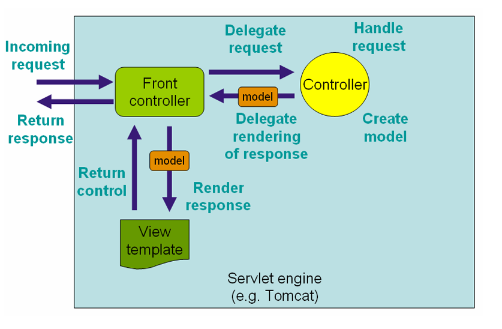

# SpringMVC分析

---

## 流程图



- front controller：前端控制器


## 组件分析

- web.xml：注册前端控制器，目的在于，我们希望让springmvc去处理所有的请求

  - 通过

    ```xml
    <!--servlet映射配置-->
    <servlet-mapping>
        <servlet-name>springmvc</servlet-name>
        <!--这里统一给我写斜杠-->
        <url-pattern>/</url-pattern>
    </servlet-mapping>
    ```

    确实是处理所有的请求（不是真的所有）

  - urlPattern的写法问题

    - /
    - /* （永远都不要这么写，）
    - *.do


### /*不能写的原因

请求/helloController过去的时候，它的视图名称是girl，girl.jsp页面，但它将其当作了一个叫做girl.jsp的请求，尝试去匹配对应的controller，但是我的容器当中根本不存在这样的controller，所以无法匹配，导致404问题。


### *.do的用法

这种方式，是有的团队习惯将请求的行为加个小尾巴用来区分，do行为，有些团队习惯用*.action

这种写法也可以处理多层/请求路径

```xml
<bean class="person.jzh.controller.HelloController" name="/hello/Controller.do"></bean>
```


### /用法

也是处理所有的请求，但与/*不一样，它处理完之后要出去的时候不会再去将这个girl.jsp当作一个新的请求，而是将这个渲染的结构直接返回给浏览器


## 前端控制器

---

springmvc的设计理念是希望开发者尽量远离原生的servletAPI，因为其不是很好用，比较繁琐，希望将操作进一步的简化，它将很多东西的责任进行了拆分，不希望我们将一些技术点绑定死，而是可以做到随意的切换。本身还是基于servlet设计的，是一个分发的servlet。


### springmvc配置文件名字的问题

默认情况下是用dispatcherServlet的名字当作命名空间

[servletName] -servlet.xml(WEB-INF)之下寻找。

[servletName] -servlet = namespace

将配置文件移动位置之后，会出现以下异常

```java
 Could not open ServletContext resource [/WEB-INF/springmvc-servlet.xml]
```

如果非要重新使用另一个名字

```xml
<servlet>
    <!--这里写的这个名字是有讲究的，
        如果我们不去修改spring配置文件默认的位置，那么
        它会去web-inf下面找一个叫做springmvc-servlet.xml的文件
    -->
    <servlet-name>springmvc</servlet-name>
    <servlet-class>org.springframework.web.servlet.DispatcherServlet</servlet-class>
    <init-param>
        <!--可以重新生成配置文件的名字-->
        <param-name>namespace</param-name>
        <param-value>mvc-servlet</param-value>
    </init-param>
</servlet>
```

默认的规则要求在web-inf下，但是maven项目的标准应该在resources下面，如何解决这下问题呢？

- 重新制定上下文的配置文件的位置即可

```xml
<init-param>
    <!--上下文配置的位置的制定-->
    <param-name>contextConfigLocation</param-name>
    <param-value>classpath:springmvc.xml</param-value>
</init-param>
```

此时是在类路径下寻找springmvc.xml这个配置文件，推荐使用这种


## 视图解析器

---

springmvc支持多种视图技术

- jsp
- freemaker（模板技术）

内部的资源视图解析器

- 视图前缀

  - /jsp/：它是我们的请求响应的资源的路径的配置 ,	viewname：girl ---->   /jsp/girl

  - ```java
    mav.setViewName("girl");
    ```

- 后缀

  - .jsp：此时我们的前缀+视图名称+后缀 = /jsp/girl.jsp

物理视图由逻辑视图转换而来

物理视图：webapp/jsp/girl.jsp


逻辑视图

- prefix：前缀
- logicViewName：视图名称
- suffix：后缀


## 控制器

是一种比较传统的实现一个接口的方式完成的，Controller

如果一个接口只有一个方法，这种接口叫做函数式接口

```java
@FunctionalInterface
public interface Controller {
   @Nullable
   ModelAndView handleRequest(HttpServletRequest request, HttpServletResponse response) throws Exception;

}
```

servlet里面由doGet,doPost里面入参就是请求与响应，而这个方法的入参也是一样的

设计为ModelAndView，在model当中填充数据，然后在具体的视图进行展示

还需要在配置文件当中配置一下这个bean，要取个名字，名字充当了这个请求的URL

```xml
<bean class="person.jzh.controller.HelloController" name="/hello/Controller.do"></bean>
```

它就处理一个请求，跟servlet差别不是很大