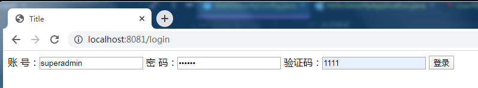
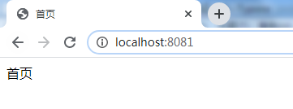
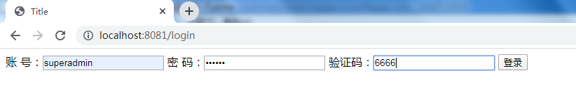
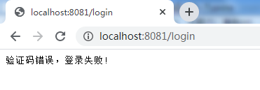
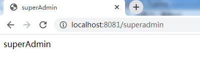
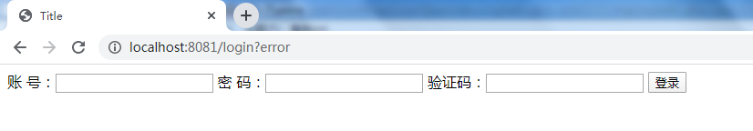

## 前言

阅读本文需要的基础知识：

- 掌握 `Java`
- 掌握 `SpringBoot`
- 能看懂 `HTML`
- 用过 `Spring Security` 框架

> 本文默认这篇文章的读者是有用过 `Spring Security` 框架的（~~这样我就不用从头说起~~）。


## 需求分析

`Security` 的前端非常的简单，只需要一个 `form` 表单把数据一提交就完事了。

```html
<form action="/login" method="post">
    <!-- 注意：这里账号名和密码名的 name 属性不要改 -->
    账号：<input type="text" name="username"/>
    密码：<input type="password" name="password"/>
    <button type="submit">登录</button>
</form>
```


如果只提交账号和密码怎么可能满足得了我们的需求呢？最起码也要加个验证码做人机识别吧。

```html
<form action="/login" method="post">
    <!-- 注意：这里账号名和密码名的 name 属性不要改 -->
    账  号：<input type="text" name="username"/>
    密  码：<input type="password" name="password"/>
    验证码：<input type="text" name="code"/>
    <button type="submit">登录</button>
</form>
```


那么问题来了，后端的 `Security` 只需要重写 `UserDetailsService` 接口，给框架提供数据库查询到的用户数据即可。但问题是这个接口只有一个入参，默认是表单中 `name` 属性为 `username` 的 `value` 值。

```java
public interface UserDetailsService {
    // 方法名字一目了然了，加载用户通过用户名，也就是说 var1 就是 用户名 username
    UserDetails loadUserByUsername(String var1) throws UsernameNotFoundException;
}
```


## 解决方案

### 方案一

Security 作为一款功能强大的权限框架，当然也提供了自定义认证方式。

回到前面表单那里，为什么账号的 `name` 属性写死 `username` 不能改呢？原因在 `UsernamePasswordAuthenticationFilter`  这个类上。

```java
public class UsernamePasswordAuthenticationFilter extends AbstractAuthenticationProcessingFilter {
    // ...省略部分源码
    private String usernameParameter = "username";
    private String passwordParameter = "password";
    public Authentication attemptAuthentication(HttpServletRequest request, HttpServletResponse response) throws AuthenticationException {
       // ...
       String username = this.obtainUsername(request);
       String password = this.obtainPassword(request);
       // ...
    }
}
```


很明显，这个 `filter` 是负责获取表单信息并处理，如果你需要完全自定义（比如用手机登录，`username` 就改成 `phone`），只需要重写这个类的方法即可，本文目的在于扩展其它参数，所以只需要继承 `UsernamePasswordAuthenticationFilter` 并重写 `UsernamePasswordAuthenticationFilter` 方法即可。当然，如果想完全改变也可以继承 `AbstractAuthenticationProcessingFilter` 类并重写即可。

```java
/**
 * @author jzh
 * @version 1.0.0
 * @date 2020/4/24 22:20
 * @description
 */
public class ExUsernamePasswordAuthenticationFilter extends UsernamePasswordAuthenticationFilter {
    
    public ExUsernamePasswordAuthenticationFilter(AuthenticationManager authenticationManager) {
        this.setAuthenticationManager(authenticationManager);
        // 使用跳转至指定url的处理方法来处理错误（认证失败）
        // setAuthenticationFailureHandler(new SimpleUrlAuthenticationFailureHandler("/login?error"));
        // 也可以直接向前端返回错误信息
        setAuthenticationFailureHandler(new AuthenticationFailureHandler() {
            @Override
            public void onAuthenticationFailure(HttpServletRequest request, HttpServletResponse response, AuthenticationException e) throws IOException, ServletException {
                String error = (String) request.getAttribute("error");
                response.setContentType("application/json;charset=utf-8");
                response.getWriter().write(error + "登录失败!");
            }
        });
    }
    @Override
    public Authentication attemptAuthentication(HttpServletRequest request, HttpServletResponse response) throws AuthenticationException {
        // 拦截登录的 form 表单路径
        if ("POST".equalsIgnoreCase(request.getMethod())) {
            // 获取表单提交的验证码
            String code = request.getParameter("code");
            // 方便测试，这里写死，正常应该写业务处理过程
            if (!"1111".equals(code)) {
                request.setAttribute("error", "验证码错误，");
                throw new ValidateCodeException("验证码错误");
            }
        }
        // 处理完自定义参数，就让 UsernamePasswordAuthenticationFilter 继续处理账号和密码，当然，也可以自定义
        return super.attemptAuthentication(request, response);
    }
}
```


然后再重写 `WebSecurityConfigurerAdapter` 的配置方法

```java
/**
 * @author jzh
 * @version 1.0.0
 * @date 2020/2/29 14:48
 * @description Security 配置
 */
@Configuration
@EnableGlobalMethodSecurity(prePostEnabled = true)
public class WebSecurityConfig extends WebSecurityConfigurerAdapter {
    @Bean
    @Override
    public UserDetailsService userDetailsService() {
        return new UserDetailsServiceImpl();
    }

    @Bean
    public PasswordEncoder passwordEncoder() {
        return new BCryptPasswordEncoder();
    }

    @Bean
    public UsernamePasswordAuthenticationFilter usernamePasswordAuthenticationFilter() throws Exception {
        // 一定要通过 WebSecurityConfigurerAdapter.authenticationManager() 方法获取 AuthenticationManager 给 AbstractAuthenticationProcessingFilter，不然会报空指针异常
        // 如果使用 WebSecurityConfigurerAdapter.authenticationManagerBean() 方法获取 AuthenticationManager，会报栈溢出异常，会在 org.springframework.security.authentication.ProviderManager#authenticate 这个方法中疯狂调用自己造成死循环然后栈溢出，因为对 Security 源码了解还不深，不清楚问题所在，此处留坑
        return new ExUsernamePasswordAuthenticationFilter(authenticationManager());
    }

    /**
     * 配置 userDetails 的数据源，密码加密格式
     *
     * @param auth
     * @throws Exception
     */
    @Override
    protected void configure(AuthenticationManagerBuilder auth) throws Exception {
        auth.userDetailsService(userDetailsService())
                .passwordEncoder(passwordEncoder())
                .and()
                // 自定义 AuthenticationProvider，实际使用可以去掉
                .authenticationProvider(new UserAuthenticationProviderImpl(userDetailsService(), passwordEncoder()));
    }

    /**
     * 配置放行的资源
     *
     * @param http
     * @throws Exception
     */
    @Override
    protected void configure(HttpSecurity http) throws Exception {
        http
                // 关闭跨域
                .csrf()
                .disable()
                .exceptionHandling()
//                .authenticationEntryPoint(restAuthenticationEntryPoint)
                .and()
                .authorizeRequests()
                .antMatchers("/superadmin").hasRole("SUPERADMIN")
                .antMatchers("/user", "/admin").hasRole("ADMIN")
                .and()
                // 将自定义的 usernamePasswordAuthenticationFilter 代替原来的 UsernamePasswordAuthenticationFilter
                .addFilterAt(usernamePasswordAuthenticationFilter(), UsernamePasswordAuthenticationFilter.class)
                .formLogin().loginPage("/login").failureUrl("/login?error").defaultSuccessUrl("/")
                .and()
                .logout().logoutUrl("/logout").logoutSuccessUrl("/");
    }
}
```


然后运行项目开始测试






然后验证码输错再登录一次






### 方案二

如果不想重写 `attemptAuthentication`，也可以使用 `filter` 进行过滤拦截。

```java
/**
 * @author jzh
 * @version 1.0.0
 * @date 2020/3/25 19:51
 * @description security验证码过渡器，用于校验验证码是否正确
 */
public class ValidateCodeFilter extends AbstractAuthenticationProcessingFilter {
    //拦截的url
    private String processUrl;
    /**
     *
     * @param defaultFilterProcessesUrl     默认拦截的路径
     * @param failureUrl                    验证失败返回的路径
     */
    public ValidateCodeFilter(String defaultFilterProcessesUrl, String failureUrl) {
        super(defaultFilterProcessesUrl);
        this.processUrl = defaultFilterProcessesUrl;
        // 设置认证失败（错误）的处理器
        setAuthenticationFailureHandler(new SimpleUrlAuthenticationFailureHandler(failureUrl));
    }
    @Override
    public void doFilter(ServletRequest request, ServletResponse response, FilterChain chain) throws IOException, ServletException {
        HttpServletRequest req = (HttpServletRequest) request;
        HttpServletResponse resp = (HttpServletResponse) response;
        // 拦截登录的 form 表单路径
        if (processUrl.equals(req.getServletPath()) && "POST".equalsIgnoreCase(req.getMethod())) {
            // 获取表单提交的验证码
            String code = req.getParameter("code");
            // 方便测试，这里写死
            if (!"1111".equals(code)) {
                // 验证失败，交给 SimpleUrlAuthenticationFailureHandler 解决
                this.getFailureHandler().onAuthenticationFailure(req, resp, new ValidateCodeException("验证码错误"));
                // 打断过滤器链
                return;
            }
        }
        // 放行
        chain.doFilter(request, response);
    }
    @Override
    public Authentication attemptAuthentication(HttpServletRequest httpServletRequest, HttpServletResponse httpServletResponse) throws AuthenticationException, IOException, ServletException {
        return null;
    }
}
```


那么如何去用呢？

注意，这个 `filter` 和方案一不同，因为没有重写 `attemptAuthentication`，所以不能直接覆盖 `UsernamePasswordAuthenticationFilter`，而应该放在 `UsernamePasswordAuthenticationFilter` 前面，由于过滤链的设计，如果验证码不对则会被 `ValidateCodeFilter` 拦截并返回错误信息；如果验证码正确，则通过 `chain.doFilter(request, response)` 方法放行，并调用 `UsernamePasswordAuthenticationFilter`  进行后续的用户名密码验证操作。 

```java
/**
 * @author jzh
 * @version 1.0.0
 * @date 2020/2/29 14:48
 * @description Security 配置
 */
@Configuration
@EnableGlobalMethodSecurity(prePostEnabled = true)
public class WebSecurityConfig extends WebSecurityConfigurerAdapter {
    @Bean
    @Override
    public UserDetailsService userDetailsService() {
        return new UserDetailsServiceImpl();
    }

    @Bean
    public PasswordEncoder passwordEncoder() {
        return new BCryptPasswordEncoder();
    }

    @Bean
    public UsernamePasswordAuthenticationFilter usernamePasswordAuthenticationFilter() throws Exception {
        // 一定要通过 WebSecurityConfigurerAdapter.authenticationManager() 方法获取 AuthenticationManager 给 AbstractAuthenticationProcessingFilter，不然会报空指针异常
        // 如果使用 WebSecurityConfigurerAdapter.authenticationManagerBean() 方法获取 AuthenticationManager，会报栈溢出异常，会在 org.springframework.security.authentication.ProviderManager#authenticate 这个方法中疯狂调用自己造成死循环然后栈溢出，因为对 Security 源码了解还不深，不清楚问题所在，此处留坑
        return new ExUsernamePasswordAuthenticationFilter(authenticationManager());
    }

    /**
     * 配置 userDetails 的数据源，密码加密格式
     *
     * @param auth
     * @throws Exception
     */
    @Override
    protected void configure(AuthenticationManagerBuilder auth) throws Exception {
        auth.userDetailsService(userDetailsService())
                .passwordEncoder(passwordEncoder())
                .and()
                // 自定义 AuthenticationProvider，实际使用可以去掉
                .authenticationProvider(new UserAuthenticationProviderImpl(userDetailsService(), passwordEncoder()));
    }

    /**
     * 配置放行的资源
     *
     * @param http
     * @throws Exception
     */
    @Override
    protected void configure(HttpSecurity http) throws Exception {
        http
                // 关闭跨域
                .csrf()
                .disable()
                .exceptionHandling()
//                .authenticationEntryPoint(restAuthenticationEntryPoint)
                .and()
                .authorizeRequests()
                .antMatchers("/superadmin").hasRole("SUPERADMIN")
                .antMatchers("/user", "/admin").hasRole("ADMIN")
                .and()
                // 这里是关键，通过这里将自己写的 Filter 放到 UsernamePasswordAuthenticationFilter 前面，进行验证码判断
                .addFilterBefore(new ValidateCodeFilter("/login", "/login?error"), UsernamePasswordAuthenticationFilter.class)
                .formLogin().loginPage("/login").failureUrl("/login?error").defaultSuccessUrl("/")
                .and()
                .logout().logoutUrl("/logout").logoutSuccessUrl("/");
    }
}

```

测试一下，验证码正确



验证码错误

