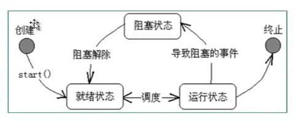
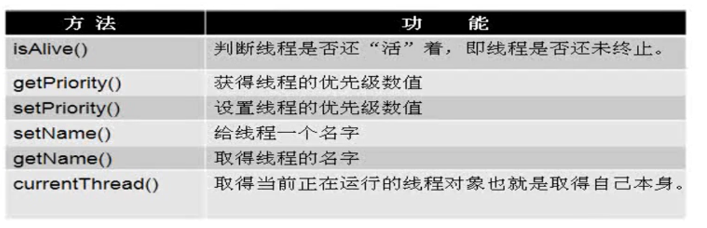
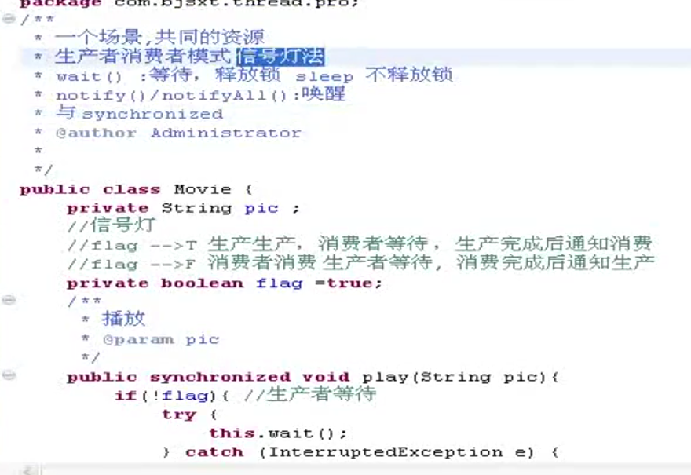

# 线程创建

## 1、继承Tread+run()

启动：创建子类对象+对象。start()

## 2、实现Runable+run(）...接口

启动：使用静态方法


​	1、创建真实角色 user

​	2、创建代理角色 Thread+应用  。代理角色等于Thread th =new thread(user)，，，，代理角色帮真实角色做事

​	3、代理角色   .start()  方法来代理运行


## 推荐使用接口：

1、避免单继承 局限性

2、便于共享资源

## 了解


​		


# 线程状态

****

 1、新生状态 2、就绪状态 3、运行状态 4、就绪状态  5、死亡状态


## 停止线程

1.自然终止：线程体正常执行完毕

2.外部干涉：

​	1）线程类中 定义 线程体使用的标志

​	2）线程体使用该标志

​	3）提供对外的方法改变标识

​	4)外部根据条件调用该方法即可


## 阻塞

1.join：合并线程

2.yield:暂停自己的线程，静态方法

3.sleep：休眠，不会释放锁

​	1）与时间相关

​	2）模拟网络延时

​	3）


# 基本信息



# 线程的同步：并发

多个线程访问同一份资源，确保资源安全----------->线程安全         synchronize--->同步       ==钥匙，拥有它才能开门


一、同步块

synchronized（引用类型 | this |  类.class）{

​	}

锁定范围要正确

锁定资源要正确

二、同步方法

synchronized

三、死锁：过多的同步容易造成死锁


四、生产者和消费者模式

一个场景，共同的资源

1.信号灯法：

wait():等待，释放锁

sleep 不释饭锁

notify()/notifyall():唤醒，与synchronize一起使用

pic是生产物

flag是灯

movie是资源




# 调度


schedule的参数

（调度的内容，在什么时间点调度，隔多少时间调度一次）两个参数则只调度一次

``` java
  public static void main(String[] args){
        Timer timer =new Timer();
        timer.schedule(
        new TimerTask(){
            @Override
            public void run() { System.out.println("so easy.......");}
        },
        new Date(System.currentTimeMillis()+1000),
                200                             
        );

```

# 总结


