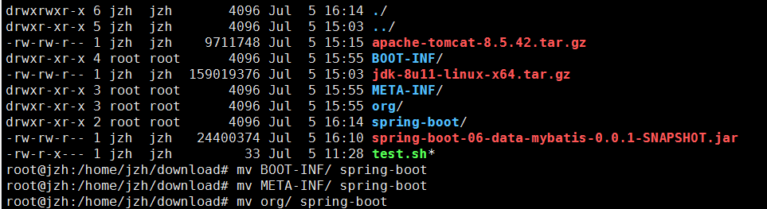
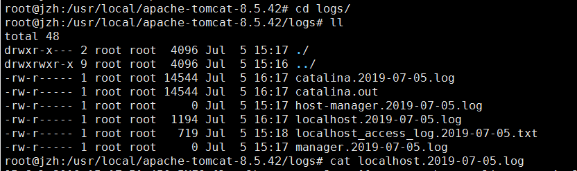
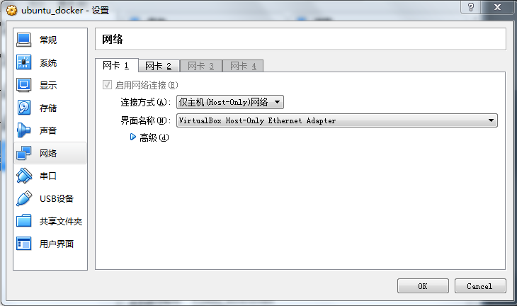
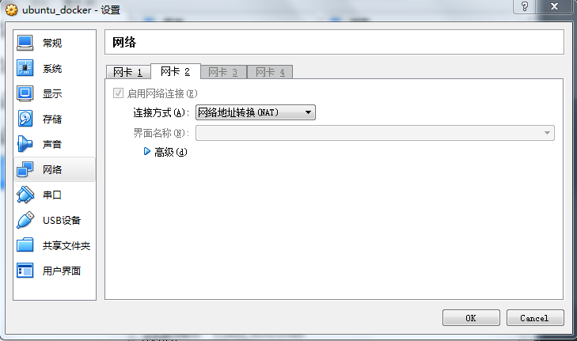
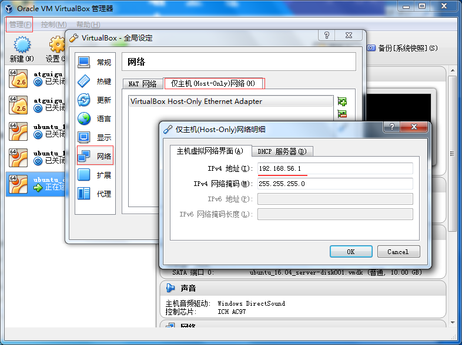
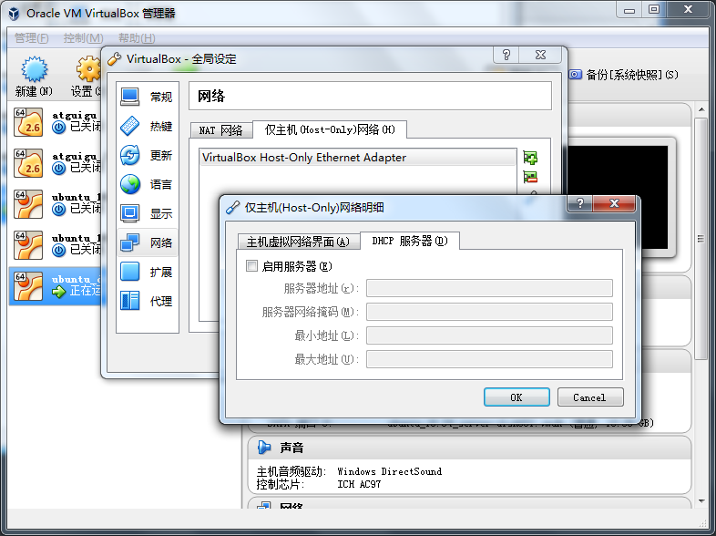
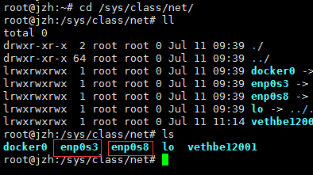
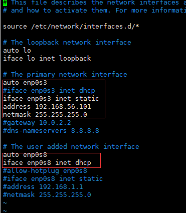

# ubuntu


## 操作文件目录

| 命令  | 说明                               | 语法                                            | 参数  | 参数说明                           |
| :---- | :--------------------------------- | :---------------------------------------------- | :---- | :--------------------------------- |
| ls    | 显示文件和目录列表                 | ls [-alrtAFR] [name...]                         |       |                                    |
|       |                                    |                                                 | -l    | 列出文件的详细信息                 |
|       |                                    |                                                 | -a    | 列出当前目录所有文件，包含隐藏文件 |
| mkdir | 创建目录                           | mkdir [-p] dirName                              |       |                                    |
|       |                                    |                                                 | -p    | 父目录不存在情况下先生成父目录     |
| cd    | 切换目录                           | cd [dirName]                                    |       |                                    |
| touch | 生成一个空文件                     |                                                 |       |                                    |
| echo  | 生成一个带内容文件                 | echo abcd > 1.txt，echo 1234 >> 1.txt           |       |                                    |
| cat   | 显示文本文件内容                   | cat [-AbeEnstTuv] [--help] [--version] fileName |       |                                    |
| cp    | 复制文件或目录                     | cp [options] source dest                        |       |                                    |
| rm    | 删除文件                           | rm [options] name...                            |       |                                    |
|       |                                    |                                                 | -f    | 强制删除文件或目录                 |
|       |                                    |                                                 | -r    | 同时删除该目录下的所有文件         |
| mv    | 移动文件或目录                     | mv [options] source dest                        |       |                                    |
| find  | 在文件系统中查找指定的文件         |                                                 |       |                                    |
|       |                                    |                                                 | -name | 文件名                             |
| grep  | 在指定的文本文件中查找指定的字符串 |                                                 |       |                                    |
| tree  | 用于以树状图列出目录的内容         |                                                 |       |                                    |
| pwd   | 显示当前工作目录                   |                                                 |       |                                    |
| ln    | 建立软链接（快捷方式）             |                                                 |       |                                    |
| more  | 分页显示文本文件内容               |                                                 |       |                                    |
| head  | 显示文件开头内容                   |                                                 |       |                                    |
| tail  | 显示文件结尾内容                   |                                                 |       |                                    |
|       |                                    |                                                 | -f    | 跟踪输出                           |


## 系统管理命令

| 命令     | 说明                                         |
| :------- | :------------------------------------------- |
| stat     | 显示指定文件的相关信息,比ls命令显示内容更多  |
| who      | 显示在线登录用户                             |
| hostname | 显示主机名称                                 |
| uname    | 显示系统信息                                 |
| top      | 显示当前系统中耗费资源最多的进程             |
| ps       | 显示瞬间的进程状态                           |
| du       | 显示指定的文件（目录）已使用的磁盘空间的总量 |
| df       | 显示文件系统磁盘空间的使用情况               |
| free     | 显示当前内存和交换空间的使用情况             |
| ifconfig | 显示网络接口信息                             |
| ping     | 测试网络的连通性                             |
| netstat  | 显示网络状态信息                             |
| clear    | 清屏                                         |
| kill     | 杀死一个进程                                 |

例：


## 开关机命令

| 命令     | 语法                                            | 参数       | 参数说明                                                     |
| :------- | :---------------------------------------------- | :--------- | :----------------------------------------------------------- |
| shutdown | shutdown [-t seconds] [-rkhncfF] time [message] |            |                                                              |
|          |                                                 | -t seconds | 设定在几秒钟之后进行关机程序                                 |
|          |                                                 | -k         | 并不会真的关机，只是将警告讯息传送给所有只用者               |
|          |                                                 | -r         | 关机后重新开机（重启）                                       |
|          |                                                 | -h         | 关机后停机                                                   |
|          |                                                 | -n         | 不采用正常程序来关机，用强迫的方式杀掉所有执行中的程序后自行关机 |
|          |                                                 | -c         | 取消目前已经进行中的关机动作                                 |
|          |                                                 | -f         | 关机时，不做 fcsk 动作(检查 Linux 档系统)                    |
|          |                                                 | -F         | 关机时，强迫进行 fsck 动作                                   |
|          |                                                 | time       | 设定关机的时间                                               |
|          |                                                 | message    | 传送给所有使用者的警告讯息                                   |


### 重启

- reboot
- shutdown -r now

### 关机

- shutdown -h now


## 压缩命令

### tar

| 命令 | 语法                                        | 参数 | 参数说明                        |
| :--- | :------------------------------------------ | :--- | :------------------------------ |
| tar  | tar [-cxzjvf] 压缩打包文档的名称 欲打包目录 |      |                                 |
|      |                                             | -c   | 建立一个归档文件的参数指令      |
|      |                                             | -x   | 解开一个归档文件的参数指令      |
|      |                                             | -z   | 是否需要用 gzip 压缩            |
|      |                                             | -j   | 是否需要用 bzip2 压缩           |
|      |                                             | -v   | 压缩的过程中显示文件            |
|      |                                             | -f   | 使用档名，在 f 之后要立即接档名 |
|      |                                             | -tf  | 查看归档文件里面的文件          |

**例子：**

- 压缩文件夹：`tar -zcvf test.tar.gz test\`
- 解压文件夹：`tar -zxvf test.tar.gz`


### gzip

| 命令 | 语法                               | 参数 | 参数说明                                                     |
| :--- | :--------------------------------- | :--- | :----------------------------------------------------------- |
| gzip | gzip [选项] 压缩（解压缩）的文件名 |      |                                                              |
|      |                                    | -d   | 解压缩                                                       |
|      |                                    | -l   | 对每个压缩文件，显示压缩文件的大小，未压缩文件的大小，压缩比，未压缩文件的名字 |
|      |                                    | -v   | 对每一个压缩和解压的文件，显示文件名和压缩比                 |
|      |                                    | -num | 用指定的数字num调整压缩的速度，-1或--fast表示最快压缩方法（低压缩比），-9或--best表示最慢压缩方法（高压缩比）。系统缺省值为6 |

说明：压缩文件后缀为 gz


### bzip2

| 命令  | 语法         | 参数 | 参数说明                                                     |
| :---- | :----------- | :--- | :----------------------------------------------------------- |
| bzip2 | bzip2 [-cdz] |      |                                                              |
|       |              | -d   | 解压缩                                                       |
|       |              | -z   | 压缩参数                                                     |
|       |              | -num | 用指定的数字num调整压缩的速度，-1或--fast表示最快压缩方法（低压缩比），-9或--best表示最慢压缩方法（高压缩比）。系统缺省值为6 |

说明：压缩文件后缀为 bz2


## [ubuntu16.04设置静态ip方法](https://www.cnblogs.com/Glf9832/p/8665086.html)

ubuntu16.04设置静态ip方法：

$ sudo vim /etc/network/interfaces

auto ens33 　　　　　　　   # 使用的网络接口，之前查询接口是为了这里
​     

iface enp0s3 inet static 　　   # enp0s3这个接口，使用静态ip设置
     

address 192.168.2.136 　　  # 设置ip地址为192.168.2.136
​     

netmask 255.255.255.0        # 设置子网掩码
​     

gateway 192.168.2.1            # 设置网关
​     

dns-nameservers 8.8.8.8      # 设置dns服务器地址

$ sudo ip addr flush enp0s3	# 刷新IP   

$ sudo systemctl restart networking.service

$ sudo reboot

 

注：若连接错误，使用以下操作：

$ sudo vim /etc/NetworkManager/NetworkManager.conf

​     managed = true

$ sudo service network-manager restart


## 各种服务重启

### mysql

service mysql restart

授权 root 用户允许所有人连接

```
grant all privileges on *.* to 'root'@'%' identified by '123';
```


### tomcat

启动

```
/usr/local/tomcat/bin/startup.sh
```


停止

```
/usr/local/tomcat/bin/shutdown.sh
```


## 将项目放到ubuntu下运行

- 先将项目打包，通过xftp传到ubuntu

- 将项目解压

  - ```
    unzip spring-boot-06-data-mybatis-0.0.1-SNAPSHOT.jar 
    ```

- 将解压后的文件复制到一个文件夹下

  - 

- 将spring-boot文件夹移动到tomcat里

  -  mv spring-boot /usr/local/apache-tomcat-8.5.42/webapps/

- 启动tomcat

  - 

- 查看日志

  - 


## 双网卡配置

- 先给虚拟机启动第二张网卡，同时第一张网卡设置成仅主机，第二张设置成nat

  - 
  - 

- 将vbox的全局设置里的仅主机ip地址修改一下

  - 

- 同时将旁边的dhcp服务关闭掉

  - 

- 进入ubuntu，到/sys/class/net/目录下查看网卡是否存在

  - 

- 此时我们可以通过ifup激活enp0s8

  - 

- 修改网卡为静态获取ip地址（vi /etc/network/interfaces）

  - 

- 最后重启网卡

  - ```
    systemctl restart networking.service
    ```


## docker配置mysql时使用路径映射报错

```
docker run -p 3306:3306 --name mysql \
-v /usr/local/docker/mysql/conf:/etc/mysql \
-v /usr/local/docker/mysql/logs:/var/log/mysql \
-v /usr/local/docker/mysql/data:/var/lib/mysql \
-e MYSQL_ROOT_PASSWORD=123 \
-d mysql
```

通过以上命令创建mysql容器时，会报[docker mysql mysqld: Error on realpath() on '/var/lib/mysql-files' No such file or directory](https://www.cnblogs.com/s1956/p/9997691.html)

当指定了外部配置文件与外部存储路径时，也需要指定 /var/lib/mysql-files的外部目录，

　　所以在 主机新建/home/mysql/mysql-files目录，

　　在启动容器时 需要加上

```
　　-v /home/mysql/mysql-files:/var/lib/mysql-files/
```

即

```
docker run -p 3306:3306 --name mysql \
-v /usr/local/docker/mysql/conf:/etc/mysql \
-v /usr/local/docker/mysql/logs:/var/log/mysql \
-v /usr/local/docker/mysql/mysql-files:/var/lib/mysql-files/
-v /usr/local/docker/mysql/data:/var/lib/mysql \
-e MYSQL_ROOT_PASSWORD=123 \
-d mysql
```


## 开启root账号登陆

```
sudo su
vim /etc/ssh/sshd_config

# 在 sshd_config 文件里的 “Authentication” 部分加上以下内容
PermitRootLogin yes
# 完成以后退出 vim 并保存

service sshd restart # 重启 ssh 服务以应用更改
passwd root # 直接修改 Root 用户的密码
```

这样重新登陆 ssh 就可以用 Root 登陆了。

