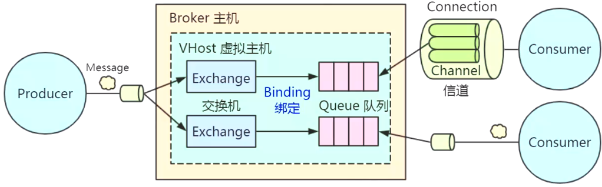
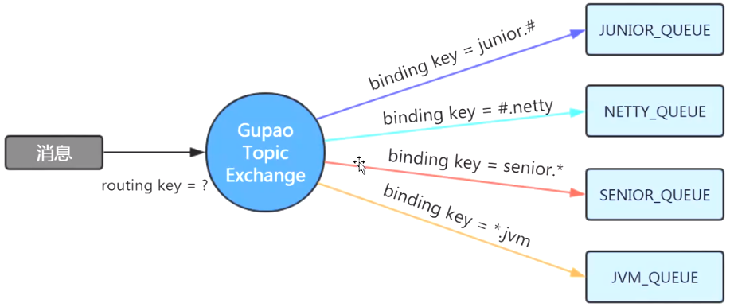
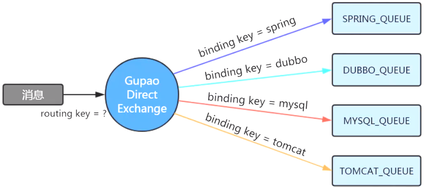
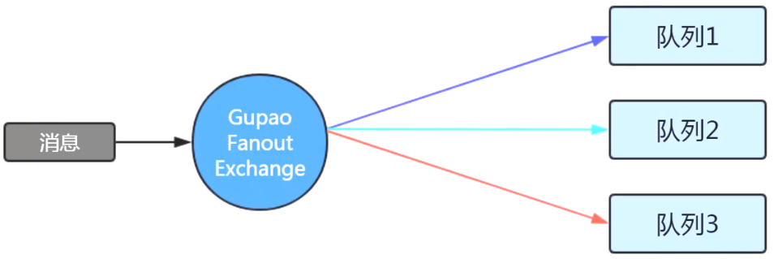
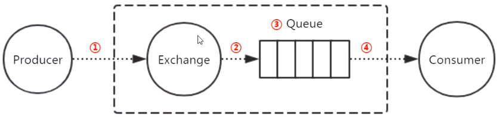
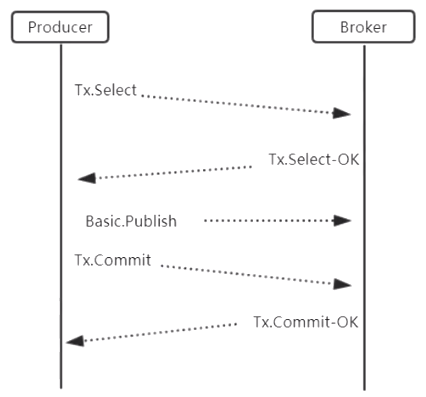
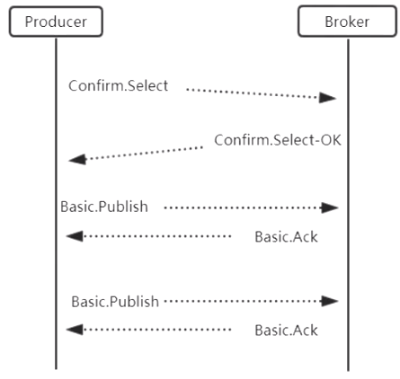

- MQ：Message Queue
- JMS：Java Message Service
- AMQP：Advanced Message Queue Protocol

RabbitMQ工作模型

消息类型

- headers
- Topic：主题
  - 
- Direct：直连
  - 
  - #：0个或者多个单词
  - *：1个单词
- Fanout：广播
  - 

### Spring Boot 整合 RabbitMQ

- 配置类：创建交换机、创建队列、创建绑定关系
- 消费者：监听类（监听队列）
- 生产者：调用template发送消息（Exchange）
- 服务器信息配置

### 消息可靠性投递分析

- 确保消息成功发送到RabbitMQ服务器
  - 事务模式
    - 
  - 确认模式
    - 
- 确保消息路由到正确的队列
- 确保消息在队列正确地存储
- 确保消息从队列正确地投递到消费者
- 其他
  - 确认
    - 给生产者发一条应答消息
    - 生产者定义回调API
  - 补偿
  - 消息幂

