## 通过一道面试题了解 Integer 的实现


> `题目：`编写一个方法交换两个 Integer 对象的值

这道题咋一看好像挺简单的，然后

```java
/**
 * @author jzh
 * @version 1.0.0
 * @date 2020/4/7 17:15
 * @description 如何交换两个 Integer 的值
 */
public class IntegerSwap {
    public static void main(String[] args) {
        Integer a = 1, b = 2;
        System.out.println("before: a = " + a + ", b = " + b);
        swap(a, b);
        System.out.println("after: a = " + a + ", b = " + b);
    }

    public static void swap(Integer i1, Integer i2) {
        Integer tmp = i1;
        i1 = i2;
        i2 = tmp;
    }
}
```

然后你会发现这运行结果不对

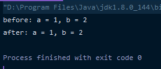

你肯定会觉得这不是引用传递吗，我明明改变了引用对象的值，为什么不能改变原对象的值呢？


### Java 到底是引用传递还是值传递？

这里就涉及到了 Java 的一个基础问题，那就是 Java 到底是引用传递还是值传递？

实际上 Java 只有一种参数传递机制，那就是值传递（具体是为什么自行百度哈），至于为什么会有这样一个问题，是因为这取决于变量的类型。

变量类型分为基本类型和引用类型，无论是哪种类型，它传递到方法的时候，处理两种类型传递的底层方法是相同的，都是按照值去传递。只是根据这两种类型的不同，如果传递的是基本类型，那么函数接收的是原始值的副本，因此这个方法改变的值只改变了副本的值，而原始值不变；而如果传递的是引用类型的时候，那函数接收的是原始引用类型的内存地址而不是值的副本，因此如果这个函数修改了这个入参的话就会改变原本值的地址去影响到我们原本要传入的值。

既然引用类型的传递是传地址的话，那么为什么 Integer 却无法修改原参数地址呢？

因为在 Java 中，这种基本类型的封装引用类型传递的副本而不是地址。

这是为什么呢？

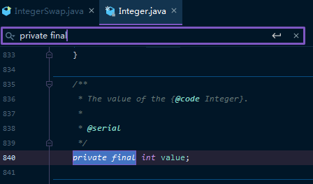

在 Integer 的实现中我们可以发现，它的 value 值是用 final 进行修饰的，这意味着值根本无法被改变。我们只能通过改变它的副本来改变它的值。

我们可以通过画图来进一步了解

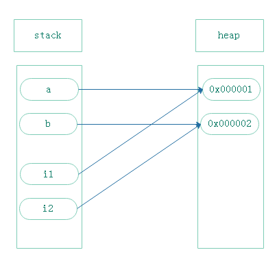

假设 a、b 在堆中的地址是如上图所示的，因为 i1、i2 实际上是 a、b 的副本，这也就意味着 i1、i2 会在栈中重新定义这两个局部变量，然后它们分别指向了 a 和 b 的地址。

当运行 swap() 方法的时候

```java
public static void swap(Integer i1, Integer i2) {
    Integer tmp = i1;
    i1 = i2;
    i2 = tmp;
}
```

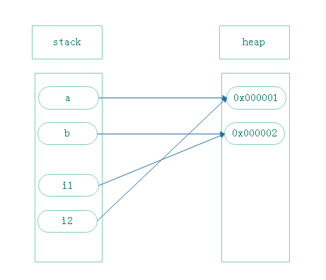

我们会发现，地址确实变了，但改变的是这两个局部变量，而原始的两个参数 a 和 b 则并没有因此而发生改变。


基于上述理论，我们如果想要改变这两个地址的值，唯一的办法就是通过反射来进行实现。

```java
public static void swap(Integer i1, Integer i2) throws NoSuchFieldException, IllegalAccessException {
    Field field = Integer.class.getDeclaredField("value");
    field.setAccessible(true);
    int tmp = i1.intValue();
    field.set(i1, i2.intValue());
    field.set(i2, tmp);
}
```

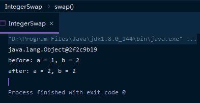

但我们会发现结果好像不对，这里面就涉及到了 Java 的装箱机制了。


### 自动装箱

```java
Integer a = 1;
```

在上述例子我们不难发现，等号左边是引用类型，而等号右边是基本类型，为什么编译的时候不报错？这里就涉及到了装箱操作。

那么什么是装箱呢？我们可以通过字节码文件来进行分析

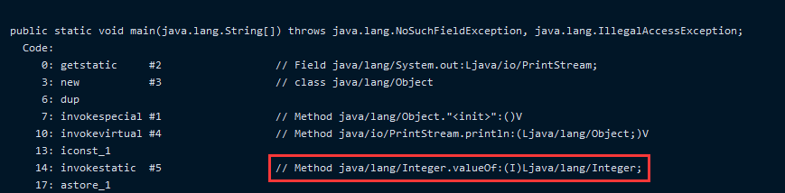

这里使用了Integer.valueOf()方法进行了装箱操作

这也就意味着

```java
Integer a = 1  相当于  Integer a = Integer.valueOf(1);
```

那么让我们看看这个方法到底做了什么？


### 缓存

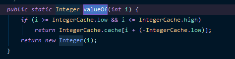

通过名字不难发现，IntegerCache 是一个缓存，如果入参 i 在 low~high 之间，则会从缓存中返回值

那现在让我们看看这个缓存又做了什么样的事情？

```java
private static class IntegerCache {
    static final int low = -128;
    static final int high;
    static final Integer cache[];

    static {
        // high value may be configured by property
        int h = 127;
        String integerCacheHighPropValue =
            sun.misc.VM.getSavedProperty("java.lang.Integer.IntegerCache.high");
        if (integerCacheHighPropValue != null) {
            try {
                int i = parseInt(integerCacheHighPropValue);
                i = Math.max(i, 127);
                // Maximum array size is Integer.MAX_VALUE
                h = Math.min(i, Integer.MAX_VALUE - (-low) -1);
            } catch( NumberFormatException nfe) {
                // If the property cannot be parsed into an int, ignore it.
            }
        }
        high = h;
        cache = new Integer[(high - low) + 1];
        int j = low;
        for(int k = 0; k < cache.length; k++)
            cache[k] = new Integer(j++);
        
        // range [-128, 127] must be interned (JLS7 5.1.7)
        assert IntegerCache.high >= 127;
    }
    private IntegerCache() {}
}
```

通过上述原码不难发现，这是个匿名内部类，在调用它时，会首先进行初始化，并将 -128~127 生成对象并保存至缓存中。这也就意味着，在运行的时候， -128~127 之间的内存地址值已经是被占用了。这样做的好处是提升了运行效率，因为我们平常最常用的整数一般都在 -128~127 之间，同时也减少了内存的分配 。 

我们来验证下：

```java
Integer i1 = 1;			   		   // Integer i1 = Integer.valueOf(1);
Integer i2 = 1;					   // Integer i2 = Integer.valueOf(1);
System.out.println(i1 == i2);		// true
```

按照 Java 的对象对比的原理，两个对象直接用 `==` 比较的是对象的地址是否相等，那么按理来说 i1 应该不等于 i2，但因为这里用的是装箱操作，数值1会从缓存中获取已经分配好的地址，所以 i1 和 i2 这两个引用变量所指向的都是同一个地址，所以在这里 i1 == i2。

那么当我们使用的数值超过 -128~127 的范围会怎样呢？

```java
Integer i1 = 129;			   		    // Integer i1 = Integer.valueOf(129);
Integer i2 = 129;					   // Integer i2 = Integer.valueOf(129);
System.out.println(i1 == i2);			// false
```

此时，`Integer.valueOf`会返回一个 `new`的对象

```java
public static Integer valueOf(int i) {
        if (i >= IntegerCache.low && i <= IntegerCache.high)
            return IntegerCache.cache[i + (-IntegerCache.low)];
        return new Integer(i);
    }
```

凡是带`new`的都是重新分配内存地址，所以这两个对象就不会指向同一个地址，即 `==` 会返回 false。这也是为什么基本数据类型比较用 `==`，而包装类型比较用 `equals`方法的原因。

```java
Integer i1 = 129;			   		  // Integer i1 = Integer.valueOf(129); ==> new Integer(129)
Integer i2 = 129;					  // Integer i2 = Integer.valueOf(129); ==> new Integer(129)
System.out.println(i1 == i2);		   // false
System.out.println(i1.equals(i2));	   // true
```


那让我们回到刚刚的问题


通过上面的装箱机制和缓存操作，我们就能够解释为什么会出现上图的情况了。

首先是`field.set()`方法，点进去会发现，这个方法的入参是`Object`类型

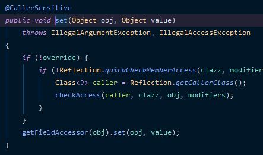

那既然是对象，那么基本数据类型传入就会触发装箱操作

```java
field.set(i1, i2.intValue());  =>  field.set(i1, Integer.valueOf(i2.intValue()));
field.set(i2, tmp);			  =>  field.set(i2, Integer.valueOf(tmp));
```

然后 i2 对应的 2 会从 `IntegerCache` 缓存中获取，i1 本身指向的就是缓存中 `1` 的地址，通过反射机制会将缓存中 `1` 的地址重新指向了缓存中 `2` 的地址，此时，`IntegerCache` 缓存中 `1` 和 `2` 的地址所指向的数据是一样的，都是 `1`。

这时 `field.set(i2, tmp)` 中的 `tmp` 由于是基本数据类型进行了装箱操作，从缓存中获取数值 `1` 所对应的缓存地址，但是这个缓存地址的数据因为被改变过，所以此时 `Integer.valueOf(tmp)` 返回的值是2。

这里说的可能有点绕，我们通过画图来解释，首先一开始应该是这样的。

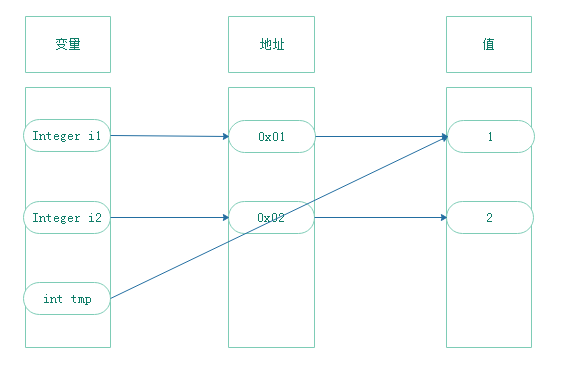

此时运行 `field.set(i1, i2.intValue())` 这行代码触发装箱操作，同时修改缓存中原本指向`1`的地址指向了`2` 。

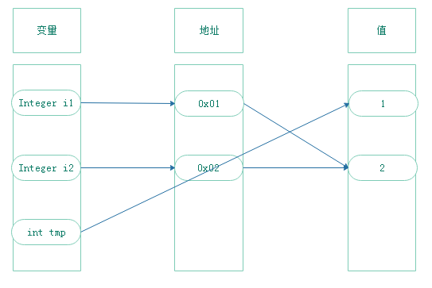

此时运行 `field.set(i2, tmp)` 这行代码，tmp 也触发了装箱操作，从 `IntegerCache` 缓存中获取对象。

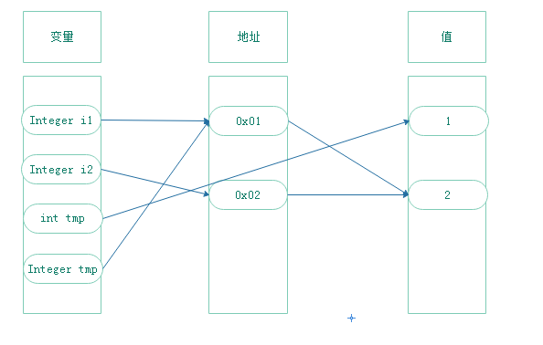

因为缓存中 `0x01` 地址所指向的值被改成了 `2`，所以 `Integer tmp` 从缓存取的对象的值也是 `2` 。

所以这里会出问题就是因为走了缓存，那么我们只需要不走缓存，不走装箱即可。

这里提供两个方法

1. `Integer tmp = new Integer()` 

```java
public static void swap(Integer i1, Integer i2) throws NoSuchFieldException, IllegalAccessException {
    Field field = Integer.class.getDeclaredField("value");
    field.setAccessible(true);
    Integer tmp = new Integer();
    field.set(i1, i2.intValue());
    field.set(i2, tmp);
}
```

这样 `tmp` 的值虽然还是 `1` ，但因为通过 `new` 方法来生成实例，所以它们的地址是不同的。

```java
Integer i1 = 1;
Integer tmp = new Integer(i1.intValue());
System.out.println(tmp == i1);				// false
```

同时因为 `tmp` 本身就是对象，不会进行装箱操作。

```java
 public static void swap(Integer i1, Integer i2) throws NoSuchFieldException, IllegalAccessException {
        Field field = Integer.class.getDeclaredField("value");
        field.setAccessible(true);
        Integer tmp = new Integer(i1.intValue());
        System.out.println(tmp == i1);				// false
        field.set(i1, i2);
        field.set(i2, tmp);
        System.out.println(Integer.valueOf(1));		// 2
        System.out.println(Integer.valueOf(2));		// 1
    }
```


2. `field.setInt()`

这个方法的第二个入参是 `int` 基本数据类型，所以不会触发装箱操作。

```java
 public static void swap(Integer i1, Integer i2) throws NoSuchFieldException, IllegalAccessException {
        Field field = Integer.class.getDeclaredField("value");
        field.setAccessible(true);
        int tmp = i1.intValue();
        field.setInt(i1, i2.intValue());
        field.setInt(i2, tmp);
        System.out.println(Integer.valueOf(1));		// 2
        System.out.println(Integer.valueOf(2));		// 1
    }
```

