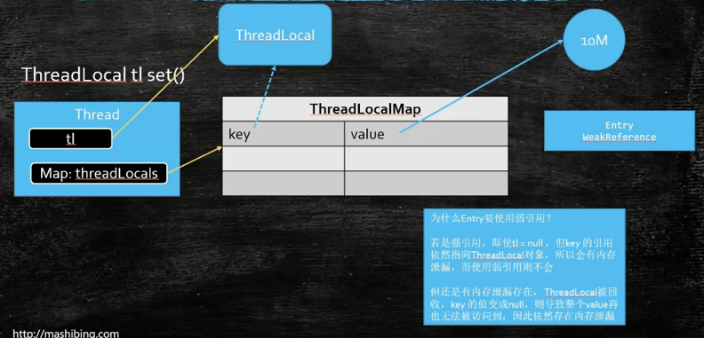

## 强引用

只要还被引用，就不会被 GC 回收

```java
/**
 * @author jzh
 * @version 1.0.0
 * @date 2020/4/7 13:35
 * @description 强引用：只要还有引用，就宁愿 OOM 也不回收
 */
public class StrongRefDemo {

    /**
     * strongRef 是静态变量，只有 StrongRefDemo 类销毁的时候，才能销毁
     * 而类只有当进程销毁的时候才会被销毁
     */
    static Object strongRef = new Object();

    public static void main(String[] args) {
        demo1();
        demo2();
    }

    public static void demo1() {
        System.out.println("demo1");
        Object obj = strongRef;
        // 虽然这里将 strongRef 设置为 null，但因为被强引用，所以 GC 后不会被回收
        strongRef = null;
        System.gc();
        System.out.println("GC 之后：" + obj);
        System.out.println("GC 之后：" + strongRef);
    }

    public static void demo2() {
        System.out.println("demo2");
        Object strongRef2 = new Object();
        Object obj = strongRef2;
        // 虽然这里将 strongRef2 设置为 null，但因为被 obj 强引用，所以 GC 后不会被回收
        strongRef2 = null;
        System.gc();
        System.out.println("GC 之后：" + obj);
        System.out.println("GC 之后：" + strongRef2);
    }
}
```


## 软引用

软引用只有在设置为 null 或者内存不足时才会被回收，还有在一定时间内没有被使用也会进行回收

适合用来做缓存

```java
/**
 * @author jzh
 * @version 1.0.0
 * @date 2020/4/7 14:01
 * @description 软引用
 */
public class SoftRefDemo {
    /**
     * 软引用和强引用的区别：
     * 软引用和强引用都是在内存充足的情况下不会被回收
     * 软引用在内存不足的情况下，为避免 OOM 会进行回收，但强引用是宁愿 OOM 也不会进行回收
     *
     * @param args
     * @throws InterruptedException
     */
    public static void main(String[] args) throws InterruptedException {
        Object softRef = new Object();
        // 在自动回收的情况下，只有在程序发生 OOM 异常前才会被回收
        SoftReference softReference = new SoftReference(softRef);
        softRef = null;
        System.out.println(softReference.get());
        System.out.println(softRef);
        System.gc();
        System.out.println(softReference.get());
        System.out.println(softRef);
    }
}
```


## 强引用和软引用的区别

相同：在内存充足的情况下都不会被回收

不同：当内存不足的时候，强引宁愿 OOM 也不回收，而软引用为了避免 OOM 会进行回收


## 弱引用

对象会在下一次 GC 被回收

```java
/**
 * @author jzh
 * @version 1.0.0
 * @date 2020/4/7 14:52
 * @description 弱引用：当对象没有被使用的下一次 GC 才会被回收
 */
public class WeakRefDemo {
    public static void main(String[] args) {
        WeakReference<M> m = new WeakReference<>(new M());

        System.out.println(m.get());
        System.gc();
        System.out.println(m.get());
    }
}
```


## 软引用和弱引用的区别

不同：

- 软引用只有当内存不足、被引用对象为 null 或者一定时间内没有被引用时才会被回收；
- 而弱引用只要有回收，就会被干掉


## 虚引用

使用的情况比较少，一般在对象回收前进行处理使用。

phantomReference.get() 本身无论如何都是 null，只有当对象将要被回收前，会将对象放入到 ReferenceQueue 队列中，我们可以通过 ReferenceQueue 队列获取到即将回收的对象用于做其它处理。

一般用来管理直接内存

```java
/**
 * @author jzh
 * @version 1.0.0
 * @date 2020/4/7 15:31
 * @description 虚引用：使用得比较少，一般用在对象被回收前对该对象进行操作
 */
public class PhantomRefDemo {
    public static void main(String[] args) throws InterruptedException {
        ReferenceQueue queue = new ReferenceQueue();
        Object phantomObj = new Object();
        PhantomReference phantomReference = new PhantomReference(phantomObj, queue);
        System.out.println(phantomReference.get());

        phantomObj = null;
        System.out.println("GC 前：" + phantomReference.get());
        System.out.println("GC 前：" + queue.poll());
        System.gc();
        System.out.println("GC 后：" + phantomReference.get());
        System.out.println("GC 后：" + queue.poll());
        Thread.sleep(200);
        System.out.println("睡眠后：" + phantomReference.get());
        System.out.println("睡眠后：" + queue.poll());
    }
}
```


## ThreadLocal 内存泄漏问题

来源：http://mashibing.com



为什么 Entry 要使用弱引用？

- 若是强引用，即使 tl = null，但 key 的引用依然指向 ThreadLocal 对象，所以会有内存泄漏，而使用弱引用则不会。但还是有内存泄漏存在，ThreadLocal 被回收，key 的值变成 null，则导致整个 value 再也无法被方法到，而 value 使用的是强引用指向数据，因此依然存在内存泄漏。


## 面试题 

1. Java 中的引用类型有哪几种？
   1. 强软弱虚
2. 每种引用类型的特点是什么？
   1. 强引用： 只要有指针指向就不会被回收
   2. 软引用：空间不够时回收
   3. 弱引用：看见就回收
   4. 虚引用：一般用来管理直接内存的，无法直接 get 获取
3. 每种引用类型的应用场景是什么？
   1. 强引用：普通的用法（new Object()）
   2. 软引用：缓存
   3. 弱引用：防止一些 Map （ThreadLocal）的内存泄漏
   4. 虚引用：JVM 内部管理直接内存
4. ThreadLocal 应用在什么地方？
   1. Spring 在 @Transaction 中的处理（connection）
   2. Mybatis 关于分页的处理
5. ThreadLocal 会产生内存泄漏你了解吗？
   1. ThreadLocalMap 的 key 使用弱引用指向 ThreadLocal，用反证法，为什么不使用强引用？当 `ThreadLocal tl = new ThreadLocal()`时，即使将 `tl = null`，由于是 key 是强引用指向 ThreadLocal，这就会导致 key 所指向的这块内存永远也不会被回收。
   2. 在 key 是弱引用指向 ThreadLocal 的情况下，ThreadLocal 会被下一个 GC 所回收，此时 `key = null`，这意味着 key 对应的 value 无法被访问，而 value 本身是强引用指向数据，这也就导致 value 这一块的内存泄漏。