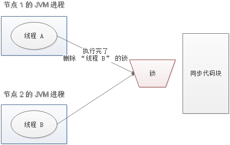
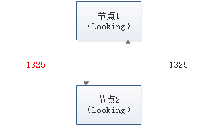

## 什么是分布式协调技术

### 概述

分布式协调技术主要用来解决分布式环境当中多个进程之间的同步控制，让他们有序的去访问某种临界资源，防止造成"脏数据"的后果。


在这图中有三台机器，每台机器各跑一个应用程序。然后我们将这三台机器通过网络将其连接起来，构成一个系统来为用户提供服务，对用户来说这个系统的架构是透明的，他感觉不到我这个系统是一个什么样的架构。那么我们就可以把这种系统称作一个**分布式系统**。

在这个分布式系统中如何对进程进行调度，我假设在第一台机器上挂载了一个资源，然后这三个物理分布的进程都要竞争这个资源，但我们又不希望他们同时进行访问，这时候我们就需要一个**协调器**，来让他们有序的来访问这个资源。这个协调器就是我们经常提到的那个**锁**，比如说"进程-1"在使用该资源的时候，会先去获得锁，"进程1"获得锁以后会对该资源保持**独占**，这样其他进程就无法访问该资源，"进程1"用完该资源以后就将锁释放掉，让其他进程来获得锁，那么通过这个锁机制，我们就能保证了分布式系统中多个进程能够有序的访问该临界资源。那么我们把这个分布式环境下的这个锁叫作**分布式锁**。这个分布式锁也就是我们**分布式协调技术**实现的核心内容。


## 什么是分布式锁

### 概述

为了防止分布式系统中的多个进程之间相互干扰，我们需要一种分布式协调技术来对这些进程进行调度。而这个分布式协调技术的核心就是来实现这个**分布式锁**。


### 为什么要使用分布式锁


- 成员变量 A 存在 JVM1、JVM2、JVM3 三个 JVM 内存中
- 成员变量 A 同时都会在 JVM 分配一块内存，三个请求发过来同时对这个变量操作，显然结果是不对的
- 不是同时发过来，三个请求分别操作三个不同 JVM 内存区域的数据，变量 A 之间不存在共享，也不具有可见性，处理的结果也是不对的 注：该成员变量 A 是一个有状态的对象

如果我们业务中确实存在这个场景的话，我们就需要一种方法解决这个问题，**这就是分布式锁要解决的问题**


### 分布式锁应该具备哪些条件

- 在分布式系统环境下，一个方法在同一时间只能**被一个机器的一个线程执行**
- 高可用的获取锁与释放锁
- 高性能的获取锁与释放锁
- 具备可重入特性（可理解为重新进入，由多于一个任务并发使用，而不必担心数据错误）
- 具备锁失效机制，防止死锁
- 具备非阻塞锁特性，即没有获取到锁将直接返回获取锁失败


### 分布式锁的实现有哪些

- Memcached：利用 Memcached 的 `add` 命令。此命令是原子性操作，只有在 `key` 不存在的情况下，才能 `add` 成功，也就意味着线程得到了锁。
- Redis：和 Memcached 的方式类似，利用 Redis 的 `setnx` 命令。此命令同样是原子性操作，只有在 `key` 不存在的情况下，才能 `set` 成功。
- **Zookeeper**：利用 Zookeeper 的顺序临时节点，来实现分布式锁和等待队列。Zookeeper 设计的初衷，就是为了实现分布式锁服务的。
- Chubby：Google 公司实现的粗粒度分布式锁服务，底层利用了 Paxos 一致性算法。


### 通过 Redis 分布式锁的实现理解基本概念

分布式锁实现的三个核心要素：


#### 加锁

最简单的方法是使用 `setnx` 命令。`key` 是锁的唯一标识，按业务来决定命名。比如想要给一种商品的秒杀活动加锁，可以给 `key` 命名为 “lock_sale_商品ID” 。而 `value` 设置成什么呢？我们可以姑且设置成 `1`。加锁的伪代码如下：

```text
setnx（lock_sale_商品ID，1）
```

当一个线程执行 `setnx` 返回 `1`，说明 `key` 原本不存在，该线程成功得到了锁；当一个线程执行 `setnx` 返回 `0`，说明 `key` 已经存在，该线程抢锁失败。


#### 解锁

有加锁就得有解锁。当得到锁的线程执行完任务，需要释放锁，以便其他线程可以进入。释放锁的最简单方式是执行 `del` 指令，伪代码如下：

```text
del（lock_sale_商品ID）
```

释放锁之后，其他线程就可以继续执行 `setnx` 命令来获得锁。


#### 锁超时

锁超时是什么意思呢？如果一个得到锁的线程在执行任务的过程中挂掉，来不及显式地释放锁，这块资源将会永远被锁住（**死锁**），别的线程再也别想进来。所以，`setnx` 的 `key` 必须设置一个超时时间，以保证即使没有被显式释放，这把锁也要在一定时间后自动释放。`setnx` 不支持超时参数，所以需要额外的指令，伪代码如下：

```text
expire（lock_sale_商品ID， 30）
```

综合伪代码如下：

```text
if（setnx（lock_sale_商品ID，1） == 1）{
    expire（lock_sale_商品ID，30）
    try {
        do something ......
    } finally {
        del（lock_sale_商品ID）
    }
}
```


#### 存在什么问题

以上伪代码中存在三个致命问题


##### `setnx` 和 `expire` 的非原子性

设想一个极端场景，当某线程执行 `setnx`，成功得到了锁：


`setnx` 刚执行成功，还未来得及执行 `expire` 指令，节点 1 挂掉了。


这样一来，这把锁就没有设置过期时间，变成**死锁**，别的线程再也无法获得锁了。

怎么解决呢？`setnx` 指令本身是不支持传入超时时间的，`set` 指令增加了可选参数，伪代码如下：

```text
set（lock_sale_商品ID，1，30，NX）
```

这样就可以取代 `setnx` 指令。

##### `del` 导致误删

又是一个极端场景，假如某线程成功得到了锁，并且设置的超时时间是 30 秒。


如果某些原因导致线程 A 执行的很慢很慢，过了 30 秒都没执行完，这时候锁过期自动释放，线程 B 得到了锁。


随后，线程 A 执行完了任务，线程 A 接着执行 `del` 指令来释放锁。但这时候线程 B 还没执行完，线程A实际上 `删除的是线程 B 加的锁`。



怎么避免这种情况呢？可以在 `del` 释放锁之前做一个判断，验证当前的锁是不是自己加的锁。至于具体的实现，可以在加锁的时候把当前的线程 ID 当做 `value`，并在删除之前验证 `key` 对应的 `value` 是不是自己线程的 ID。

加锁：

```text
String threadId = Thread.currentThread().getId()
set（key，threadId ，30，NX）
```

解锁：

```text
if（threadId .equals(redisClient.get(key))）{
    del(key)
}
```

但是，这样做又隐含了一个新的问题，判断和释放锁是两个独立操作，不是原子性。


##### 出现并发的可能性

还是刚才第二点所描述的场景，虽然我们避免了线程 A 误删掉 `key` 的情况，但是同一时间有 A，B 两个线程在访问代码块，仍然是不完美的。怎么办呢？我们可以让获得锁的线程开启一个**守护线程**，用来给快要过期的锁“续航”。


当过去了 29 秒，线程 A 还没执行完，这时候守护线程会执行 `expire` 指令，为这把锁“续命”20 秒。守护线程从第 29 秒开始执行，每 20 秒执行一次。


当线程 A 执行完任务，会显式关掉守护线程。


另一种情况，如果节点 1 忽然断电，由于线程 A 和守护线程在同一个进程，守护线程也会停下。这把锁到了超时的时候，没人给它续命，也就自动释放了。


## 什么是 Zookeeper


### 概述

ZooKeeper 是一种分布式协调服务，用于管理大型主机。在分布式环境中协调和管理服务是一个复杂的过程。ZooKeeper 通过其简单的架构和 API 解决了这个问题。ZooKeeper 允许开发人员专注于核心应用程序逻辑，而不必担心应用程序的分布式特性。

以下为 Zookeeper 的基本概念


### Zookeeper 的数据模型

Zookeeper 的数据模型是什么样子呢？它很像数据结构当中的树，也很像文件系统的目录。


树是由节点所组成，Zookeeper 的数据存储也同样是基于节点，这种节点叫做 **Znode**

但是，不同于树的节点，Znode 的引用方式是路径引用，类似于文件路径：

```text
/动物/猫
/汽车/宝马
```

这样的层级结构，让每一个 Znode 节点拥有唯一的路径，就像命名空间一样对不同信息作出清晰的隔离。


#### Znode 包含哪些元素


- data：Znode 存储的数据信息。
- ACL：记录 Znode 的访问权限，即哪些人或哪些 IP 可以访问本节点。
- stat：包含 Znode 的各种元数据，比如事务 ID、版本号、时间戳、大小等等。
- child：当前节点的子节点引用

这里需要注意一点，Zookeeper 是为读多写少的场景所设计。Znode 并不是用来存储大规模业务数据，而是用于存储少量的状态和配置信息，`每个节点的数据最大不能超过 1MB`。


### Zookeeper 的基本操作

创建节点

```text
create
```

删除节点

```text
delete
```

判断节点是否存在

```text
exists
```

获得一个节点的数据

```text
getData
```

设置一个节点的数据

```text
setData
```

获取节点下的所有子节点

```text
getChildren
```

这其中，`exists`，`getData`，`getChildren` 属于读操作。Zookeeper 客户端在请求读操作的时候，可以选择是否设置 **Watch**


### Zookeeper 的事件通知

我们可以把 **Watch** 理解成是注册在特定 Znode 上的触发器。当这个 Znode 发生改变，也就是调用了 `create`，`delete`，`setData` 方法的时候，将会触发 Znode 上注册的对应事件，请求 Watch 的客户端会接收到异步通知。

具体交互过程如下：

- 客户端调用 `getData` 方法，`watch` 参数是 `true`。服务端接到请求，返回节点数据，并且在对应的哈希表里插入被 Watch 的 Znode 路径，以及 Watcher 列表。


- 当被 Watch 的 Znode 已删除，服务端会查找哈希表，找到该 Znode 对应的所有 Watcher，异步通知客户端，并且删除哈希表中对应的 Key-Value。


### Zookeeper 的一致性

Zookeeper 身为分布式系统协调服务，如果自身挂了如何处理呢？为了防止单机挂掉的情况，Zookeeper 维护了一个集群。如下图：


Zookeeper Service 集群是一主多从结构。

在更新数据时，首先更新到主节点（这里的节点是指服务器，不是 Znode），再同步到从节点。

在读取数据时，直接读取任意从节点。

为了保证主从节点的数据一致性，Zookeeper 采用了 **ZAB 协议**，这种协议非常类似于一致性算法 **Paxos** 和 **Raft**。


#### 什么是 ZAB

Zookeeper Atomic Broadcast，有效解决了 Zookeeper 集群崩溃恢复，以及主从同步数据的问题。


##### ZAB 协议定义的三种节点状态

- Looking ：选举状态。
- Following ：Follower 节点（从节点）所处的状态。
- Leading ：Leader 节点（主节点）所处状态。

##### 最大 ZXID

最大 ZXID 也就是节点本地的最新事务编号，包含 epoch 和计数两部分。epoch 是纪元的意思，相当于 Raft 算法选主时候的 term。

##### ZAB 的崩溃恢复

假如 Zookeeper 当前的主节点挂掉了，集群会进行崩溃恢复。ZAB 的崩溃恢复分成三个阶段：

**Leader election**

选举阶段，此时集群中的节点处于 Looking 状态。它们会各自向其他节点发起投票，投票当中包含自己的服务器 ID 和最新事务 ID（ZXID）。


接下来，节点会用自身的 ZXID 和从其他节点接收到的 ZXID 做比较，如果发现别人家的 ZXID 比自己大，也就是数据比自己新，那么就重新发起投票，投票给目前已知最大的 ZXID 所属节点。



每次投票后，服务器都会统计投票数量，判断是否有某个节点得到半数以上的投票。如果存在这样的节点，该节点将会成为准 Leader，状态变为 Leading。其他节点的状态变为 Following。


**Discovery**

发现阶段，用于在从节点中发现最新的 ZXID 和事务日志。或许有人会问：既然 Leader 被选为主节点，已经是集群里数据最新的了，为什么还要从节点中寻找最新事务呢？

这是为了防止某些意外情况，比如因网络原因在上一阶段产生多个 Leader 的情况。

所以这一阶段，Leader 集思广益，接收所有 Follower 发来各自的最新 epoch 值。Leader 从中选出最大的 epoch，基于此值加 1，生成新的 epoch 分发给各个 Follower。

各个 Follower 收到全新的 epoch 后，返回 ACK 给 Leader，带上各自最大的 ZXID 和历史事务日志。Leader 选出最大的 ZXID，并更新自身历史日志。


**Synchronization**

同步阶段，把 Leader 刚才收集得到的最新历史事务日志，同步给集群中所有的 Follower。只有当半数 Follower 同步成功，这个准 Leader 才能成为正式的 Leader。

自此，故障恢复正式完成。


##### ZAB 的数据写入

**Broadcast**

ZAB 的数据写入涉及到 Broadcast 阶段，简单来说，就是 Zookeeper 常规情况下更新数据的时候，由 Leader 广播到所有的 Follower。其过程如下：

- 客户端发出写入数据请求给任意 Follower。
- Follower 把写入数据请求转发给 Leader。
- Leader 采用二阶段提交方式，先发送 Propose 广播给 Follower。
- Follower 接到 Propose 消息，写入日志成功后，返回 ACK 消息给 Leader。
- Leader 接到半数以上ACK消息，返回成功给客户端，并且广播 Commit 请求给 Follower


ZAB 协议既不是强一致性，也不是弱一致性，而是处于两者之间的**单调一致性（顺序一致性）**。它依靠事务 ID 和版本号，保证了数据的更新和读取是有序的。


### Zookeeper 的应用场景


#### 分布式锁

这是雅虎研究员设计 Zookeeper 的初衷。利用 Zookeeper 的临时顺序节点，可以轻松实现分布式锁。


#### 服务注册和发现

利用 Znode 和 Watcher，可以实现分布式服务的注册和发现。最著名的应用就是阿里的分布式 RPC 框架 Dubbo。


#### 共享配置和状态信息

Redis 的分布式解决方案 Codis，就利用了 Zookeeper 来存放数据路由表和 codis-proxy 节点的元信息。同时 codis-config 发起的命令都会通过 ZooKeeper 同步到各个存活的 codis-proxy。

此外，Kafka、HBase、Hadoop，也都依靠Zookeeper同步节点信息，实现高可用。